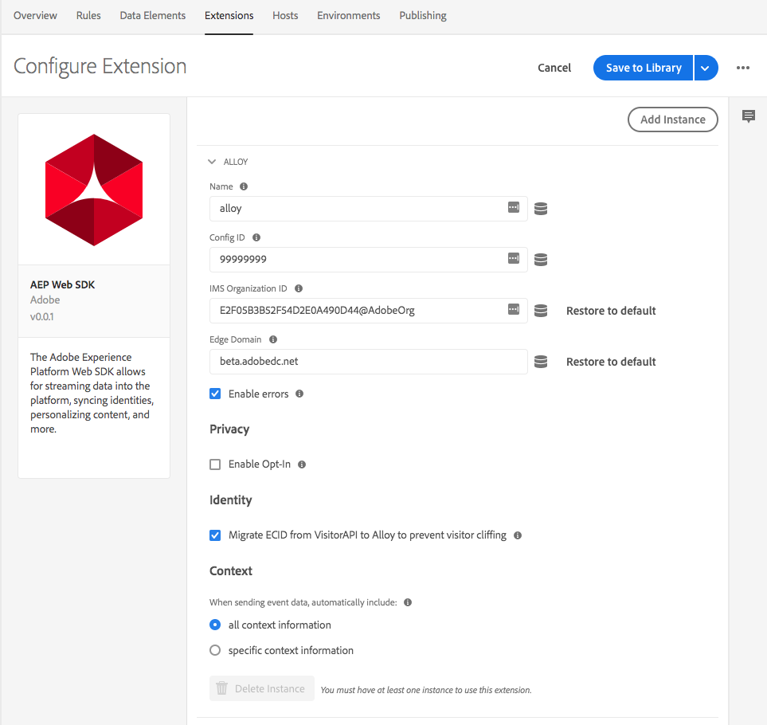

# Extensão SDK da Web do Adobe Experience Platform para lançamento de plataforma

O Adobe Experience Platform Web SDK Extension envia dados para a Adobe Experience Cloud a partir de propriedades da Web, por meio do Adobe Experience Platform Edge Network. A extensão SDK da Web da Adobe Experience Platform permite a transmissão de dados na plataforma, a sincronização de identidades, a aceitação e a coleta automática de dados de contexto.

## Configurar a extensão SDK da Web da AEP

Esta seção fornece uma referência para as opções disponíveis ao configurar a extensão SDK da Web da Adobe Experience Platform.

Se a extensão do Adobe Experience Platform Web SDK ainda não estiver instalada, abra sua propriedade, selecione **[!UICONTROL Extensões > Catálogo]**, passe o mouse sobre a extensão do Adobe Experience Platform Web SDK e selecione **[!UICONTROL Instalar]**.

Para configurar a extensão, abra a guia **[!UICONTROL Extensões]**, passe o cursor do mouse sobre a extensão e selecione **[!UICONTROL Configurar]**.

### Nome da instância

A extensão Adobe Experience Platform Web SDK suporta várias instâncias na página. Isso é usado para enviar dados para várias organizações com uma única configuração do Adobe Experience Platform Launch. O padrão **[!UICONTROL Name]** é liga. No entanto, é possível alterar o nome da instância para qualquer nome de objeto JavaScript válido. A extensão do Adobe Experience Platform exige que cada instância tenha uma **[!UICONTROL ID de configuração]** diferente e uma **[!UICONTROL ID de organização]** diferente.

## **[!UICONTROL ID de configuração]**

O **[!UICONTROL Config ID]** é o que informa à Adobe Experience Platform onde os dados devem ser roteados e quais configurações devem ser usadas no servidor. Isso é necessário para que a extensão Adobe Experience Platform funcione. Você pode obter uma ID de configuração entrando em contato com o Atendimento ao cliente.

### **[!UICONTROL ID da organização]**

A **[!UICONTROL ID da organização]** é a organização para a qual você gostaria que os dados fossem enviados no Adobe. Na maioria das vezes, você deve usar o valor padrão preenchido automaticamente. Quando houver várias instâncias na página, preencha com o valor da segunda organização para a qual deseja enviar dados.

### **[!UICONTROL Domínio de borda]**

O **[!UICONTROL Domínio de Borda]** é o domínio do qual a extensão Adobe Experience Platform envia e recebe dados. A extensão requer o uso de um CNAME próprio para o tráfego de produção. O domínio padrão de terceiros funciona em ambientes de desenvolvimento, mas não é adequado para ambientes de produção. As instruções sobre como configurar um CNAME primário estão listadas [aqui](https://docs.adobe.com/content/help/pt-BR/core-services/interface/ec-cookies/cookies-first-party.html).

### **[!UICONTROL Ativar erros]**

Por padrão, se houver um erro com a extensão, ele será registrado no console. Se quiser ocultar os erros em um ambiente de produção, desmarque a caixa de seleção **[!UICONTROL Ativar erros]**. Os erros ainda são impressos quando a depuração está ativada no Platform Launch.

### **[!UICONTROL Ativar aceitação]**

Se **[!UICONTROL Habilitar aceitação]** estiver habilitado, a extensão AEP Web SDK pode conter ocorrências até que a aceitação seja recebida. A extensão expõe uma ação para definir as preferências de aceitação.

### **[!UICONTROL Ativar Migrar ECID]**

A extensão SDK da Web da AEP usa um novo cookie para armazenar a ECID. Essa configuração permite a compatibilidade entre o novo cookie e o cookie antigo para fins de migração. A Adobe recomenda que isso esteja ativado, a menos que você não tenha visitantes com uma ECID.

### **[!UICONTROL Usar cookies de terceiros]**

A Adobe Experience Platform sempre armazenará um cookie no domínio primário. Esta opção permite usar um cookie de terceiros definido em demdex.net, além do cookie no domínio primário. Isso pode ser útil quando você tem usuários que se movem entre vários domínios. Isso desativará as chamadas com demdex.net.

### **[!UICONTROL Contexto]**

A extensão coleta informações automaticamente sobre o contexto da solicitação (por exemplo, detalhes sobre o URL e o navegador). Isso pode ser desativado ao desmarcar contextos específicos.

- **[!UICONTROL web]**  - Detalhes sobre a página da Web, como url, quem indicou etc.
- **[!UICONTROL device]** - Detalhes sobre o dispositivo, como a orientação da tela, a altura da tela e a largura da tela.
- **[!UICONTROL ambiente]**  - Informações sobre o ambiente de computação (navegador, conexão e assim por diante)
- **[!UICONTROL localização]**  - Informações limitadas sobre a localização do usuário

## O que vem a seguir

1. Defina [tipos de ação](action-types.md).
2. Defina [os tipos de elementos de dados](data-element-types.md).
