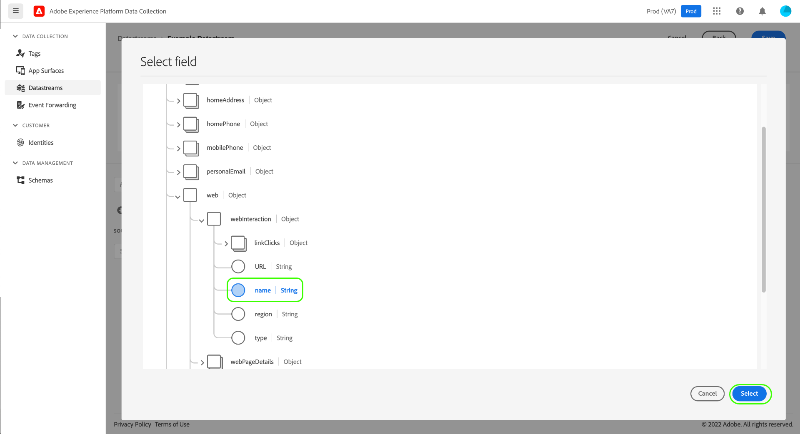
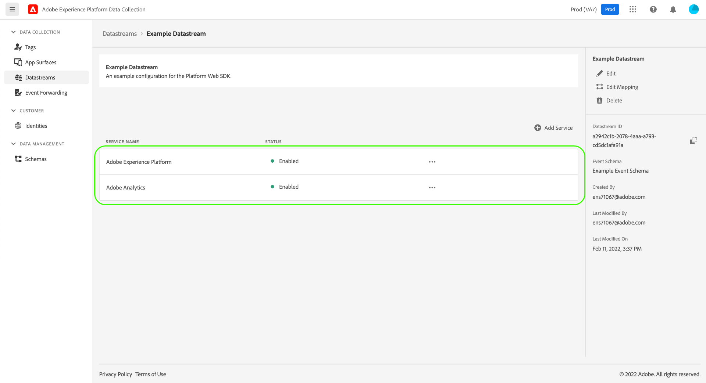
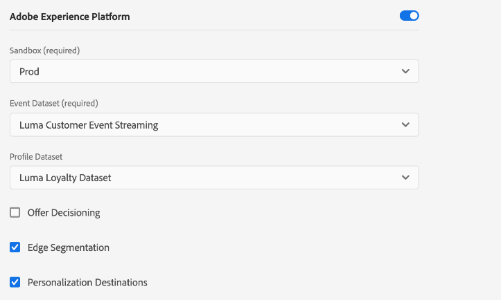
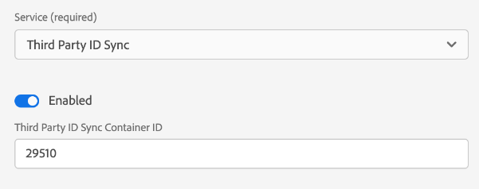

# Configurar um conjunto de dados

Um armazenamento de dados representa a configuração do lado do servidor ao implementar os SDKs móveis e da Web do Adobe Experience Platform. Enquanto a variável [comando configurar](configuring-the-sdk.md) no SDK controla os itens que devem ser manipulados no cliente (como `edgeDomain`), os conjuntos de dados lidam com todas as outras configurações do SDK. Quando uma solicitação é enviada para a rede de borda da Adobe Experience Platform, a variável `edgeConfigId` é usada para fazer referência ao armazenamento de dados. Isso permite atualizar a configuração do lado do servidor sem precisar fazer alterações de código no site.

Este documento aborda as etapas para configurar um armazenamento de dados na interface do usuário da coleta de dados.

>[!NOTE]
>
>Sua organização deve ser provisionada para esse recurso para acessá-lo na interface do usuário do . Se você não tiver acesso, preencha o seguinte [formulário](http://adobe.ly/websdkaccess) e lhe concederemos o acesso necessário.

## Acesse o [!UICONTROL Datastreams] espaço de trabalho

Você pode criar e gerenciar conjuntos de dados na interface do usuário da Coleta de dados selecionando **[!UICONTROL Datastreams]** no painel de navegação esquerdo.

>[!NOTE]
>
>Ao acessar o [!UICONTROL Datastreams] independentemente de usar os recursos de gerenciamento de tags da Platform, você deve ter permissões de desenvolvedor para gerenciar os próprios conjuntos de dados. Consulte a [permissões do usuário](../../tags/ui/administration/user-permissions.md) na documentação das tags para obter mais detalhes.

O [!UICONTROL Datastreams] A guia exibe uma lista de conjuntos de dados existentes, incluindo o nome amigável, a ID e a data da última modificação. Selecione o nome de um armazenamento de dados para [exibir seus detalhes e configurar serviços](#view-details).

Selecione o ícone &quot;mais&quot; (**...**) para um armazenamento de dados específico revelar mais opções. Selecionar **[!UICONTROL Editar]** para atualizar o [configuração básica](#configure) para o armazenamento de dados, ou selecione **[!UICONTROL Excluir]** para remover o armazenamento de dados.

## Criar um novo armazenamento de dados {#create}

Para criar um armazenamento de dados, comece selecionando **[!UICONTROL Novo fluxo de dados]**.

### [!UICONTROL Configurar] {#configure}

O fluxo de trabalho de criação do armazenamento de dados é exibido, começando na etapa de configuração. Aqui, você deve fornecer um nome e uma descrição opcional para o armazenamento de dados.

Se você estiver configurando esse armazenamento de dados para uso no Experience Platform e estiver usando o SDK da Web da plataforma, também deverá selecionar um [esquema do Experience Data Model (XDM) baseado em eventos](../../xdm/classes/experienceevent.md) para representar os dados que você planeja assimilar.

O restante desta seção foca nas etapas para mapear dados para um esquema de evento da plataforma selecionado. Se você estiver usando o SDK móvel ou não estiver configurando seu conjunto de dados para a Plataforma, selecione **[!UICONTROL Salvar]** antes de prosseguir para a próxima seção sobre [adicionar serviços ao armazenamento de dados](#add-services).

### Preparação de dados para coleta de dados {#data-prep}

>[!IMPORTANT]
>
>No momento, a Preparação de dados para a coleta de dados não é compatível com implementações do SDK móvel.

A Preparação de dados é um serviço do Experience Platform que permite mapear, transformar e validar dados de e para o Experience Data Model (XDM). Ao configurar um conjunto de dados habilitado para a plataforma, você pode usar os recursos de Preparação de dados para mapear seus dados de origem para o XDM ao enviá-los para a Rede de borda da plataforma.

As subseções abaixo abordam as etapas básicas para o mapeamento de seus dados na interface do usuário da coleta de dados. Para obter uma orientação abrangente sobre todos os recursos de Preparação de dados, incluindo funções de transformação para campos calculados, consulte a seguinte documentação:

* [Visão geral da preparação de dados](../../data-prep/home.md)
* [Funções de mapeamento da preparação de dados](../../data-prep/functions.md)
* [Manuseio de formatos de dados com Preparação de dados](../../data-prep/data-handling.md)

#### [!UICONTROL Selecionar dados]

Selecionar **[!UICONTROL Salvar e adicionar mapeamento]** depois de concluir o [etapa de configuração básica](#configure)e o **[!UICONTROL Selecionar dados]** será exibida. A partir daqui, você deve fornecer um objeto JSON de amostra que represente a estrutura dos dados que planeja enviar para a Plataforma. Você pode selecionar a opção de carregar o objeto como um arquivo ou colar o objeto bruto na caixa de texto fornecida.

>[!IMPORTANT]
>
>O objeto JSON deve ter um único nó raiz `data` para passar na validação.

Se o JSON for válido, um esquema de visualização será exibido no painel direito. Clique em **[!UICONTROL Avançar]** para continuar.

#### [!UICONTROL Mapeamento]

O **[!UICONTROL Mapeamento]** é exibida, permitindo mapear os campos nos dados de origem para o do esquema de evento de destino no Platform. Para começar, selecione **[!UICONTROL Adicionar novo mapeamento]** para criar uma nova linha de mapeamento.

Selecione o ícone de origem () e, na caixa de diálogo exibida, selecione o campo de origem que deseja mapear na tela fornecida. Depois de escolher um campo, use a variável **[!UICONTROL Selecionar]** para continuar.

Em seguida, selecione o ícone de esquema () para abrir uma caixa de diálogo semelhante para o esquema de evento de destino. Escolha o campo para o qual deseja mapear os dados antes de confirmar com **[!UICONTROL Selecionar]**.

A página de mapeamento é exibida novamente com o mapeamento de campo concluído mostrado. O **[!UICONTROL Andamento do mapeamento]** atualizações de seção para refletir o número total de campos que foram mapeados com êxito.

Continue seguindo as etapas acima para mapear o restante dos campos para o schema de destino. Embora não seja necessário mapear todos os campos de origem disponíveis, todos os campos no schema de destino definidos conforme necessário devem ser mapeados para concluir esta etapa. O **[!UICONTROL Campos obrigatórios]** O contador indica quantos campos obrigatórios ainda não estão mapeados na configuração atual.

Quando a contagem dos campos necessários atingir zero e você estiver satisfeito com seu mapeamento, selecione **[!UICONTROL Salvar]** para finalizar as alterações.

## Exibir detalhes do armazenamento de dados {#view-details}

Após configurar um novo armazenamento de dados ou selecionar um existente para exibir, a página de detalhes desse armazenamento de dados será exibida. Aqui você pode encontrar mais informações sobre o armazenamento de dados, incluindo sua ID.

Na tela de detalhes do armazenamento de dados, é possível [adicionar serviços](#add-services) para ativar os recursos dos produtos da Adobe Experience Cloud aos quais você tem acesso.

## Adicionar serviços a um armazenamento de dados {#add-services}

Na página de detalhes de um armazenamento de dados, selecione **[!UICONTROL Adicionar Serviço]** para começar a adicionar os serviços disponíveis para esse armazenamento de dados.

Na próxima tela, use o menu suspenso para selecionar um serviço a ser configurado para esse armazenamento de dados. Somente os serviços aos quais você tem acesso serão exibidos nesta lista.

Selecione o serviço desejado, preencha as opções de configuração exibidas e selecione **[!UICONTROL Salvar]** para adicionar o serviço ao armazenamento de dados. Todos os serviços adicionados aparecem na visualização de detalhes do armazenamento de dados.

As subseções abaixo descrevem as opções de configuração para cada serviço.

>[!NOTE]
>
>Cada configuração de serviço contém um **[!UICONTROL Ativado]** alternar que é ativado automaticamente quando o serviço é selecionado. Para desabilitar o serviço selecionado para esse armazenamento de dados, selecione o **[!UICONTROL Ativado]** alternar novamente.

### Configurações do Adobe Analytics

Esse serviço controla se e como os dados são enviados para a Adobe Analytics. Podem ser encontrados detalhes adicionais no guia sobre [envio de dados para o Analytics](../data-collection/adobe-analytics/analytics-overview.md).

| Configuração | Descrição |
| --- | --- |
| [!UICONTROL ID de conjunto de relatórios] | **(Obrigatório)** A ID do conjunto de relatórios do Analytics para o qual você deseja enviar dados. Essa ID pode ser encontrada na interface do usuário do Adobe Analytics em [!UICONTROL Administrador] > [!UICONTROL ReportSuites]. Se vários conjuntos de relatórios forem especificados, os dados serão copiados para cada conjunto de relatórios. |

### Configurações do Adobe Audience Manager

Esse serviço controla se e como os dados são enviados para a Adobe Audience Manager. Tudo o que é necessário para enviar dados para o Audience Manager é habilitar esta seção. As outras configurações são opcionais, mas são incentivadas.

| Configuração | Descrição |
| --- | --- |
| [!UICONTROL Destinos de cookies ativados] | Permite que o SDK compartilhe informações do segmento por meio de [destinos de cookie](https://experienceleague.adobe.com/docs/audience-manager/user-guide/features/destinations/custom-destinations/create-cookie-destination.html) from [!DNL Audience Manager]. |
| [!UICONTROL Destinos de URL ativados] | Permite que o SDK compartilhe informações do segmento por meio de [Destinos de URL](https://experienceleague.adobe.com/docs/audience-manager/user-guide/features/destinations/custom-destinations/create-url-destination.html) from [!DNL Audience Manager]. |

### Configurações do Adobe Experience Platform

>[!IMPORTANT]
>
>Ao ativar um conjunto de dados para a Platform, observe a sandbox da Platform que você está usando no momento, como exibido na faixa superior da interface do usuário de coleta de dados.
>
>
>
>As sandboxes são partições virtuais no Adobe Experience Platform que permitem isolar seus dados e implementações de outras pessoas na organização. Depois que um conjunto de dados é criado, sua sandbox não pode ser alterada. Para obter mais detalhes sobre a função das sandboxes no Experience Platform, consulte o [documentação das sandboxes](../../sandboxes/home.md).

Esse serviço controla se e como os dados são enviados para a Adobe Experience Platform.

| Configuração | Descrição |
| --- | --- |
| [!UICONTROL Conjunto de dados do evento] | **(Obrigatório)** Selecione o conjunto de dados da plataforma para o qual os dados do evento do cliente serão transmitidos. Esse schema deve usar o [Classe XDM ExperienceEvent](../../xdm/classes/experienceevent.md). |
| [!UICONTROL Conjunto de dados de perfil] | Selecione o conjunto de dados da plataforma para o qual os dados do atributo do cliente serão enviados. Esse schema deve usar o [Classe de perfil individual XDM](../../xdm/classes/individual-profile.md). |
| [!UICONTROL Offer Decisioning] | Marque essa caixa de seleção para ativar o Offer Decisioning para uma implementação do SDK da Web da plataforma. Consulte o guia sobre [uso do Offer Decisioning com o SDK da Web da plataforma](../personalization/offer-decisioning/offer-decisioning-overview.md) para obter mais detalhes sobre a implementação. Para obter mais informações sobre recursos do Offer Decisioning, consulte [Documentação do Adobe Journey Optimizer](https://experienceleague.adobe.com/docs/journey-optimizer/using/offer-decisioniong/get-started/starting-offer-decisioning.html?lang=pt-BR). |
| [!UICONTROL Segmentação de borda] | Marque essa caixa de seleção para ativar [segmentação de borda](../../segmentation/ui/edge-segmentation.md) para esse armazenamento de dados. Quando o SDK envia dados por meio de um conjunto de dados habilitado para a segmentação de borda, qualquer associação de segmento atualizada para o perfil em questão é enviada de volta na resposta.  Essa opção pode ser usada em combinação com [!UICONTROL Destinos de personalização] para [casos de uso de personalização de próxima página](../../destinations/ui/configure-personalization-destinations.md). |
| [!UICONTROL Destinos de personalização] | Quando usado em combinação com [!UICONTROL Segmentação de borda] , essa opção permite que o conjunto de dados se conecte a mecanismos de personalização como o Adobe Target. Consulte a documentação de destinos para obter etapas específicas sobre [configuração de destinos de personalização](../../destinations/ui/configure-personalization-destinations.md). |

### Configurações do Adobe Target

Esse serviço controla se e como os dados são enviados para a Adobe Target.

| Configuração | Descrição |
| --- | --- |
| [!UICONTROL Token de propriedade] | [!DNL Target] O permite que os clientes controlem permissões por meio do uso de propriedades do . Para obter mais informações sobre propriedades, consulte o guia sobre [configuração de permissões empresariais](https://experienceleague.adobe.com/docs/target/using/administer/manage-users/enterprise/properties-overview.html?lang=pt-BR) no [!DNL Target] documentação.  O token de propriedade pode ser encontrado na interface do usuário do Adobe Target em [!UICONTROL Configuração] > [!UICONTROL Propriedades]. |
| [!UICONTROL ID do ambiente do Target] | [Ambientes no Adobe Target](https://experienceleague.adobe.com/docs/target/using/administer/hosts.html) Ajudar você a gerenciar sua implementação em todos os estágios de desenvolvimento. Essa configuração especifica qual ambiente você usará com esse conjunto de dados.  A prática recomendada é definir isso de forma diferente para cada um de seus `dev`, `stage`e `prod` ambientes de fluxo de dados para simplificar as coisas. No entanto, se você já tiver ambientes Adobe Target definidos, poderá usá-los. |
| [!UICONTROL Namespace da ID de terceiros do Target] | O namespace de identidade do `mbox3rdPartyId` você deseja usar para esse armazenamento de dados. Consulte o guia sobre [implementação `mbox3rdPartyId` com o SDK da Web](../personalization/adobe-target/using-mbox-3rdpartyid.md) para obter mais informações. |

### [!UICONTROL Encaminhamento de evento] configurações

Esse serviço controla se e como os dados são enviados para [encaminhamento de eventos](../../tags/ui/event-forwarding/overview.md).

| Configuração | Descrição |
| --- | --- |
| [!UICONTROL Propriedade do Launch] | **(Obrigatório)** A propriedade de encaminhamento de evento para a qual você deseja enviar dados. |
| [!UICONTROL Ambiente do Launch] | **(Obrigatório)** O ambiente na propriedade selecionada para a qual você deseja enviar dados. |

>[!NOTE]
>
>Você pode selecionar **[!UICONTROL Inserir IDs manualmente]** para digitar os nomes da propriedade e do ambiente em vez de usar os menus suspensos.

### [!UICONTROL Sincronização de ID de terceiros] configurações

A seção ID de terceiros é a única seção que está sempre ativa. Ele tem duas configurações disponíveis: &quot;[!UICONTROL Sincronização de ID de terceiros ativada]&quot; e &quot;[!UICONTROL ID do contêiner de sincronização de ID de terceiros]&quot;.

| Configuração | Descrição |
| --- | --- |
| [!UICONTROL ID do contêiner de sincronização de ID de terceiros] | As sincronizações de ID podem ser agrupadas em contêineres para permitir que sincronizações de ID diferentes sejam executadas em momentos diferentes. Isso controla qual contêiner de sincronizações de ID é executado para esse armazenamento de dados. |

## Próximas etapas

Este guia abordou como configurar um conjunto de dados na interface do usuário da coleta de dados. Para obter mais informações sobre como instalar e configurar o SDK da Web após configurar um conjunto de dados, consulte o [Guia E2E de coleta de dados](../../collection/e2e.md#install).
