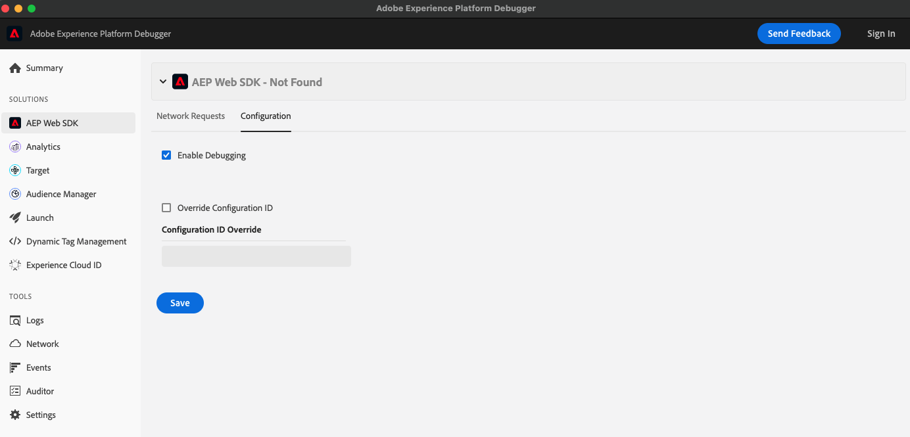

# Depuração

Quando a depuração está ativada, o SDK gera mensagens para o console do navegador que podem ser úteis na depuração da implementação e na compreensão de como o SDK está se comportando.

A depuração é desativada por padrão, mas pode ser ativada de quatro maneiras diferentes:

* `configure` comando
* `setDebug` comando
* parâmetro da string de consulta
* Ativar a depuração no Adobe Experience Platform Debugger. O Adobe Experience Platform é uma ferramenta poderosa que avalia as páginas da Web e ajuda a depurar os problemas de implementação com os produtos do Experience Cloud. O Adobe Experience Platform Debugger está disponível como um [Cromo](https://chrome.google.com/webstore/detail/adobe-experience-platform/bfnnokhpnncpkdmbokanobigaccjkpob) e [Firefox](https://addons.mozilla.org/pt-BR/firefox/addon/adobe-experience-platform-dbg/) extensão. A depuração pode ser ativada na guia de configuração da seção AEP Web SDK.



## Alternar a depuração com o comando Configurar

Ao configurar o SDK usando o `configure` , ative a depuração definindo o `debugEnabled` para `true`.

```javascript
alloy("configure", {
  "edgeConfigId": "ebebf826-a01f-4458-8cec-ef61de241c93",
  "orgId":"ADB3LETTERSANDNUMBERS@AdobeOrg",
  "debugEnabled": true
});
```

>[!TIP]
>
>Isso permite a depuração de todos os usuários da página da Web, em vez de somente seu navegador pessoal.

## Alternar a depuração com o comando Depurar

Alternar a depuração com uma `debug` comando como segue:

```javascript
alloy("setDebug", {
  "enabled": true
});
```

Se preferir não alterar o código na sua página da Web ou não quiser que as mensagens de registro sejam produzidas para todos os usuários do seu site, isso é particularmente útil, pois você pode executar a variável `debug` no console JavaScript do navegador a qualquer momento.

## Alternar a depuração com um parâmetro da string de consulta

Ative a depuração configurando uma `alloy_debug` parâmetro da string de consulta para `true` ou `false` como se segue:

```HTTP
http://example.com/?alloy_debug=true
```

Semelhante ao `debug` , se preferir não alterar o código na sua página da Web ou não quiser que as mensagens de log sejam produzidas para todos os usuários do seu site, isso é particularmente útil, pois você pode definir o parâmetro da cadeia de caracteres de consulta ao carregar a página da Web em seu navegador.

## Prioridade e duração

Quando a depuração é definida pela variável `debug` ou parâmetro da string de consulta, substitui qualquer `debug` , definido na variável `configure` comando. Nesses dois casos, a depuração também permanece ativada durante a sessão. Em outras palavras, se você ativar a depuração usando o comando debug ou parâmetro da string de consulta, ela permanecerá ativada até um dos seguintes:

* O fim da sessão
* Você executa o `debug` comando
* Você define o parâmetro da string de consulta novamente

## Recuperando informações da biblioteca

Geralmente, é útil acessar alguns dos detalhes por trás da biblioteca que você carregou em seu site. Para fazer isso, execute o `getLibraryInfo` comando como segue:

```js
alloy("getLibraryInfo").then(function(result) {
  console.log(result.libraryInfo.version);
  console.log(result.libraryInfo.commands);
  console.log(result.libraryInfo.configs);
});
```

Atualmente, o `libraryInfo` O objeto contém as seguintes propriedades:

* `version`: Esta é a versão da biblioteca carregada. Por exemplo, se a versão da biblioteca que está sendo carregada fosse 1.0.0, o valor seria `1.0.0`. Quando a biblioteca é executada dentro da extensão da tag (chamada de &quot;AEP Web SDK&quot;), a versão é a versão da biblioteca e a versão da extensão da tag é unida com um sinal &quot;+&quot;. Por exemplo, se a versão da biblioteca fosse 1.0.0 e a versão da extensão de tag fosse 1.2.0, o valor seria `1.0.0+1.2.0`.
* `commands`: Esses são todos os comandos disponíveis compatíveis com a biblioteca carregada.
* `configs`: Essas são todas as configurações atuais na biblioteca carregada.
