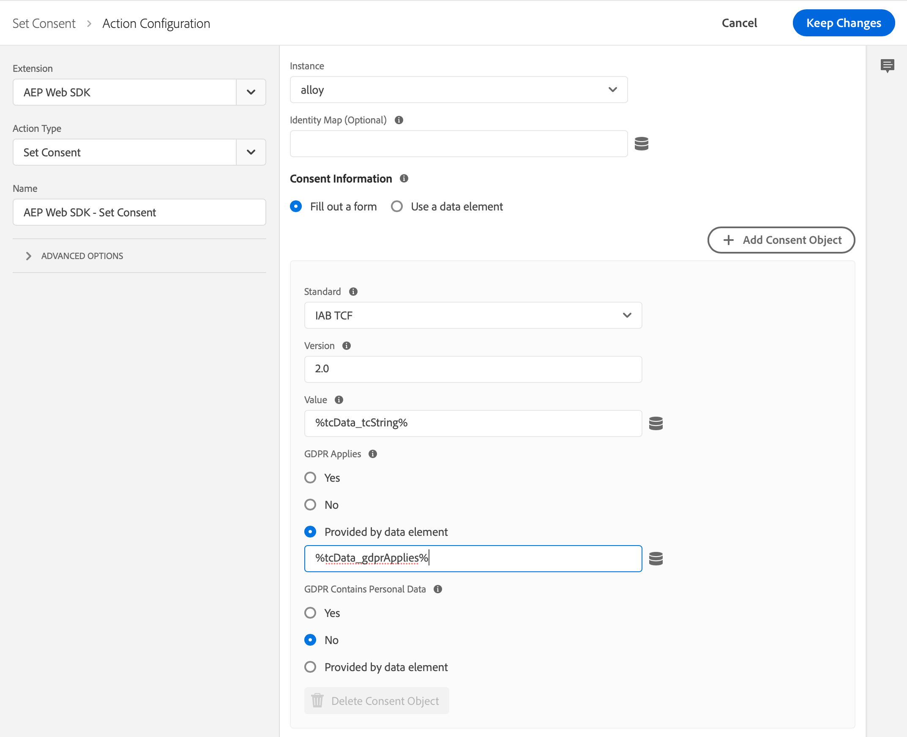

# Uso do IAB TCF 2.0 com Experience Platform Launch e extensão AEP Web SDK

O Adobe Experience Platform Web Software Development Kit (Adobe Experience Platform Web SDK) oferece suporte à Interative Advertising Bureau Transparency &amp; Consent Framework, versão 2.0 (IAB TCF 2.0). Este guia mostra como configurar uma propriedade da Adobe Experience Platform Launch para enviar informações de consentimento do IAB TCF 2.0 para o Adobe usando a extensão de lançamento do AEP Web SDK.

Se você não quiser usar o Experience Platform Launch, consulte o guia sobre como [usar o IAB TCF 2.0 sem o Experience Platform Launch](./without-launch.md).

## Introdução

Para usar o IAB TCF 2.0 com Experience Platform Launch e a extensão AEP Web SDK, é necessário ter um schema XDM e um conjunto de dados disponíveis. Se você não configurou nenhuma dessas opções, consulte o guia [de start rápido do](../../getting-started/quick-start-with-launch.md) Adobe Experience Platform Web SDK Launch antes de continuar.

Além disso, este guia exige que você tenha uma compreensão funcional do SDK da Web da Adobe Experience Platform. Para obter uma atualização rápida, leia a visão geral [do SDK da Web da](../../home.md) Adobe Experience Platform e a documentação de perguntas [](../../getting-started/web-sdk-faq.md) frequentes.

## Configuração do consentimento padrão

Na configuração da extensão, há uma configuração para o consentimento padrão. Isso controla o comportamento dos clientes que não têm um cookie de consentimento. Se você quiser colocar Eventos de experiência na fila para clientes que não têm um cookie de consentimento, defina como `pending`.

>[!NOTE]
>
>Atualmente, não há como definir isso dinamicamente pela extensão Experience Platform Launch.

Para obter mais informações sobre o consentimento padrão, consulte a seção [consentimento](../../fundamentals/configuring-the-sdk.md#default-consent) padrão na documentação de configuração do SDK.

## Atualização de Perfis com informações de consentimento {#consent-code-1}

Para chamar a ação `setConsent` quando suas preferências de consentimento do cliente forem alteradas, é necessário criar uma nova regra de Experience Platform Launch. Adicionando um novo evento e escolhendo o tipo de evento &quot;Código personalizado&quot; da extensão Core.

Use a seguinte amostra de código para o seu novo evento:

```javascript
// Wait for window.__tcfapi to be defined, then trigger when the customer has completed their consent and preferences.
function addEventListener() {
  if (window.__tcfapi) {
    window.__tcfapi("addEventListener", 2, function (tcData, success) {
      if (success && tcData.eventStatus === "useractioncomplete") {
        // save the tcData.tcString in a data element
        _satellite.setVar("IAB TCF Consent String", tcData.tcString);
        _satellite.setVar("IAB TCF Consent GDPR", tcData.gdprApplies);
        trigger();
      }
    });
  } else {
    // window.__tcfapi wasn't defined. Check again in 100 milliseconds
    setTimeout(addEventListener, 100);
  }
}
addEventListener();
```

Este código personalizado faz duas coisas:

* Define dois elementos de dados, um com a string de consentimento e outro com o `gdprApplies` sinalizador. Isso é útil mais tarde ao preencher a ação &quot;Definir consentimento&quot;.

* Aciona a regra quando as preferências de consentimento são alteradas. A ação &quot;Definir consentimento&quot; deve ser usada sempre que as preferências de consentimento forem alteradas. Adicione uma ação &quot;Definir consentimento&quot; na extensão e preencha o formulário da seguinte forma:

* Padrão: &quot;IAB TCF&quot;
* Versão: &quot;2.0&quot;
* Valor: &quot;%IAB TCF Cadeia de Consentimento %1&quot;
* RGPD Aplica-se: &quot;%IAB TCF Consentimento GDPR%&quot;



>[!IMPORTANT]
>
>Não é possível escolher esses elementos de dados usando o seletor de elementos de dados porque eles foram criados por meio de um código personalizado. Você deve digitar o nome do elemento de dados com os sinais de porcentagem. Esse código atualiza o perfil do cliente com suas novas preferências de consentimento sempre que elas são alteradas. Além disso, o servidor retorna um valor de cookie, o que pode impedir o Adobe Experience Platform Web SDK de gravar Eventos da experiência.

## Criação de um elemento de dados XDM para Eventos de experiência

A sequência de caracteres de consentimento deve ser incluída no Evento de experiência XDM. Para fazer isso, use o elemento de dados Objeto XDM. Start criando um novo elemento de dados Objeto XDM ou, alternativamente, use um que você já criou para enviar eventos. Se você tiver adicionado a combinação Privacidade do Experience Evento ao seu schema, deverá ter uma `consentStrings` chave no objeto XDM.

1. Selecione **[!UICONTROL ConsidereStrings]**.

1. Escolha **[!UICONTROL Fornecer itens]** individuais e selecione **[!UICONTROL Adicionar item]**.

1. Expanda o cabeçalho **[!UICONTROL agreementString]** , expanda o primeiro item e preencha os seguintes valores:

* `consentStandard`: TCF IAB
* `consentStandardVersion`: 2.0
* `consentStringValue`: %IAB Cadeia de Consentimento TCF%
* `gdprApplies`: %IAB TCF Consentimento GDPR%

>[!IMPORTANT]
>
>Não é possível escolher esses elementos de dados usando o seletor de elementos de dados porque eles foram criados por meio de um código personalizado. Você deve digitar o nome do elemento de dados com os sinais de porcentagem.

## Envio de um Evento de experiência inicial com informações de consentimento do IAB TCF 2.0

Se o Evento de experiência inicial na página for acionado com um evento de carregamento de página, a sequência de caracteres de consentimento talvez ainda não tenha sido carregada. Esta regra tem como objetivo substituir o evento de carregamento de página atual. Para garantir que as informações de consentimento sejam carregadas primeiro, crie uma nova regra e adicione o seguinte código como um evento de código personalizado:

```javascript
// Wait for window.__tcfapi to be defined, then trigger when there is a consent string
function addEventListener() {
  if (window.__tcfapi) {
    window.__tcfapi("addEventListener", 2, function (tcData, success) {
      if (success && (tcData.eventStatus === "useractioncomplete" || tcData.eventStatus === "tcloaded")) {
        // save the tcData.tcString in a data element
        _satellite.setVar("IAB TCF Consent String", tcData.tcString);
        _satellite.setVar("IAB TCF GDPR Applies", tcData.gdprApplies);
        trigger();
      }
    });
  } else {
    // window.__tcfapi wasn"t defined. Check again in 100 milliseconds
    setTimeout(addEventListener, 100);
  }
}
addEventListener();
```

Esse código é idêntico ao código personalizado anterior, exceto que ambos `useractioncomplete` e `tcloaded` os eventos são tratados. O código [personalizado](#consent-code-1) anterior só é acionado quando o cliente escolhe suas preferências pela primeira vez. Esse código também é acionado quando o cliente já escolheu suas preferências. Por exemplo, no segundo carregamento de página.

Adicione uma ação &quot;Enviar Evento&quot; da extensão Adobe Experience Platform Web SDK. No campo XDM, escolha o elemento de dados XDM criado na seção anterior.

## Envio de outros eventos com informações de consentimento do IAB TCF 2.0

Quando os eventos são acionados após o Evento de experiência inicial, os dois elementos de dados ainda são definidos e podem ser usados para enviar as informações de consentimento do IAB. Use o mesmo elemento de dados XDM para enviar eventos futuros. As informações do IAB TCF 2.0 estão incluídas.

## Próximas etapas

Agora que você aprendeu a usar o IAB TCF 2.0 com a extensão Adobe Experience Platform Web SDK, também pode optar por integrar com outras soluções de Adobe, como a Adobe Analytics ou a plataforma Dados do cliente em tempo real. Consulte a visão geral [do](./overview.md) IAB Transparency &amp; Consent Framework 2.0 para obter mais informações.
