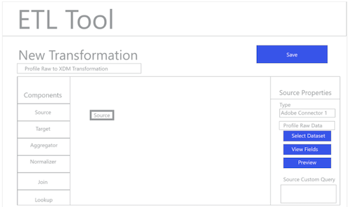

# Fluxo de trabalho ETL

Várias ferramentas de extração, transformação e carregamento (ETL) podem diferir no formato, mas a maioria expõe funcionalidades semelhantes para auxiliar na combinação de várias fontes de dados.

## Exemplo de ferramenta ETL

Os diagramas a seguir fornecem modelos de ações ETL comuns e uma experiência de usuário genérica com base em interações padrão. Essas imagens poderiam ser facilmente adaptadas para uma experiência específica do usuário de ETL.

As ações ilustradas abaixo são descritas nas etapas descritas no [Guia de Integração ETL](home.md). Algumas etapas fazem referência a &quot;Figuras&quot; específicas, outras descrevem ações semelhantes ao fluxo de trabalho mostrado aqui.

### Figura 1 - Configurar o novo conector do Adobe Experience Platform:

### Figura 2 - Conector [!DNL Experience Platform] ativado:

### Figura 3 - Interface do usuário do gerenciamento de transformação ETL:

### Figura 4 - Nova interface de transformação, selecionando [!DNL Experience Platform] Conexão:

### Figura 5 - Procurar conjuntos de dados de origem [!DNL Experience Platform]:

### Figura 6 - Metadados e dados de amostra do conjunto de dados na interface do ETL:

### Figura 7 - Exibição de informações do esquema de campo a partir dos conjuntos de dados:

### Figura 8 - Visualização de dados de conjuntos de dados:

### Figura 9 - Definição dos parâmetros de sincronização de dados para a operação da transformação:

### Figura 10 - Definição do conjunto de dados de destino [!DNL Experience Data Model] (XDM):

### Figura 11 - Visualização de esquemas e metadados hierárquicos XDM para suportar mapeamento/transformações:

### Figura 12 - Salvar e executar/agendar as transformações:

