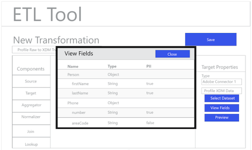

# Fluxo de trabalho ETL

Várias ferramentas de extração, transformação e carregamento (ETL) podem diferir no formato, mas a maioria expõe funcionalidades semelhantes para auxiliar na combinação de várias fontes de dados.

## Exemplo de ferramenta ETL

Os diagramas a seguir fornecem modelos de ações ETL comuns e uma experiência do usuário genérica com base em interações padrão. Essas imagens podem ser facilmente adaptadas para uma experiência específica do usuário de ETL.

As ações ilustradas abaixo estão descritas nas etapas descritas no [Guia de Integração do ETL](home.md). Algumas etapas fazem referência a &quot;Figuras&quot; específicas, outras descrevem ações semelhantes ao fluxo de trabalho mostrado aqui.

### Figura 1 - Configurar novo conector do Adobe Experience Platform:

### Figura 2 - Conector do [!DNL Experience Platform] ativado:

### Figura 3 - Interface do usuário do gerenciamento de transformação do ETL:

### Figura 4 - Nova interface do usuário de transformação, selecionando [!DNL Experience Platform] Conexão:

### Figura 5 - Procurando Conjuntos de Dados de origem [!DNL Experience Platform]:

### Figura 6 - Metadados e dados de amostra do conjunto de dados na interface do ETL:

### Figura 7 - Exibição de informações do esquema de campo de conjuntos de dados:

### Figura 8 - Visualização de dados dos conjuntos de dados:

### Figura 9 - Definição dos parâmetros de sincronização de dados para a operação da transformação:

### Figura 10 - Definindo o Conjunto de Dados de destino [!DNL Experience Data Model] (XDM):

### Figura 11 - Visualização dos esquemas hierárquicos e metadados XDM para suportar mapeamento/transformações:

### Figura 12 - Salvar e executar/agendar as Transformações:

