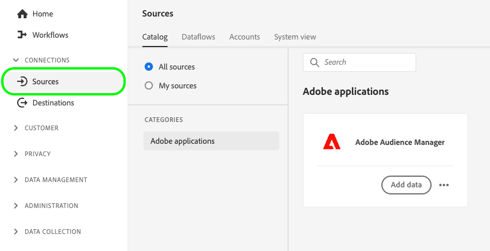

# Ativar públicos-alvo por meio da Ativação expandida de Audience Manager

Esta página descreve o fluxo de trabalho completo que deve ser seguido para ativar públicos-alvo do Audience Manager para as plataformas de destino compatíveis com a Ativação expandida.

## Antes de começar {#before-you-begin}

As etapas descritas neste guia supõem que você tenha lido a [Página de visão geral da Ativação expandida](overview.md) e você confirmou que atende aos pré-requisitos para ativação de público-alvo.

>[!IMPORTANT]
>
>Para ativar públicos-alvo por meio do [!DNL Expanded Activation], verifique se os públicos-alvo do Audience Manager são baseados em **endereços de email com hash**. Consulte a [pré-requisitos](overview.md#prerequisites) para obter mais detalhes.

## Etapa 1: configurar a conexão de origem do Audience Manager {#configure-source}

A variável [conector de origem do Audience Manager](../sources/connectors/adobe-applications/audience-manager.md) O envia dados de público-alvo coletados no Adobe Audience Manager para ativação nas plataformas de destino compatíveis com a Ativação expandida.

Siga o guia em como [criar uma conexão de origem de Audience Manager](../sources/tutorials/ui/create/adobe-applications/audience-manager.md) para configurar seu conector de origem.

>[!TIP]
>
>O conector de origem do Adobe Audience Manager é o único conector de origem disponível na Ativação expandida.
>
>Se você quiser assimilar públicos com base em identificadores adicionais, compre uma edição do [Real-Time CDP](../rtcdp/overview.md). Entre em contato com o representante da Adobe para obter mais detalhes.

### Exibir e monitorar públicos-alvo assimilados {#view-audiences}

Os públicos-alvo que você traz para a Ativação expandida do Audience Manager estão disponíveis para você visualizar no **[!UICONTROL Públicos-alvo]** painel.

Para exibir seus públicos-alvo, acesse **[!UICONTROL Cliente]** -> **[!UICONTROL Públicos-alvo]** -> **[!UICONTROL Procurar]**.

>[!IMPORTANT]
>
>* O Audiences pode levar até 48 horas para ser totalmente preenchido na Ativação expandida. Isso também se aplica a atualizações para públicos-alvo de Audience Manager existentes.
>* Os públicos-alvo de Audience Manager recém-criados não aparecem automaticamente na Ativação expandida. Para assimilar novos segmentos na Ativação expandida, você deve adicioná-los por meio do conector de origem do Audience Manager.

Após configurar o conector de origem do Audience Manager, mova para [etapa 2](#create-destination-connection).

## Etapa 2: criar uma nova conexão de destino {#create-destination-connection}

Antes de enviar os públicos-alvo do Audience Manager para a plataforma de destino escolhida, é necessário primeiro criar uma conexão com uma plataforma de destino.

Na barra lateral esquerda, vá para **[!UICONTROL Conexões]** -> **[!UICONTROL Destinos]** -> **[!UICONTROL Catálogo]**.

As categorias de destino disponíveis para [!DNL Expanded Activation] são [publicidade](../destinations/catalog/advertising/overview.md) e [social](../destinations/catalog/social/overview.md).

Para criar uma nova conexão com uma plataforma de destino, siga o guia em [como criar uma nova conexão de destino](../destinations/ui/connect-destination.md). Em seguida, mova para [etapa 3](#activate-audiences).

## Etapa 3: ativar públicos-alvo para o destino {#activate-audiences}

Depois que você tiver [públicos-alvo de Audience Manager assimilados](#configure-source) e [criou uma nova conexão de destino](#create-destination-connection), agora você pode ativar os públicos-alvo para a plataforma de destino de sua escolha.

Para ativar os públicos-alvo para o seu destino, siga o guia em [como ativar públicos para destinos de transmissão](../destinations/ui/activate-segment-streaming-destinations.md).

## Verificar ativação de público {#verify}

Verifique a [documentação de monitoramento de destino](../dataflows/ui/monitor-destinations.md) para obter informações detalhadas sobre como monitorar o fluxo de dados para seus destinos.