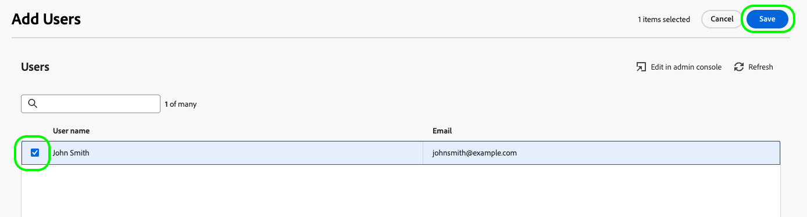

# Administração de conta

Para assimilar públicos do Audience Manager e ativá-los para destinos sociais e de publicidade, primeiro crie uma conta de usuário de Ativação expandida e atribua a conta à função de permissão correta.

Esta página explica como criar uma conta de usuário no Admin Console e atribuir as permissões corretas para a Ativação expandida.

## Criar contas de usuário {#create-users}

Antes que você possa usar [!DNL Audience Manager Expanded Activation], você deve criar uma conta de usuário.

Para criar uma conta de usuário para [!DNL Expanded Activation], siga as instruções em gerenciamento de usuários na [Adobe Admin Console](https://helpx.adobe.com/br/enterprise/using/manage-users-individually.html) documentação.

## Adicionar usuários à função de permissão {#permissions}

Após criar uma conta de usuário, você deve adicioná-la à [!DNL Expanded Activation] função de permissão, na [!DNL Expanded Activation] interface do usuário.

Ir para **[!UICONTROL Administração]** -> **[!UICONTROL Permissões]** -> **[!UICONTROL Funções]** e selecione a variável **[!UICONTROL Função Padrão de Ativação Expandida]**.

Vá para a **[!UICONTROL Usuários]** e selecione **[!UICONTROL Adicionar usuários]**.

Selecione o usuário recém-criado na lista disponível e selecione **[!UICONTROL Salvar]**.

A conta de usuário agora é criada e atribuída à função correta. Agora ele está pronto para acessar o **[!UICONTROL Ativação expandida]** interface do usuário.

## Monitorar o uso da licença {#license-usage}

Seu [!DNL Audience Manager Expanded Activation] o contrato especifica o número máximo de emails com hash que você pode assimilar na sua conta.

Você pode encontrar essas informações acessando o **[!UICONTROL Administração]** -> **[!UICONTROL Uso da licença]** página.

Nessa página, você pode encontrar as seguintes informações:

* **[!UICONTROL Produto]**: o produto Adobe para o qual você está licenciado. Isso sempre será **[!UICONTROL Ativação expandida do Audience Manager]**.
* **[!UICONTROL Métrica primária]**: o nome da métrica que está sendo rastreada para uso. Isso sempre será **[!UICONTROL Público endereçável]**.
* **[!UICONTROL Valor da licença]**: o número máximo de emails com hash que você está licenciado a assimilar.

  >[!TIP]
  >
  >Você assimila emails com hash por meio do [conector de origem do Audience Manager](../sources/connectors/adobe-applications/audience-manager.md). Consulte a documentação em [como ativar públicos](activate-audiences.md) para obter mais detalhes.

* **[!UICONTROL Uso]**: o número de emails com hash que você assimilou.
* **[!UICONTROL Uso %]**: a porcentagem do valor da licença usada.

Para saber mais sobre o uso de licença no Experience Platform, consulte a [documentação de uso da licença](../dashboards/guides/license-usage.md).

## Próximas etapas {#next-steps}

Agora que você configurou pelo menos uma conta de usuário com o acesso correto à Ativação expandida, é possível começar a usar a conta para [ativar públicos](activate-audiences.md).
