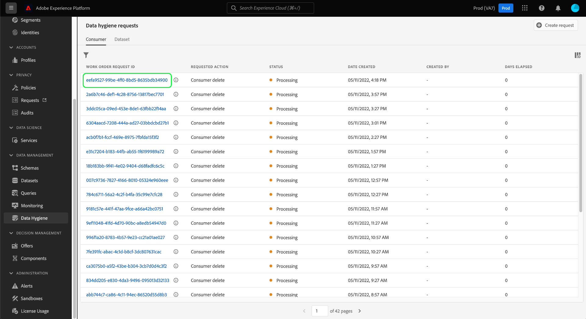

# Procurar ordens de trabalho de higiene de dados

>[!CONTEXTUALHELP]
>id="platform_hygiene_workorders"
>title="IDs de ordem de trabalho"
>abstract="Quando uma solicitação de higiene de dados é enviada para o sistema, uma ordem de trabalho é criada para executar a tarefa solicitada. Em outras palavras, uma ordem de trabalho representa um processo específico de higiene de dados, que inclui seu status atual e outros detalhes relacionados. Cada ordem de trabalho recebe automaticamente sua própria ID exclusiva após a criação. Para saber mais, consulte o guia da interface do usuário de higiene de dados."

>[!IMPORTANT]
>
>Os recursos de higiene de dados no Adobe Experience Platform estão disponíveis apenas para organizações que compraram o Adobe Shield for Healthcare.

Quando uma solicitação de higiene de dados é enviada para o sistema, uma ordem de trabalho é criada para executar a tarefa solicitada. Uma ordem de trabalho representa um processo específico de higiene de dados (como a exclusão de dados do consumidor), que inclui seu status atual e outros detalhes relacionados.

Este guia aborda como visualizar e gerenciar pedidos de trabalho existentes na interface do usuário do Adobe Experience Platform.

## Listar e filtrar ordens de trabalho existentes

Ao acessar o **[!UICONTROL Higiene de dados]** na interface do usuário, uma lista de pedidos de trabalho existentes é mostrada junto com os detalhes básicos.

![Imagem que mostra o [!UICONTROL Higiene de dados] espaço de trabalho na interface do usuário da plataforma](../images/ui/browse/work-order-list.png)

A lista mostra somente pedidos de trabalho para uma categoria de cada vez. Selecionar **[!UICONTROL Consumidor]** para exibir uma lista de tarefas de exclusão do consumidor, e **[!UICONTROL Conjunto de dados]** para exibir uma lista de agendamentos de TTL (time-to-live) para conjuntos de dados.

![Imagem que mostra o [!UICONTROL Conjunto de dados] guia](../images/ui/browse/dataset-tab.png)

Selecione o ícone de funil () para visualizar uma lista de filtros para as ordens de serviço exibidas.

Dependendo da guia que você estiver visualizando, filtros diferentes estarão disponíveis:

| Filtro | Categoria | Descrição |
| --- | --- | --- |
| [!UICONTROL Status] | [!UICONTROL Consumidor] &amp; [!UICONTROL Conjunto de dados] | Filtrar com base no status atual da ordem de trabalho. |
| [!UICONTROL Data de criação] | [!UICONTROL Consumidor] | Filtro com base em quando a solicitação de exclusão do consumidor foi feita. |
| [!UICONTROL Data de criação] | [!UICONTROL Conjunto de dados] | Filtro com base em quando a solicitação de exclusão do consumidor foi feita. |
| [!UICONTROL Data de exclusão] | [!UICONTROL Conjunto de dados] | Filtro com base na data de exclusão agendada pelo TTL. |
| [!UICONTROL Data de atualização] | [!UICONTROL Conjunto de dados] | Filtrar com base em quando o TTL do conjunto de dados foi atualizado pela última vez. As criações e as consultas TTL são contadas como atualizações. |

{style=&quot;table-layout:auto&quot;}

## Exibir os detalhes de uma ordem de serviço

Selecione a ID de um pedido de trabalho listado para exibir seus detalhes.

Dependendo do tipo de ordem de trabalho selecionada, informações e controles diferentes são fornecidos. Elas são abordadas nas seções abaixo.

### Detalhes de exclusão do consumidor

<!-- (Not available for initial release)
>[!CONTEXTUALHELP]
>id="platform_hygiene_responsemessages"
>title="Consumer delete response"
>abstract="When a consumer deletion process receives a response from the system, these messages are displayed under the **[!UICONTROL Result]** section. If a problem occurs while a work order is processing, any relevant error messages will appear in this section to help you troubleshoot the issue. To learn more, see the data hygiene UI guide."
-->

Os detalhes de uma solicitação de exclusão do consumidor são somente leitura, exibindo seus atributos básicos, como seu status atual e o tempo decorrido desde que a solicitação foi feita.

### Detalhes do TTL do conjunto de dados

A página de detalhes de um TTL de conjunto de dados fornece informações sobre seus atributos básicos, incluindo a data de expiração programada nos dias restantes antes da exclusão. No painel direito, você pode usar controles para editar ou cancelar o TTL.

## Próximas etapas

Este guia cobriu como visualizar e gerenciar pedidos de higiene de dados existentes na interface do usuário da plataforma. Para obter informações sobre como criar seus próprios pedidos de trabalho, consulte a seguinte documentação:

* [Excluir um consumidor](./delete-consumer.md)
* [Programar um TTL de conjunto de dados](./ttl.md)
