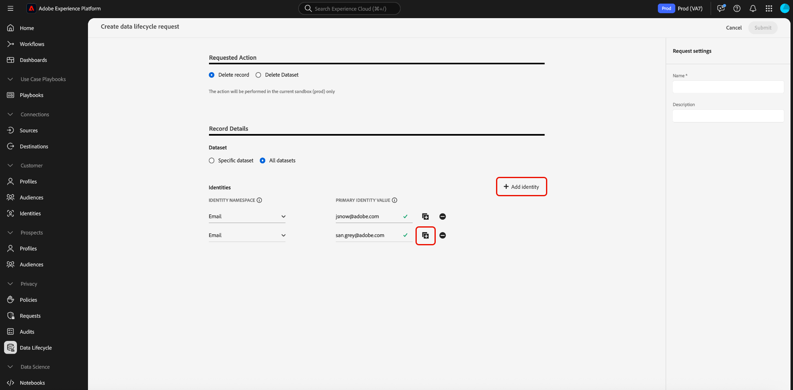

# Registrar solicitações de exclusão (Fluxo de trabalho da interface do usuário) {#record-delete}

Use o [[!UICONTROL Data Lifecycle] espaço de trabalho](./overview.md) para excluir registros no Adobe Experience Platform com base em suas identidades primárias. Esses registros podem ser vinculados a consumidores individuais ou a qualquer outra entidade incluída no gráfico de identidade.

>[!IMPORTANT]
>
>As exclusões de registros devem ser usadas para limpeza de dados, remoção de dados anônimos ou minimização de dados. Eles **não** devem ser usados para solicitações de direitos do titular dos dados (conformidade) relacionadas a regulamentos de privacidade, como o Regulamento Geral sobre a Proteção de Dados (GDPR). Para todos os casos de uso de conformidade, use o [Adobe Experience Platform Privacy Service](../../privacy-service/home.md).

## Pré-requisitos {#prerequisites}

A exclusão de registros requer um entendimento prático de como os campos de identidade funcionam no Experience Platform. Especificamente, você deve conhecer os valores de namespace de identidade das entidades cujos registros deseja excluir, dependendo do conjunto de dados (ou conjuntos de dados) do qual você está excluindo.

Consulte a seguinte documentação para obter mais informações sobre identidades no Experience Platform:

* [Adobe Experience Platform Identity Service](../../identity-service/home.md): une identidades em dispositivos e sistemas, vinculando conjuntos de dados com base nos campos de identidade definidos pelos esquemas XDM aos quais estão em conformidade.
* [Namespaces de identidade](../../identity-service/features/namespaces.md): os namespaces de identidade definem os diferentes tipos de informações de identidade que podem se relacionar a uma única pessoa e são um componente necessário para cada campo de identidade.
* [Perfil do cliente em tempo real](../../profile/home.md): usa gráficos de identidade para fornecer perfis de consumidor unificados com base em dados agregados de várias fontes, atualizados em tempo quase real.
* [Experience Data Model (XDM)](../../xdm/home.md): fornece definições e estruturas padrão para dados do Experience Platform por meio do uso de esquemas. Todos os conjuntos de dados do Experience Platform estão em conformidade com um esquema XDM específico, e o esquema define quais campos são identidades.
* [Campos de identidade](../../xdm/ui/fields/identity.md): saiba como um campo de identidade é definido em um esquema XDM.

## Criar uma solicitação {#create-request}

Para iniciar o processo, selecione **[!UICONTROL Data Lifecycle]** na navegação à esquerda da interface do Experience Platform. O espaço de trabalho [!UICONTROL Data lifecycle requests] é exibido. Em seguida, selecione **[!UICONTROL Create request]** na página principal do espaço de trabalho.

![O espaço de trabalho [!UICONTROL Data lifecycle requests] com [!UICONTROL Create request] selecionado.](../images/ui/record-delete/create-request-button.png)

O workflow de criação da solicitação é exibido. Por padrão, a opção **[!UICONTROL Delete record]** está selecionada na seção **[!UICONTROL Requested Action]**. Deixe essa opção selecionada.

>[!IMPORTANT]
> 
>Para melhorar a eficiência e tornar as operações do conjunto de dados mais baratas, as organizações que foram movidas para o formato Delta podem excluir dados do Serviço de identidade, do Perfil do cliente em tempo real e do data lake. Esse tipo de usuário é chamado de delta-migrado. Os usuários de organizações que receberam a migração delta podem optar por excluir registros de um único conjunto de dados ou de todos eles. Os usuários de organizações que não passaram pela migração delta não podem excluir seletivamente registros de um único conjunto de dados ou de todos os conjuntos de dados, conforme mostrado na imagem abaixo. Nesse caso, continue para a seção [Fornecer identidades](#provide-identities) do guia.

![O fluxo de trabalho de criação da solicitação com a opção [!UICONTROL Delete record] selecionada e realçada.](../images/ui/record-delete/delete-record.png)

## Selecionar conjuntos de dados {#select-dataset}

A próxima etapa é determinar se você deseja excluir registros de um único conjunto de dados ou de todos os conjuntos de dados. Dependendo da configuração de sua organização, a opção de seleção de conjunto de dados pode não estar disponível. Se você não vir essa opção, continue na seção [Fornecer identidades](#provide-identities) do guia.

Na seção **[!UICONTROL Record Details]**, selecione um botão de opção para escolher um conjunto de dados específico ou todos os conjuntos de dados.

Para excluir de um conjunto de dados específico, selecione **[!UICONTROL Select dataset]** e, em seguida, selecione o ícone do banco de dados (). Na caixa de diálogo exibida, escolha um conjunto de dados e selecione **[!UICONTROL Done]** para confirmar.

![A caixa de diálogo [!UICONTROL Select dataset] com um conjunto de dados selecionado e [!UICONTROL Done] realçado.](../images/ui/record-delete/select-dataset.png)

Para excluir de todos os conjuntos de dados, selecione **[!UICONTROL All datasets]**. Essa opção aumenta o escopo da operação e requer que você forneça todos os tipos de identidade relevantes.

![A caixa de diálogo [!UICONTROL Select dataset] com a opção [!UICONTROL All datasets] selecionada.](../images/ui/record-delete/all-datasets.png)

>[!WARNING]
>
>Selecionar **[!UICONTROL All datasets]** expande a operação para todos os conjuntos de dados na organização. Cada conjunto de dados pode usar um tipo de identidade principal diferente. Você deve fornecer **todos os tipos de identidade necessários** para garantir uma correspondência precisa.
>
>Se qualquer tipo de identidade estiver ausente, alguns registros poderão ser ignorados durante a exclusão. Isso pode atrasar o processamento e levar a **resultados parciais**.

Cada conjunto de dados na Experience Platform oferece suporte a apenas um tipo de identidade principal.

* Ao excluir de um **único conjunto de dados**, todas as identidades em sua solicitação devem usar o **mesmo tipo**.
* Ao excluir de **todos os conjuntos de dados**, você pode incluir **vários tipos de identidade**, já que conjuntos de dados diferentes podem confiar em identidades primárias diferentes.&quot;

## Fornecer identidades {#provide-identities}

>[!CONTEXTUALHELP]
>id="platform_hygiene_primaryidentity"
>title="Namespace de identidade"
>abstract="Um namespace de identidade é um atributo que vincula um registro ao perfil de consumidor na Experience Platform. O campo de namespace de identidade de um conjunto de dados é definido pelo esquema em que o conjunto de dados se baseia. Nessa coluna, é necessário fornecer o tipo (ou namespace) para namespace de identidade do registro, como `email` para endereços de email e `ecid` para IDs da Experience Cloud. Para saber mais, consulte o guia da interface do ciclo de vida dos dados."

>[!CONTEXTUALHELP]
>id="platform_hygiene_identityvalue"
>title="Valor de identidade principal"
>abstract="Nessa coluna, é necessário fornecer o valor do namespace de identidade do registro, que deve corresponder ao tipo de identidade fornecido na coluna esquerda. Se o tipo de namespace de identidade for `email`, o valor deverá ser o endereço de email do registro. Para saber mais, consulte o guia da interface do ciclo de vida dos dados."

Ao excluir registros, você deve fornecer informações de identidade para que o sistema possa determinar quais registros devem ser excluídos. Para qualquer conjunto de dados no Experience Platform, os registros são excluídos com base no campo **namespace de identidade** definido pelo esquema do conjunto de dados.

Como todos os campos de identidade no Experience Platform, um namespace de identidade é composto de dois itens: um **tipo** (às vezes chamado de namespace de identidade) e um **valor**. O tipo de identidade fornece contexto sobre como o campo identifica um registro (como um endereço de email). O valor representa a identidade específica de um registro para esse tipo (por exemplo, `jdoe@example.com` para o tipo de identidade `email`). Campos comuns usados como identidades incluem informações da conta, IDs do dispositivo e IDs de cookie.

>[!TIP]
>
>Se você não souber o namespace de identidade de um conjunto de dados específico, poderá encontrá-lo na interface do usuário do Experience Platform. No espaço de trabalho **[!UICONTROL Datasets]**, selecione o conjunto de dados em questão na lista. Na página de detalhes do conjunto de dados, passe o mouse sobre o nome do esquema do conjunto de dados no painel direito. O namespace de identidade é exibido junto com o nome e a descrição do esquema.
>
>

Há duas opções para fornecer identidades ao excluir registros:

* [Fazer upload de um arquivo JSON](#upload-json)
* [Inserir valores de identidade primários manualmente](#manual-identity)

### Fazer upload de um arquivo JSON {#upload-json}

Para carregar um arquivo JSON, você pode arrastar e soltar o arquivo na área fornecida ou selecionar **[!UICONTROL Choose files]** para procurar e selecionar no diretório local.


O arquivo JSON deve ser formatado como uma matriz de objetos, cada objeto representando uma identidade.

```json
[
  {
    "namespaceCode": "email",
    "value": "jdoe@example.com"
  },
  {
    "namespaceCode": "email",
    "value": "san.gray@example.com"
  }
]
```

| Propriedade | Descrição |
| --- | --- |
| `namespaceCode` | O tipo de identidade. |
| `value` | O valor de identidade principal conforme indicado pelo tipo. |

Depois que o arquivo for carregado, você poderá continuar a [enviar a solicitação](#submit).

### Inserir identidades manualmente {#manual-identity}

Para inserir identidades manualmente, selecione **[!UICONTROL Add identity]**.

![O fluxo de trabalho de criação da solicitação com a opção [!UICONTROL Add identity] realçada.](../images/ui/record-delete/add-identity.png)

São exibidos controles que permitem inserir identidades, uma de cada vez. Em **[!UICONTROL identity namespace]**, use o menu suspenso para selecionar o tipo de identidade. Em **[!UICONTROL Primary Identity Value]**, forneça o valor do namespace de identidade para o registro.


Para adicionar mais identidades, selecione o ícone de adição () ao lado de uma das linhas ou selecione **[!UICONTROL Add identity]**.



## Cotas e cronogramas de processamento {#quotas}

As solicitações de exclusão de registros estão sujeitas a limites diários e mensais de envio de identificadores, determinados pelo direito de licença da organização. Esses limites se aplicam às solicitações de exclusão baseadas em interface e API.

>[!NOTE]
>
>Você pode enviar até **1.000.000 identificadores por dia**, mas somente se sua cota mensal restante permitir. Se o limite mensal for inferior a 1 milhão, os envios diários não poderão exceder esse limite.

### Direito de envio mensal por produto {#quota-limits}

A tabela abaixo descreve os limites de envio de identificadores por produto e nível de direito. Para cada produto, o limite mensal é o menor de dois valores: um limite de identificador fixo ou um limite baseado em porcentagem vinculado ao volume de dados licenciado.

| Produto | Descrição do Direito | Limite mensal (o que for menor) |
|----------|-------------------------|---------------------------------|
| Real-Time CDP ou Adobe Journey Optimizer | Sem o Privacy and Security Shield ou o complemento Healthcare Shield | 2.000.000 identificadores ou 5% do público endereçável |
| Real-Time CDP ou Adobe Journey Optimizer | Com o Privacy and Security Shield ou o complemento Healthcare Shield | 15.000.000 identificadores ou 10% do público endereçável |
| Customer Journey Analytics | Sem o Privacy and Security Shield ou o complemento Healthcare Shield | 2.000.000 identificadores ou 100 identificadores por milhão de linhas de direito do CJA |
| Customer Journey Analytics | Com o Privacy and Security Shield ou o complemento Healthcare Shield | 15.000.000 identificadores ou 200 identificadores por milhão de linhas de direito do CJA |

>[!NOTE]
>
> A maioria das organizações terá limites mensais mais baixos com base no público-alvo endereçável real ou nos direitos de linha do CJA.

As cotas são redefinidas no primeiro dia de cada mês. Cota não utilizada **não** é transferida.

>[!NOTE]
>
>As cotas são baseadas no direito mensal licenciado de sua organização para **identificadores enviados**. Esses procedimentos não são aplicados pelas medidas de proteção do sistema, mas podem ser monitorados e revisados.
>
>A Exclusão de Registro é um **serviço compartilhado**. Seu limite mensal reflete os direitos mais altos no Real-Time CDP, Adobe Journey Optimizer, Customer Journey Analytics e em qualquer complemento do Shield aplicável.

### Processamento de cronogramas para envios de identificadores {#sla-processing-timelines}

Após o envio, as solicitações de exclusão de registro são enfileiradas e processadas com base no seu nível de direito.

| Descrição do produto e dos direitos | Duração da Fila | Tempo máximo de processamento (SLA) |
|------------------------------------------------------------------------------------|---------------------|-------------------------------|
| Sem o Privacy and Security Shield ou o complemento Healthcare Shield | Até 15 dias | 30 dias |
| Com o Privacy and Security Shield ou o complemento Healthcare Shield | Normalmente, 24 horas | 15 dias |

Se sua organização exigir limites mais altos, entre em contato com o representante da Adobe para obter uma revisão de direito.

>[!TIP]
>
>Para verificar seu nível atual de uso de cota ou direito, consulte o [Guia de referência de cota](../api/quota.md).

## Enviar a solicitação {#submit}

Quando terminar de adicionar identidades à solicitação, em **[!UICONTROL Request settings]**, forneça um nome e uma descrição opcional para a solicitação antes de selecionar **[!UICONTROL Submit]**.

>[!TIP]
>
>É possível enviar até 10.000 identidades por solicitação por meio da interface do usuário do. Para enviar volumes maiores (até 100.000 IDs por solicitação), use o [método de API](../api/workorder.md#create).

![A configuração da solicitação [!UICONTROL Name] e [!UICONTROL Description] campos com [!UICONTROL Submit] realçados.](../images/ui/record-delete/submit.png)

Uma caixa de diálogo [!UICONTROL Confirm request] é exibida para indicar que as identidades não podem ser recuperadas depois de excluídas. Selecione **[!UICONTROL Submit]** para confirmar a lista de identidades cujos dados você deseja excluir.

![A caixa de diálogo [!UICONTROL Confirm request].](../images/ui/record-delete/confirm-request.png)

Após o envio da solicitação, uma ordem de serviço é criada e aparece na guia [!UICONTROL Record] do espaço de trabalho [!UICONTROL Data Lifecycle]. Aqui, você pode monitorar o status da ordem de serviço à medida que ela processa a solicitação.

>[!NOTE]
>
>Consulte a seção de visão geral em [linhas do tempo e transparência](../home.md#record-delete-transparency) para obter detalhes sobre como as exclusões de registros são processadas após a execução.

![A guia [!UICONTROL Record] do espaço de trabalho [!UICONTROL Data Lifecycle] com a nova solicitação realçada.](../images/ui/record-delete/request-log.png)

## Exclusão de registros de conjuntos de dados com base em esquemas relacionais {#relational-record-delete}

Se o conjunto de dados do qual você está excluindo for baseado em um esquema relacional, analise as seguintes considerações para garantir que os registros sejam removidos corretamente e não sejam assimilados novamente devido a incompatibilidades entre o Experience Platform e o sistema de origem.

### Comportamento de exclusão de registro

A tabela a seguir descreve como as exclusões de registros se comportam em sistemas Experience Platform e de origem, dependendo do método de assimilação e da configuração de captura de dados de alteração.

| Aspecto | Comportamento |
|---------------------|--------------------------------------------------------------------------|
| Exclusão da plataforma | Os registros são removidos do conjunto de dados e do data lake da Experience Platform. |
| Retenção do Source | Os registros permanecem no sistema de origem, a menos que sejam explicitamente excluídos desse sistema. |
| Impacto total na atualização | Se estiver usando a atualização completa, os registros excluídos poderão ser assimilados novamente, a menos que sejam removidos ou excluídos da origem. |
| Alterar comportamento de captura de dados | Os registros sinalizados com `_change_request_type = 'd'` são excluídos durante a assimilação. Os registros não sinalizados podem ser assimilados novamente. |

Para evitar a reassimilação, aplique a mesma abordagem de exclusão no sistema de origem e no Experience Platform, removendo registros de ambos os sistemas ou incluindo `_change_request_type = 'd'` para os registros que você pretende excluir.

### Alterar colunas de controle e captura de dados

Esquemas relacionais que usam Origens com captura de dados de alteração podem usar a coluna de controle `_change_request_type` ao diferenciar exclusões de substituições. Durante a assimilação, os registros sinalizados com `d` são excluídos do conjunto de dados, enquanto aqueles sinalizados com `u` ou sem a coluna são tratados como substituições. A coluna `_change_request_type` é lida somente no momento da assimilação e não é armazenada no esquema de destino ou mapeada para campos XDM.

>[!NOTE]
>
>A exclusão de registros por meio da interface do usuário do ciclo de vida dos dados não afeta o sistema de origem. Para remover dados de ambos os locais, exclua-os na Experience Platform e na origem.

### Métodos de exclusão adicionais para esquemas relacionais

Além do fluxo de trabalho padrão de exclusão de registros, os esquemas relacionais oferecem suporte a métodos adicionais para casos de uso específicos:

* **Abordagem do conjunto de dados de cópia segura**: duplicar o conjunto de dados de produção e aplicar exclusões à cópia para teste controlado ou reconciliação antes de aplicar alterações aos dados de produção.
* **Upload em lote somente com exclusões**: carregue um arquivo contendo apenas operações de exclusão para limpeza direcionada quando precisar remover registros específicos sem afetar outros dados.

### Suporte de descritor para operações de higiene {#descriptor-support}

Os descritores de esquema relacionais fornecem metadados essenciais para operações de higiene precisas:

* **Descritor de chave primária**: identifica registros exclusivamente para atualizações ou exclusões direcionadas, garantindo que os registros corretos sejam afetados.
* **Descritor de versão**: garante que as exclusões e atualizações sejam aplicadas na ordem cronológica correta, evitando operações fora de sequência.
* **Descritor de carimbo de data/hora (esquemas de série temporal)**: alinha as operações de exclusão com tempos de ocorrência de eventos em vez de tempos de assimilação.

>[!NOTE]
>
>Os processos de higiene operam no nível do conjunto de dados. Para conjuntos de dados habilitados para perfis, podem ser necessários fluxos de trabalho de perfil adicionais para manter a consistência no Perfil do cliente em tempo real.

### Retenção programada para esquemas relacionais

Para uma higiene automatizada com base na idade dos dados em vez de identidades específicas, consulte [Gerenciar a retenção do conjunto de dados (TTL) do evento de experiência](../../catalog/datasets/experience-event-dataset-retention-ttl-guide.md) para retenção no nível de linha agendada no data lake.

>[!NOTE]
>
>A expiração em nível de linha é compatível somente com conjuntos de dados que usam comportamento de série temporal.

### Práticas recomendadas para exclusão de registro relacional

Para evitar a reassimilação não intencional e manter a consistência dos dados entre sistemas, siga estas práticas recomendadas:

* **Coordenar exclusões**: alinhe as exclusões de registro com sua configuração de captura de dados de alteração e estratégia de gerenciamento de dados de origem.
* **Monitorar fluxos de captura de dados de alteração**: após excluir registros na Plataforma, monitore os fluxos de dados e confirme se o sistema de origem remove os mesmos registros ou os inclui com `_change_request_type = 'd'`.
* **Limpar a origem**: para origens que usam assimilação de atualização completa ou aquelas que não oferecem suporte a exclusões por meio da captura de dados de alteração, exclua registros diretamente do sistema de origem para evitar a reassimilação.

Para obter mais detalhes sobre requisitos do esquema, consulte [requisitos do descritor de esquema relacional](../../xdm/schema/relational.md#relational-schemas).

Para saber como a captura de dados de alteração funciona com origens, consulte [Habilitar captura de dados de alteração nas origens](../../sources/tutorials/api/change-data-capture.md#using-change-data-capture-with-relational-schemas).

## Próximas etapas

Este documento abordou como excluir registros na interface do usuário do Experience Platform. Para obter informações sobre como executar outras tarefas de gerenciamento do ciclo de vida dos dados na interface, consulte a [visão geral da interface do ciclo de vida dos dados](./overview.md).

Para saber como excluir registros usando a API de Limpeza de Dados, consulte o [manual de ponto de extremidade de ordem de trabalho](../api/workorder.md).
