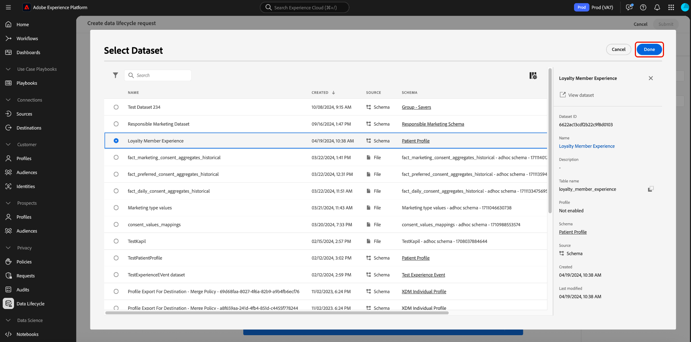

# Excluir registros

O [[!UICONTROL Higiene de dados] espaço de trabalho](./overview.md) na interface do usuário do Adobe Experience Platform permite excluir registros que estão participando do Serviço de identidade e do Perfil do cliente em tempo real. Esses registros podem ser vinculados a consumidores individuais ou a qualquer outra entidade incluída no gráfico de identidade.

>[!IMPORTANT]
>
>As solicitações de exclusão de registro só estão disponíveis para organizações que compraram **Blindagem do Adobe Healthcare**.
>
>
>As exclusões de registros devem ser usadas para limpeza de dados, remoção de dados anônimos ou minimização de dados. Eles são **not** a ser usado para solicitações de direitos do titular de dados (conformidade) como parte de regulamentos de privacidade como o Regulamento Geral sobre a Proteção de Dados (GDPR). Para todos os casos de uso de conformidade, use [Adobe Experience Platform Privacy Service](../../privacy-service/home.md) em vez disso.

## Pré-requisitos

A exclusão de registros requer uma compreensão funcional de como os campos de identidade funcionam no Experience Platform. Especificamente, você deve saber os valores de identidade primários das entidades cujos registros deseja excluir, dependendo do conjunto de dados (ou conjuntos de dados) do qual você os está excluindo.

Consulte a seguinte documentação para obter mais informações sobre identidades na Platform:

* [Serviço de identidade da Adobe Experience Platform](../../identity-service/home.md): Corresponde identidades entre dispositivos e sistemas, vinculando conjuntos de dados com base nos campos de identidade definidos pelos esquemas XDM aos quais eles estão em conformidade.
   * [Namespaces de identidade](../../identity-service/namespaces.md): Os namespaces de identidade definem os diferentes tipos de informações de identidade que podem estar relacionadas a uma única pessoa e são um componente obrigatório para cada campo de identidade.
* [Perfil do cliente em tempo real](../../profile/home.md): Utiliza gráficos de identidade para fornecer perfis de consumidor unificados com base em dados agregados de várias fontes, atualizados em tempo quase real.
* [Experience Data Model (XDM)](../../xdm/home.md): Fornece definições e estruturas padrão para dados da plataforma por meio do uso de esquemas. Todos os conjuntos de dados da Platform estão em conformidade com um esquema XDM específico e o esquema define quais campos são identidades.
   * [Campos de identidade](../../xdm/ui/fields/identity.md): Saiba como um campo de identidade é definido em um esquema XDM.

## Criar uma nova solicitação

Para iniciar o processo, selecione **[!UICONTROL Criar solicitação]** na página principal do espaço de trabalho.

![Imagem que mostra o [!UICONTROL Criar solicitação] botão sendo selecionado](../images/ui/record-delete/create-request-button.png)

A caixa de diálogo de criação da solicitação é exibida. Por padrão, a variável **[!UICONTROL Excluir consumidor]** está selecionada sob a variável **[!UICONTROL Ação solicitada]** seção. Deixe essa opção selecionada.


## Selecionar conjuntos de dados

Em **[!UICONTROL Detalhes do consumidor]** , a próxima etapa é determinar se você deseja excluir registros de um único conjunto de dados ou de todos os conjuntos de dados.

Se você escolher **[!UICONTROL Selecionar conjunto de dados]**, selecione o ícone do banco de dados () e uma caixa de diálogo é exibida permitindo selecionar o conjunto de dados desejado na lista.



Se quiser excluir registros de todos os conjuntos de dados, selecione **[!UICONTROL Todos os conjuntos de dados]**.

![Imagem que mostra o [!UICONTROL Todos os conjuntos de dados] opção selecionada](../images/ui/record-delete/all-datasets.png)

>[!NOTE]
>
>Selecionar o **[!UICONTROL Todos os conjuntos de dados]** A opção pode fazer com que a operação de exclusão demore mais e pode não resultar em uma exclusão de registro precisa.

## Fornecer identidades {#provide-identities}

>[!CONTEXTUALHELP]
>id="platform_hygiene_primaryidentity"
>title="Identidade primária"
>abstract="Uma identidade primária é um atributo que vincula um registro ao perfil do consumidor no Experience Platform. O campo de identidade principal de um conjunto de dados é definido pelo esquema em que o conjunto de dados se baseia. Nesta coluna, você deve fornecer o tipo (ou namespace) da identidade primária do registro, como `email` para endereços de email e `ecid` para Experience Cloud IDs. Para saber mais, consulte o guia da interface do usuário da Higiene de Dados ."

>[!CONTEXTUALHELP]
>id="platform_hygiene_identityvalue"
>title="Valor de identidade"
>abstract="Nesta coluna, você deve fornecer o valor da identidade primária do registro, que deve corresponder ao tipo de identidade fornecido na coluna esquerda. Se o tipo de identidade principal for `email`, o valor deve ser o endereço de email do registro. Para saber mais, consulte o guia da interface do usuário de higiene de dados."

Ao excluir registros, você deve fornecer informações de identidade para que o sistema possa determinar quais registros devem ser excluídos. Para qualquer conjunto de dados na Platform, os registros são excluídos com base na variável **identidade primária** que é definido pelo esquema do conjunto de dados.

Como todos os campos de identidade na Platform, uma identidade primária é composta de duas coisas: a **type** (às vezes chamado de namespace de identidade) e um **value**. O tipo de identidade fornece contexto sobre como o campo identifica um registro (como um endereço de email) e o valor representa a identidade específica de um registro para esse tipo (por exemplo, `jdoe@example.com` para `email` tipo de identidade). Campos comuns usados como identidades incluem informações de conta, IDs de dispositivo e IDs de cookie.

>[!TIP]
>
>Se você não souber a identidade primária de um conjunto de dados específico, poderá encontrá-la na interface do usuário da plataforma. No **[!UICONTROL Conjuntos de dados]** no espaço de trabalho, selecione o conjunto de dados em questão na lista. Na página de detalhes do conjunto de dados, passe o mouse sobre o nome do esquema do conjunto de dados no painel direito. A identidade primária é exibida junto com o nome e a descrição do schema.
>
>

Se você estiver excluindo registros de um único conjunto de dados, todas as identidades fornecidas deverão ter o mesmo tipo, já que um conjunto de dados pode ter apenas uma identidade primária. Se estiver excluindo de todos os conjuntos de dados, é possível incluir vários tipos de identidade, pois conjuntos de dados diferentes podem ter identidades primárias diferentes.

Há duas opções para fornecer identidades ao excluir registros:

* [Fazer upload de um arquivo JSON](#upload-json)
* [Inserir valores de identidade manualmente](#manual-identity)

### Fazer upload de um arquivo JSON {#upload-json}

Para fazer upload de um arquivo JSON, você pode arrastar e soltar o arquivo na área de fornecimento ou selecionar **[!UICONTROL Escolher arquivos]** para navegar e selecionar no diretório local.


O arquivo JSON deve ser formatado como uma matriz de objetos, cada objeto que representa uma identidade.

```json
[
  {
    "namespaceCode": "email",
    "value": "jdoe@example.com"
  },
  {
    "namespaceCode": "email",
    "value": "san.gray@example.com"
  }
]
```

| Propriedade | Descrição |
| --- | --- |
| `namespaceCode` | O tipo de identidade. |
| `value` | O valor de identidade como denotado pelo tipo . |

Depois que o arquivo for carregado, você poderá continuar [enviar o pedido](#submit).

### Inserir identidades manualmente {#manual-identity}

Para inserir identidades manualmente, selecione **[!UICONTROL Adicionar identidade]**.

![Imagem que mostra o [!UICONTROL Adicionar identidade] botão sendo selecionado](../images/ui/record-delete/add-identity.png)

São exibidos controles que permitem inserir identidades uma de cada vez. Em **[!UICONTROL Identidade principal]**, use o menu suspenso para selecionar o tipo de identidade. Em **[!UICONTROL Valor de identidade]**, forneça o valor de identidade principal para o registro.


Para adicionar mais identidades, selecione o ícone de adição () ao lado de uma das linhas ou selecione **[!UICONTROL Adicionar identidade]**.


## Enviar a solicitação (#submit)

Depois de concluir a adição de identidades à solicitação, em **[!UICONTROL Configurações da solicitação]**, forneça um nome e uma descrição opcional para a solicitação antes de selecionar **[!UICONTROL Enviar]**.

![Imagem que mostra o [!UICONTROL Enviar] botão sendo selecionado](../images/ui/record-delete/submit.png)

Você deverá confirmar a lista de identidades cujos dados deseja excluir. Selecionar **[!UICONTROL Enviar]** para confirmar a seleção.


Depois que a solicitação é enviada, uma ordem de serviço é criada e exibida no [!UICONTROL Consumidor] da guia [!UICONTROL Higiene de dados] espaço de trabalho. A partir daqui, você pode monitorar o status da ordem de serviço enquanto ela processa a solicitação.

>[!NOTE]
>
>Consulte a seção de visão geral em [prazos e transparência](../home.md#record-delete-transparency) para obter detalhes sobre como as exclusões de registros são processadas após a execução.

## Próximas etapas

Este documento cobriu como excluir registros na interface do usuário do Experience Platform. Para obter informações sobre como executar outras tarefas de higiene de dados na interface do usuário, consulte [visão geral da interface do usuário da higiene de dados](./overview.md).

Para saber como excluir registros usando a API de Higiene de Dados, consulte o [guia do endpoint de ordem de trabalho](../api/workorder.md).
