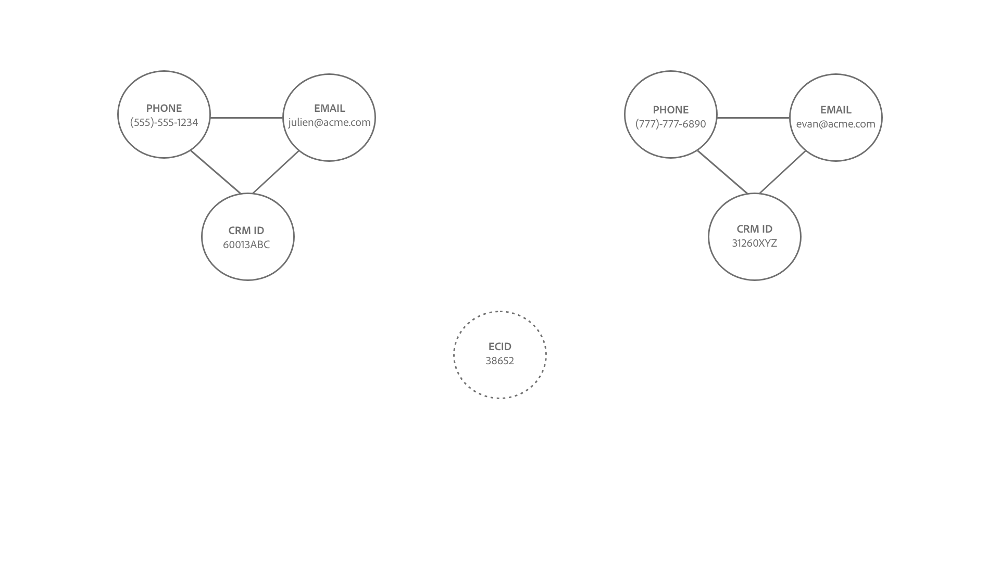

# Lógica de vinculação do Serviço de identidade {#identity-service-linking-logic}

>[!CONTEXTUALHELP]
>id="platform_identities_simulatedgraph"
>title="Gráfico simulado"
>abstract="As identidades são vinculadas quando o namespace de identidade e o valor de identidade são correspondentes."

Um link entre duas identidades é estabelecido quando o namespace de identidade e os valores de identidade são correspondentes.

Há dois tipos de identidades que são vinculadas:

* **Registros de perfil**: essas identidades geralmente vêm de sistemas CRM.
* **Eventos de experiência**: essas identidades geralmente vêm da implementação do SDK da Web ou da origem do Adobe Analytics.

## Significado semântico do estabelecimento de vínculos

Uma identidade representa uma entidade real. Se houver um vínculo estabelecido entre duas identidades, significa que as duas identidades estão associadas uma à outra. Veja a seguir alguns exemplos que ilustram esse conceito:

| Ação | Links estabelecidos | Significado |
| --- | --- | --- |
| Um usuário final faz logon usando um computador. | A CRMID e a ECID estão vinculadas. | Uma pessoa (CRMID) possui um dispositivo com um navegador (ECID). |
| Um usuário final navega anonimamente usando uma iPhone. | O IDFA está vinculado à ECID. | O dispositivo de hardware da Apple (IDFA), como uma iPhone, está associado ao navegador (ECID). |
| Um usuário final faz logon usando o Google Chrome e, em seguida, o Firefox. | A CRMID está vinculada a duas ECIDs diferentes. | Uma pessoa (CRMID) está associada a dois navegadores da Web (**Observação**: cada navegador terá sua própria ECID). |
| Um engenheiro de dados assimila um registro do CRM que inclui dois campos marcados como uma identidade: CRMID e Email. | CRMID e Email estão vinculados. | Uma pessoa (CRMID) está associada ao endereço de email. |

## Compreender a lógica de vinculação do Serviço de identidade

Uma identidade consiste em um namespace de identidade e um valor de identidade.

* Um namespace de identidade é o contexto de um determinado valor de identidade para. Exemplos comuns de namespaces de identidade incluem CRMID, Email e Telefone.
* Um valor de identidade é a string que representa uma entidade real. Por exemplo: &quot;julien@acme.com&quot; pode ser um valor de identidade para um namespace de email e 555-555-1234 pode ser um valor de identidade correspondente para um namespace de telefone.
* O Serviço de identidade diferencia maiúsculas e minúsculas. Por exemplo, **julien@gmail.com** e **JULIEN@GMAIL.COM** seriam tratados como duas identidades de email separadas.

>[!TIP]
>
>O namespace de identidade é importante porque, sem ele, o valor de identidade perde seu contexto e não terá informações suficientes para corresponder com êxito às identidades.

Consulte os diagramas a seguir para obter uma representação visual de como funciona a lógica de vinculação do Serviço de identidade:

>[!BEGINTABS]

>[!TAB Gráfico existente]

Suponha que você tenha um gráfico de identidade existente com três identidades vinculadas:

* TELEFONE:(555)-555-1234
* EMAIL:julien@acme.com
* CRMID:60013ABC

>[!TAB Dados de entrada]

Um par de identidades é assimilado em seu gráfico e esse par contém:

* CRMID:60013ABC
* ECID:100066526

>[!TAB Gráfico atualizado]

O Serviço de identidade reconhece que o CRMID:60013ABC já existe no seu gráfico e, portanto, vincula somente a nova ECID

>[!ENDTABS]

## Cenário do cliente

Você é um engenheiro de dados e assimila o seguinte conjunto de dados do CRM (registro de Perfil) na Experience Platform.

| CRMID** | Telefone* | E-mail* | Nome | Sobrenome |
| --- | --- | --- | --- | --- |
| 60013ABC | 555-555-1234 | julien@acme.com | Julien | Smith |
| 31260XYZ | 777-777-6890 | evan@acme.com | Evan | Smith |

>[!NOTE]
>
>* `**` - Denota um campo marcado como identidade primária.
>* `*` - Indica o campo marcado como identidade secundária.
>
>O serviço de identidade não faz distinção entre a identidade primária e secundária. Desde que um campo esteja marcado como uma identidade, ele será assimilado no Serviço de identidade.

Você também implementou o SDK da Web e assimilou um conjunto de dados do SDK da Web (Evento de experiência) com as seguintes tabelas de dados:

| Carimbo de data e hora | Identidades no evento* | Evento |
| --- | --- | --- |
| `t=1` | ECID:38652 | Exibir página inicial |
| `t=2` | ECID:38652, CRMID:31260XYZ | Procurar sapatos |
| `t=3` | ECID:44675 | Exibir página inicial |
| `t=4` | ECID:44675, CRMID: 31260XYZ | Exibir histórico de compras |

A identidade primária para cada evento será determinada com base em [como você configura os tipos de elementos de dados](../../tags/extensions/client/web-sdk/data-element-types.md).

>[!NOTE]
>
>* Se você selecionar o CRMID como principal, os eventos autenticados (eventos com mapa de identidade contendo o CRMID e ECID) terão uma identidade principal de CRMID. Para eventos não autenticados (eventos com o mapa de identidade contendo apenas a ECID), terá uma identidade principal da ECID. A Adobe recomenda essa opção.
>
>* Se você selecionar a ECID como a principal, independentemente do estado de autenticação, a ECID se tornará a identidade principal.

Neste exemplo:

* `t=1`, usou um computador desktop (ECID:38652) e, para exibir a navegação da home page, navegou anonimamente.
* `t=2`, usou o mesmo computador desktop, fez logon (CRMID:31260XYZ) e procurou sapatos.
   * Depois que um usuário é conectado, o evento envia ECID e CRMID para o Serviço de identidade.
* `t=3`, usou um laptop (ECID:44675) e navegou anonimamente.
* `t=4`, usou o mesmo laptop, fez login (CRMID: 31260XYZ) e, em seguida, visualizou o histórico de compras.

>[!BEGINTABS]

>[!TAB carimbo de data/hora=0]

Em `timestamp=0`, você tem dois gráficos de identidade para dois clientes diferentes. Ambos são representados por três identidades vinculadas.

| | CRMID | Email | Telefone |
| --- | --- | --- | --- |
| Cliente um | 60013ABC | julien@acme.com | 555-555-1234 |
| Cliente dois | 31260XYZ | evan@acme.com | 777-777-6890 |

>[!TAB carimbo de data/hora=1]

No `timestamp=1`, um cliente usa um laptop para visitar seu site de comércio eletrônico, exibir sua home page e navegar anonimamente. Este evento de navegação anônimo é identificado como ECID:38652. Como o Serviço de identidade armazena apenas eventos com pelo menos duas identidades, essas informações não são armazenadas.

>[!TAB carimbo de data/hora=2]

No `timestamp=2`, um cliente usa o mesmo laptop para visitar o site de comércio eletrônico. Eles fazem logon com sua combinação de nome de usuário e senha e procuram sapatos. O serviço de identidade identifica a conta do cliente quando ele faz logon, pois ela corresponde à CRMID: 31260XYZ. Além disso, o Serviço de Identidade relaciona a ECID:38562 ao CRMID:31260XYZ, pois ambos estão usando o mesmo navegador no mesmo dispositivo.

>[!TAB carimbo de data/hora=3]

No `timestamp=3`, um cliente usa um tablet para visitar seu site de comércio eletrônico e navegar anonimamente. Este evento de navegação anônimo é identificado como ECID:44675. Como o Serviço de identidade armazena apenas eventos com pelo menos duas identidades, essas informações não são armazenadas.

>[!TAB carimbo de data/hora=4]

Em `timestamp=4`, um cliente usa o mesmo tablet, faz logon em sua conta (CRMID:31260XYZ) e exibe seu histórico de compras. Este evento vincula seu CRMID:31260XYZ ao identificador de cookie atribuído à atividade de navegação anônima, ECID:44675, e vincula o ECID:44675 ao gráfico de identidade do cliente dois.

>[!ENDTABS]
