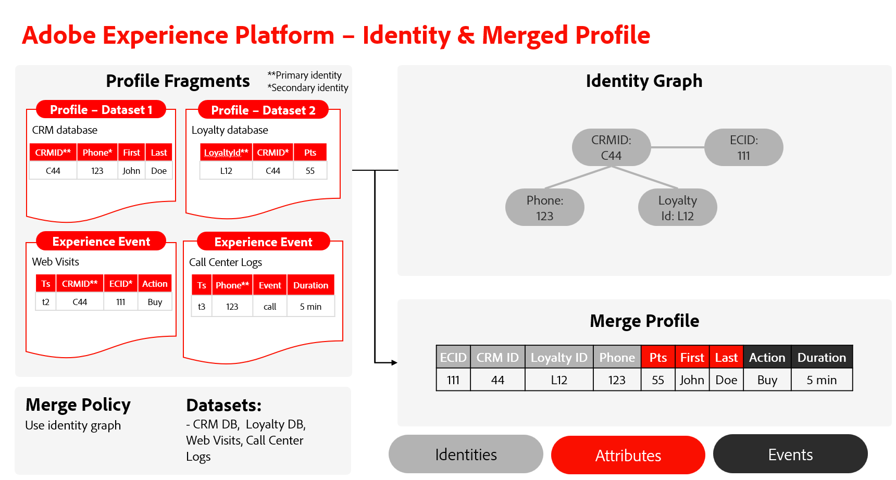

# Compreender a relação entre o Serviço de identidade e o Perfil do cliente em tempo real

>[!IMPORTANT]
>
>Esta página supõe que a política de mesclagem está usando o gráfico de identidade. Para obter mais informações sobre políticas de mesclagem no Perfil do cliente em tempo real, leia a documentação em [políticas de mesclagem e compilação de identidade](../profile/merge-policies/overview.md#identity-stitching).

Embora você possa usar o Serviço de identidade e o Perfil do cliente em tempo real em conjunto, os dois recursos do Adobe Experience Platform não são inerentemente os mesmos.

* Você pode usar o Serviço de identidade para gerar e manter o gráfico de identidade que reúne as identidades diferentes de um cliente individual.
* Você pode usar o Perfil do cliente em tempo real para reunir fragmentos de perfil diferentes e criar um perfil mesclado. Este processo requer o uso do gráfico de identidade.

Este documento descreve as semelhanças, diferenças e relacionamentos entre o Serviço de identidade e o Perfil do cliente em tempo real.

## Serviço de identidade versus Perfil do cliente em tempo real

As principais diferenças entre o Serviço de identidade e o Perfil do cliente em tempo real são as seguintes:

| | Identity Service | Perfil do cliente em tempo real |
| --- | --- |--- |
| **Propósito** | <ul><li>Você pode usar o Serviço de identidade para criar e gerenciar gráficos de identidade.</li></ul> | Você pode usar o Perfil de cliente em tempo real para: <ul><li>Crie uma exibição de 360 graus de um perfil de cliente.</li><li>Exibir e gerenciar perfis.</li></ul> |
| **Entrada** | <ul><li>Para usar o Serviço de identidade, você deve assimilar dados de registro ou eventos de série temporal que tenham pelo menos dois campos marcados como identidade. Os campos marcados como identidade são assimilados no Serviço de identidade.</li></ul> | <ul><li>Fragmentos de perfil: representam uma identidade principal exclusiva e os dados de registro ou evento correspondentes dessa ID em um determinado conjunto de dados.</li><li>Gráficos de identidade: o perfil faz referência ao gráfico de identidade de um determinado perfil do cliente, para identificar todos os fragmentos de perfil com as mesmas identidades principais.</li></ul> |
| **Processo** | <ul><li>Depois de assimilar pelo menos duas identidades, o Serviço de identidade vincula essas identidades.</li></ul> | <ul><li>O Perfil do cliente em tempo real mescla fragmentos de perfil ao fazer referência aos gráficos de identidade correspondentes.</li></ul> |
| **Saída** | <ul><li>O resultado é um gráfico de identidade, que é um conjunto de identidades relacionadas a um indivíduo.</li></ul> | <ul><li>O resultado é um perfil mesclado, que é uma visualização única e abrangente de um determinado cliente. Esse perfil pode então se qualificar para um segmento.</li></ul> |

{style="table-layout:auto"}

## Processo de criação de perfil mesclado

Leia as etapas abaixo para entender melhor o processo de criação de um perfil mesclado:

* Primeiro, o Perfil do cliente em tempo real faz referência a um gráfico de identidade e recupera todas as identidades.
* Em seguida, o Perfil recupera fragmentos de perfil com identidades principais no gráfico de identidade.
* Depois de bem-sucedido, o Perfil mescla todos os eventos e atributos existentes.
   * Se houver informações de atributo conflitantes, os atributos serão escolhidos com base no método de mesclagem. Para obter mais informações, leia a [visão geral das políticas de mesclagem](../profile/merge-policies/overview.md).

## Designar um campo como uma identidade

No Experience Data Model (XDM), marcar ou designar um campo como identidade é uma instrução para o Experience Platform assimilar esse campo específico no Serviço de identidade. Essa designação permite que os fragmentos de perfil sejam mesclados no Perfil do cliente em tempo real. Se não houver fragmentos de perfil associados à identidade, não os designe como identidade.

### Noções básicas sobre identidades primária e secundária

Depois de marcar os campos como identidades, eles podem ser definidos como identidades primárias ou secundárias. As identidades primária e secundária são conceitos que fazem parte do Perfil do cliente em tempo real.

* A identidade principal (às vezes chamada de &quot;chave primária&quot;) é a identidade na qual os fragmentos de perfil são armazenados.
* Se houver apenas uma identidade em uma determinada linha de dados, essa única identidade será designada como primária.
* Se houver duas ou mais identidades, uma será designada como primária e a restante será designada como secundária.

O Serviço de identidade estabelecerá vínculos entre identidades, desde que haja pelo menos dois campos marcados como identidade. O Serviço de identidade não armazena informações sobre se uma identidade é primária ou secundária.

