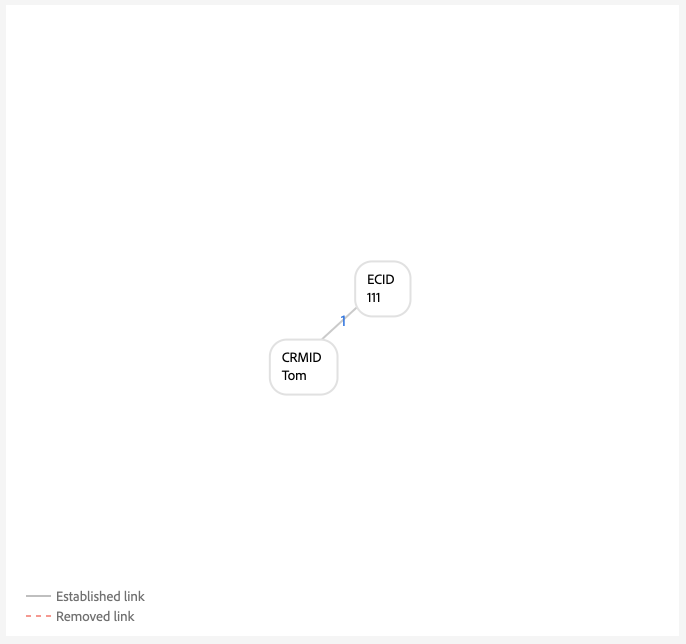
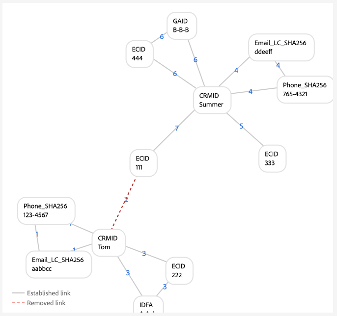
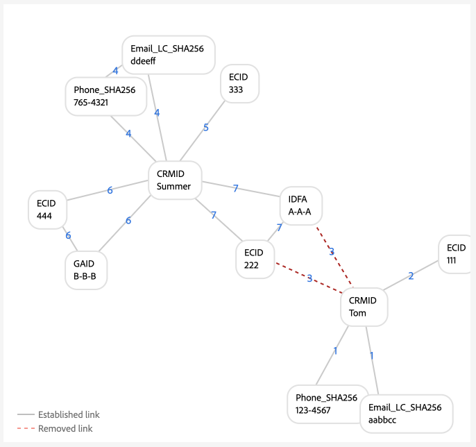

# Exemplos de configurações de gráfico {#examples-of-graph-configurations}

>[!CONTEXTUALHELP]
>id="platform_identities_algorithmconfiguration"
>title="Configuração do algoritmo"
>abstract="Configure um namespace único e uma prioridade de namespace adaptados às suas identidades assimiladas."

>[!NOTE]
>
>* &quot;CRMID&quot; e &quot;loginID&quot; são namespaces personalizados. Neste documento, &quot;CRMID&quot; é um identificador de pessoa e &quot;loginID&quot; é um identificador de logon associado a uma determinada pessoa.
>* Para simular os cenários de gráficos de exemplo descritos neste documento, primeiro você deve criar dois namespaces personalizados, um com o símbolo de identidade &quot;CRMID&quot; e outro com o símbolo de identidade &quot;loginID&quot;. Os símbolos de identidade diferenciam maiúsculas de minúsculas.

Este documento descreve exemplos de configuração de gráficos de cenários comuns que você pode encontrar ao trabalhar com [!DNL Identity Graph Linking Rules] e dados de identidade.

## Somente CRMID

Este é um exemplo de um cenário de implementação simples em que os eventos online (CRMID e ECID) são assimilados e os eventos offline (registros de perfil) são armazenados somente no CRMID.

**Implementação:**

| Namespaces usados | Método de coleta de comportamento da Web |
| --- | --- |
| CRMID, ECID | Web SDK |

**Eventos:**

Você pode criar esse cenário na simulação de gráfico copiando os seguintes eventos no modo de texto:

```shell
CRMID: Tom, ECID: 111
```

**Configuração do algoritmo:**

Você pode criar esse cenário na simulação de gráfico definindo a seguinte configuração para a configuração do algoritmo:

| Prioridade | Nome de exibição | Tipo de identidade | Único por gráfico |
| ---| --- | --- | --- |
| 1 | CRMID | CROSS_DEVICE | Sim |
| 2 | ECID | COOKIE | Não |

**Seleção de identidade principal para o Perfil de Cliente em Tempo Real:**

No contexto dessa configuração, a identidade primária será definida da seguinte maneira:

| Status de autenticação | Namespace(s) em eventos | Identidade principal |
| --- | --- | --- |
| Autenticado | CRMID, ECID | CRMID |
| Não autenticado | ECID | ECID |

**Exemplos de gráfico**

>[!BEGINTABS]

>[!TAB Gráfico ideal para uma única pessoa]

Veja a seguir um exemplo de um gráfico ideal para uma única pessoa, em que a CRMID é exclusiva e recebe a maior prioridade.



>[!TAB Gráfico de várias pessoas]

Veja a seguir um exemplo de gráfico com várias pessoas. Este exemplo exibe um cenário de &quot;dispositivo compartilhado&quot;, em que há dois CRMIDs e o que tem o link estabelecido mais antigo é removido.


**Entrada de eventos de simulação de gráfico**

```shell
CRMID: Tom, ECID: 111
CRMID: Summer, ECID: 111
```

>[!ENDTABS]

## CRMID com email com hash

Nesse cenário, um CRMID é assimilado e representa os dados online (evento de experiência) e offline (registro de perfil). Esse cenário também envolve a assimilação de um email com hash, que representa outro namespace enviado no conjunto de dados de registro do CRM junto com o CRMID.

>[!IMPORTANT]
>
>**É crucial que a CRMID seja sempre enviada para cada usuário**. Se isso não for feito, poderá ocorrer um cenário de ID de logon &quot;pendente&quot;, em que uma única entidade de pessoa compartilha um dispositivo com outra pessoa.

**Implementação:**

| Namespaces usados | Método de coleta de comportamento da Web |
| --- | --- |
| CRMID, Email_LC_SHA256, ECID | Web SDK |

**Eventos:**

Você pode criar esse cenário na simulação de gráfico copiando os seguintes eventos no modo de texto:

```shell
CRMID: Tom, Email_LC_SHA256: tom<span>@acme.com
CRMID: Tom, ECID: 111
CRMID: Summer, Email_LC_SHA256: summer<span>@acme.com
CRMID: Summer, ECID: 222
```

**Configuração do algoritmo:**

Você pode criar esse cenário na simulação de gráfico definindo a seguinte configuração para a configuração do algoritmo:

| Prioridade | Nome de exibição | Tipo de identidade | Único por gráfico |
| ---| --- | --- | --- |
| 1 | CRMID | CROSS_DEVICE | Sim |
| 2 | Emails (SHA256, em letras minúsculas) | Email | Não |
| 3 | ECID | COOKIE | Não |

**Seleção de identidade principal para o Perfil:**

No contexto dessa configuração, a identidade primária será definida da seguinte maneira:

| Status de autenticação | Namespace(s) em eventos | Identidade principal |
| --- | --- | --- |
| Autenticado | CRMID, ECID | CRMID |
| Não autenticado | ECID | ECID |

**Exemplos de gráfico**

>[!BEGINTABS]

>[!TAB Gráfico ideal para uma única pessoa]

A seguir estão exemplos de um par de gráficos ideais para uma única pessoa, em que cada CRMID é associado ao seu respectivo namespace de email com hash e ECID.


>[!TAB Gráfico multipessoa: dispositivo compartilhado]

Este é um exemplo de um cenário de gráfico de várias pessoas em que um dispositivo é compartilhado por duas pessoas.


**Entrada de eventos de simulação de gráfico**

```shell
CRMID: Tom, Email_LC_SHA256: aabbcc
CRMID: Tom, ECID: 111
CRMID: Summer, Email_LC_SHA256: ddeeff
CRMID: Summer, ECID: 222
CRMID: Summer, ECID: 111
```

>[!TAB Gráfico de várias pessoas: email não exclusivo]

Este é um exemplo de um cenário de gráfico de várias pessoas em que o email não é único e está sendo associado a dois CRMIDs diferentes.


**Entrada de eventos de simulação de gráfico**

```shell
CRMID: Tom, Email_LC_SHA256: aabbcc
CRMID: Tom, ECID: 111
CRMID: Summer, Email_LC_SHA256: ddeeff
CRMID: Summer, ECID: 222
CRMID: Summer, Email_LC_SHA256: aabbcc
```

>[!ENDTABS]

## CRMID com email com hash, telefone com hash, GAID e IDFA

Esse cenário é semelhante ao anterior. No entanto, neste cenário, email e telefone com hash estão sendo marcados como identidades a serem utilizadas no [[!DNL Segment Match]](../../segmentation/ui/segment-match/overview.md).

>[!IMPORTANT]
>
>**É crucial que a CRMID seja sempre enviada para cada usuário**. Se isso não for feito, poderá ocorrer um cenário de ID de logon &quot;pendente&quot;, em que uma única entidade de pessoa compartilha um dispositivo com outra pessoa.

**Implementação:**

| Namespaces usados | Método de coleta de comportamento da Web |
| --- | --- |
| CRMID, Email_LC_SHA256, Phone_SHA256, GAID, IDFA, ECID | Web SDK |

**Eventos:**

Você pode criar esse cenário na simulação de gráfico copiando os seguintes eventos no modo de texto:

```shell
CRMID: Tom, Email_LC_SHA256: aabbcc, Phone_SHA256: 123-4567
CRMID: Tom, ECID: 111
CRMID: Tom, ECID: 222, IDFA: A-A-A
CRMID: Summer, Email_LC_SHA256: ddeeff, Phone_SHA256: 765-4321
CRMID: Summer, ECID: 333
CRMID: Summer, ECID: 444, GAID:B-B-B
```

**Configuração do algoritmo:**

Você pode criar esse cenário na simulação de gráfico definindo a seguinte configuração para a configuração do algoritmo:

| Prioridade | Nome de exibição | Tipo de identidade | Único por gráfico |
| ---| --- | --- | --- |
| 1 | CRMID | CROSS_DEVICE | Sim |
| 2 | Emails (SHA256, em letras minúsculas) | Email | Não |
| 3 | Telefone (SHA256) | Telefone | Não |
| 4 | ID de anúncio do Google (GAID) | DISPOSITIVO | Não |
| 5 | Apple IDFA (ID para Apple) | DISPOSITIVO | Não |
| 6 | ECID | COOKIE | Não |

**Seleção de identidade principal para o Perfil:**

No contexto dessa configuração, a identidade primária será definida da seguinte maneira:

| Status de autenticação | Namespace(s) em eventos | Identidade principal |
| --- | --- | --- |
| Autenticado | CRMID, IDFA, ECID | CRMID |
| Autenticado | CRMID, GAID, ECID | CRMID |
| Autenticado | CRMID, ECID | CRMID |
| Não autenticado | GAID, ECID | GAID |
| Não autenticado | IDFA, ECID | IDFA |
| Não autenticado | ECID | ECID |

**Exemplos de gráfico**

>[!BEGINTABS]

>[!TAB Gráfico ideal para uma única pessoa]

Este é um cenário ideal de gráficos de pessoa única no qual emails com hash e telefones com hash são marcados como identidades para uso no [!DNL Segment Match]. Nesse cenário, os gráficos são divididos em dois, para representar entidades de pessoas diferentes.


>[!TAB Gráfico multipessoas: dispositivo compartilhado, computador compartilhado]

Veja a seguir um cenário de gráfico de várias pessoas em que um dispositivo (computador) é compartilhado por duas pessoas. Neste cenário, o computador compartilhado é representado por `{ECID: 111}` e está vinculado a `{CRMID: Summer}` porque esse é o link estabelecido mais recentemente. `{CRMID: Tom}` foi removido porque o vínculo entre `{CRMID: Tom}` e `{ECID: 111}` é mais antigo e porque CRMID é o namespace exclusivo designado nesta configuração.



**Entrada de eventos de simulação de gráfico**

```shell
CRMID: Tom, Email_LC_SHA256: aabbcc, Phone_SHA256: 123-4567
CRMID: Tom, ECID: 111
CRMID: Tom, ECID: 222, IDFA: A-A-A
CRMID: Summer, Email_LC_SHA256: ddeeff, Phone_SHA256: 765-4321
CRMID: Summer, ECID: 333
CRMID: Summer, ECID: 444, GAID:B-B-B
CRMID: Summer, ECID: 111
```

>[!TAB Gráfico multipessoa: dispositivo compartilhado, dispositivo móvel android]

Veja a seguir um gráfico de várias pessoas no qual um dispositivo Android é compartilhado por duas pessoas. Nesse cenário, o CRMID é configurado como um namespace exclusivo e, portanto, o link mais recente de `{CRMID: Tom, GAID: B-B-B, ECID:444}` substitui o `{CRMID: Summer, GAID: B-B-B, ECID:444}` mais antigo.


**Entrada de eventos de simulação de gráfico**

```shell
CRMID: Tom, Email_LC_SHA256: aabbcc, Phone_SHA256: 123-4567
CRMID: Tom, ECID: 111
CRMID: Tom, ECID: 222, IDFA: A-A-A
CRMID: Summer, Email_LC_SHA256: ddeeff, Phone_SHA256: 765-4321
CRMID: Summer, ECID: 333
CRMID: Summer, ECID: 444, GAID: B-B-B
CRMID: Tom, ECID: 444, GAID: B-B-B
```

>[!TAB Gráfico multipessoas: dispositivo compartilhado, dispositivo móvel apple, sem redefinição de ECID]

Este é um cenário de gráfico de várias pessoas em que um dispositivo Apple é compartilhado por duas pessoas. Nesse cenário, o IDFA é compartilhado, mas a ECID não é redefinida.



**Entrada de eventos de simulação de gráfico**

```shell
CRMID: Tom, Email_LC_SHA256: aabbcc, Phone_SHA256: 123-4567
CRMID: Tom, ECID: 111
CRMID: Tom, ECID: 222, IDFA: A-A-A
CRMID: Summer, Email_LC_SHA256: ddeeff, Phone_SHA256: 765-4321
CRMID: Summer, ECID: 333
CRMID: Summer, ECID: 444, GAID: B-B-B
CRMID: Summer, ECID: 222, IDFA: A-A-A
```

>[!TAB Gráfico multipessoa: dispositivo compartilhado, apple, redefinições de ECID]

Este é um cenário de gráfico de várias pessoas em que um dispositivo Apple é compartilhado por duas pessoas. Nesse cenário, a ECID é redefinida, mas o IDFA permanece o mesmo.


**Entrada de eventos de simulação de gráfico**

```shell
CRMID: Tom, Email_LC_SHA256: aabbcc, Phone_SHA256: 123-4567
CRMID: Tom, ECID: 111
CRMID: Tom, ECID: 222, IDFA: A-A-A
CRMID: Summer, Email_LC_SHA256: ddeeff, Phone_SHA256: 765-4321
CRMID: Summer, ECID: 333
CRMID: Summer, ECID: 444, GAID: B-B-B
CRMID: Summer, ECID: 555, IDFA: A-A-A
```

>[!TAB Gráfico de várias pessoas: telefone não exclusivo]

Veja a seguir um cenário de gráfico de várias pessoas em que o mesmo número de telefone está sendo compartilhado por duas pessoas.


**Entrada de eventos de simulação de gráfico**

```shell
CRMID: Tom, Email_LC_SHA256: aabbcc, Phone_SHA256: 123-4567
CRMID: Tom, ECID: 111
CRMID: Tom, ECID: 222, IDFA: A-A-A
CRMID: Summer, Email_LC_SHA256: ddeeff, Phone_SHA256: 765-4321
CRMID: Summer, ECID: 333
CRMID: Summer, ECID: 444, GAID: B-B-B
CRMID: Summer, Phone_SHA256: 123-4567
```

Neste exemplo, `{Phone_SHA256}` também é marcado como um namespace exclusivo. Portanto, um gráfico não pode ter mais de uma identidade com o namespace `{Phone_SHA256}`. Neste cenário, `{Phone_SHA256: 765-4321}` está desvinculado de `{CRMID: Summer}` e `{Email_LC_SHA256: ddeeff}` porque é o link mais antigo,


>[!TAB Gráfico de várias pessoas: email não exclusivo]

Este é um cenário de gráfico de várias pessoas em que o email é compartilhado por duas pessoas.


**Entrada de eventos de simulação de gráfico**

```shell
CRMID: Tom, Email_LC_SHA256: aabbcc, Phone_SHA256: 123-4567
CRMID: Tom, ECID: 111
CRMID: Tom, ECID: 222, IDFA: A-A-A
CRMID: Summer, Email_LC_SHA256: ddeeff, Phone_SHA256: 765-4321
CRMID: Summer, ECID: 333
CRMID: Summer, ECID: 444, GAID: B-B-B
CRMID: Summer, Email_LC_SHA256: aabbcc
```

>[!ENDTABS]

## CRMID único com várias IDs de logon (versão simples)

Nesse cenário, há um único CRMID que representa uma entidade de pessoa. No entanto, uma entidade de pessoa pode ter vários identificadores de logon:

* Uma determinada entidade de pessoa pode ter diferentes tipos de conta (pessoal vs. comercial, conta por estado, conta por marca, etc.)
* Uma determinada entidade de pessoa pode usar endereços de email diferentes para qualquer número de contas.

>[!IMPORTANT]
>
>**É crucial que a CRMID seja sempre enviada para cada usuário**. Se isso não for feito, poderá ocorrer um cenário de ID de logon &quot;pendente&quot;, em que uma única entidade de pessoa compartilha um dispositivo com outra pessoa.

**Implementação:**

| Namespaces usados | Método de coleta de comportamento da Web |
| --- | --- |
| CRMID, ID de logon, ECID | Web SDK |

**Eventos:**

Você pode criar esse cenário na simulação de gráfico copiando os seguintes eventos no modo de texto:

```shell
CRMID: Tom, loginID: ID_A
CRMID: Tom, loginID: ID_B
loginID: ID_A, ECID: 111
CRMID: Summer, loginID: ID_C
CRMID: Summer, loginID: ID_D
loginID: ID_C, ECID: 222
```

**Configuração do algoritmo:**

Você pode criar esse cenário na simulação de gráfico definindo a seguinte configuração para a configuração do algoritmo:

| Prioridade | Nome de exibição | Tipo de identidade | Único por gráfico |
| ---| --- | --- | --- |
| 1 | CRMID | CROSS_DEVICE | Sim |
| 2 | loginID | CROSS_DEVICE | Não |
| 3 | ECID | COOKIE | Não |

**Seleção de identidade principal para o Perfil:**

No contexto dessa configuração, a identidade primária será definida da seguinte maneira:

| Status de autenticação | Namespace(s) em eventos | Identidade principal |
| --- | --- | --- |
| Autenticado | ID de logon, ECID | loginID |
| Autenticado | ID de logon, ECID | loginID |
| Autenticado | CRMID, ID de logon, ECID | CRMID |
| Autenticado | CRMID, ECID | CRMID |
| Não autenticado | ECID | ECID |

**Exemplos de gráfico**

>[!BEGINTABS]

>[!TAB Cenário ideal para uma única pessoa]

Veja a seguir um cenário de gráfico de uma única pessoa com um único CRMID e várias IDs de logon.


>[!TAB Cenário de gráfico de várias pessoas: dispositivo compartilhado]

Veja a seguir um cenário de gráfico de várias pessoas em que um dispositivo é compartilhado por duas pessoas. Neste cenário, `{ECID:111}` está vinculado com `{loginID:ID_A}` e `{loginID:ID_C}` e o link mais antigo estabelecido de `{ECID:111, loginID:ID_A}` é removido.


**Entrada de eventos de simulação de gráfico**

```shell
CRMID: Tom, loginID: ID_A
CRMID: Tom, loginID: ID_B
loginID: ID_A, ECID: 111
CRMID: Summer, loginID: ID_C
CRMID: Summer, loginID: ID_D
loginID: ID_C, ECID: 222
loginID: ID_C, ECID: 111
```

>[!TAB Cenário de gráfico de várias pessoas: dados incorretos]

Veja a seguir um cenário de gráfico com várias pessoas que envolve dados incorretos. Neste cenário, `{loginID:ID_D}` está incorretamente vinculado a dois usuários diferentes e o link com o carimbo de data e hora mais antigo é excluído em favor do link estabelecido mais recentemente.


**Entrada de eventos de simulação de gráfico**

```shell
CRMID: Tom, loginID: ID_A
CRMID: Tom, loginID: ID_B
loginID: ID_A, ECID: 111
CRMID: Summer, loginID: ID_C
CRMID: Summer, loginID: ID_D
loginID: ID_C, ECID: 222
CRMID: Tom, loginID: ID_D
```

>[!TAB LoginID &#39; &#39; pendente&#39;]

O gráfico a seguir simula um cenário de ID de logon &quot;pendente&quot;. Neste exemplo, duas IDs de logon diferentes são vinculadas à mesma ECID. No entanto, `{loginID:ID_C}` não está vinculado ao CRMID. Portanto, não há como o Serviço de identidade detectar que essas duas IDs de logon representam duas entidades diferentes.


**Entrada de eventos de simulação de gráfico**

```shell
CRMID: Tom, loginID: ID_A
CRMID: Tom, loginID: ID_B
loginID: ID_A, ECID: 111
loginID: ID_C, ECID: 111
```

>[!ENDTABS]

## CRMID único com várias IDs de logon (versão complexa)

Nesse cenário, há um único CRMID que representa uma entidade de pessoa. No entanto, uma entidade de pessoa pode ter vários identificadores de logon:

* Uma determinada entidade de pessoa pode ter diferentes tipos de conta (pessoal vs. comercial, conta por estado, conta por marca, etc.)
* Uma determinada entidade de pessoa pode usar endereços de email diferentes para qualquer número de contas.

>[!IMPORTANT]
>
>**É crucial que a CRMID seja sempre enviada para cada usuário**. Se isso não for feito, poderá ocorrer um cenário de ID de logon &quot;pendente&quot;, em que uma única entidade de pessoa compartilha um dispositivo com outra pessoa.

**Implementação:**

| Namespaces usados | Método de coleta de comportamento da Web |
| --- | --- |
| CRMID, Email_LC_SHA256, Phone_SHA256, ID de logon, ECID | Conector de origem do Adobe Analytics. <br> **Observação:** por padrão, as AAIDs estão bloqueadas no Serviço de identidade e, portanto, você deve colocar em suas ECIDs uma prioridade maior do que as AAIDs ao usar a fonte do Analytics. Leia o [guia de implementação](./implementation-guide.md#ingest-your-data) para obter mais informações.</br> |

**Eventos:**

Você pode criar esse cenário na simulação de gráfico copiando os seguintes eventos no modo de texto:

```shell
CRMID: Tom, Email_LC_SHA256: aabbcc, Phone_SHA256: 123-4567
CRMID: Tom, loginID: ID_A
CRMID: Tom, loginID: ID_B
loginID: ID_A, ECID: 111
CRMID: Summer, Email_LC_SHA256: ddeeff, Phone_SHA256: 765-4321
CRMID: Summer, loginID: ID_C
CRMID: Summer, loginID: ID_D
loginID: ID_C, ECID: 222
```

**Configuração do algoritmo:**

Você pode criar esse cenário na simulação de gráfico definindo a seguinte configuração para a configuração do algoritmo:

| Prioridade | Nome de exibição | Tipo de identidade | Único por gráfico |
| ---| --- | --- | --- | 
| 1 | CRMID | CROSS_DEVICE | Sim |
| 2 | Email_LC_SHA256 | Email | Não |
| 3 | Phone_SHA256 | Telefone | Não |
| 4 | loginID | CROSS_DEVICE | Não |
| 5 | ECID | COOKIE | Não |
| 6 | AAID | COOKIE | Não |

**Seleção de identidade principal para o Perfil:**

No contexto dessa configuração, a identidade primária será definida da seguinte maneira:

| Status de autenticação | Namespace(s) em eventos | Identidade principal |
| --- | --- | --- |
| Autenticado | ID de logon, ECID | loginID |
| Autenticado | ID de logon, ECID | loginID |
| Autenticado | CRMID, ID de logon, ECID | CRMID |
| Autenticado | CRMID, ECID | CRMID |
| Não autenticado | ECID | ECID |

**Exemplos de gráfico**

>[!BEGINTABS]

>[!TAB Gráfico ideal para uma única pessoa]

Veja a seguir um exemplo de dois gráficos de uma pessoa em que cada um tem uma CRMID e várias IDs de logon.


>[!TAB Gráfico multipessoa: dispositivo compartilhado 1]

Este é um cenário de dispositivo compartilhado com várias pessoas em que `{ECID:111}` está vinculado a `{loginID:ID_A}` e `{loginID:ID_C}`. Nesse caso, os links estabelecidos mais antigos são removidos em favor dos links estabelecidos mais recentemente.


**Entrada de eventos de simulação de gráfico**

```shell
CRMID: Tom, Email_LC_SHA256: aabbcc, Phone_SHA256: 123-4567
CRMID: Tom, loginID: ID_A
CRMID: Tom, loginID: ID_B
loginID: ID_A, ECID: 111
CRMID: Summer, Email_LC_SHA256: ddeeff, Phone_SHA256: 765-4321
CRMID: Summer, loginID: ID_C
CRMID: Summer, loginID: ID_D
loginID: ID_C, ECID: 222
loginID: ID_C, ECID: 111
```

>[!TAB Gráfico multipessoa: dispositivo compartilhado 2]

Nesse cenário, em vez de enviar somente a ID de logon, a ID de logon e a CRMID são enviadas como eventos de experiência.


**Entrada de eventos de simulação de gráfico**

```shell
CRMID: Tom, Email_LC_SHA256: aabbcc, Phone_SHA256: 123-4567
CRMID: Tom, loginID: ID_A
CRMID: Tom, loginID: ID_B
loginID: ID_A, ECID: 111
CRMID: Summer, Email_LC_SHA256: ddeeff, Phone_SHA256: 765-4321
CRMID: Summer, loginID: ID_C
CRMID: Summer, loginID: ID_D
loginID: ID_C, ECID: 222
CRMID: Summer, loginID: ID_C, ECID: 111
loginID: ID_A, ECID: 111
```

>[!TAB Gráfico entre várias pessoas: dados de ID de logon incorretos]

Neste cenário, `{loginID:ID_C}` está vinculado ao `{CRMID:Tom}` e ao `{CRMID:Summer}` e, portanto, é considerado um dado incorreto porque os cenários de gráficos ideais não devem vincular as mesmas IDs de logon a dois usuários diferentes. Nesse caso, os links estabelecidos mais antigos são removidos em favor dos links estabelecidos mais recentemente.


**Entrada de eventos de simulação de gráfico**

```shell
CRMID: Tom, Email_LC_SHA256: aabbcc, Phone_SHA256: 123-4567
CRMID: Tom, loginID: ID_A
CRMID: Tom, loginID: ID_B
loginID: ID_A, ECID: 111
CRMID: Summer, Email_LC_SHA256: ddeeff, Phone_SHA256: 765-4321
CRMID: Summer, loginID: ID_C
CRMID: Summer, loginID: ID_D
loginID: ID_C, ECID: 222
CRMID: Tom, loginID: ID_C
```

>[!TAB Gráfico de várias pessoas: email não exclusivo]

Nesse cenário, um email não exclusivo está sendo vinculado a dois CRMIDs diferentes, portanto, os links estabelecidos mais antigos são removidos em favor dos links estabelecidos mais recentemente.


**Entrada de eventos de simulação de gráfico**

```shell
CRMID: Tom, Email_LC_SHA256: aabbcc, Phone_SHA256: 123-4567
CRMID: Tom, loginID: ID_A
CRMID: Tom, loginID: ID_B
loginID: ID_A, ECID: 111
CRMID: Summer, Email_LC_SHA256: ddeeff, Phone_SHA256: 765-4321
CRMID: Summer, loginID: ID_C
CRMID: Summer, loginID: ID_D
loginID: ID_C, ECID: 222
CRMID: Summer, Email_LC_SHA256: aabbcc
```

>[!TAB Gráfico de várias pessoas: telefone não exclusivo]

Nesse cenário, um número de telefone não exclusivo está sendo vinculado a dois CRMIDs diferentes, os links estabelecidos mais antigos são removidos em favor dos links estabelecidos mais recentemente.


**Entrada de eventos de simulação de gráfico**

```shell
CRMID: Tom, Email_LC_SHA256: aabbcc, Phone_SHA256: 123-4567
CRMID: Tom, loginID: ID_A
CRMID: Tom, loginID: ID_B
loginID: ID_A, ECID: 111
CRMID: Summer, Email_LC_SHA256: ddeeff, Phone_SHA256: 765-4321
CRMID: Summer, loginID: ID_C
CRMID: Summer, loginID: ID_D
loginID: ID_C, ECID: 222
CRMID: Tom, Phone_SHA256: 111-1111
CRMID: Summer, Phone_SHA256: 111-1111
```

>[!ENDTABS]

## Uso em outro Adobe Commerce

Os exemplos de configuração de gráfico nesta seção descrevem os casos de uso do Adobe Commerce. Os exemplos abaixo estão focados em clientes de varejo com dois tipos de usuário:

* Usuário registrado (usuários que criaram uma conta)
* Usuários convidados (usuários que têm apenas um endereço de email)

>[!IMPORTANT]
>
>**É crucial que a CRMID seja sempre enviada para cada usuário**. Se isso não for feito, poderá ocorrer um cenário de ID de logon &quot;pendente&quot;, em que uma única entidade de pessoa compartilha um dispositivo com outra pessoa.

**Implementação:**

| Namespaces usados | Método de coleta de comportamento da Web |
| --- | --- |
| CRMID, Email, ECID | Web SDK |

**Eventos:**

Você pode criar esse cenário na simulação de gráfico copiando os seguintes eventos no modo de texto:

```shell
CRMID: Tom, Email: tom@acme.com
CRMID: Tom, ECID: 111
```

**Configuração do algoritmo:**

Você pode criar esse cenário na simulação de gráfico definindo a seguinte configuração para a configuração do algoritmo:

| Prioridade | Nome de exibição | Tipo de identidade | Único por gráfico |
| ---| --- | --- | --- | 
| 1 | CRMID | CROSS_DEVICE | Sim |
| 2 | Email | Email | Sim |
| 5 | ECID | COOKIE | Não |

**Seleção de identidade principal para o Perfil:**

No contexto dessa configuração, a identidade primária será definida da seguinte maneira:

| Atividade do usuário | Namespace(s) em eventos | Identidade principal |
| --- | --- | --- |
| Navegação autenticada | CRMID, ECID | CRMID |
| Check-out de convidado | Email, ECID | Email |
| Navegação não autenticada | ECID | ECID |

>[!WARNING]
>
>Os usuários registrados devem ter o CRMID e o email em seus perfis para que os cenários de gráfico a seguir funcionem.

**Exemplos de gráfico**

>[!BEGINTABS]

>[!TAB Gráfico ideal para uma única pessoa]

Veja a seguir um exemplo de um gráfico ideal para uma única pessoa.


>[!TAB Gráficos de várias pessoas]

Este é um exemplo de um gráfico de várias pessoas em que dois usuários registrados estão navegando usando o mesmo dispositivo.


**Entrada de eventos de simulação de gráfico**

```shell
CRMID: Tom, Email: tom@acme.com
CRMID: Summer, Email: summer@acme.com
CRMID: Tom, ECID: 111
CRMID: Summer, ECID: 111
```

Nesse cenário, um usuário registrado e um usuário convidado compartilham o mesmo dispositivo.


**Entrada de eventos de simulação de gráfico**

```shell
CRMID: Tom, Email: tom@acme.com
CRMID: Tom, ECID: 111
Email: summer@acme.com, ECID: 111
```

Nesse cenário, um usuário registrado e um usuário convidado compartilham um dispositivo. No entanto, ocorre um erro de implementação, pois o CRMID não contém um namespace de email correspondente. Neste cenário, Tom é o usuário registrado e Summer é o usuário convidado. Diferentemente do cenário anterior, as duas entidades são mescladas, pois não há namespaces de email comuns entre as duas entidades de pessoa.


**Entrada de eventos de simulação de gráfico**

```shell
CRMID: Tom, ECID: 111
Email: summer@acme.com, ECID: 111
```

Nesse cenário, dois usuários convidados compartilham o mesmo dispositivo.


**Entrada de eventos de simulação de gráfico**

```shell
Email: tom@acme.com, ECID: 111
Email: summer@acme.com, ECID: 111
```

Nesse cenário, um usuário convidado faz check-out de um item e, em seguida, faz o registro usando o mesmo dispositivo.


**Entrada de eventos de simulação de gráfico**

```shell
Email: tom@acme.com, ECID: 111
Email: tom@acme.com, CRMID: Tom
CRMID: Tom, ECID: 111
```

>[!ENDTABS]

## Próximas etapas

Para obter mais informações sobre [!DNL Identity Graph Linking Rules], leia a seguinte documentação:

* [Visão geral do [!DNL Identity Graph Linking Rules]](./overview.md)
* [Algoritmo de otimização de identidade](./identity-optimization-algorithm.md)
* [Guia de implementação](./implementation-guide.md)
* [Solução de problemas e perguntas frequentes](./troubleshooting.md)
* [Prioridade de namespace](./namespace-priority.md)
* [Interface de simulação de gráfico](./graph-simulation.md)
* [Interface de configurações de identidade](./identity-settings-ui.md)