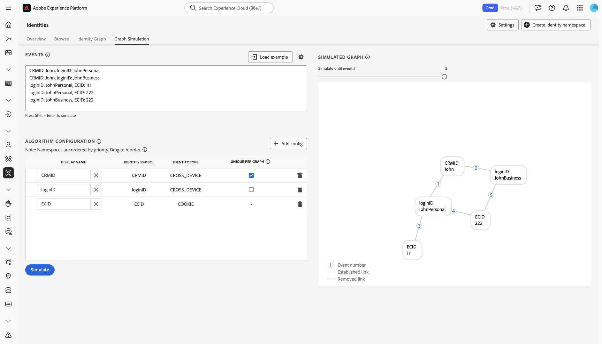
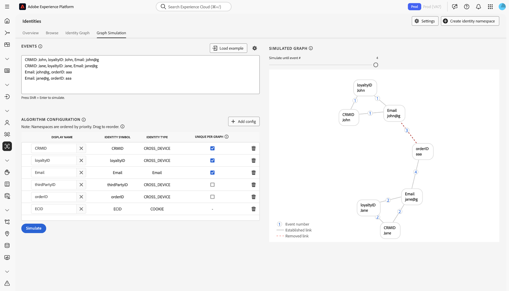

# Guia de configurações das [!DNL Identity Graph Linking Rules] {#configurations-guide}

>[!CONTEXTUALHELP]
>id="platform_identities_algorithmconfiguration"
>title="Configuração do algoritmo"
>abstract="Configure um namespace único e uma prioridade de namespace adaptados às suas identidades assimiladas."

Leia este documento para saber mais sobre os diferentes tipos de implementação que você pode configurar usando o [!DNL Identity Graph Linking Rules].

Os cenários de gráficos do cliente podem ser agrupados em três categorias diferentes.

* **Básico**: [As implementações básicas](#basic-implementations) incluem gráficos que frequentemente incluem implementações simples. Essas implementações tendem a girar em torno de um único namespace entre dispositivos (por exemplo, CRMID). Embora as implementações básicas sejam relativamente simples, o colapso de gráficos ainda pode ocorrer, geralmente devido a **cenários de dispositivo compartilhado**.
* **Intermediário**: [As implementações intermediárias](#intermediate-implementations) incluem várias variáveis, como **vários namespaces entre dispositivos**, **identidades não exclusivas** e **vários namespaces exclusivos**.
* **Avançado**: [As implementações avançadas](#advanced-implementations) envolvem cenários gráficos complexos de várias camadas. Para implementações avançadas, é essencial estabelecer a ordem correta de prioridade do namespace para garantir que os links apropriados sejam removidos, evitando assim o colapso do gráfico.

## Introdução

Antes de mergulhar no documento a seguir, familiarize-se com vários conceitos importantes do Serviço de identidade e [!DNL Identity Graph Linking Rules].

* [Visão geral do serviço de identidade](../home.md)
* [Visão geral do [!DNL Identity Graph Linking Rules]](../identity-graph-linking-rules/namespace-priority.md)
* [Prioridade de namespace](namespace-priority.md)
* [Namespace exclusivo](overview.md#unique-namespace)
* [Simulação de gráfico](graph-simulation.md)

## Implementações básicas {#basic-implementations}

>[!NOTE]
>
>Para concluir as implementações abaixo, você deve criar um namespace personalizado com o símbolo de identidade (diferencia maiúsculas de minúsculas) de: `CRMID`.

Leia esta seção para implementações básicas do [!DNL Identity Graph Linking Rules].

### Caso de uso: implementação simples que usa um namespace entre dispositivos

Geralmente, os clientes do Adobe têm um único namespace entre dispositivos que é usado em todas as suas propriedades, incluindo Web, dispositivos móveis e aplicativos. Esse sistema é independente tanto do setor quanto geograficamente, já que os clientes de varejo, telecomunicações e serviços financeiros usam esse tipo de implementação.

Normalmente, um usuário final é representado por um namespace entre dispositivos (geralmente um CRMID), portanto, o CRMID deve ser classificado como um namespace exclusivo. Um usuário final que possui um computador e um [!DNL iPhone] e não compartilha seu dispositivo, pode ter um gráfico de identidade como o seguinte.

Imagine que você seja um arquiteto de dados em uma empresa de comércio eletrônico chamada **ACME**. John e Jane são seus clientes. São usuários finais que vivem juntos em San Jose, Califórnia. Eles compartilham um computador desktop e usam este computador para navegar em seu site. Da mesma forma, John e Jane também compartilham [!DNL iPad] e ocasionalmente usam este [!DNL iPad] para navegar na Internet, inclusive em seu site.

**Modo texto**

```json
CRMID: John, ECID: 123
CRMID: John, ECID: 999, IDFA: a-b-c
```

**Configuração de algoritmo (Configurações de identidade)**

Defina as seguintes configurações na interface de Simulação de gráfico antes de simular o gráfico.

| Nome de exibição | Símbolo de identidade | Tipo de identidade | Único por gráfico | Prioridade de namespace |
| --- | --- | --- | --- | --- |
| CRMID | CRMID | CROSS_DEVICE | ✔️ | 1 |
| ECID | ECID | COOKIE | | 2 |
| IDFA | IDFA | DISPOSITIVO | | 3 |

**Gráfico simulado**

Neste gráfico, John (o usuário final) é representado pela CRMID. `{ECID: 123}` representa o navegador da Web que John usou em seu computador pessoal para visitar sua plataforma de comércio eletrônico. `{ECID: 999}` representa o navegador que ele usou em seu [!DNL iPhone] e `{IDFA: a-b-c}` representa seu [!DNL iPhone].


**Exercício**

Simule a seguinte configuração na Simulação de gráfico. Você pode criar seus próprios eventos ou copiar e colar usando o modo de texto.

>[!BEGINTABS]

>[!TAB Dispositivo compartilhado (PC)]

**Dispositivo compartilhado (PC)**

**Modo texto**

```json
CRMID: John, ECID: 111
CRMID: Jane, ECID: 111
```

**Gráfico simulado**

Neste gráfico, John e Jane são representados por suas próprias CRMIDs:

* `{CRMID: John}`
* `{CRMID: Jane}`

O navegador no computador desktop que ambos usam para visitar sua plataforma de comércio eletrônico é representado por `{ECID: 111}`. Neste cenário gráfico, Jane é o último usuário final autenticado e, portanto, o vínculo entre `{ECID: 111}` e `{CRMID: John}` é removido.


>[!TAB Dispositivo compartilhado (celular)]

**Dispositivo compartilhado (celular)**

**Modo texto**

```json
CRMID: John, ECID: 111, IDFA: a-b-c
CRMID: Jane, ECID: 111, IDFA: a-b-c
```

**Gráfico simulado**

Nesse gráfico, John e Jane são representados por suas próprias CRMIDs. O navegador usado é representado por `{ECID: 111}` e o [!DNL iPad] compartilhado é representado por `{IDFA: a-b-c}`. Neste cenário gráfico, Jane é o último usuário final autenticado e, portanto, os links de `{ECID: 111}` e `{IDFA: a-b-c}` a `{CRMID: John}` são removidos.


>[!ENDTABS]

## Implementações intermediárias {#intermediate-implementations}

>[!TIP]
>
>Uma **identidade não exclusiva** é uma identidade associada a um namespace não exclusivo.

Leia esta seção para implementações intermediárias de [!DNL Identity Graph Linking Rules].

### Caso de uso: seus dados incluem identidades não exclusivas

>[!NOTE]
>
>Para concluir as implementações abaixo, você deve criar os seguintes namespaces personalizados com os símbolos de identidade (diferencia maiúsculas de minúsculas) de:
>
>* `CRMID`
>* `CChash` (Este é um namespace personalizado que representa um número de cartão de crédito com hash.)

Imagine que você seja um arquiteto de dados trabalhando em um banco comercial que emite cartões de crédito. Sua equipe de marketing indicou que deseja incluir o histórico de transações de cartões de crédito passados em um perfil. Este gráfico de identidade pode ser semelhante ao seguinte.

**Modo texto**

```json
CRMID: John, CChash: 1111-2222 
CRMID: John, CChash: 3333-4444 
CRMID: John, ECID: 123 
CRMID: John, ECID: 999, IDFA: a-b-c
```

**Configuração de algoritmo (Configurações de identidade)**

Defina as seguintes configurações na interface de Simulação de gráfico antes de simular o gráfico.

| Nome de exibição | Símbolo de identidade | Tipo de identidade | Único por gráfico | Prioridade de namespace |
| --- | --- | --- | --- | --- |
| CRMID | CRMID | CROSS_DEVICE | ✔️ | 1 |
| Hash | Hash | CROSS_DEVICE | | 2 |
| ECID | ECID | COOKIE | | 3 |
| IDFA | IDFA | DISPOSITIVO | | 4 |

**Gráfico simulado**


Não há garantias de que esses números de cartão de crédito, ou qualquer outro namespace não exclusivo, sempre serão associados a um único usuário final. Dois usuários finais podem se registrar no mesmo cartão de crédito. Pode haver valores não exclusivos de espaço reservado que foram assimilados incorretamente. Simplificando, não há garantia de que namespaces não exclusivos não causarão o colapso do gráfico.

Para resolver esse problema, o Serviço de identidade remove os links mais antigos e mantém os links mais recentes. Isso garante que você tenha apenas uma CRMID em um gráfico, evitando assim o seu colapso.

**Exercício**

Simule as seguintes configurações na Simulação de gráfico. Você pode criar seus próprios eventos ou copiar e colar usando o modo de texto.

>[!BEGINTABS]

>[!TAB Dispositivo compartilhado]

**Modo texto**

```json
CRMID: John, CChash: 1111-2222
CRMID: Jane, CChash: 3333-4444
CRMID: John, ECID: 123
CRMID: Jane, ECID:123
```

**Gráfico simulado**


>[!TAB Dois usuários finais com o mesmo cartão de crédito]

Dois usuários finais diferentes se inscrevem no seu site de comércio eletrônico com o mesmo cartão de crédito. Sua equipe de marketing deseja evitar o colapso dos gráficos, garantindo que o cartão de crédito esteja associado a apenas um único perfil.

**Modo texto**

```json
CRMID: John, CChash: 1111-2222
CRMID: Jane, CChash: 1111-2222
CRMID: John, ECID: 123
CRMID: Jane, ECID:456
```

**Gráfico simulado**


>[!TAB Número de cartão de crédito inválido]

Devido a dados não limpos, um número de cartão de crédito inválido é assimilado na Experience Platform.

**Modo texto**

```json
CRMID: John, CChash: undefined
CRMID: Jane, CChash: undefined
CRMID: Jack, CChash: undefined
CRMID: Jill, CChash: undefined
```

**Gráfico simulado**


>[!ENDTABS]

### Caso de uso: seus dados incluem CRMIDs com e sem hash

>[!NOTE]
>
>Para concluir as implementações abaixo, você deve criar namespaces personalizados com os símbolos de identidade (diferencia maiúsculas de minúsculas) de:
>
>* `CRMID`
>* `CRMIDhash`

Você está assimilando um CRMID com hash (offline) e um CRMID com hash (online). A expectativa é que haja uma relação direta entre CRMIDs com hash e sem hash. Quando um usuário final navega com uma conta autenticada, a CRMID com hash é enviada junto com a ID do dispositivo (representada no Serviço de identidade como uma ECID).

**Configuração de algoritmo (Configurações de identidade)**

Defina as seguintes configurações na interface de Simulação de gráfico antes de simular o gráfico.

| Nome de exibição | Símbolo de identidade | Tipo de identidade | Único por gráfico | Prioridade de namespace |
| --- | --- | --- | --- | --- | 
| CRMID | CRMID | CROSS_DEVICE | ✔️ | 1 |
| CRMIDhash | CRMIDhash | CROSS_DEVICE | ✔️ | 2 |
| ECID | ECID | COOKIE | | 3 |


**Exercício**

Simule as seguintes configurações na Simulação de gráfico. Você pode criar seus próprios eventos ou copiar e colar usando o modo de texto.

>[!BEGINTABS]

>[!TAB Dispositivo compartilhado]

John e Jane compartilham um dispositivo.

**Modo texto**

```json
CRMID: John, CRMIDhash: John
CRMID: Jane, CRMIDhash: Jane
CRMIDhash: John, ECID: 111 
CRMIDhash: Jane, ECID: 111
```


>[!TAB Dados incorretos]

Devido a erros no processo de hash, uma CRMID com hash não exclusiva é gerada e enviada para o Serviço de identidade.

**Modo texto**

```json
CRMID: John, CRMIDhash: aaaa
CRMID: Jane, CRMIDhash: aaaa
```


>[!ENDTABS]
<!-- 
### Use case: You are using Real-Time CDP and Adobe Commerce

You have two types of end-users:

* **Members**: An end-user who is assigned a CRMID and has an email account registered to your system.
* **Guests**: An end-user who is not a member. They do not have an assigned CRMID and their email accounts are not registered to your system.

In this scenario, your customers are sending data from Adobe Commerce to Real-Time CDP.

**Exercise**

Simulate the following configurations in the graph simulation tool. You can either create your own events, or copy and paste using text mode.

>[!BEGINTABS]

>[!TAB Shared device between two members]

In this scenario, two members share the same device to browse an e-commerce website.

**Text mode**

```json
CRMID: John, Email: john@g
CRMID: Jane, Email: jane@g
CRMID: John, ECID: 111
CRMID: Jane, ECID: 111
```


>[!TAB Shared device between two guests]

In this scenario, two guests share the same device to browse an e-commerce website.

**Text mode**

```json
Email: john@g, ECID: 111
Email: jane@g, ECID: 111
```


>[!TAB Shared device between a member and a guest]

In this scenario, a member and a guest share the same device to browse an e-commerce website.

**Text mode**

```json
CRMID: John, Email: john@g
CRMID: John, ECID: 111
Email: jane@g, ECID: 111
```


>[!ENDTABS] -->

### Caso de uso: seus dados incluem três namespaces exclusivos

>[!NOTE]
>
>Para concluir as implementações abaixo, você deve criar um namespace personalizado com o símbolo de identidade (diferencia maiúsculas de minúsculas) de: `CRMID`.

Seu cliente define uma entidade unipessoal da seguinte maneira:

* Um usuário final com uma CRMID atribuída.
* Um usuário final que está associado a um endereço de email com hash, para que os perfis possam ser ativados para destinos que oferecem suporte a email com hash (por exemplo, [!DNL Facebook]).
* Um usuário final associado a um endereço de email, para que a equipe de suporte possa pesquisar seu perfil no Real-Time CDP usando esse endereço de email.

| Nome de exibição | Símbolo de identidade | Tipo de identidade | Único por gráfico | Prioridade de namespace |
| --- | --- | --- | --- | --- |
| CRMID | CRMID | CROSS_DEVICE | ✔️ | 1 |
| Email | Email | Email | ✔️ | 2 |
| Email_LC_SHA256 | Email_LC_SHA256 | Email | ✔️ | 3 |
| ECID | ECID | COOKIE | | 4 |

Simule as seguintes configurações na ferramenta de simulação de gráfico. Você pode criar seus próprios eventos ou copiar e colar usando o modo de texto.

>[!BEGINTABS]

>[!TAB Dispositivo compartilhado]

Nesse cenário, John e Jane fazem logon em um site de comércio eletrônico.

**Modo texto**

```json
CRMID: John, Email: john@g, Email_LC_SHA256: john_hash 
CRMID: Jane, Email: jane@g, Email_LC_SHA256: jane_hash 
CRMID: John, ECID: 111 
CRMID: Jane, ECID: 111
```


>[!TAB Um usuário final altera seu email]

**Modo texto**

```json
CRMID: John, Email: john@g, Email_LC_SHA256: john_hash
CRMID: John, Email: john@y, Email_LC_SHA256: john_y_hash
```


>[!ENDTABS]

## Implementações avançadas {#advanced-implementations}

As implementações avançadas envolvem cenários de gráficos complexos e de várias camadas. Esses tipos de implementações incluem o uso de **prioridade de namespace** para identificar os links corretos que devem ser removidos para evitar o recolhimento do gráfico.

**Prioridade de namespace** são metadados que classificam os namespaces por sua importância. Se um gráfico contiver duas identidades, cada uma com um namespace exclusivo diferente, o Serviço de identidade usará a prioridade de namespace para decidir quais links remover. Para obter mais informações, leia a [documentação sobre prioridade de namespace](../identity-graph-linking-rules/namespace-priority.md).

A prioridade de namespace desempenha um papel essencial em cenários de gráficos complexos. Os gráficos podem ter várias camadas - um usuário final pode estar associado a várias IDs de logon e essas IDs de logon podem ter hash. Além disso, diferentes ECIDs podem ser vinculados a diferentes IDs de logon. Para garantir que o link correto, na camada correta, seja removido, as configurações de prioridade do namespace devem estar corretas.

Leia esta seção para implementações avançadas de [!DNL Identity Graph Linking Rules].

### Caso de uso: você precisa de suporte para várias linhas de negócios

>[!NOTE]
>
>Para concluir as implementações abaixo, você deve criar namespaces personalizados com os símbolos de identidade (diferencia maiúsculas de minúsculas) de:
>* `CRMID`
>* `loginID`

Seus usuários finais têm duas contas diferentes: uma conta pessoal e uma conta comercial. Cada conta é identificada por uma ID diferente. Nesse cenário, um gráfico típico seria semelhante ao seguinte:

**Modo texto**

```json
CRMID: John, loginID: JohnPersonal
CRMID: John, loginID: JohnBusiness
loginID: JohnPersonal, ECID: 111
loginID: JohnPersonal, ECID: 222
loginID: JohnBusiness, ECID: 222
```

**Configuração de algoritmo (Configurações de identidade)**

Defina as seguintes configurações na interface de Simulação de gráfico antes de simular o gráfico.

| Nome de exibição | Símbolo de identidade | Tipo de identidade | Único por gráfico | Prioridade de namespace |
| --- | --- | --- | --- | --- |
| CRMID | CRMID | CROSS_DEVICE | ✔️ | 1 |
| loginID | loginID | CROSS_DEVICE | | 2 |
| ECID | ECID | COOKIE | | 3 |

**Gráfico simulado**



**Exercício**

Simule a seguinte configuração na Simulação de gráfico. Você pode criar seus próprios eventos ou copiar e colar usando o modo de texto.

>[!BEGINTABS]

>[!TAB Dispositivo compartilhado]

**Modo texto**

```json
CRMID: John, loginID: JohnPersonal
CRMID: John, loginID: JohnBusiness
CRMID: Jane, loginID: JanePersonal
CRMID: Jane, loginID: JaneBusiness
loginID: JohnPersonal, ECID: 111
loginID: JanePersonal, ECID: 111
```


>[!TAB Dados inválidos enviados para o Real-Time CDP]

**Modo texto**

```json
CRMID: John, loginID: JohnPersonal
CRMID: John, loginID: error
CRMID: Jane, loginID: JanePersonal
CRMID: Jane, loginID: error
loginID: JohnPersonal, ECID: 111
loginID: JanePersonal, ECID: 222
```


>[!ENDTABS]

### Caso de uso: você tem implementações complexas que exigem vários namespaces

>[!NOTE]
>
>Para concluir as implementações abaixo, você deve criar namespaces personalizados com os símbolos de identidade (diferencia maiúsculas de minúsculas) de:
>
>* `CRMID`
>* `loyaltyID`
>* `thirdPartyID`
>* `orderID`

Você é uma empresa de mídia e entretenimento e seus usuários finais têm o seguinte:

* UMA CRMID
* Uma ID de fidelidade

Além disso, os usuários finais podem fazer uma compra no site de comércio eletrônico e esses dados são vinculados ao endereço de email. Os dados do usuário também são enriquecidos por um provedor de banco de dados de terceiros e enviados para a Experience Platform em lotes.

**Modo texto**

```json
CRMID: John, loyaltyID: John, Email: john@g
Email: john@g, orderID: aaa
CRMID: John, thirdPartyID: xyz
CRMID: John, ECID: 111
```

**Configuração de algoritmo (Configurações de identidade)**

Defina as seguintes configurações na interface de Simulação de gráfico antes de simular o gráfico.

| Nome de exibição | Símbolo de identidade | Tipo de identidade | Único por gráfico | Prioridade de namespace |
| --- | --- | --- | --- | --- |
| CRMID | CRMID | CROSS_DEVICE | ✔️ | 1 |
| fidelid | fidelid | CROSS_DEVICE | ✔️ | 2 |
| Email | Email | Email | ✔️ | 3 |
| thirdPartyID | thirdPartyID | CROSS_DEVICE | | 4 |
| orderID | orderID | CROSS_DEVICE | | 5 |
| ECID | ECID | COOKIE | | 6 |

**Exercício**

Simule a seguinte configuração na Simulação de gráfico. Você pode criar seus próprios eventos ou copiar e colar usando o modo de texto.

>[!BEGINTABS]

>[!TAB Dispositivo compartilhado]

**Modo texto**

```json
CRMID: John, loyaltyID: John, Email: john@g
CRMID: Jane, loyaltyID: Jane, Email: jane@g
Email: john@g, orderID: aaa 
CRMID: John, thirdPartyID: xyz 
CRMID: John, ECID: 111
CRMID: Jane, ECID: 111
```


>[!TAB O usuário final altera seu endereço de email]

**Modo texto**

```json
CRMID: John, loyaltyID: John, Email: john@g
CRMID: John, loyaltyID: John, Email: john@y
```


>[!TAB A associação thirdPartyID muda]

**Modo texto**

```json
CRMID: John, loyaltyID: John, Email: john@g
CRMID: Jane, loyaltyID: Jane, Email: jane@g
CRMID: John, thirdPartyID: xyz
CRMID: Jane, thirdPartyID: xyz
```


>[!TAB ID de ordem não exclusiva]

**Modo texto**

```json
CRMID: John, loyaltyID: John, Email: john@g
CRMID: Jane, loyaltyID: Jane, Email: jane@g
Email: john@g, orderID: aaa
Email: jane@g, orderID: aaa
```



>[!TAB ID de fidelidade incorreta]

**Modo texto**

```json
CRMID: John, loyaltyID: aaa, Email: john@g
CRMID: Jane, loyaltyID: aaa, Email: jane@g
```


>[!ENDTABS]

## Próximas etapas

Para obter mais informações sobre [!DNL Identity Graph Linking Rules], leia a seguinte documentação:

* [Visão geral do [!DNL Identity Graph Linking Rules]](./overview.md)
* [Algoritmo de otimização de identidades](./identity-optimization-algorithm.md)
* [Guia de implementação](./implementation-guide.md)
* [Solução de problemas e perguntas frequentes](./troubleshooting.md)
* [Prioridade de namespace](./namespace-priority.md)
* [Interface de simulação de gráfico](./graph-simulation.md)
* [Interface de configurações de identidade](./identity-settings-ui.md)