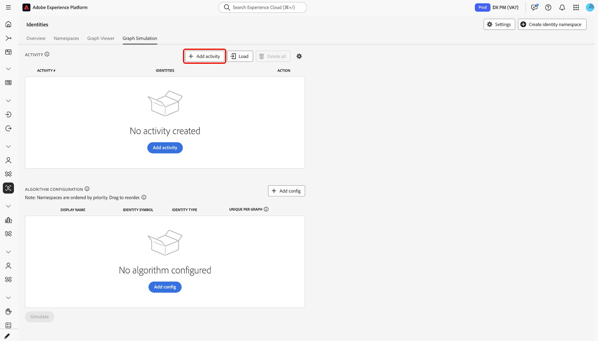
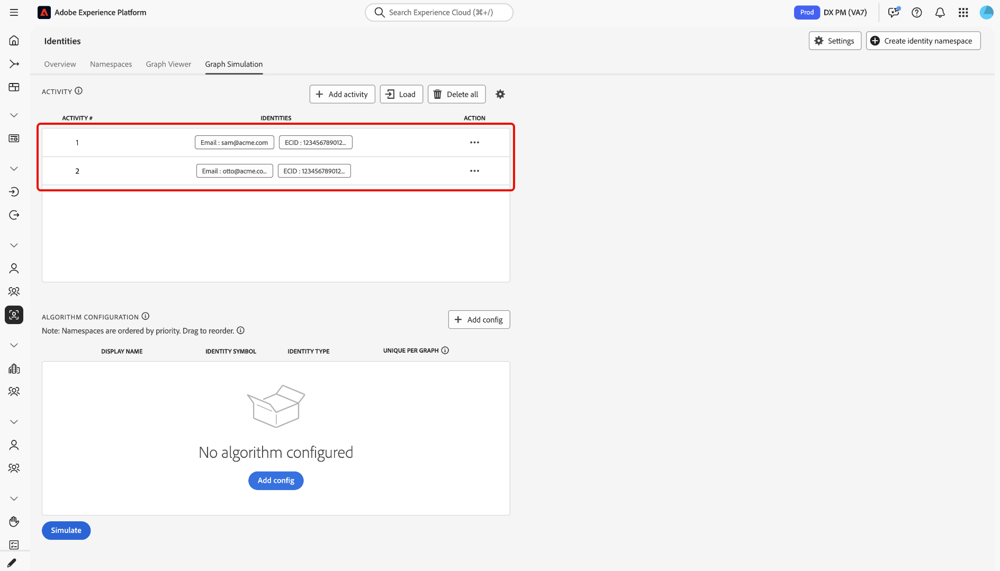
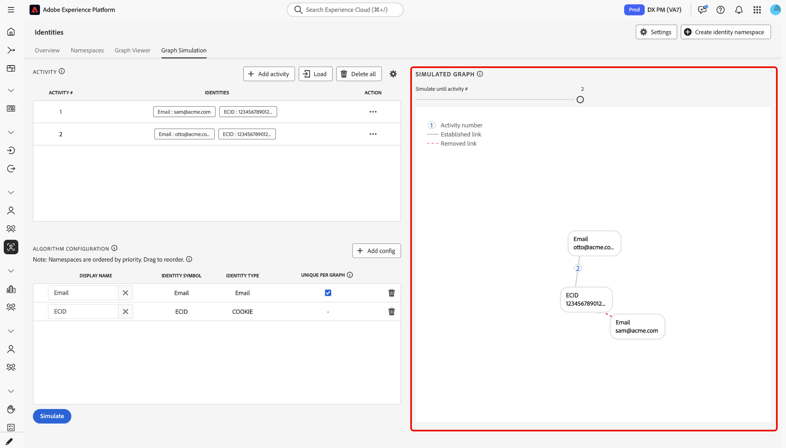
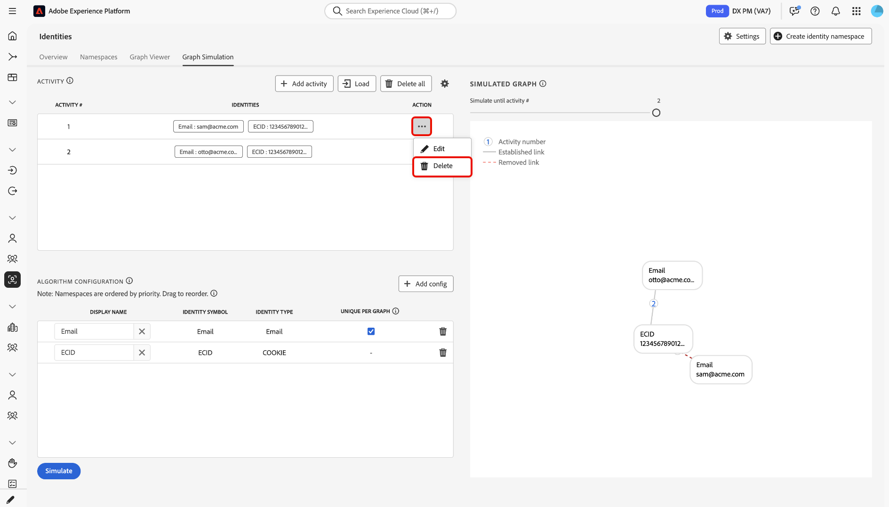
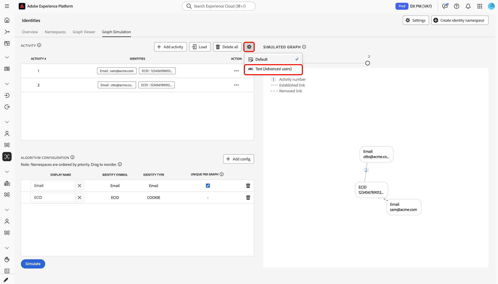

# [!DNL Graph Simulation] Guia da interface {#graph-simulation}

>[!CONTEXTUALHELP]
>id="platform_identities_graphsimulation"
>title="Simulação de gráfico"
>abstract="Simule gráficos para entender como o serviço de identidade vincula identidades e como o algoritmo de otimização de identidades funciona."

O [!DNL Graph Simulation] é uma ferramenta na interface do usuário do Serviço de Identidade que você pode usar para simular como um gráfico de identidade se comporta com base nas identidades fornecidas e como você configura o [Algoritmo de Otimização de Identidade](./identity-optimization-algorithm.md).

Use-o para testar com segurança o comportamento do gráfico antes de aplicar [!DNL Identity Graph Linking Rules] aos dados de produção. Ao definir eventos de exemplo e configurar o Algoritmo de otimização de identidade, incluindo prioridades de namespace e configurações &quot;únicas por gráfico&quot;, você pode ver se as identidades se mesclam em um gráfico ou se ficam separadas e, em seguida, ajustar sua configuração conforme necessário. Use esse recurso para:

* Evitar o recolhimento de gráficos (por exemplo, quando várias pessoas compartilham um dispositivo ou um número de telefone)
* Ajustar as prioridades de namespace (por exemplo, se EMAIL ou CRM_ID deve ser dominante)
* Avalie como os identificadores de baixa qualidade ou reutilizados podem afetar a compilação no seu ambiente.

Você também pode ensaiar alterações de configuração e depurar problemas de identidade que aparecem nos aplicativos downstream. Por exemplo, se o tamanho do público-alvo ou os perfis mesclados parecerem incorretos, você poderá reconstruir os eventos relevantes no [!DNL Graph Simulation] para ver como suas regras atuais moldam o gráfico e tentar alternativas mais seguras.

Os cenários de exemplo integrados ajudam a explicar o comportamento da identidade e o risco de colapso de gráfico às partes interessadas e oferecem suporte à aceitação da qualidade dos dados e do controle de identidade.

## Compreendendo a interface [!DNL Graph Simulation]

Para acessar [!DNL Graph Simulation], navegue até o espaço de trabalho Serviço de Identidade na interface de usuário do Adobe Experience Platform e selecione **[!UICONTROL Graph Simulation]**.

A interface do é organizada em três seções principais:

>[!BEGINTABS]

>[!TAB Atividade]

Use o painel **[!UICONTROL Activity]** para adicionar identidades e simular um gráfico. Cada identidade precisa de um namespace e um valor. Você deve adicionar pelo menos duas identidades para executar uma simulação. Você também pode selecionar **[!UICONTROL Load]** para importar uma configuração de evento e algoritmo pré-configurada ou para abrir um gráfico existente.

>[!TAB Configuração de algoritmo]

Use o painel **[!UICONTROL Algorithm configuration]** para adicionar e configurar o algoritmo de otimização para seus namespaces. Arraste e solte linhas de namespace para alterar a ordem de prioridade. Você também pode selecionar **[!UICONTROL Unique Per Graph]** para marcar se um namespace deve ser exclusivo dentro do gráfico.

>[!TAB Gráfico simulado]

Use a exibição **[!UICONTROL Simulated graph]** para revisar o gráfico produzido de suas atividades e configurações de algoritmo. Uma linha sólida entre duas identidades significa que o link é mantido; uma linha pontilhada significa que o algoritmo removeu esse link.

>[!ENDTABS]

## [!DNL Graph Simulation] fluxo de trabalho

### Adicionar atividades

Para começar a simular gráficos de identidade, selecione **[!UICONTROL Add Activity]**.

Quando a janela pop-up para [!UICONTROL Activity #1] for exibida, escolha um namespace de identidade e insira seu valor. Você pode escolher um namespace na lista suspensa ou digitar algumas letras para filtrar a lista. Após selecionar um namespace, insira o valor de identidade correspondente.

>[!TIP]
>
>Você não precisa usar valores de identidade reais ao usar [!DNL Graph Simulation].

A interface [!UICONTROL Activity] é atualizada para mostrar sua primeira atividade.

Selecione **[!UICONTROL Add Activity]** novamente e conclua uma segunda atividade. Você precisa de pelo menos duas identidades totalmente qualificadas (namespace mais valor) para gerar um gráfico.

### Configurar algoritmo

>[!IMPORTANT]
>
>O algoritmo que você configura controla como o Serviço de identidade trata os namespaces em suas atividades. Nada que você tenha configurado no [!DNL Graph Simulation UI] foi salvo nas configurações de identidade do Serviço de Identidade.

Depois que suas atividades estiverem em vigor, configure o algoritmo para a simulação. Selecione **[!UICONTROL Add config]**.

Adicione cada namespace que você deseja que o algoritmo considere. Use a lista suspensa para pesquisar ou digite as primeiras letras para restringir a lista.

* **Prioridade de namespace**: você controla a ordem de importância de cada namespace em seu gráfico de identidade. Por exemplo, se o seu gráfico usa CRMID, ECID, Email e Apple IDFA, é possível definir a prioridade para refletir o que deve ser considerado primeiro ao vincular identidades. O namespace na parte superior da lista terá a prioridade mais alta.
* **Namespace exclusivo**: quando um namespace é marcado como exclusivo, o Serviço de Identidade garante que apenas uma identidade com esse namespace apareça em um gráfico. Por exemplo, se Email for definido como exclusivo, cada gráfico conterá apenas uma identidade de Email. Se várias identidades com o mesmo email estiverem presentes, a conexão mais antiga será removida para manter a exclusividade.

Arraste as linhas do namespace para a ordem de prioridade: a linha superior tem a prioridade mais alta e a inferior, a mais baixa. Para tratar um namespace como exclusivo dentro do gráfico, marque a caixa de seleção **[!UICONTROL Unique Per Graph]**.

Quando estiver pronto, selecione **[!UICONTROL Simulate]**.

### Exibir gráfico simulado

A seção [!UICONTROL Simulated Graph] mostra o gráfico ou gráficos produzidos a partir das atividades e da configuração de algoritmo.

| Ícones de gráfico | Descrição |
| --- | --- |
| Linha sólida | Uma linha sólida representa um vínculo estabelecido entre duas identidades. |
| Linha pontilhada | Uma linha pontilhada representa um link removido entre duas identidades. |
| Número na linha | Um número em uma linha indica quando esse link foi formado em relação aos outros. O número mais baixo (1) é o link mais antigo. |

## Recursos adicionais

Você também pode editar ou excluir atividades, inserir atividades no modo de texto, carregar um cenário de amostra ou obter um gráfico existente do Serviço de identidade.

### Editar atividade {#edit-activity}

Para editar uma atividade, selecione as reticências (`...`) ao lado de uma determinada atividade e selecione **[!UICONTROL Edit]**.

### Excluir atividade {#delete-activity}

Para excluir uma atividade, selecione as reticências (`...`) ao lado de uma determinada atividade e selecione **[!UICONTROL Delete]**.

### Usar modo de texto {#use-text-mode}

Você pode usar o modo de texto para configurar suas atividades. Para usar o modo de texto, selecione o ícone de configurações e selecione **[!UICONTROL Text (Advanced users)]**.

No modo texto, digite cada identidade como `namespace:value`. Separe várias identidades no mesmo evento com uma vírgula (`,`). Inicie uma nova linha para cada evento.

### Carregar exemplo {#load-example}

Selecione **[!UICONTROL Load example]** para carregar um gráfico pronto com atividades predefinidas e configurações de algoritmo.

Uma caixa de diálogo lista os cenários que você pode abrir:

| Exemplo de gráfico | Descrição | Exemplo |
| --- | --- | --- |
| Dispositivo compartilhado | Dois usuários diferentes fazem logon no mesmo dispositivo. | Um marido e uma esposa compartilham uma iPad para navegação e comércio eletrônico. |
| Telefone inválido (não é único) | Dois usuários diferentes se registram com o mesmo número de telefone. | Uma mãe e uma filha usam um número de telefone residencial compartilhado para se inscreverem em contas de comércio eletrônico. |
| Valores de identidade “incorretos” | Os erros de implementação enviam IDs duplicadas ou de espaço reservado (por exemplo, o mesmo IDFA para muitos usuários). | O Web SDK envia um valor `user_null` em cada atividade devido a um defeito de código. |

Escolha um cenário para carregar [!DNL Graph Simulation] com atividades correspondentes e configurações de algoritmo. É possível editar o resultado como qualquer outra simulação.

### Carregar gráfico existente {#load-existing-graph}

Você pode usar [!DNL Graph Simulation] para carregar um gráfico existente e exibir suas atividades, configuração de algoritmo e gráfico.

Selecione **[!UICONTROL Load]** e depois **[!UICONTROL Existing graph]**.

Na caixa de diálogo, insira um namespace e um valor de identidade que pertençam ao gráfico que você deseja inspecionar.

Quando o carregamento é bem-sucedido, [!DNL Graph Simulation] mostra o gráfico que contém essa identidade.

>[!TIP]
>
>Depois de definir as configurações na primeira tela [Configurações de identidade](./identity-settings-ui.md), você pode usar a opção **carregar gráficos existentes** para simular o gráfico com base nessas configurações exatas. A simulação usará a configuração definida.

## Próximas etapas

Você pode usar [!DNL Graph Simulation] para ver como o Serviço de Identidade vincula identidades em diferentes regras antes de alterar as configurações de produção. Para aprofundar, consulte a seguinte documentação:

* [Visão geral do [!DNL Identity Graph Linking Rules]](./overview.md)
* [Algoritmo de otimização de identidades](./identity-optimization-algorithm.md)
* [Guia de implementação](./implementation-guide.md)
* [Solução de problemas e perguntas frequentes](./troubleshooting.md)
* [Exemplos de configurações de gráfico](./example-configurations.md)
* [Prioridade de namespace](./namespace-priority.md)
* [Interface de configurações de identidade](./identity-settings-ui.md)
