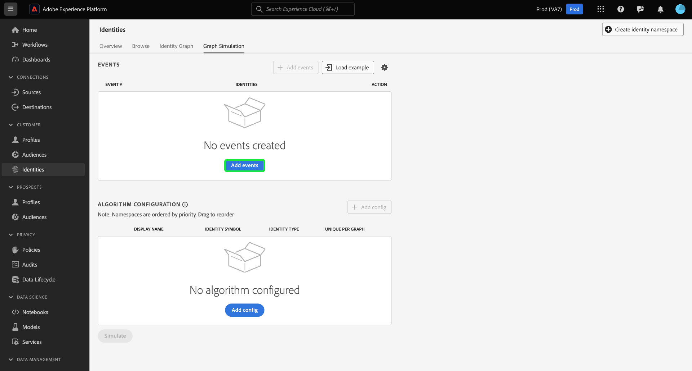
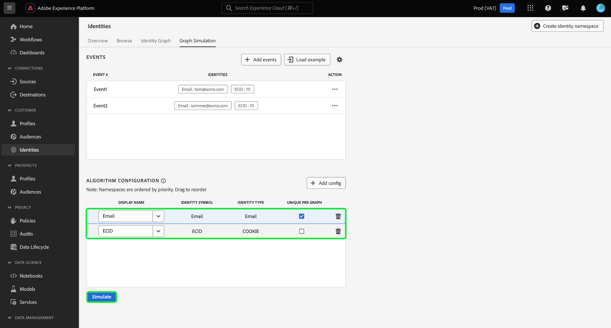

# [!DNL Graph Simulation] Guia da interface {#graph-simulation}

>[!CONTEXTUALHELP]
>id="platform_identities_graphsimulation"
>title="Simulação de gráfico"
>abstract="Simule gráficos para entender como o serviço de identidade vincula identidades e como o algoritmo de otimização de identidades funciona."

[!DNL Graph Simulation] é uma ferramenta na interface do usuário do Serviço de Identidade que você pode usar para simular como um gráfico de identidade se comporta considerando uma combinação específica de identidades e como você configura o [Algoritmo de Otimização de Identidade](./identity-optimization-algorithm.md).

Assista ao vídeo a seguir para obter mais informações sobre como usar a interface [!DNL Graph Simulation] no espaço de trabalho da interface do usuário do Serviço de Identidade:

>[!VIDEO](https://video.tv.adobe.com/v/3444048/?captions=por_br&learn=on&enablevpops)

Leia este documento para saber como você pode usar o [!DNL Graph Simulation] para entender melhor o comportamento do gráfico de identidade e como ele funciona.

## Conheça a interface do [!DNL Graph Simulation] {#interface}

Você pode acessar [!DNL Graph Simulation] na interface do Adobe Experience Platform. Selecione **[!UICONTROL Identities]** na navegação à esquerda e selecione **[!UICONTROL Graph Simulation]** no cabeçalho superior.

A interface [!DNL Graph Simulation] pode ser dividida em três seções:

>[!BEGINTABS]

>[!TAB Eventos]

Eventos: use o painel **[!UICONTROL Events]** para adicionar identidades e simular um gráfico. Uma identidade totalmente qualificada deve ter um namespace de identidade e seu valor de identidade correspondente. Você deve adicionar pelo menos duas identidades para simular um gráfico. Você também pode selecionar **[!UICONTROL Load Example]** para inserir um evento pré-configurado e configuração de algoritmo.

>[!TAB Configuração de algoritmo]

Configuração do algoritmo: Use o painel **[!UICONTROL Algorithm configuration]** para adicionar e configurar o algoritmo de otimização para seus namespaces. Você pode arrastar e soltar um namespace para modificar sua respectiva classificação de prioridade. Você também pode selecionar **[!UICONTROL Unique Per Graph]** para determinar se um namespace é exclusivo.

>[!TAB Visualizador de gráficos simulado]

Visualizador de gráficos simulado: o visualizador de gráficos simulado exibe o gráfico resultante com base nos eventos adicionados e no algoritmo configurado. Uma linha reta entre duas identidades significa que um link é estabelecido. Uma linha pontilhada indica que um link foi removido.

>[!ENDTABS]

## Adicionar eventos {#add-events}

Para começar, selecione **[!UICONTROL Add events]**.

Uma janela pop-up é exibida para [!UICONTROL Event #1]. Aqui, insira sua combinação de namespace de identidade e valor de identidade. Você pode usar o menu suspenso para selecionar um namespace de identidade. Como alternativa, você pode digitar as primeiras letras de um namespace e selecionar as opções fornecidas no menu suspenso. Depois de selecionar o namespace, forneça um valor de identidade que corresponda a ele.

>[!TIP]
>
>O valor de identidade que você insere durante os exercícios do [!DNL Graph Simulation] não precisa ser um valor de identidade real e pode ser um espaço reservado simples.

Quando a primeira identidade estiver concluída, selecione o ícone adicionar (**`+`**) para adicionar uma segunda identidade.

Em seguida, repita as mesmas etapas e adicione uma segunda identidade. Duas identidades totalmente qualificadas são necessárias para gerar um gráfico de identidade. No exemplo abaixo, uma ECID é adicionada como um namespace e é fornecida com um valor de `111`. Quando terminar, selecione **[!UICONTROL Save]**.

A interface [!UICONTROL Events] é atualizada para exibir seu primeiro evento, que neste caso é: `{Email: tom@acme.com, ECID: 111}`.

Em seguida, repita as mesmas etapas para adicionar um segundo evento. Para o Evento #2, adicione `{Email: summer@acme.com}` como sua primeira identidade e adicione o mesmo `{ECID: 111}` como a segunda identidade, criando assim um segundo evento de: `{Email: summer@acme.com}, {ECID: 111}`. Quando terminar, você deverá ter dois eventos, um para `{Email: tom@acme.com, ECID: 111}` e um para `{Email: summer@acme.com}, {ECID: 111}`.

### Carregar exemplo {#load-example}

Selecione **[!UICONTROL Load example]** para configurar um gráfico de exemplo com um algoritmo predefinido e uma configuração de evento.

Uma janela pop-up é exibida, fornecendo os cenários de gráfico disponíveis entre os quais você pode escolher:

| Exemplo de gráfico | Descrição | Exemplo |
| --- | --- | --- |
| Dispositivo compartilhado | Dispositivo compartilhado refere-se a cenários em que dois usuários diferentes fazem logon no mesmo dispositivo único. | Marido e esposa compartilham uma iPad para navegação na Internet e comércio eletrônico. |
| Telefone inválido (não é único) | Telefone inválido ou não exclusivo refere-se a cenários em que dois usuários diferentes usam o mesmo número de telefone para criar uma conta. | Uma mãe e sua filha usam o número de telefone residencial compartilhado para se inscreverem em qualquer conta de comércio eletrônico. |
| Valores de identidade “incorretos” | Os valores de identidade &quot;inválidos&quot; referem-se a cenários em que o Serviço de identidade gera IDFAs não exclusivos devido à implementação incorreta. | O SDK da Web envia erroneamente um valor `user_null` para cada evento devido a problemas de implementação de código. |

Selecione qualquer uma das opções para carregar [!DNL Graph Simulation] com eventos e algoritmo pré-configurados. Você ainda pode fazer mais configurações em qualquer exemplo de cenário de gráfico pré-carregado.

Quando terminar, selecione **[!UICONTROL Simulate]**.

### Usar versão de texto {#use-text-version}

Você também pode usar o modo texto para configurar eventos. Para usar o modo de texto, selecione o ícone de configurações e selecione **[!UICONTROL Text (Advanced users)]**.

Você pode inserir suas identidades manualmente com o modo de texto. Use dois pontos (`:`) para distinguir o valor de identidade que corresponde ao namespace inserido e use uma vírgula (`,`) para separar suas identidades. Para distinguir eventos diferentes uns dos outros, use uma nova linha para cada evento.

### Editar evento {#edit-event}

Para editar um evento, selecione as reticências (`...`) ao lado de um determinado evento e selecione **[!UICONTROL Edit]**.

### Excluir evento {#delete-event}

Para excluir um evento, selecione as reticências (`...`) ao lado de um determinado evento e selecione **[!UICONTROL Delete]**.

## Configurar algoritmo {#configure-algorithm}

>[!IMPORTANT]
>
>O algoritmo que você configura determina como o Serviço de identidade trata os namespaces inseridos em seus eventos. As configurações agrupadas em [!DNL Graph Simulation UI] não são salvas nas configurações de identidade.

Depois de adicionar os eventos, é possível configurar o algoritmo que será usado para simular o gráfico. Para começar, selecione **[!UICONTROL Add config]**.

Uma linha de configuração vazia é exibida. Primeiro, insira o mesmo namespace que você usou para os eventos. Nesse caso, comece inserindo o Email. Depois que você inserir o namespace, as colunas para [!UICONTROL Identity Symbol] e [!UICONTROL Identity Type] serão preenchidas automaticamente.

Em seguida, repita as mesmas etapas e adicione seu segundo namespace, que neste caso é a ECID. Depois que todos os namespaces forem inseridos, você poderá começar a configurar suas prioridades e exclusividade.

* **Prioridade de namespace**: a prioridade de um namespace determina sua importância relativa em comparação com os outros namespaces em um determinado gráfico de identidade. Por exemplo, se o seu gráfico de identidade tiver quatro namespaces diferentes: CRMID, ECID, Email e Apple IDFA, você poderá configurar prioridades para determinar uma ordem de importância para os quatro namespaces.
* **Namespace exclusivo**: se um namespace for designado como exclusivo, o Serviço de Identidade gerará gráficos com o aviso de que apenas uma identidade com determinado namespace exclusivo pode existir. Por exemplo, se o namespace de email for designado como um namespace exclusivo, um gráfico só poderá ter uma identidade com Email. Se houver mais de uma identidade com o namespace de email, o link mais antigo será removido.

Para configurar a prioridade do namespace, selecione e arraste as linhas do namespace até a ordem de prioridade desejada, com a linha superior representando a prioridade mais alta e a linha inferior representando a prioridade mais baixa. Para designar um namespace como exclusivo, marque a caixa de seleção **[!UICONTROL Unique Per Graph]**.

Quando terminar, selecione **[!UICONTROL Simulate]**.

## Exibir gráfico simulado

A seção [!UICONTROL Simulated Graph] exibe o(s) gráfico(s) de identidade gerado(s) com base nos eventos adicionados e no algoritmo configurado.

| Ícones de gráfico | Descrição |
| --- | --- |
| Linha sólida | Uma linha sólida representa um vínculo estabelecido entre duas identidades. |
| Linha pontilhada | Uma linha pontilhada representa um link removido entre duas identidades. |
| Número na linha | Um número em uma linha representa o carimbo de data e hora de quando determinado link foi gerado. O número mais baixo (1) representa o link estabelecido mais antigo. |

No gráfico de exemplo abaixo, uma linha pontilhada existe entre `{Email: tom@acme.com}` e `{ECID: 111}` devido aos seguintes motivos:

* O email foi designado como exclusivo durante a etapa de configuração do algoritmo. Portanto, somente uma identidade com um namespace de email pode existir em um gráfico.
* O vínculo entre `{Email: tom@acme.com}` e `{ECID: 111}` foi a primeira identidade estabelecida (Evento #1). É o link mais antigo e, portanto, é removido.

## Próximas etapas

Após a leitura deste documento, você sabe como usar a ferramenta [!DNL Graph Simulation] para entender melhor como seus dados de identidade são tratados com base em um conjunto específico de regras e configurações. Para obter mais informações, leia os seguintes documentos:

* [Visão geral do [!DNL Identity Graph Linking Rules]](./overview.md)
* [Algoritmo de otimização de identidades](./identity-optimization-algorithm.md)
* [Guia de implementação](./implementation-guide.md)
* [Solução de problemas e perguntas frequentes](./troubleshooting.md)
* [Exemplos de configurações de gráfico](./example-configurations.md)
* [Prioridade de namespace](./namespace-priority.md)
* [Interface de configurações de identidade](./identity-settings-ui.md)
