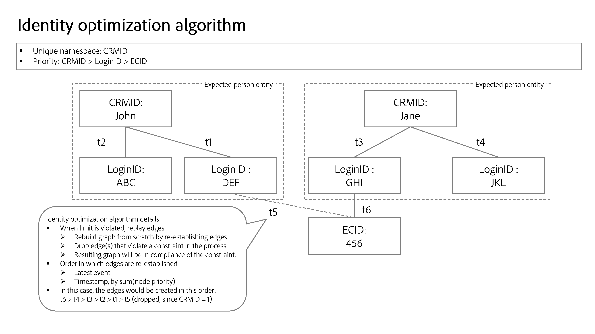

# Algoritmo de otimização de identidade

>[!AVAILABILITY]
>
>As regras de vinculação do gráfico de identidade estão na versão beta. Entre em contato com a equipe de conta do Adobe para obter informações sobre os critérios de participação. O recurso e a documentação estão sujeitos a alterações.

O algoritmo de otimização de identidade é um algoritmo de gráfico no Serviço de identidade que ajuda a garantir que um gráfico de identidade seja representativo de uma única pessoa e, portanto, impede a mesclagem indesejada de identidades no Perfil do cliente em tempo real.

## Parâmetros de entrada {#input-parameters}

Leia esta seção para obter informações sobre namespaces exclusivos e prioridade de namespace. Esses dois conceitos servem como parâmetros de entrada exigidos pelo algoritmo de otimização de identidade.

### Namespace exclusivo {#unique-namespace}

Um namespace exclusivo determina os links que serão removidos se ocorrer o recolhimento do gráfico.

Um único perfil mesclado e seu gráfico de identidade correspondente devem representar um único indivíduo (entidade pessoa). Um único indivíduo geralmente é representado por IDs de CRM e/ou IDs de logon. A expectativa é que dois indivíduos (IDs de CRM) não sejam mesclados em um único perfil ou gráfico.

Você deve especificar quais namespaces representam uma entidade de pessoa no Serviço de identidade usando o algoritmo de otimização de identidade. Por exemplo, se um banco de dados do CRM definir uma conta de usuário a ser associada a uma única ID do CRM e um único endereço de email, as configurações de identidade para essa sandbox serão assim:

* Namespace da ID do CRM = exclusivo
* Namespace do email = exclusivo

Um namespace que você declara como exclusivo será configurado automaticamente para ter um limite máximo de um em um determinado gráfico de identidade. Por exemplo, se você declarar um namespace de ID do CRM como exclusivo, um gráfico de identidade poderá ter apenas uma identidade que contenha um namespace de ID do CRM. Se você não declarar um namespace como exclusivo, o gráfico poderá conter mais de uma identidade com esse namespace.

>[!NOTE]
>
>* A representação da entidade da família (&quot;gráficos da família&quot;) não é compatível no momento.
>
>* Todos os namespaces que são identificadores de pessoas e que são usados na sandbox para gerar gráficos de identidade devem ser marcados como um namespace exclusivo. Caso contrário, você poderá ver resultados indesejáveis de vinculação.

### Prioridade de namespace {#namespace-priority}

A prioridade de namespace determina como o algoritmo de otimização de identidade remove os links.

Os namespaces no serviço de identidade têm uma ordem de importância relativa implícita. Considere um gráfico estruturado como uma pirâmide. Há um nó na camada superior, dois nós na camada intermediária e quatro nós na camada inferior. A prioridade de namespace deve refletir essa ordem relativa para garantir que uma entidade de pessoa seja representada com precisão.

Para uma análise detalhada da prioridade do namespace e de suas funcionalidades e usos completos, leia o [guia de prioridade do namespace](./namespace-priority.md).

## Processo {#process}

Ao assimilar novas identidades, o Serviço de identidade verifica se as novas identidades e seus namespaces correspondentes seguem configurações de namespace exclusivas. Se as configurações forem seguidas, a assimilação continua e as novas identidades são vinculadas ao gráfico. No entanto, se as configurações não forem seguidas, o algoritmo de otimização de identidade:

* Assimile o evento mais recente, ao mesmo tempo em que leva a prioridade do namespace em consideração.
* Remova o link que mesclaria duas entidades de pessoa da camada de gráfico apropriada.

## Detalhes do algoritmo de otimização de identidade

Quando a restrição de namespace exclusivo é violada, o algoritmo de otimização de identidade &quot;repetirá&quot; os links e recriará o gráfico do zero.

* Os links são classificados pela seguinte ordem:
   * Evento mais recente.
   * Carimbo de data e hora pela soma da prioridade do namespace (soma menor = ordem maior).
* O gráfico seria restabelecido com base na ordem acima. Se a adição do link violar a restrição de limite (por exemplo, o gráfico contiver duas ou mais identidades com um namespace exclusivo), os links serão removidos.
* O gráfico resultante será compatível com a restrição de namespace exclusivo que você configurou.

## Exemplos de cenários para o algoritmo de otimização de identidade

A seção a seguir descreve como o algoritmo de otimização de identidade se comporta, em cenários como dispositivo compartilhado ou assimilação de dados com o mesmo carimbo de data e hora.

### Dispositivo compartilhado

Um dispositivo compartilhado refere-se a um dispositivo usado por mais de um indivíduo. Por exemplo, um dispositivo compartilhado pode ser um laptop ou um tablet que você compartilha com um parceiro ou um membro da família, um computador de biblioteca ou um quiosque público.

>[!BEGINTABS]

>[!TAB Exemplo um]

| Namespace | Namespace exclusivo |
| --- | --- |
| ID do CRM | Sim |
| Email | Sim |
| ECID | Não |

Neste exemplo, a ID do CRM e o Email são designados como namespaces exclusivos. Em `timestamp=0`, um conjunto de dados de registro do CRM é assimilado e cria dois gráficos diferentes devido à configuração exclusiva do namespace. Cada gráfico contém uma ID do CRM e um namespace de email.

* `timestamp=1`: Jane faz logon em seu site de comércio eletrônico usando um laptop. Jane é representada por sua ID de CRM e por e-mail, enquanto o navegador da Web em seu notebook que ela usa é representado por uma ECID.
* `timestamp=2`: João faz logon no site de comércio eletrônico usando o mesmo laptop. John é representado por sua ID do CRM e por seu e-mail, enquanto o navegador da Web que ele usou já é representado por uma ECID. Devido ao mesmo ECID estar vinculado a dois gráficos diferentes, o Serviço de identidade pode saber que esse dispositivo (laptop) é um dispositivo compartilhado.
* No entanto, devido à configuração exclusiva de namespace que define um máximo de um namespace de ID do CRM e um namespace de email por gráfico, o algoritmo de otimização de identidade divide o gráfico em dois.
   * Por fim, como John é o último usuário autenticado, a ECID que representa o laptop permanece vinculada ao seu gráfico, em vez de à de Jane.

>[!TAB Exemplo dois]

| Namespace | Namespace exclusivo |
| --- | --- |
| ID do CRM | Sim |
| ECID | Não |

Neste exemplo, o namespace da ID do CRM é designado como um namespace exclusivo.

* `timestamp=1`: Jane faz logon em seu site de comércio eletrônico usando um laptop. Ela é representada por sua ID de CRM e o navegador da Web no notebook é representado pela ECID.
* `timestamp=2`: João faz logon no site de comércio eletrônico usando o mesmo laptop. Ele é representado por sua ID do CRM e o navegador da Web que ele usa é representado pela mesma ECID.
   * Esse evento vincula duas IDs independentes do CRM à mesma ECID, o que excede o limite configurado de uma ID do CRM.
   * Como resultado, o algoritmo de otimização de identidade remove o link mais antigo, que neste caso é a ID do CRM da Jane que estava vinculada em `timestamp=1`.
   * No entanto, embora a ID do CRM da Jane não exista mais como um gráfico no Serviço de identidade, ela ainda persistirá como um perfil no Perfil do cliente em tempo real. Isso ocorre porque um gráfico de identidade deve conter pelo menos duas identidades vinculadas e, como resultado da remoção dos links, a ID do CRM da Jane não tem mais outra identidade para a qual vincular.

>[!ENDTABS]

### Email incorreto

Há instâncias em que um usuário pode inserir valores incorretos para seu email e/ou números de telefone.

| Namespace | Namespace exclusivo |
| --- | --- |
| ID do CRM | Sim |
| Email | Sim |
| ECID | Não |

Neste exemplo, a ID do CRM e os namespaces de email são designados como exclusivos. Considere o cenário em que Jane e John se inscreveram no site de comércio eletrônico usando um valor de email incorreto (por exemplo, test@test.com).

* `timestamp=1`: Jane faz logon no seu site de comércio eletrônico usando o Safari no iPhone dela, estabelecendo a ID do CRM (informações de logon) e a ECID (navegador).
* `timestamp=2`: John faz logon no site de comércio eletrônico usando o Google Chrome em sua iPhone, estabelecendo sua ID de CRM (informações de logon) e ECID (navegador).
* `timestamp=3`: Seu engenheiro de dados assimila o registro do CRM da Jane, o que resulta no link de sua ID do CRM para o email incorreto.
* `timestamp=4`: seu engenheiro de dados assimila o registro do CRM de John, o que resulta no link de sua ID do CRM para o email incorreto.
   * Isso se torna uma violação da configuração de namespace exclusivo, pois cria um único gráfico com dois namespaces de ID de CRM.
   * Como resultado, o algoritmo de otimização de identidade exclui o link mais antigo, que neste caso é o link entre a identidade de Jane com o namespace de ID de CRM e a identidade com test@test.

Com o algoritmo de otimização de identidade, valores de identidade inválidos, como emails falsos ou números de telefone, não são propagados por vários gráficos de identidade diferentes.

### Associação de evento anônimo

As ECIDs armazenam eventos não autenticados (anônimos), enquanto a ID do CRM armazena eventos autenticados. No caso de dispositivos compartilhados, a ECID (portador de eventos não autenticados) é associada ao **último usuário autenticado**.

Exiba o diagrama abaixo para entender melhor como a associação de eventos anônimos funciona:

* Kevin e Nora compartilham um tablet.
   * `timestamp=1`: Kevin faz logon em um site de comércio eletrônico usando sua conta, estabelecendo assim sua ID de CRM (informações de logon) e uma ECID (navegador). No momento do logon, Kevin agora é considerado o último usuário autenticado.
   * `timestamp=2`: Nora faz logon em um site de comércio eletrônico usando sua conta, estabelecendo assim sua ID de CRM (informações de logon) e a mesma ECID. No momento do logon, Nora agora é considerado o último usuário autenticado.
   * `timestamp=3`: Kevin usa o tablet para navegar no site de comércio eletrônico, mas não faz logon com sua conta. A atividade de navegação de Kevin é então armazenada na ECID, que por sua vez é associada a Nora porque ela é a última usuário autenticada. Nesse ponto, Nora é dona dos eventos anônimos.
      * Até que Kevin faça logon novamente, o perfil mesclado de Nora será associado a todos os eventos não autenticados armazenados na ECID (com eventos em que a ECID é a identidade principal).
   * `timestamp=4`: Kevin faz logon pela segunda vez. Nesse ponto, ele se torna novamente o último usuário autenticado e agora também é o proprietário dos eventos não autenticados:
      * Antes do seu login inicial antes de `timestamp=1`; e
      * Quaisquer atividades que ele ou Nora realizaram enquanto navegavam anonimamente entre o primeiro e o segundo logon de Kevin.

## Próximas etapas

Para obter mais informações sobre regras de vinculação de gráficos de identidade, leia a seguinte documentação:

* [Visão geral das regras de vinculação do gráfico de identidade](./overview.md)
* [Prioridade de namespace](./namespace-priority.md)
* [Exemplos de cenários para configurar regras de vinculação de gráficos de identidade](./example-scenarios.md)
* [Lógica de vinculação de identidade](../features/identity-linking-logic.md)
* [Serviço de identidade e perfil do cliente em tempo real](../identity-and-profile.md)
