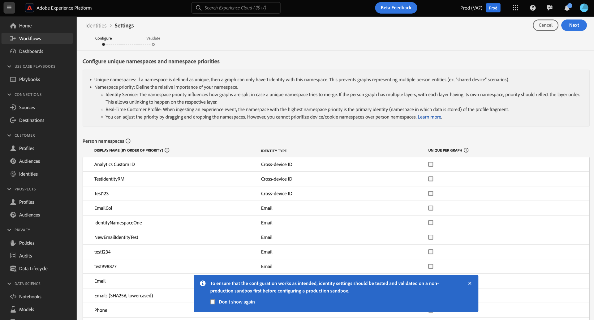

# Interface de configuração de identidade

>[!AVAILABILITY]
>
>Esse recurso ainda não está disponível; o programa beta para regras de vinculação de gráficos de identidade deve começar em julho nas sandboxes de desenvolvimento. Entre em contato com a equipe de conta do Adobe para obter informações sobre os critérios de participação.

As configurações de identidade são um recurso na interface do serviço de identidade da Adobe Experience Platform que pode ser usado para designar namespaces exclusivos e configurar a prioridade de namespace.

Leia este guia para saber como usar a ferramenta de configurações de identidade.

## Pré-requisito

Leia os seguintes documentos antes de começar a trabalhar com configurações de identidade:

* [Algoritmo de otimização de identidade](./identity-optimization-algorithm.md)
* [Prioridade de namespace](./namespace-priority.md)
* [Simulação de gráfico](./graph-simulation.md)

## Definir suas configurações de identidade

Para acessar as configurações de identidade, navegue até o espaço de trabalho do Serviço de identidade na interface do usuário do Adobe Experience Platform e selecione **[!UICONTROL Configurações]**.

A página de configurações de identidade é exibida e você recebe uma mensagem de confirmação para lembrá-lo de testar e validar primeiro suas configurações de identidade em uma sandbox de desenvolvimento antes de concluir as configurações em uma sandbox de produção.

A página de configurações de identidade é dividida em duas seções: [!UICONTROL Namespaces de pessoas] e [!UICONTROL Namespaces de dispositivo ou cookie]. Os namespaces de pessoa são identificadores de indivíduos únicos. Eles podem ser IDs entre dispositivos, endereços de email e números de telefone. Os namespaces de dispositivo ou cookie são identificadores de dispositivos e navegadores da Web e não podem receber uma prioridade mais alta do que os namespaces de pessoa. Você também não pode designar um dispositivo ou namespace de cookie como um namespace exclusivo.

### Designar seu namespace exclusivo

Para designar um namespace exclusivo, selecione o [!UICONTROL Exclusivo por gráfico] que corresponde a esse namespace. Você pode selecionar mais de um namespace exclusivo para sua configuração de definições de identidade.

Depois que os namespaces exclusivos forem estabelecidos, os gráficos não poderão mais ter várias identidades que contenham um namespace exclusivo. Por exemplo, se você designou a ID personalizada do Analytics como um namespace exclusivo, um gráfico só pode ter uma identidade com o namespace da ID personalizada do Analytics. Para obter mais informações, leia a [visão geral do algoritmo de otimização de identidade](./identity-optimization-algorithm.md#unique-namespace).

### Configurar prioridade de namespace

Para configurar a prioridade de namespace, selecione um namespace no menu de configurações de identidade e arraste e solte esse namespace na ordem de sua preferência. Coloque um namespace mais alto na lista para dar a ele uma prioridade mais alta e, inversamente, coloque um namespace mais baixo na lista para dar a ele uma prioridade mais baixa. O namespace com a maior prioridade também deve ser designado como um namespace exclusivo.

Quando terminar as configurações, selecione **[!UICONTROL Próxima]**. Uma mensagem de confirmação é exibida. Use esta oportunidade para verificar se suas configurações estão corretas e selecione **[!UICONTROL Concluir]**.

Um aviso é exibido indicando que as novas configurações não terão implicações nos links existentes em um gráfico de identidade e nos fragmentos de perfil de evento de experiência que já foram assimilados. Para confirmar, digite o nome da sandbox e selecione **[!UICONTROL Confirmar o]**.

