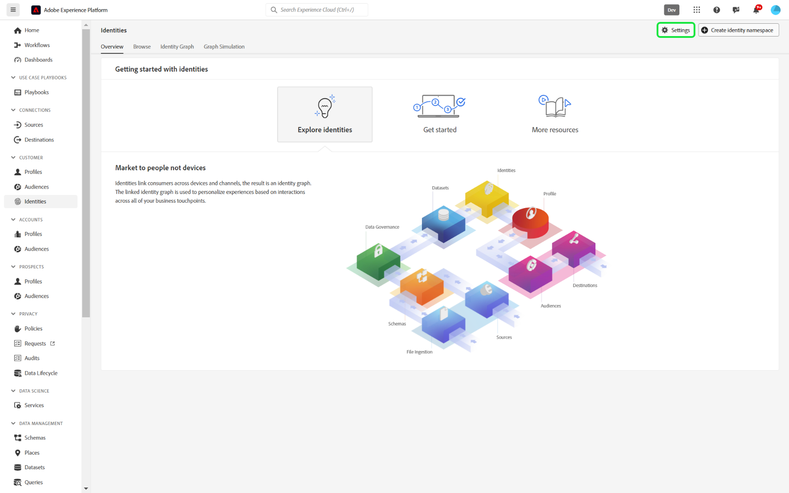

# Interface de configuração de identidade

>[!AVAILABILITY]
>
>As regras de vinculação do gráfico de identidade estão na versão beta. Entre em contato com a equipe de conta do Adobe para obter informações sobre os critérios de participação. O recurso e a documentação estão sujeitos a alterações.

As configurações de identidade são um recurso na interface do serviço de identidade da Adobe Experience Platform que pode ser usado para designar namespaces exclusivos e configurar a prioridade de namespace.

Leia este guia para saber como definir suas configurações de identidade na interface do usuário.

## Pré-requisitos

Leia os seguintes documentos antes de começar a trabalhar com configurações de identidade:

* [Guia de configuração das regras de vinculação do gráfico de identidade](./configuration.md)
* [Algoritmo de otimização de identidade](./identity-optimization-algorithm.md)
* [Prioridade de namespace](./namespace-priority.md)
* [Simulação de gráfico](./graph-simulation.md)

## Definir suas configurações de identidade

Para acessar as configurações de identidade, navegue até o espaço de trabalho Serviço de Identidade na interface do usuário do Adobe Experience Platform e selecione **[!UICONTROL Configurações]**.

A página de configurações de identidade está dividida em duas seções: [!UICONTROL Namespaces de pessoa] e [!UICONTROL Namespaces de dispositivo ou cookie]. Os namespaces de pessoa são identificadores de indivíduos únicos. Eles podem ser IDs entre dispositivos, endereços de email e números de telefone. Os namespaces de dispositivo ou cookie são identificadores de dispositivos e navegadores da Web e não podem receber uma prioridade mais alta do que os namespaces de pessoa. Você também não pode designar um dispositivo ou namespace de cookie como um namespace exclusivo.

### Configurar prioridade de namespace

Para configurar a prioridade de namespace, selecione um namespace no menu de configurações de identidade e arraste e solte esse namespace na ordem de sua preferência. Coloque um namespace mais alto na lista para dar a ele uma prioridade mais alta e, inversamente, coloque um namespace mais baixo na lista para dar a ele uma prioridade mais baixa. O namespace com a maior prioridade também deve ser designado como um namespace exclusivo.

### Designar seu namespace exclusivo

Para designar um namespace exclusivo, marque a caixa de seleção [!UICONTROL Exclusivo por gráfico] que corresponde a esse namespace. Você pode selecionar mais de um namespace exclusivo para sua configuração de definições de identidade.

Depois que os namespaces exclusivos forem estabelecidos, os gráficos não poderão mais ter várias identidades que contenham um namespace exclusivo. Por exemplo, se você designou a ID do CRM como um namespace exclusivo, um gráfico só pode ter uma identidade com o namespace da ID do CRM. Para obter mais informações, leia a [visão geral do algoritmo de otimização de identidade](./identity-optimization-algorithm.md#unique-namespace).

Quando você terminar as configurações, selecione **[!UICONTROL Avançar]**. Uma mensagem de confirmação é exibida. Use esta oportunidade para verificar se as configurações estão corretas e selecione **[!UICONTROL Concluir]**.

Um aviso é exibido indicando que as novas configurações não terão implicações nos links existentes em um gráfico de identidade e nos fragmentos de perfil de evento de experiência que já foram assimilados. Além disso, você será notificado de que levará até seis horas para que suas novas configurações sejam refletidas no sistema. Para confirmar, digite o nome da sandbox e selecione **[!UICONTROL Confirmar]**.

## Próximas etapas

Agora você configurou as prioridades de namespace e designou os namespaces exclusivos usando a página de interface do usuário de configurações de identidade. Para obter mais informações, leia a [visão geral das regras de vinculação do gráfico de identidade](./overview.md).
