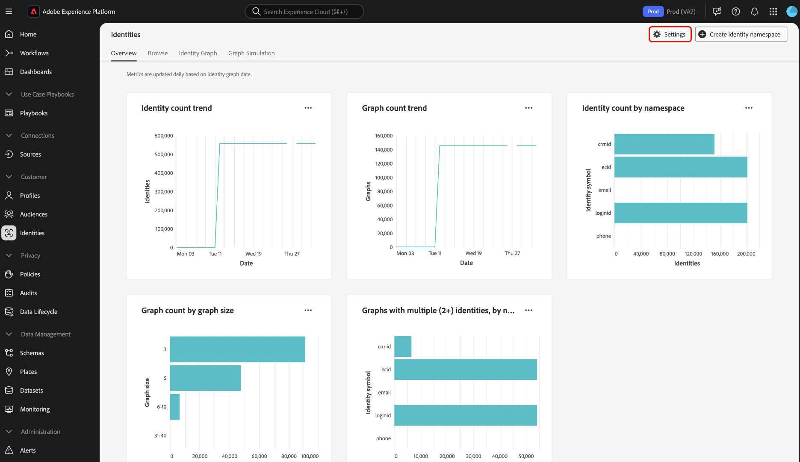

# Interface de configurações de identidade

>[!IMPORTANT]
>
>[!DNL Identity Graph Linking Rules] está agora disponível. Entre em contato com a Equipe de conta da Adobe ou com o Suporte da Adobe se tiver uma sandbox que exija que os gráficos recolhidos sejam desrecolhidos (&quot;corrigidos&quot;) após ativar as configurações de identidade.

As configurações de identidade são um recurso na interface do serviço de identidade da Adobe Experience Platform que pode ser usado para designar namespaces exclusivos e configurar a prioridade de namespace.

Assista ao vídeo a seguir para obter mais informações sobre como usar a interface [!DNL Graph Simulation] no espaço de trabalho da interface do usuário do Serviço de Identidade:

>[!VIDEO](https://video.tv.adobe.com/v/3475967/?captions=por_br&learn=on&enablevpops)

Leia este guia para saber como definir suas configurações de identidade na interface do usuário.

## Pré-requisitos

Leia os seguintes documentos antes de começar a trabalhar com configurações de identidade:

* [[!DNL Identity Graph Linking Rules]](./overview.md)
* [Algoritmo de otimização de identidades](./identity-optimization-algorithm.md)
* [Guia de implementação](./implementation-guide.md)
* [Exemplos de configurações de gráfico](./example-configurations.md)
* [Prioridade de namespace](./namespace-priority.md)
* [Simulação de gráfico](./graph-simulation.md)

### Definir permissões {#set-permissions}

Em seguida, verifique se sua conta foi provisionada com as seguintes permissões:

* **[!UICONTROL Exibir Configurações de Identidade]**: aplique esta permissão para poder exibir namespaces exclusivos e a prioridade de namespace na página de procura de namespace de identidade.
* **[!UICONTROL Editar configurações de identidade]**: aplique esta permissão para poder editar e salvar suas configurações de identidade.

Entre em contato com o administrador se não tiver essas permissões. Para obter mais informações, leia o [guia de permissões](../../access-control/abac/ui/permissions.md).

## Definir suas configurações de identidade

Para acessar as configurações de identidade, navegue até o espaço de trabalho Serviço de Identidade na interface do usuário do Adobe Experience Platform e selecione **[!UICONTROL Configurações]**.

A página de configurações de identidade está dividida em duas seções: [!UICONTROL Namespaces de pessoa] e [!UICONTROL Namespaces de dispositivo ou cookie]. Os namespaces de pessoa são identificadores de indivíduos únicos. Eles podem ser IDs entre dispositivos, endereços de email e números de telefone. Os namespaces de dispositivo ou cookie são identificadores de dispositivos e navegadores da Web e não podem receber uma prioridade mais alta do que os namespaces de pessoa. Você também não pode designar um dispositivo ou namespace de cookie como um namespace exclusivo.

### Configurar prioridade de namespace

Para configurar a prioridade de namespace, selecione um namespace no menu de configurações de identidade e arraste e solte esse namespace na ordem de sua preferência. Coloque um namespace mais alto na lista para dar a ele uma prioridade mais alta e, inversamente, coloque um namespace mais baixo na lista para dar a ele uma prioridade mais baixa. O namespace com a maior prioridade também deve ser designado como um namespace exclusivo.

### Designar seu namespace exclusivo

Para designar um namespace exclusivo, marque a caixa de seleção [!UICONTROL Exclusivo por gráfico] que corresponde a esse namespace. Você pode selecionar **até no máximo três namespaces exclusivos** para suas configurações de identidade.

Depois que os namespaces exclusivos forem estabelecidos, os gráficos não poderão mais ter várias identidades que contenham um namespace exclusivo. Por exemplo, se você designou o CRMID como um namespace exclusivo, um gráfico só poderá ter uma identidade com o namespace CRMID. Para obter mais informações, leia a [visão geral do Algoritmo de otimização de identidade](./identity-optimization-algorithm.md#unique-namespace).

Quando terminar de configurar, selecione **[!UICONTROL Avançar]** para continuar.

A partir daqui, você deve confirmar o seguinte antes de prosseguir para a etapa final:

1. Os namespaces exclusivos selecionados.
2. A existência de uma identidade com o namespace exclusivo priorizado mais alto em cada perfil conhecido.
3. A ordem de prioridade do namespace.

### Confirme suas configurações {#confirm-your-settings}

>[!IMPORTANT]
>
>* A etapa final é outra mensagem de confirmação indicando que os gráficos existentes só serão afetados pelo algoritmo de gráfico **se os gráficos forem atualizados depois de salvar suas configurações**, e que a identidade principal dos fragmentos de evento no Perfil de cliente em tempo real não será atualizada mesmo após as alterações de prioridade do namespace.
>
>* Serão necessárias até **24 horas** para que suas configurações novas ou atualizadas entrem em vigor. Para confirmar, digite o nome da sua sandbox e selecione **[!UICONTROL Confirmar]**.
>
>* Não haverá alterações nos dados até que você salve as configurações de identidade.

## Próximas etapas

Para obter mais informações sobre [!DNL Identity Graph Linking Rules], leia a seguinte documentação:

* [Visão geral do [!DNL Identity Graph Linking Rules]](./overview.md)
* [Algoritmo de otimização de identidades](./identity-optimization-algorithm.md)
* [Guia de implementação](./implementation-guide.md)
* [Exemplos de configurações de gráfico](./example-configurations.md)
* [Solução de problemas e perguntas frequentes](./troubleshooting.md)
* [Prioridade de namespace](./namespace-priority.md)
* [Interface de simulação de gráfico](./graph-simulation.md)