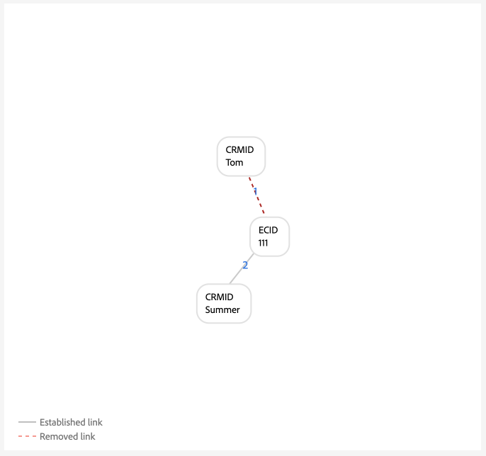

# Guia de implementação para [!DNL Identity Graph Linking Rules]

>[!IMPORTANT]
>
>Este documento supõe que você esteja iniciando a implementação em uma nova sandbox sem dados.

Leia este documento para obter um guia passo a passo que você pode seguir ao implementar seus dados com o Adobe Experience Platform Identity Service.

Estrutura passo a passo:

1. [Pré-requisitos completos para a implementação](#prerequisites-for-implementation)
2. [Criar os namespaces de identidade necessários](#namespace)
3. [Use a ferramenta de simulação de gráficos para se familiarizar com o Algoritmo de otimização de identidade](#graph-simulation)
4. [Use a interface das configurações de identidade para designar seus namespaces exclusivos e configurar classificações de prioridade para seus namespaces](#identity-settings)
5. [Criar um esquema do Experience Data Model (XDM)](#schema)
6. [Criar um conjunto de dados](#dataset)
7. [Assimilar seus dados na Experience Platform](#ingest)

## Pré-requisitos para implementação {#prerequisites-for-implementation}

Esta seção descreve as etapas de pré-requisito que devem ser concluídas antes de implementar o [!DNL Identity Graph Linking Rules] para seus dados.

### Namespace exclusivo

#### Requisito de namespace para uma única pessoa {#single-person-namespace-requirement}

Você deve garantir que o namespace exclusivo com a maior prioridade esteja sempre presente em todos os perfis conhecidos. Isso permite que o Serviço de identidade detecte o identificador de pessoa apropriado em um determinado gráfico.

+++Selecione para exibir um exemplo de gráfico sem um namespace de identificador de pessoa singular

Sem um namespace exclusivo para representar seus identificadores de pessoa, você pode acabar com um gráfico que se vincula a identificadores de pessoa diferentes para a mesma ECID. Neste exemplo, B2BCRM e B2CCRM estão vinculados à mesma ECID ao mesmo tempo. Este gráfico sugere que Tom, usando sua conta de login B2C, compartilhou um dispositivo com Summer, usando sua conta de login B2B. No entanto, o sistema reconhecerá que este é um perfil (colapso de gráfico).

{zoomable="yes"}

+++

+++Selecione para exibir um exemplo de gráfico com um único namespace de identificador de pessoa

Dado um namespace exclusivo (neste caso, uma CRMID em vez de dois namespaces diferentes), o Serviço de identidade pode discernir o identificador de pessoa que foi associado pela última vez à ECID. Neste exemplo, como existe uma CRMID exclusiva, o Serviço de identidade pode reconhecer um cenário de &quot;dispositivo compartilhado&quot;, em que duas entidades estão compartilhando o mesmo dispositivo.

{zoomable="yes"}

+++

### Configuração de prioridade de namespace

Se você estiver usando o [conector de origem do Adobe Analytics](../../sources/tutorials/ui/create/adobe-applications/analytics.md) para assimilar dados, deverá dar às ECIDs uma prioridade mais alta do que a Adobe Analytics ID (AAID), pois o Serviço de Identidade bloqueia a AAID. Ao priorizar a ECID, você pode instruir o Perfil do cliente em tempo real para armazenar eventos não autenticados na ECID em vez da AAID.

### Eventos de experiência XDM {#xdm-experience-events}

>[!CONTEXTUALHELP]
>id="platform_identities_linkingrules_xdm"
>title="Certifique-se de ter um único identificador de pessoa"
>abstract="Durante o processo de pré-implementação, certifique-se de que os eventos autenticados que seu sistema enviará para a Experience Platform sempre contenham um **único** identificador de pessoa, como um CRMID."

Durante o processo de pré-implementação, certifique-se de que os eventos autenticados que seu sistema enviará para a Experience Platform sempre contenham um **único** identificador de pessoa, como um CRMID.

* (Recomendado) Eventos autenticados com um identificador de pessoa exclusivo.
* (Não recomendado) Eventos autenticados com dois identificadores de pessoa exclusivos. Se você tiver mais de um identificador de pessoa exclusivo, poderá encontrar um colapso de gráfico indesejado.
* (Não recomendado) Eventos autenticados sem identificadores de pessoa exclusivos. Se você não tiver identificadores de pessoa exclusivos, os eventos não autenticados e autenticados serão armazenados na ECID.

>[!BEGINTABS]

>[!TAB Eventos autenticados com um identificador de pessoa]

```json
{
  "_id": "test_id",
  "identityMap": {
      "ECID": [
          {
              "id": "62486695051193343923965772747993477018",
              "primary": false
          }
      ],
      "CRMID": [
          {
              "id": "John",
              "primary": true
          }
      ]
  },
  "timestamp": "2024-09-24T15:02:32+00:00",
  "web": {
      "webPageDetails": {
          "URL": "https://business.adobe.com/br/",
          "name": "Adobe Business"
      }
  }
}
```

>[!TAB Eventos autenticados com dois identificadores de pessoa]

Se o sistema enviar dois identificadores de pessoa, a implementação pode falhar o requisito de namespace de pessoa única. Por exemplo, se o identityMap na implementação do SDK da Web contiver um CRMID, uma customerID e um namespace ECID, não há garantia de que cada evento conterá CRMID e customerID.

Você deve **não** enviar uma carga como a seguir:

```json
{
  "_id": "test_id",
  "identityMap": {
      "ECID": [
          {
              "id": "62486695051193343923965772747993477018",
              "primary": false
          }
      ],
      "CRMID": [
          {
              "id": "John",
              "primary": true
          }
      ],
      "customerID": [
          {
            "id": "Jane",
            "primary": false
          }
      ],
  },
  "timestamp": "2024-09-24T15:02:32+00:00",
  "web": {
      "webPageDetails": {
          "URL": "https://business.adobe.com/br/",
          "name": "Adobe Business"
      }
  }
}
```

No entanto, é importante observar que, embora seja possível enviar dois identificadores de pessoa, não há garantia de que um colapso de gráfico indesejado será evitado devido a erros de implementação ou dados. Considere o seguinte cenário:

* `timestamp1` = João faz logon -> capturas do sistema `CRMID: John, ECID: 111`. No entanto, `customerID: John` não está presente nesta carga do evento.
* `timestamp2` = Jane faz logon -> capturas de sistema `customerID: Jane, ECID: 111`. No entanto, `CRMID: Jane` não está presente nesta carga do evento.

Portanto, é prática recomendada enviar apenas um identificador de pessoa com seus eventos autenticados.

Na simulação do gráfico, essa assimilação pode ser semelhante a:

{zoomable="yes"}

>[!TAB Eventos autenticados sem identificadores de pessoa]

Neste exemplo, você pode supor que o evento a seguir foi enviado para o Experience Platform enquanto John (o usuário final) estava navegando em seu site enquanto estava autenticado. No entanto, apesar de estar autenticado, o Experience Platform não consegue identificar John devido à falta de identificadores de pessoas no evento. Portanto, esse evento é interpretado como um usuário anônimo que navega no site Adobe Business, em vez de reconhecê-lo como uma atividade online associada especificamente a John.

```json
{
    "_id": "test_id",
    "identityMap": {
        "ECID": [
            {
                "id": "62486695051193343923965772747993477018",
                "primary": false
            }
        ]
    },
    "timestamp": "2024-09-24T15:02:32+00:00",
    "web": {
        "webPageDetails": {
            "URL": "https://business.adobe.com/br/",
            "name": "Adobe Business"
        }
    }
}
```

>[!ENDTABS]

## Definir permissões {#set-permissions}

A primeira etapa do processo de implementação do Serviço de identidade é garantir que sua conta da Experience Platform seja adicionada a uma função que seja provisionada com as permissões necessárias. O administrador pode configurar permissões para sua conta navegando até a interface de permissões no Adobe Experience Cloud. A partir daí, sua conta deve ser adicionada a uma função com as seguintes permissões:

* [!UICONTROL View Identity Settings]: aplique esta permissão para poder exibir namespaces exclusivos e a prioridade de namespace na página de procura de namespace de identidade.
* [!UICONTROL Edit Identity Settings]: aplique esta permissão para poder editar e salvar suas configurações de identidade.

Para obter mais informações sobre permissões, leia o [guia de permissões](../../access-control/abac/ui/permissions.md).

## Criar namespaces de identidade {#namespace}

Se os dados exigirem, primeiro crie os namespaces apropriados para sua organização. Para obter etapas sobre como criar um namespace personalizado, leia o manual sobre [criação de um namespace personalizado na interface](../features/namespaces.md#create-custom-namespaces).

## Usar ferramenta de simulação de gráfico {#graph-simulation}

Em seguida, navegue até a [ferramenta de simulação de gráficos](./graph-simulation.md), no espaço de trabalho da interface do usuário do Serviço de Identidade. Você pode usar a ferramenta de simulação de gráficos para simular gráficos de identidade, criados com uma variedade de diferentes configurações de namespace único e prioridade de namespace.

Ao criar diferentes configurações, você pode usar a ferramenta de simulação de gráficos para conhecer e entender melhor como o Algoritmo de otimização de identidade e determinadas configurações podem afetar o comportamento do gráfico.

## Definir configurações de identidade {#identity-settings}

Assim que tiver uma ideia melhor de como deseja que o gráfico se comporte, navegue até a [interface de configurações de identidade](./identity-settings-ui.md) no espaço de trabalho da interface do usuário do Serviço de Identidade. Para acessar a interface de configurações de identidade, selecione **[!UICONTROL Identities]** na navegação à esquerda e **[!UICONTROL Settings]**.

{zoomable="yes"}

Use a interface de configurações de identidade para designar seus namespaces exclusivos e configurar seus namespaces por ordem de prioridade.

>[!IMPORTANT]
>
>Quando terminar de aplicar as configurações, aguarde pelo menos 24 horas para poder continuar a assimilar dados, pois demora pelo menos 24 horas para que as novas configurações sejam refletidas no Serviço de identidade.

Para obter mais informações, leia o [guia da interface do usuário de configurações de identidade](./identity-settings-ui.md).

## Criar um esquema do XDM {#schema}

Com os namespaces exclusivos e as prioridades de namespace estabelecidas, agora é possível prosseguir para a configuração necessária para assimilar seus dados. Primeiro, você deve criar um esquema XDM. Dependendo dos seus dados, talvez seja necessário criar um esquema para o Perfil individual XDM e o ExperienceEvent XDM.

Para assimilar dados no Perfil do cliente em tempo real, você deve garantir que seu esquema contenha pelo menos um campo que tenha sido designado como a identidade principal. Ao configurar uma identidade principal, é possível ativar um determinado esquema para assimilação de perfil.

Para obter instruções sobre como criar um esquema, leia o manual sobre [criação de um esquema XDM na interface](../../xdm/tutorials/create-schema-ui.md).

## Criar um conjunto de dados {#dataset}

Em seguida, crie um conjunto de dados para fornecer uma estrutura para os dados que você vai assimilar. Um conjunto de dados é uma construção de armazenamento e gerenciamento para uma coleção de dados, normalmente uma tabela, que contém um esquema (colunas) e campos (linhas). Os conjuntos de dados funcionam em conjunto com esquemas e, para assimilar dados no Perfil do cliente em tempo real, seu conjunto de dados deve estar habilitado para assimilação de perfil. Para que seu conjunto de dados seja ativado para o Perfil, ele deve fazer referência a um esquema que esteja ativado para assimilação de Perfil.

Para obter instruções sobre como criar um conjunto de dados, leia o [guia da interface do conjunto de dados](../../catalog/datasets/user-guide.md).

## Assimilar seus dados {#ingest}

Nesse ponto, você deve ter o seguinte:

* As permissões necessárias para acessar os recursos do Serviço de identidade.
* Namespaces para seus dados.
* Namespaces exclusivos designados e prioridades configuradas para seus namespaces.
* Pelo menos um esquema XDM. (Dependendo dos seus dados e do caso de uso específico, talvez seja necessário criar esquemas de evento de perfil e de experiência.)
* Um conjunto de dados baseado no seu esquema.

Depois de ter todos os itens listados acima, você pode começar a assimilar seus dados na Experience Platform. Você pode realizar a assimilação de dados de várias maneiras diferentes. Você pode usar os seguintes serviços para trazer seus dados para a Experience Platform:

* [Assimilação em lote e por transmissão](../../ingestion/home.md)
* [Coleta de dados no Experience Platform](../../collection/home.md)
* [Fontes do Experience Platform](../../sources/home.md)

>[!TIP]
>
>Depois que os dados são assimilados, a carga de dados brutos do XDM não é alterada. Você ainda pode ver suas configurações de identidade principais na interface do usuário. No entanto, essas configurações serão substituídas pelas configurações de identidade.

Para qualquer comentário, use a opção **[!UICONTROL Beta feedback]** no espaço de trabalho da interface do usuário do Serviço de Identidade.

## Validar seus gráficos {#validate}

Use o painel de identidade para obter insights sobre o estado dos gráficos de identidade, como a contagem geral de identidades e as tendências de contagem de gráficos, a contagem de identidades por namespace e a contagem de gráficos por tamanho do gráfico. Você também pode usar o painel de identidade para exibir tendências em gráficos com duas ou mais identidades, organizadas por namespace.

Selecione as reticências (`...`) e selecione **[!UICONTROL View more]** para obter mais informações e validar se não há gráficos recolhidos.

{zoomable="yes"}

Use a janela exibida para exibir informações sobre os gráficos recolhidos. Neste exemplo, email e telefone são marcados como namespace exclusivo, portanto, não há gráficos recolhidos na sandbox.

{zoomable="yes"}

## Apêndice {#appendix}

Leia esta seção para obter informações adicionais que você pode consultar ao implementar suas configurações de identidade e namespaces exclusivos.

### Perdendo o cenário de ID de logon {#dangling-loginid-scenario}

O gráfico a seguir simula um cenário de ID de logon &quot;pendente&quot;. Neste exemplo, duas IDs de logon diferentes são vinculadas à mesma ECID. No entanto, `{loginID: ID_C}` não está vinculado ao CRMID. Portanto, não há como o Serviço de identidade detectar que essas duas IDs de logon representam duas entidades diferentes.

>[!BEGINTABS]

>[!TAB LoginID ambíguo]

Neste exemplo, `{loginID: ID_C}` é deixado pendente e desvinculado a um CRMID. Assim, a entidade de pessoa à qual essa ID de logon deve ser associada é deixada ambígua.

{zoomable="yes"}

>[!TAB loginID está vinculado a um CRMID]

Neste exemplo, `{loginID: ID_C}` está vinculado a `{CRMID: Tom}`. Portanto, o sistema pode discernir que essa ID de logon está associada ao Tom.

{zoomable="yes"}

>[!TAB loginID está vinculado a outro CRMID]

Neste exemplo, `{loginID: ID_C}` está vinculado a `{CRMID: Summer}`. Portanto, o sistema pode discernir que essa ID de logon está associada a outra entidade de pessoa, neste caso, o Verão.

Este exemplo também mostra que Tom e Summer são entidades de pessoas diferentes que estão compartilhando um dispositivo, representado por `{ECID: 111}`.

{zoomable="yes"}

>[!ENDTABS]

## Próximas etapas

Para obter mais informações sobre [!DNL Identity Graph Linking Rules], leia a seguinte documentação:

* [Visão geral do [!DNL Identity Graph Linking Rules]](./overview.md)
* [Algoritmo de otimização de identidades](./identity-optimization-algorithm.md)
* [Exemplos de configurações de gráfico](./example-configurations.md)
* [Solução de problemas e perguntas frequentes](./troubleshooting.md)
* [Prioridade de namespace](./namespace-priority.md)
* [Interface de simulação de gráfico](./graph-simulation.md)
* [Interface de configurações de identidade](./identity-settings-ui.md)
