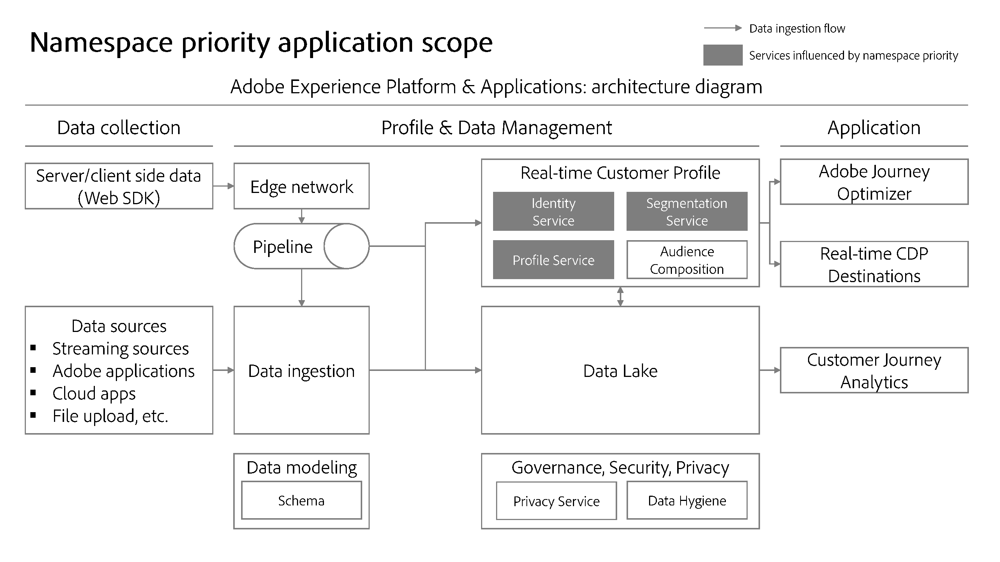

# Prioridade de namespace

>[!AVAILABILITY]
>
>Esse recurso ainda não está disponível; o programa beta para regras de vinculação de gráficos de identidade deve começar em julho nas sandboxes de desenvolvimento. Entre em contato com a equipe de conta do Adobe para obter informações sobre os critérios de participação.

Cada implementação de cliente é exclusiva e personalizada para atender às metas de uma organização específica e, como tal, a importância de um determinado namespace varia de acordo com o cliente. Exemplos reais incluem:

* Por um lado, você pode considerar que o namespace de email representa uma entidade de pessoa e, portanto, é exclusivo por pessoa. Por outro lado, outro cliente pode considerar o namespace de email como um identificador não confiável e, portanto, pode permitir que uma única ID do CRM seja associada a várias identidades com o namespace de email.
* Você pode coletar o comportamento online usando um namespace de &quot;ID de logon&quot;. Essa ID de logon pode ter uma relação 1:1 com a ID do CRM, que armazena atributos de um sistema CRM e pode ser considerada o namespace mais importante. Nesse caso, você está determinando que o namespace da ID do CRM é uma representação mais precisa de uma pessoa, enquanto o namespace da ID de logon é o segundo mais importante.

Você deve fazer configurações no Serviço de identidade que reflitam a importância dos namespaces, pois isso influencia como os perfis são formados e segmentados.

## Determine suas prioridades

A determinação da prioridade do namespace é baseada nos seguintes fatores:

### Estrutura do gráfico de identidade

Se o gráfico estruturado de sua organização estiver em camadas, a prioridade do namespace deverá refletir isso para que os links corretos sejam removidos no caso de recolhimento de gráficos.

>[!TIP]
>
>* &quot;Coleta de gráfico&quot; refere-se a cenários em que vários perfis diferentes são mesclados inadvertidamente em um único gráfico de identidade.
>
>* Um gráfico em camadas se refere aos gráficos de identidade que têm vários níveis de links. Veja a imagem abaixo para obter um exemplo de um gráfico com três camadas.

### Significado semântico do namespace

Uma identidade representa um objeto real. Há três objetos que são representados no gráfico de identidade. Em ordem de importância, eles são:

* Pessoas (entre dispositivos, email, número de telefone)
* Dispositivo de hardware
* Navegador da Web (Cookie)

Os namespaces de pessoa são relativamente imutáveis em comparação a dispositivos de hardware (como IDFA, GAID), que são relativamente imutáveis em comparação a navegadores da Web. Basicamente, você (pessoa) sempre será uma única entidade, que pode ter vários dispositivos de hardware (telefone, laptop, tablet etc.) e usar vários navegadores (Google Chrome, Safari, FireFox etc.)

Outra maneira de abordar este tópico é através da cardinalidade. Para uma determinada entidade de pessoa, quantas identidades serão criadas? Na maioria dos casos, uma pessoa terá uma ID de CRM, alguns identificadores de dispositivo de hardware (redefinições de IDFA/GAID não devem ocorrer com frequência) e ainda mais cookies (um indivíduo pode navegar em vários dispositivos, usar o modo incógnito ou redefinir cookies a qualquer momento). Em geral, **cardinalidade mais baixa indica um namespace com um valor mais alto**.

## Validar as configurações de prioridade do namespace

Depois de ter uma ideia de como priorizar seus namespaces, você pode usar a ferramenta Simulação de gráfico para testar vários cenários de recolhimento de gráficos e garantir que suas configurações de prioridade retornem os resultados esperados do gráfico. Para obter mais informações, leia o guia sobre como usar o [Ferramenta Simulação de gráfico](./graph-simulation.md).

## Configurar prioridade de namespace

A prioridade de namespace pode ser configurada usando [!UICONTROL Configurações de identidade]. No [!UICONTROL Configurações de identidade] você pode arrastar e soltar um namespace para determinar sua importância relativa.

>[!IMPORTANT]
>
>Você não pode priorizar namespaces de dispositivo/cookie em relação a namespaces de pessoa. Essa restrição garante que não ocorram erros de configuração.

## Uso da prioridade de namespace

Atualmente, a prioridade do namespace influencia o comportamento do sistema do Perfil do cliente em tempo real. O diagrama abaixo ilustra esse conceito. Para obter mais informações, leia o guia em [Diagramas da arquitetura de aplicativos e Adobe Experience Platform](https://experienceleague.adobe.com/en/docs/blueprints-learn/architecture/architecture-overview/platform-applications).

### Serviço de identidade: algoritmo de otimização de identidade

Para estruturas de gráficos relativamente complexas, a prioridade de namespace desempenha um papel importante para garantir que os links corretos sejam removidos quando ocorrem cenários de recolhimento de gráficos. Para obter mais informações, leia a [[!DNL Identity Optimization Algorithm] visão geral](../identity-graph-linking-rules/identity-optimization-algorithm.md).

### Perfil do cliente em tempo real: determinação de identidade principal para eventos de experiência

* Para eventos de experiência, depois de definir as Configurações de identidade para uma determinada sandbox, a identidade primária será determinada pela prioridade de namespace mais alta a partir de agora.
   * Isso ocorre porque os eventos de experiência são de natureza dinâmica. Um mapa de identidade pode conter três ou mais identidades, e a prioridade do namespace garante que o namespace mais importante esteja associado ao evento de experiência.
* Como resultado, as seguintes configurações **não será mais usado pelo Perfil de cliente em tempo real**:
   * Caixa de seleção &quot;Primário&quot; no tipo de elemento de dados no WebSDK.
   * Quaisquer campos marcados como identidade primária em um esquema de Classe de evento de experiência XDM.
   * Configurações de identidade primária padrão no conector de origem do Adobe Analytics (ECID ou AAID).
* Por outro lado, **a prioridade de namespace não determina a identidade principal para registros de perfil**.
   * Para registros de perfil, você pode usar o espaço de trabalho de esquemas na interface do usuário do Experience Platform para definir os campos de identidade, incluindo a identidade principal. Leia o guia em [definição de campos de identidade na interface](../../xdm/ui/fields/identity.md) para obter mais informações.

>[!NOTE]
>
>* A prioridade do namespace é **uma propriedade de um namespace**. É um valor numérico atribuído a um namespace para indicar sua importância relativa.
>
>* A identidade principal é a identidade na qual um fragmento de perfil é armazenado. Um fragmento de perfil é um registro de dados que armazena informações sobre um determinado usuário: atributos (geralmente assimilados por meio de registros do CRM) ou eventos (geralmente assimilados de eventos de experiência ou dados online).

### Exemplo de cenário de gráfico

Esta seção fornece um exemplo de como a configuração de prioridade pode afetar seus dados.

Suponha que as seguintes configurações sejam estabelecidas para uma determinada sandbox:

| Namespace | Aplicação real do namespace | Prioridade |
| --- | --- | --- |
| CRMID | Usuário(a)  | 1 |
| IDFA | Dispositivo de hardware do Apple (iPhone, IPad etc.) | 2 |
| GAID | Dispositivo de hardware do Google (Google Pixel, Pixelbook, etc.) | 3 |
| ECID | Navegador da Web (Firefox, Safari, Google Chrome etc.) | 4 |
| AAID | Navegador da Web | 5 |

{style="table-layout:auto"}

Dadas as configurações descritas acima, as ações do usuário e a determinação da identidade principal serão resolvidas como:

| Ação do usuário (Evento de experiência) | Estado de autenticação | Fonte de dados | Mapa de identidade | Identidade principal (chave principal do fragmento do perfil) |
| --- | --- | --- | --- | --- |
| Exibir página de oferta de cartão de crédito | Não autenticado (anônimo) | Web SDK | {ECID} | ECID |
| Exibir página de ajuda | Não autenticado | SDK móvel | {ECID, IDFA} | IDFA |
| Exibir saldo de conta corrente | Autenticado | Web SDK | {CRM ID, ECID} | ID do CRM |
| Inscrever-se para obter empréstimo residencial | Autenticado | Conector de origem do Analytics | {ID de CRM, ECID, AAID} | ID do CRM |
| Transferência de US$ 1.000 da verificação para a economia | Autenticado | SDK móvel | {ID DE CRM, GAID, ECID} | ID do CRM |

{style="table-layout:auto"}

### Serviço de segmentação: armazenamento de metadados de associação de segmento

Para um determinado perfil mesclado, as associações de segmento serão armazenadas em relação à identidade com o namespace de prioridade mais alta.

Por exemplo, suponha que haja dois perfis:

* O primeiro perfil representa John.
* O segundo perfil representa Jane.

Se John e Jane compartilharem um dispositivo, a ECID (navegador da Web) será transferida de uma pessoa para outra. No entanto, isso não influencia as informações de associação do segmento armazenadas em relação a John e Jane.

Se os critérios de qualificação de segmento fossem baseados apenas em eventos anônimos armazenados na ECID, Jane se qualificaria para esse segmento

## Implicações em outros serviços do Experience Platform {#implications}

Esta seção descreve como a prioridade de namespace pode afetar outros serviços de Experience Platform.

### Gerenciamento avançado do ciclo de vida dos dados

A exclusão de registros da higiene de dados solicita funções da seguinte maneira, para uma determinada identidade:

* Perfil do cliente em tempo real: exclui qualquer fragmento de perfil com a identidade especificada como identidade principal. **A identidade principal no Perfil agora será determinada com base na prioridade do namespace.**
* Data lake: exclui qualquer registro com a identidade especificada como identidade principal.

Para obter mais informações, leia a [visão geral avançada do gerenciamento do ciclo de vida](../../hygiene/home.md).

### Data lake

A assimilação de dados no data lake continuará respeitando as configurações de identidade principais definidas em [SDK da Web](../../tags/extensions/client/web-sdk/data-element-types.md#identity-map) e esquemas.

O data lake não determinará a identidade principal com base na prioridade do namespace. Por exemplo, o Adobe Customer Journey Analytics continuará a usar valores no mapa de identidade mesmo após a prioridade do namespace ser ativada (como adicionar um conjunto de dados a uma nova conexão), porque o Customer Journey Analytics consome seus dados do data lake.

### Esquemas do Experience Data Model (XDM)

Qualquer esquema que não seja um Evento de experiência XDM, como Perfis individuais XDM, continuará a honrar qualquer [campos marcados como identidade](../../xdm/ui/fields/identity.md).

Para obter mais informações sobre esquemas XDM, leia a [visão geral de esquemas](../../xdm/home.md).

### Serviços inteligentes

Ao selecionar seus dados, você precisará especificar um namespace, que será usado para determinar os eventos que calculam pontuações e os eventos que armazenam as pontuações calculadas. É recomendável selecionar o namespace que representa uma pessoa.

* Se estiver coletando dados de comportamento da Web usando o WebSDk, é recomendável escolher o namespace da ID do CRM no mapa de identidade.
* Se você estiver coletando dados de comportamento da Web usando o conector de origem do Analytics, selecione o descritor de identidade (ID do CRM).

Esta configuração resulta no cálculo de pontuações somente usando eventos autenticados.

Para obter mais informações sobre, leia os documentos em [Attribution AI](../../intelligent-services/attribution-ai/overview.md) e [IA do cliente](../../intelligent-services/customer-ai/overview.md).

### Privacy Service

[solicitações de exclusão do Privacy Service](../privacy.md) função da seguinte maneira, para uma determinada identidade:

* Perfil do cliente em tempo real: exclui qualquer fragmento de perfil com valor de identidade especificado como identidade principal. **A identidade principal no Perfil agora será determinada com base na prioridade do namespace.**
* Data lake: exclui qualquer registro com a identidade especificada como identidade primária ou secundária.

Para obter mais informações, leia a [Visão geral do Privacy Service](../../privacy-service/home.md).
