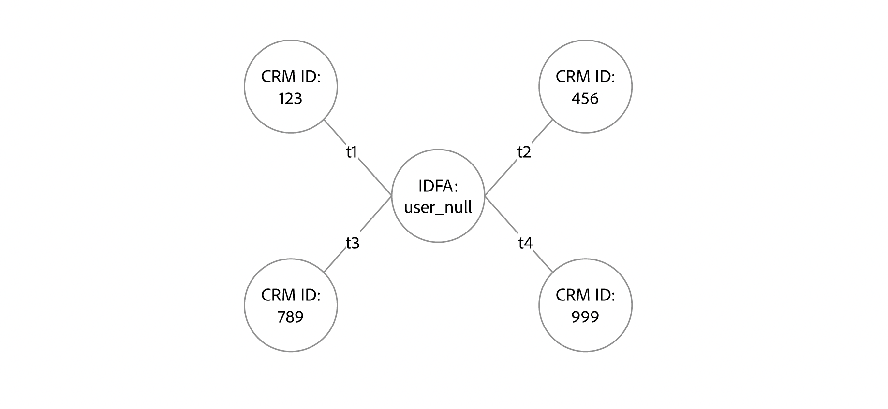

# Visão geral das regras de vinculação do gráfico de identidade

>[!AVAILABILITY]
>
>As regras de vinculação do gráfico de identidade estão na versão beta. Entre em contato com a equipe de conta do Adobe para obter informações sobre os critérios de participação. O recurso e a documentação estão sujeitos a alterações.

Com o Serviço de identidade da Adobe Experience Platform e o Perfil do cliente em tempo real, é fácil supor que seus dados são assimilados perfeitamente e que todos os perfis mesclados representam uma única pessoa por meio de um identificador de pessoa, como um CRMID. No entanto, há possíveis cenários em que determinados dados podem tentar mesclar vários perfis diferentes em um único perfil (&quot;colapso de gráfico&quot;). Para evitar essas mesclagens indesejadas, é possível usar as configurações fornecidas por meio das regras de vinculação do gráfico de identidade e permitir a personalização precisa para seus usuários.

## Introdução

Os documentos a seguir são essenciais para entender as regras de vinculação do gráfico de identidade.

* [Algoritmo de otimização de identidade](./identity-optimization-algorithm.md)
* [Guia de implementação](./implementation-guide.md)
* [Exemplos de configurações de gráfico](./example-configurations.md)
* [Solução de problemas e perguntas frequentes](./troubleshooting.md)
* [Prioridade de namespace](./namespace-priority.md)
* [Interface de simulação de gráfico](./graph-simulation.md)
* [Interface de configurações de identidade](./identity-settings-ui.md)

## Exemplos de cenários em que o colapso de gráficos pode ocorrer

* **Dispositivo compartilhado**: dispositivo compartilhado refere-se a dispositivos que são usados por mais de um indivíduo. Exemplos de dispositivos compartilhados incluem tablets, computadores de biblioteca e quiosques.
* **Email e números de telefone incorretos**: emails e números de telefone incorretos se referem a usuários finais que registram informações de contato inválidas, como &quot;test@test.com&quot; para email e &quot;+1-111-111-1111&quot; para número de telefone.
* **Valores de identidade incorretos ou incorretos**: valores de identidade incorretos ou incorretos se referem a valores de identidade não exclusivos que poderiam mesclar CRMIDs. Por exemplo, embora os IDFAs devam ter 36 caracteres (32 caracteres alfanuméricos e quatro hifens), há cenários em que um IDFA com um valor de identidade de &quot;user_null&quot; pode ser assimilado. Da mesma forma, os números de telefone suportam apenas caracteres numéricos, mas um namespace de telefone com um valor de identidade &quot;não especificado&quot; pode ser assimilado.

Para obter mais informações sobre cenários de caso de uso para regras de vinculação de gráficos de identidade, leia a seção sobre [exemplos de cenários](#example-scenarios).

## Regras de vinculação do gráfico de identidade {#identity-graph-linking-rules}

Com as regras de vinculação do gráfico de identidade, você pode:

* Crie um único gráfico de identidade/perfil mesclado para cada usuário configurando namespaces exclusivos, o que impedirá que dois identificadores de pessoa diferentes sejam mesclados em um gráfico de identidade.
* Associar eventos online e autenticados à pessoa, configurando prioridades

### Terminologia {#terminology}

| Terminologia | Descrição |
| --- | --- |
| Namespace exclusivo | Um namespace exclusivo é um namespace de identidade que foi configurado para ser distinto no contexto de um gráfico de identidade. Você pode configurar um namespace para ser exclusivo usando a interface do usuário. Depois que um namespace é definido como exclusivo, um gráfico só pode ter uma identidade que contenha esse namespace. |
| Prioridade de namespace | A prioridade de namespace refere-se à importância relativa dos namespaces em comparação uns com os outros. A prioridade de namespace pode ser configurada por meio da interface do usuário. Você pode classificar namespaces em um determinado gráfico de identidade. Depois de ativada, a prioridade de nomes será usada em vários cenários, como entrada para o algoritmo de otimização de identidade e determinação da identidade principal para fragmentos de evento de experiência. |
| Algoritmo de otimização de identidade | O algoritmo de otimização de identidade garante que as diretrizes criadas pela configuração de um namespace exclusivo e de prioridades de namespace sejam aplicadas em um determinado gráfico de identidade. |

### Namespace exclusivo {#unique-namespace}

Você pode configurar um namespace para ser exclusivo usando o espaço de trabalho da interface do usuário de configurações de identidade. Ao fazer isso, o informa ao algoritmo de otimização de identidade que um determinado gráfico pode ter apenas uma identidade que contenha esse namespace exclusivo. Isso impede a mesclagem de dois identificadores de pessoas diferentes no mesmo gráfico.

Considere o seguinte cenário:

* Scott usa um tablet e abre seu navegador Google Chrome para ir até nike.com, onde ele entra e navega por novos sapatos de basquete.
   * Nos bastidores, esse cenário registra as seguintes identidades:
      * Um namespace e valor de ECID para representar o uso do navegador
      * Um namespace e valor CRMID para representar o usuário autenticado (Scott entrou com sua combinação de nome de usuário e senha).
* Seu filho Peter usa o mesmo tablet e também usa o Google Chrome para ir até nike.com, onde ele entra com sua própria conta para procurar equipamentos de futebol.
   * Nos bastidores, esse cenário registra as seguintes identidades:
      * O mesmo namespace e valor de ECID para representar o navegador.
      * Um novo namespace e valor de CRMID para representar o usuário autenticado.

Se a CRMID foi configurada como um namespace exclusivo, o algoritmo de otimização de identidade divide as CRMIDs em dois gráficos de identidade separados, em vez de mesclá-los.

Se você não configurar um namespace exclusivo, poderá obter mesclagens de gráficos indesejadas, como duas identidades com o mesmo namespace CRMID, mas valores de identidade diferentes (cenários como esses geralmente representam duas entidades de pessoa diferentes no mesmo gráfico).

Você deve configurar um namespace exclusivo para informar o algoritmo de otimização de identidade para impor limitações aos dados de identidade que são assimilados em um determinado gráfico de identidade.

### Prioridade de namespace {#namespace-priority}

A prioridade de namespace refere-se à importância relativa dos namespaces em comparação uns com os outros. A prioridade de namespace é configurável por meio da interface do usuário e você pode classificar namespaces em um determinado gráfico de identidade.

Uma maneira pela qual a prioridade do namespace é usada é ao determinar a identidade principal dos fragmentos de evento de experiência (comportamento do usuário) no Perfil do cliente em tempo real. Se as configurações de prioridade estiverem definidas, a configuração de identidade principal no SDK da Web não será mais usada para determinar quais fragmentos de perfil estão armazenados.

Namespaces exclusivos e prioridades de namespace podem ser configurados no espaço de trabalho da interface do usuário de configurações de identidade. No entanto, os efeitos de suas configurações são diferentes:

| | Serviço de identidade | Perfil do cliente em tempo real |
| --- | --- | --- |
| Namespace exclusivo | No Serviço de identidade, o algoritmo de otimização de identidade se refere a namespaces exclusivos para determinar os dados de identidade que são assimilados em um determinado gráfico de identidade. | Os namespaces exclusivos não afetam o Perfil do cliente em tempo real. |
| Prioridade de namespace | No Identity Service, para gráficos com várias camadas, a prioridade do namespace determinará se os links apropriados foram removidos. | Quando um evento de experiência é assimilado no Perfil, o namespace com a prioridade mais alta se torna a identidade principal do fragmento de perfil. |

* A prioridade de namespace não afeta o comportamento do gráfico quando o limite de 50 identidades por gráfico é atingido.
* **A prioridade de namespace é um valor numérico** atribuído a um namespace indicando sua importância relativa. Esta é uma propriedade de um namespace.
* **Identidade principal é a identidade na qual um fragmento de perfil é armazenado**. Um fragmento de perfil é um registro de dados que armazena informações sobre um determinado usuário: atributos (geralmente assimilados por meio de registros do CRM) ou eventos (geralmente assimilados de eventos de experiência ou dados online).
* A prioridade do namespace determina a identidade principal dos fragmentos de evento de experiência.
   * Para registros de perfil, você pode usar o espaço de trabalho de esquemas na interface do usuário do Experience Platform para definir campos de identidade, incluindo a identidade principal. Leia o manual sobre [definição de campos de identidade na interface](../../xdm/ui/fields/identity.md) para obter mais informações.
* Se um evento de experiência tiver duas ou mais identidades com a maior prioridade de namespace no identityMap, ele será rejeitado da assimilação porque será considerado como &quot;dado incorreto&quot;. Por exemplo, se identityMap contiver `{ECID: 111, CRMID: John, CRMID: Jane}`, o evento inteiro será rejeitado como dados inválidos porque implica que o evento está associado a `CRMID: John` e `CRMID: Jane` simultaneamente.

Para obter mais informações, leia o manual sobre [prioridade de namespace](./namespace-priority.md).

## Exemplos de cenários de cliente resolvidos pelas regras de vinculação do gráfico de identidade {#example-scenarios}

Esta seção descreve cenários de exemplo que você pode considerar ao configurar regras de vinculação de gráficos de identidade.

### Dispositivo compartilhado

Há instâncias em que vários logons podem ocorrer em um único dispositivo:

| Dispositivo compartilhado | Descrição |
| --- | --- |
| Computadores e tablets da família | O marido e a esposa fazem logon em suas respectivas contas bancárias. |
| Quiosque público | Os viajantes que fazem logon em um aeroporto usam sua ID de fidelidade para fazer check-in de malas e imprimir cartões de embarque. |
| Central de atendimento | A equipe da central de atendimento faz logon em um único dispositivo em nome dos clientes, ligando para o suporte ao cliente para resolver problemas. |

Nesses casos, do ponto de vista do gráfico, sem limites ativados, uma única ECID será vinculada a várias CRMIDs.

Com as regras de vinculação do gráfico de identidade, você pode:

* Configure a ID usada para fazer logon como identificador exclusivo. Por exemplo, você pode limitar um gráfico para armazenar apenas uma identidade com um namespace CRMID e, portanto, definir essa CRMID como o identificador exclusivo de um dispositivo compartilhado.
   * Ao fazer isso, você pode garantir que os CRMIDs não sejam mesclados pela ECID.

### Cenários de email/telefone inválidos

Também há instâncias de usuários que fornecem valores falsos como números de telefone e/ou endereços de email ao se registrar. Nesses casos, se os limites não estiverem ativados, as identidades relacionadas a telefone/email acabarão sendo vinculadas a vários CRMIDs diferentes.

Com as regras de vinculação do gráfico de identidade, você pode:

* Configure o CRMID, o número de telefone ou o endereço de email como o identificador exclusivo e, portanto, limite uma pessoa a apenas um CRMID, número de telefone e/ou endereço de email associado à conta.

### Valores de identidade incorretos ou incorretos

Há casos em que valores de identidade incorretos e não exclusivos são assimilados no sistema, independentemente do namespace. São exemplos:

* Namespace IDFA com o valor de identidade de &quot;user_null&quot;.
   * Os valores de identidade do IDFA devem ter 36 caracteres: 32 caracteres alfanuméricos e quatro hifens.
* Namespace de número de telefone com o valor de identidade de &quot;não especificado&quot;.
   * Os números de telefone não devem ter caracteres alfabéticos.

Essas identidades podem resultar nos seguintes gráficos, em que várias CRMIDs são mescladas com a identidade &quot;incorreta&quot;:

Com as regras de vinculação de gráficos de identidade, você pode configurar o CRMID como identificador exclusivo para impedir o colapso de perfis indesejados devido a esse tipo de dados.

## Próximas etapas

Para obter mais informações sobre regras de vinculação de gráficos de identidade, leia a seguinte documentação:

* [Algoritmo de otimização de identidade](./identity-optimization-algorithm.md)
* [Guia de implementação](./implementation-guide.md)
* [Exemplos de configurações de gráfico](./example-configurations.md)
* [Solução de problemas e perguntas frequentes](./troubleshooting.md)
* [Prioridade de namespace](./namespace-priority.md)
* [Interface de simulação de gráfico](./graph-simulation.md)
* [Interface de configurações de identidade](./identity-settings-ui.md)