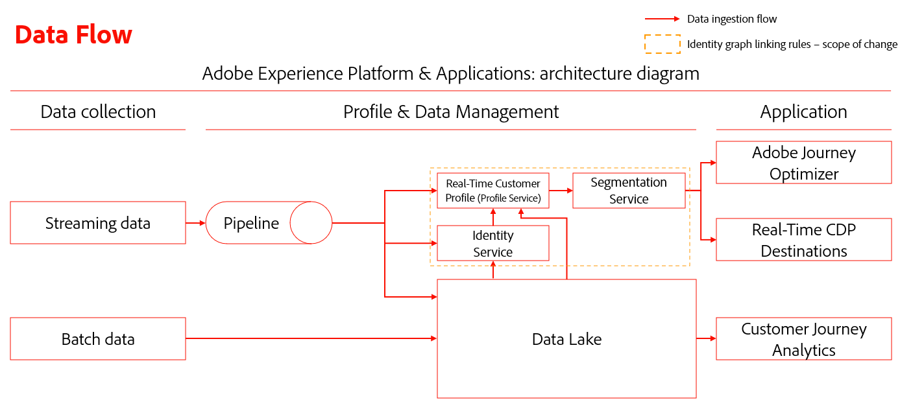

# Guia de solução de problemas para regras de vinculação de gráficos de identidade

>[!AVAILABILITY]
>
>O recurso Regras de vinculação do gráfico de identidade está atualmente na versão beta. Entre em contato com a equipe de conta do Adobe para obter informações sobre os critérios de participação. O recurso e a documentação estão sujeitos a alterações.

À medida que você testa e valida regras de vinculação de gráficos de identidade, pode ter alguns problemas relacionados à assimilação de dados e ao comportamento do gráfico. Leia este documento para saber como solucionar alguns problemas comuns que você pode encontrar ao trabalhar com regras de vinculação de gráficos de identidade.

## Visão geral do fluxo de assimilação de dados {#data-ingestion-flow-overview}

O diagrama a seguir é uma representação simplificada de como os dados fluem para o Adobe Experience Platform e os aplicativos. Use este diagrama como referência para ajudá-lo a entender melhor o conteúdo desta página.



É importante observar os seguintes fatores:

* Para dados de transmissão, o Perfil do cliente em tempo real, o Serviço de identidade e o data lake iniciarão o processamento dos dados quando os dados forem enviados. No entanto, a latência para concluir o processamento dos dados depende do serviço. Normalmente, o data lake levará um tempo maior para processar, em comparação ao Perfil e à Identidade.
   * Se os dados não aparecerem ao executar um query em um conjunto de dados mesmo após algumas horas, é provável que os dados não tenham sido assimilados no Experience Platform.
* Para dados em lote, todos os dados fluirão para o data lake primeiro e, em seguida, os dados serão propagados para o Perfil e a Identidade se o conjunto de dados estiver habilitado para Perfil e Identidade.
* Para problemas relacionados à assimilação, é importante que o problema seja isolado em um nível de serviço para uma depuração e solução de problemas precisas. Há três tipos de problemas em potencial a serem considerados:

| Tipo de problema de assimilação | Os dados são assimilados no data lake? | Os dados são assimilados no Perfil? | Os dados são assimilados no Serviço de identidade? |
| --- | --- | --- | --- |
| Problema geral de assimilação | Não | Não | Não |
| Problema de gráfico | Sim | Sim | Não |
| Problema de fragmento de perfil | Sim | Não | Sim |

## Problemas de assimilação de dados {#data-ingestion-issues}

>[!NOTE]
>
>* Esta seção presume que os dados foram assimilados com êxito no data lake e que não houve sintaxe ou outros erros que impediriam que os dados fossem assimilados no Experience Platform.
>
>* Os exemplos usam a ECID como o namespace do cookie e a CRMID como o namespace da pessoa.

### Minhas identidades não estão sendo assimiladas no Serviço de identidade{#my-identities-are-not-getting-ingested-into-identity-service}

Há várias razões pelas quais isso pode acontecer, incluindo, mas não limitado ao seguinte:

* [O conjunto de dados não está habilitado para o Perfil](../../catalog/datasets/enable-for-profile.md).
* O registro é ignorado porque há apenas uma identidade no evento.
* [Falha de validação no Serviço de Identidade](../guardrails.md#identity-value-validation).
   * Por exemplo, uma ECID pode ter excedido o comprimento máximo de 38 caracteres.
* Por padrão, [as AAIDs estão bloqueadas para assimilação](../guardrails.md#identity-namespace-ingestion).
* A identidade foi removida devido a [medidas de proteção do sistema](../guardrails.md#understanding-the-deletion-logic-when-an-identity-graph-at-capacity-is-updated).

No contexto das regras de vinculação de gráficos de identidade, um registro pode ser rejeitado do Serviço de identidade porque o evento de entrada tem duas ou mais identidades com o mesmo namespace exclusivo, mas com valor de identidade diferente. Esse cenário geralmente ocorre devido a erros de implementação.

Considere o seguinte evento com duas suposições:

* O nome de campo CRMID é marcado como uma identidade com o namespace CRMID.
* O namespace CRMID é definido como um namespace exclusivo.

O evento a seguir retornará uma mensagem de erro indicando que a assimilação falhou.

<!-- because the ingestion of this erroneous event would have resulted in graph collapse. In the following event, two entities (Alice and Bob) are both associated with the same namespace (CRMID). -->

```json
{ 
  "_id": "random_string", 
  "eventType": "web browsing event", 
  "identityMap": { 
    "ECID": [ 
      { 
        "id": "11111111111111111111111111111111111111", 
        "primary": false 
      } 
    ], 
    "CRMID": [ 
      { 
        "id": "Alice", 
        "primary": true 
      } 
    ] 
  }, 
  "CRMID": "Bob", 
  "timestamp": "2024-08-17T15:22:51+00:00", 
  "web": { 
    "webPageDetails": { 
      "URL": "https://www.adobe.com/acrobat.html", 
      "name": "Adobe Acrobat" 
    } 
  } 
} 
```

**Etapas de solução de problemas**

Para resolver esse erro, primeiro você deve coletar as seguintes informações:

* O valor de identidade (`identity_value`) que você esperava assimilar no gráfico de identidade.
* O conjunto de dados (`dataset_name`) no qual o evento foi enviado.

Em seguida, use o [Serviço de consulta do Adobe Experience Platform](../../query-service/home.md) e execute a seguinte consulta:

>[!TIP]
>
>Substitua `dataset_name` e `identity_value` pelas informações coletadas.

```sql
  SELECT key, col.id as identityValue, timestamp, _id, identityMap, * 
  FROM (SELECT key, explode(value), * 
  FROM (SELECT explode(identityMap), * 
  FROM dataset_name)) WHERE col.id = 'identity_value' 
```

Após executar a consulta, localize o registro de evento que você esperava gerar um gráfico e, em seguida, valide se os valores de identidade são diferentes na mesma linha. Veja a imagem a seguir para ver um exemplo:


>[!NOTE]
>
>Se as duas identidades forem exatamente as mesmas e se o evento for assimilado por transmissão, a Identidade e o Perfil desduplicarão a identidade.

### Meus fragmentos de evento de experiência não estão sendo assimilados no Perfil {#my-experience-event-fragments-are-not-getting-ingested-into-profile}

Há vários motivos que contribuem para que os fragmentos de evento de experiência não sejam assimilados no Perfil, incluindo, mas não limitados a:

* [O conjunto de dados não está habilitado para o Perfil](../../catalog/datasets/enable-for-profile.md).
* [Pode ter ocorrido uma falha de validação no Perfil](../../xdm/classes/experienceevent.md).
   * Por exemplo, um evento de experiência deve conter um `_id` e um `timestamp`.
   * Além disso, o `_id` deve ser exclusivo para cada evento (registro).

No contexto da prioridade de namespace, o Perfil rejeitará qualquer evento que contenha duas ou mais identidades com a maior prioridade de namespace. Por exemplo, se GAID não estiver marcada como um namespace exclusivo e duas identidades tiverem um namespace GAID e valores de identidade diferentes, o Perfil não armazenará nenhum dos eventos.

**Etapas de solução de problemas**

Para resolver esse erro, leia as etapas de solução de problemas descritas no guia acima em [solução de problemas de erros relacionados à não assimilação de dados no Serviço de Identidade](#my-identities-are-not-getting-ingested-into-identity-service).

### Os fragmentos de evento de minha experiência são assimilados, mas têm a identidade principal &quot;errada&quot; no perfil

A prioridade de namespace desempenha um papel importante em como os fragmentos de evento determinam a identidade principal.

* Depois de definir e salvar suas [configurações de identidade](./identity-settings-ui.md) para uma determinada sandbox, o Perfil usará a [prioridade de namespace](namespace-priority.md#real-time-customer-profile-primary-identity-determination-for-experience-events) para determinar a identidade principal. No caso de identityMap, o perfil não usará mais o sinalizador `primary=true`.
* Embora o Perfil não se refira mais a esse sinalizador, outros serviços no Experience Platform podem continuar a usar o sinalizador `primary=true`.

Para que [eventos de usuário autenticados](configuration.md#ingest-your-data) sejam vinculados ao namespace de pessoa, todos os eventos autenticados devem conter o namespace de pessoa (CRMID). Isso significa que mesmo depois que um usuário fizer logon, o namespace da pessoa ainda deverá estar presente em cada evento autenticado.

Você pode continuar a ver o sinalizador `primary=true` &#39;eventos&#39; ao pesquisar um perfil no visualizador de perfil. No entanto, isso é ignorado e não será usado pelo Perfil.

As AAIDs são bloqueadas por padrão. Portanto, se você estiver usando o [conector de origem do Adobe Analytics](../../sources/tutorials/ui/create/adobe-applications/analytics.md), certifique-se de que a ECID tenha uma prioridade maior do que a ECID, para que os eventos não autenticados tenham uma identidade principal de ECID.

**Etapas de solução de problemas**

* Para validar se os eventos autenticados contêm a pessoa e o namespace do cookie, leia as etapas descritas na seção sobre [solução de problemas de erros relacionados à não assimilação de dados no Serviço de Identidade](#my-identities-are-not-getting-ingested-into-identity-service).
* Para validar se os eventos autenticados têm a identidade principal do namespace de pessoa (por exemplo, CRMID), pesquise o namespace de pessoa no visualizador de perfil usando a política de mesclagem sem compilação (essa é a política de mesclagem que não usa gráfico privado). Esta pesquisa só retornará eventos associados ao namespace de pessoa.

## Problemas relacionados ao comportamento do gráfico {#graph-behavior-related-issues}

Esta seção descreve problemas comuns que podem ser encontrados em relação ao comportamento do gráfico de identidade.

### A identidade está sendo vinculada à pessoa &quot;errada&quot;

O algoritmo de otimização de identidade respeitará [os links estabelecidos mais recentemente e removerá os links mais antigos](./identity-optimization-algorithm.md#identity-optimization-algorithm-details). Portanto, é possível que, uma vez habilitado esse recurso, as ECIDs possam ser reatribuídas (vinculadas novamente) de uma pessoa a outra. Para entender o histórico de como uma identidade é vinculada ao longo do tempo, siga as etapas abaixo:

**Etapas de solução de problemas**

>[!NOTE]
>
>As etapas a seguir recuperarão informações sob as seguintes premissas:
>
>* Um único conjunto de dados está em uso (isso não consultará vários conjuntos de dados).
>
>* Os dados não foram excluídos do data lake devido à exclusão por [Advanced Data Lifecycle Management](../../hygiene/home.md), [Privacy Service](../../privacy-service/home.md) ou outros serviços que realizam a exclusão.

Primeiro, você deve coletar as seguintes informações:

* O símbolo de identidade (namespaceCode) do namespace de cookie (por exemplo, ECID) e o namespace de pessoa (por exemplo, CRMID) que foram enviados.
   * Para implementações do SDK da Web, geralmente esses são os namespaces incluídos no identityMap.
   * Para implementações do conector de origem do Analytics, esse é o identificador de cookie incluído no identityMap. O identificador de pessoa é um campo eVar marcado como uma identidade.
* O conjunto de dados em que o evento foi enviado (dataset_name).
* O valor de identidade do namespace do cookie a ser pesquisado (identity_value).

Os símbolos de identidade (namespaceCode) fazem distinção entre maiúsculas e minúsculas. Para recuperar todos os símbolos de identidade de um determinado conjunto de dados no identityMap, execute a seguinte consulta:

```sql
SELECT distinct explode(*)FROM (SELECT map_keys(identityMap) FROM dataset_name)
```

Se você não souber o valor de identidade do identificador de cookie e quiser procurar por uma ID de cookie que teria sido vinculada a vários identificadores de pessoa, será necessário executar a seguinte consulta. Essa consulta considera a ECID como o namespace do cookie e a CRMID como o namespace da pessoa.

>[!BEGINTABS]

>[!TAB Implementação do SDK da Web]

```sql
  SELECT identityMap['ECID'][0]['id'], count(distinct identityMap['CRMID'][0]['id']) as crmidCount FROM dataset_name GROUP BY identityMap['ECID'][0]['id'] ORDER BY crmidCount desc 
```

>[!TAB Implementação do conector de origem do Analytics]

```sql
  SELECT identityMap['ECID'][0]['id'], count(distinct personID) as crmidCount FROM dataset_name group by identityMap['ECID'][0]['id'] ORDER BY crmidCount desc 
```

**Observação:** personID refere-se ao caminho do descritor. Você pode encontrar essas informações em schemas.

>[!ENDTABS]

Em seguida, examine a associação do namespace do cookie em ordem de carimbo de data e hora, executando a seguinte query:

>[!BEGINTABS]

>[!TAB Implementação do SDK da Web]

```sql
  SELECT identityMap['CRMID'][0]['id'] as personEntity, * 
  FROM dataset_name 
  WHERE identitymap['ECID'][0].id ='identity_value' 
  ORDER BY timestamp desc 
```

>[!TAB Implementação do conector de origem do Analytics]

```sql
SELECT _experience.analytics.customDimensions.eVars.eVar10 as personEntity, * 
FROM dataset_name 
WHERE identitymap['ECID'][0].id ='identity_value' 
ORDER BY timestamp desc 
```

**Observação**: este exemplo pressupõe que `eVar10` está marcado como uma identidade. Para suas configurações, você deve alterar o eVar com base na implementação de sua própria organização.

>[!ENDTABS]

### O algoritmo de otimização de identidade não está &quot;funcionando&quot; como esperado

**Etapas de solução de problemas**

Consulte a documentação sobre o [algoritmo de otimização de identidade](./identity-optimization-algorithm.md), bem como os tipos de estruturas de gráfico com suporte.

* Leia o [guia de configuração de gráfico](./example-configurations.md) para ver exemplos de estruturas de gráfico com suporte.
* Você também pode ler o [guia de implementação](./configuration.md#appendix) para ver exemplos de estruturas de gráfico não suportadas. Há dois cenários que podem acontecer:
   * Nenhum namespace único em todos os perfis.
   * Ocorre um cenário de [&quot;ID pendente&quot;](./configuration.md#dangling-loginid-scenario). Nesse cenário, o Serviço de identidade não pode determinar se a ID pendente está associada a qualquer uma das entidades de pessoa nos gráficos.

Você também pode usar a [ferramenta de simulação de gráficos na interface](./graph-simulation.md) para simular eventos e definir suas próprias configurações de prioridade de namespace e namespace exclusivas. Isso pode ajudar a fornecer uma compreensão da linha de base de como o algoritmo de otimização de identidade deve se comportar.

Se os resultados da simulação corresponderem às expectativas de comportamento do gráfico, você poderá verificar se as [configurações de identidade](./identity-settings-ui.md) correspondem às configurações definidas na simulação.

### Ainda vejo gráficos recolhidos em minha sandbox, mesmo após definir as configurações de identidade

Os gráficos de identidade seguirão seu namespace exclusivo e sua prioridade de namespace configurados _após_ salvar as configurações. Quaisquer gráficos &quot;recolhidos&quot; existentes _antes_ de salvar suas novas configurações não serão afetados, até que novos dados sejam assimilados de modo que o gráfico recolhido seja atualizado. A identidade principal dos fragmentos de evento no Perfil de cliente em tempo real não será atualizada mesmo após as alterações de prioridade do namespace.

**Etapas de solução de problemas**

Você pode usar o [visualizador de gráficos de identidade](../features/identity-graph-viewer.md) para verificar se o gráfico foi assimilado antes ou depois das configurações. Examine o carimbo de data/hora atualizado pela última vez em [!UICONTROL Propriedades do link] para ver quando o Serviço de Identidade assimilou o gráfico. Se o carimbo de data e hora for anterior à configuração, isso sugere que o gráfico &quot;recolhido&quot; foi criado antes da ativação do recurso.


### Quero saber quantos gráficos &quot;recolhidos&quot; existem em minha sandbox

Use o painel de identidade para obter insights sobre o estado do gráfico de identidade, como a contagem de identidades e gráficos. Consulte a métrica &quot;Contagem de gráficos com vários namespaces&quot; para obter uma contagem de gráficos que foram recolhidos, ou seja, gráficos que contêm duas ou mais identidades com o mesmo namespace. Supondo que a sandbox não tenha dados e você tenha configurado um namespace (por exemplo, CRMID) para ser exclusivo, a expectativa é que haja zero gráficos que tenham dois ou mais CRMIDs. No exemplo abaixo, há dois gráficos que contêm dois ou mais endereços de email.


Você pode encontrar um detalhamento detalhado no [conjunto de dados de exportação de instantâneo de perfil](../../dashboards/query.md) no data lake executando a consulta abaixo:

>[!NOTE]
>
>* Substitua `dataset_name` pelo nome real do seu conjunto de dados.
>
>* As contagens podem não corresponder exatamente. O painel de identidade é baseado na contagem de gráficos de identidade e a consulta a seguir é baseada na contagem de perfis com duas ou mais identidades. Os dados são processados e atualizados de forma independente pelo serviço.

```sql
  SELECT key, identityCountInGraph, count(identityCountInGraph) as graphCount 
  FROM (SELECT key, cardinality(value) as identityCountInGraph 
  FROM (SELECT explode(identityMap) 
  FROM dataset_name 
  WHERE cardinality(identityMap) > 1)) /* by definition, graphs have 2 or more identities */ 
  WHERE key not in ('ecid', 'aaid', 'idfa', 'gaid') /* filter out common device/cookie namespaces */ 
  GROUP BY 1, 2 
  ORDER BY 1, 2 asc 
```

Você pode usar a seguinte consulta no conjunto de dados de exportação de instantâneo de perfil para obter identidades de amostra de gráficos &quot;recolhidos&quot;.

```sql
  SELECT identityMap 
  FROM dataset_name 
  WHERE cardinality(identityMap['CRMID'])>1 /* any graphs with 2+ CRMID. Change CRMID namespace if needed */ 
```

>[!TIP]
>
>As duas consultas listadas acima produzirão os resultados esperados se a sandbox não estiver habilitada para a abordagem temporária de dispositivo compartilhado e se comportará de forma diferente das regras de vinculação do gráfico de identidade.