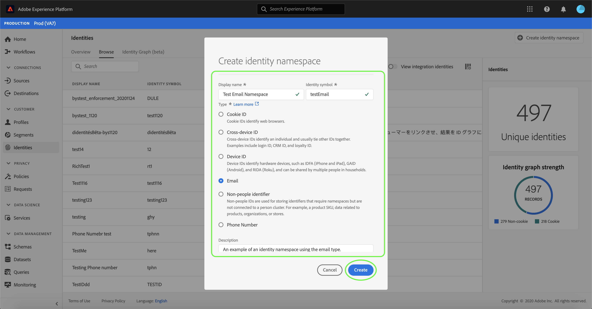

# Visão geral da namespace de identidade

As namespaces de identidade são um componente de [[!DNL Identity Service]](./home.md) que servem como indicadores do contexto ao qual uma identidade está relacionada. Por exemplo, eles distinguem um valor de &quot;name@email.com&quot; como um endereço de email ou &quot;443522&quot; como uma ID CRM numérica.

## Introdução

Trabalhar com namespaces de identidade requer uma compreensão dos vários serviços da Adobe Experience Platform envolvidos. Antes de começar a trabalhar com o namespace, consulte a documentação dos seguintes serviços:

- [[!DNL Real-time Customer Profile]](../profile/home.md): Fornece um perfil unificado e em tempo real para o cliente, com base em dados agregados de várias fontes.
- [[!DNL Identity Service]](./home.md): Obtenha uma melhor visualização de clientes individuais e de seu comportamento ao unir identidades entre dispositivos e sistemas.
- [[!DNL Privacy Service]](../privacy-service/home.md): As namespaces de identidade são usadas para cumprir o Regulamento Geral de Proteção de Dados (RGPD), onde os pedidos RGPD podem ser feitos em relação a uma namespace.

## Noções básicas sobre namespaces de identidade

Uma identidade totalmente qualificada inclui um valor de ID e uma namespace. Ao corresponder dados de registro em fragmentos de perfil, como quando [!DNL Real-time Customer Profile] une dados de perfil, o valor de identidade e a namespace devem corresponder.

Por exemplo, dois fragmentos de perfil podem conter IDs primárias diferentes, mas compartilham o mesmo valor para a namespace &quot;Email&quot;, portanto [!DNL Platform] é capaz de ver que esses fragmentos são realmente o mesmo indivíduo e reúne os dados no gráfico de identidade do indivíduo.

### Tipos de identidade

Os dados podem ser identificados por vários tipos de identidade diferentes. O tipo de identidade é especificado no momento em que a namespace de identidade é criada e controla se os dados são persistentes ou não para o gráfico de identidade e quaisquer instruções especiais sobre como esses dados devem ser tratados.

Os seguintes tipos de identidade estão disponíveis em [!DNL Platform]:

| Tipo de identidade | Descrição |
| --- | --- |
| ID de cookies | As IDs de cookie identificam os navegadores da Web. Essas identidades são críticas para a expansão e constituem a maioria do gráfico de identidade. No entanto, por natureza, eles caem rápido e perdem seu valor ao longo do tempo. |
| ID entre dispositivos | As IDs entre dispositivos identificam um indivíduo e normalmente vinculam outras IDs. Os exemplos incluem uma ID de logon, uma CRM ID e uma ID de fidelidade. Esta é uma indicação para [!DNL Identity Service] manipular o valor de forma sensível. |
| ID do dispositivo | As IDs de dispositivo identificam dispositivos de hardware, como IDFA (iPhone e iPad), GAID (Android) e RIDA (Roku), e podem ser compartilhadas por várias pessoas em residências. |
| Endereço de email | Os endereços de email são geralmente associados a uma única pessoa e, portanto, podem ser usados para identificá-la em canais diferentes. Identidades desse tipo incluem informações de identificação pessoal (PII). Esta é uma indicação para [!DNL Identity Service] manipular o valor de forma sensível. |
| Identificador de não pessoas | As IDs de não pessoas são usadas para armazenar identificadores que exigem namespaces, mas não estão conectadas a um cluster de pessoas. Por exemplo, um SKU de produto, dados relacionados a produtos, organizações ou lojas. |
| Número de telefone | Os números de telefone são frequentemente associados a uma única pessoa e, portanto, podem ser usados para identificá-la em canais diferentes. Identidades desse tipo incluem PII. Essa é uma indicação para [!DNL Identity Service] manipular o valor de forma sensível. |

### Namespaces padrão

O Experience Platform fornece várias namespaces de identidade que estão disponíveis para todas as organizações. Elas são conhecidas como namespaces padrão e são visíveis usando a API [!DNL Identity Service] ou por meio da interface do usuário da plataforma.

As seguintes namespaces padrão são fornecidas para uso por todas as organizações dentro da Plataforma:

| Nome de exibição | Descrição |
| ------------ | ----------- |
| AdCloud | Uma namespace que representa a Adobe AdCloud. |
| Adobe Analytics (ID herdada) | Uma namespace que representa o Adobe Analytics. Consulte o documento a seguir em [Adobe Analytics namespace](https://experienceleague.adobe.com/docs/analytics/admin/data-governance/gdpr-namespaces.html?lang=en#namespaces) para obter mais informações. |
| Apple IDFA (ID para anunciantes) | Uma namespace que representa a Apple ID para anunciantes. Consulte o documento a seguir em [anúncios baseados em juros](https://support.apple.com/en-us/HT202074) para obter mais informações. |
| Serviço de notificação por push da Apple | Uma namespace que representa identidades coletadas usando o serviço de Notificação por push da Apple. Consulte o seguinte documento em [Serviço de notificação por push da Apple](https://developer.apple.com/library/archive/documentation/NetworkingInternet/Conceptual/RemoteNotificationsPG/APNSOverview.html#//apple_ref/doc/uid/TP40008194-CH8-SW1) para obter mais informações. |
| CORE | Uma namespace que representa o Adobe Audience Manager. Essa namespace também pode ser chamada pelo nome herdado: &quot;Adobe AudienceManager&quot;. Consulte o documento a seguir em [Audience Manager IDs](https://experienceleague.adobe.com/docs/audience-manager/user-guide/overview/data-privacy/data-privacy-reference/data-privacy-ids.html?lang=en#aam-ids) para obter mais informações. |
| ECID | Uma namespace que representa a ECID. Essa namespace também pode ser chamada pelos seguintes aliases: &quot;Adobe Marketing Cloud ID&quot;, &quot;Adobe Experience Cloud ID&quot;, &quot;Adobe Experience Platform ID&quot;. Consulte o documento a seguir em [ECID](./ecid.md) para obter mais informações. |
| Email | Uma namespace que representa um endereço de email. Esse tipo de namespace é frequentemente associado a uma única pessoa e, portanto, pode ser usado para identificá-la em canais diferentes. |
| Emails (SHA256, em minúsculas) | Uma namespace para o endereço de email com hash prévio. Os valores fornecidos nesta namespace são convertidos em minúsculas antes de hash com SHA256. Os espaços à esquerda e à direita precisam ser eliminados antes que um endereço de email seja normalizado. Esta configuração não pode ser alterada retroativamente. Consulte o seguinte documento em [SHA256 hash support](https://experienceleague.adobe.com/docs/id-service/using/reference/hashing-support.html?lang=en#hashing-support) para obter mais informações. |
| Firebase Cloud Messaging | Uma namespace que representa identidades coletadas usando o Google Firebase Cloud Messaging para notificações por push. Consulte o documento a seguir em [Google Firebase Cloud Messaging](https://firebase.google.com/docs/cloud-messaging) para obter mais informações. |
| Google Ad ID (GAID) | Uma namespace que representa uma ID de anúncio do Google. Consulte o documento a seguir em [ID de publicidade do Google](https://support.google.com/googleplay/android-developer/answer/6048248?hl=en) para obter mais informações. |
| ID de clique do Google | Uma namespace que representa uma ID de clique do Google. Consulte o documento a seguir em [Clique em rastreamento no Google Ads](https://developers.google.com/adwords/api/docs/guides/click-tracking) para obter mais informações. |
| Telefone | Uma namespace que representa um número de telefone. Esse tipo de namespace é frequentemente associado a uma única pessoa e, portanto, pode ser usado para identificá-la em canais diferentes. |
| Telefone (E.164) | Uma namespace que representa números de telefone brutos que precisam ser atribuídos a hash no formato E.164. O formato E.164 inclui um sinal de mais (`+`), um código de chamada de país internacional, um código de área local e um número de telefone. Por exemplo: `(+)(country code)(area code)(phone number)`. |
| Telefone (SHA256) | Uma namespace que representa números de telefone que precisam ser hash usando SHA256. Você deve remover símbolos, letras e quaisquer zeros à esquerda. Você também deve adicionar o código de chamada do país como um prefixo. |
| Telefone (SHA256_E.164) | Uma namespace que representa números de telefone brutos que precisam ser hash usando os formatos SHA256 e E.164. |
| TNTID | Uma namespace que representa o Adobe Target. Consulte o documento a seguir em [Público alvo](https://experienceleague.adobe.com/docs/target/using/target-home.html?lang=en) para obter mais informações. |
| Windows AID | Uma namespace que representa uma ID de anúncio do Windows. Consulte o documento a seguir em [ID de publicidade do Windows](https://docs.microsoft.com/en-us/uwp/api/windows.system.userprofile.advertisingmanager.advertisingid?view=winrt-19041) para obter mais informações. |

Para visualização de namespaces padrão na interface do usuário, selecione **[!UICONTROL Identidades]** no painel de navegação esquerdo e selecione a guia **[!UICONTROL Procurar]** para exibir uma lista de namespaces de identidade padrão acessíveis à sua organização. Você pode classificar as namespaces em ordem alfabética usando o **[!UICONTROL Nome de exibição]**, **[!UICONTROL Símbolo de identidade]** ou **[!UICONTROL Proprietário]**. Como alternativa, você pode classificar as namespaces cronologicamente pela data de atualização mais recente.

Selecione uma namespace para ver informações mais específicas no painel direito.

>[!NOTE]
>
>A plataforma também fornece namespaces para fins de integração. Essas namespaces são ocultadas por padrão, pois são usadas para conexão com outros sistemas e não para unir identidades. Para visualização de namespaces de integração, selecione **[!UICONTROL identidades de integração de Visualização]**.

## Gerenciamento de namespaces personalizadas

Dependendo dos dados organizacionais e dos casos de uso, você pode precisar de namespaces personalizadas. Namespaces personalizadas podem ser criadas usando a API [[!DNL Identity Service]](./api/create-custom-namespace.md) ou por meio da interface do usuário.

Para criar uma namespace personalizada usando a interface do usuário, navegue até a área de trabalho **[!UICONTROL Identidades]**, selecione **[!UICONTROL Procurar]** e selecione **[!UICONTROL Criar namespace de identidade]**.

A caixa de diálogo **[!UICONTROL Criar namespace de identidade]** é exibida. Forneça um **[!UICONTROL Nome de exibição]** e **[!UICONTROL Símbolo de identidade]** exclusivos e selecione o tipo de identidade que deseja criar. Você também pode adicionar uma descrição opcional para obter mais informações sobre a namespace. Quando terminar, selecione **[!UICONTROL Criar]**.

>[!IMPORTANT]
>
>As namespaces que você definir são privadas para sua organização e exigem um símbolo de identidade exclusivo para serem criadas com êxito.

Semelhante às namespaces padrão, você pode selecionar uma namespace personalizada na guia **[!UICONTROL Procurar]** para visualização de seus detalhes. No entanto, com uma namespace personalizada, também é possível editar seu nome de exibição e sua descrição na área de detalhes.

>[!NOTE]
>
>Depois que uma namespace é criada, ela não pode ser excluída e seu símbolo de identidade e tipo não podem ser alterados.

## Namespaces nos dados de identidade

O fornecimento da namespace para uma identidade depende do método usado para fornecer dados de identidade. Para obter detalhes sobre como fornecer dados de identidade de dados, consulte a seção [fornecendo dados de identidade](./home.md#supplying-identity-data-to-identity-service) na visão geral [!DNL Identity Service].

## Próximas etapas

Agora que você entende os principais conceitos das namespaces de identidade, pode começar a aprender a trabalhar com seu gráfico de identidade usando o [visualizador de gráfico de identidade](./ui/identity-graph-viewer.md).
