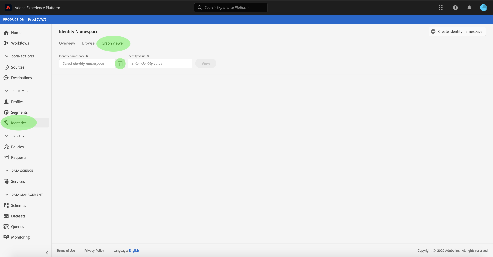

# (Beta) Visualizador de gráficos de identidade

>[!NOTE]
>
>O visualizador de gráficos de identidade está atualmente em beta. Seus recursos estão sujeitos a mudanças.

Um gráfico de identidade é um mapa de relacionamentos entre diferentes identidades para um cliente específico, fornecendo uma representação visual de como o cliente interage com sua marca em diferentes canais. Todos os gráficos de identidade do cliente são gerenciados e atualizados coletivamente pelo Adobe Experience Platform Identity Service em tempo quase real, em resposta à atividade do cliente.

O visualizador de gráficos de identidade na interface do usuário da Plataforma permite visualizar e entender melhor quais identidades de clientes são agrupadas e de que maneiras. O visualizador permite que você arraste e interaja com diferentes partes do gráfico, permitindo que você examine relações de identidade complexas, depure com mais eficiência e se beneficie de maior transparência com a forma como as informações estão sendo utilizadas.

## Introdução

Trabalhar com o visualizador de gráficos de identidade requer uma compreensão dos vários serviços da Adobe Experience Platform envolvidos. Antes de começar a trabalhar com o visualizador de gráficos de identidade, consulte a documentação dos seguintes serviços:

- [[!DNL Identity Service]](../home.md): Obtenha uma melhor visualização de clientes individuais e de seu comportamento ao unir identidades entre dispositivos e sistemas.

### Terminologia

- **Identidade (nó):** Uma identidade ou um nó são dados exclusivos de uma entidade, geralmente uma pessoa. Uma identidade é composta de uma namespace e um valor de identidade.
- **Link (borda):** Um link ou uma borda representa a conexão entre identidades.
- **Gráfico (cluster):** Um gráfico ou cluster é um grupo de identidades e links que representam uma pessoa.

## Acessar o visualizador de gráficos de identidade

Para usar o visualizador de gráfico de identidade na interface do usuário, selecione **[!UICONTROL Identidades]** na navegação à esquerda e selecione a guia Gráfico **[!UICONTROL de]** identidade. Na tela **[!UICONTROL Namespace]** de identidade, clique no ícone **[!UICONTROL Selecionar namespace]** de identidade para pesquisar a namespace que deseja usar.

O painel **[!UICONTROL Selecionar namespace]** de identidade é exibido. Esta tela contém uma lista de namespaces disponíveis para sua organização, incluindo informações sobre um nome **[!UICONTROL de]** exibição de namespace, símbolo **[!UICONTROL de]** identidade, **[!UICONTROL proprietário]**, data **[!UICONTROL da última atualização]** e **[!UICONTROL descrição]**. Você pode usar qualquer uma das namespaces fornecidas, desde que tenha um valor de identidade válido conectado a elas.

Selecione a namespace que deseja usar e clique em **[!UICONTROL Selecionar]** para prosseguir.

Depois de selecionar uma namespace, digite o valor correspondente para um cliente específico na caixa de texto Valor **[!UICONTROL de]** identidade e selecione **[!UICONTROL Visualização]**.

O visualizador de gráficos de identidade é exibido. No lado esquerdo da tela está o gráfico de identidade que exibe todas as identidades vinculadas à namespace selecionada e o valor de identidade inserido. Cada nó de identidade consiste em uma namespace e seu valor de ID correspondente. Você pode selecionar e manter qualquer identidade para arrastar e interagir com o gráfico. Como alternativa, você pode passar o mouse sobre uma identidade para ver informações sobre seu valor de ID. A saída do gráfico também é exibida como uma lista com guias no centro da tela.

>[!IMPORTANT]
>
>Um gráfico de identidade requer no mínimo duas identidades vinculadas para serem geradas, bem como uma namespace e um par de ID válidos. O número máximo de identidades que o visualizador de gráficos pode exibir é 400. See the [appendix](#appendix) section below for more information.

Selecione uma identidade para atualizar a linha realçada na tabela **[!UICONTROL Identidades]** e para atualizar as informações fornecidas no painel direito, que inclui um **[!UICONTROL Valor]** de identidade, ID **[!UICONTROL de]** lote e sua data **[!UICONTROL Última atualização]** .

É possível filtrar por um gráfico e isolar uma namespace específica usando a opção de classificação na parte superior da tabela **[!UICONTROL Identidades]** . No menu suspenso, selecione a namespace que deseja realçar.

O visualizador de gráficos retorna, destacando a namespace selecionada. A opção de filtro também atualiza a tabela **[!UICONTROL Identidades]** para retornar informações somente para a namespace selecionada.

A parte superior direita da caixa do visualizador de gráficos contém opções de ampliação. Selecione o ícone **(+)** para aplicar zoom no gráfico ou no ícone **(-)** para aplicar menos zoom.

Você pode visualização mais informações sobre lotes selecionando a fonte **[!UICONTROL de]** dados no cabeçalho. A tabela da fonte **[!UICONTROL de]** dados exibe uma lista de IDs **[!UICONTROL de]** lote associadas ao gráfico, bem como suas IDs **** vinculadas, o schema de origem e a data de ingestão.

Você pode selecionar qualquer um dos links em um gráfico de identidade para ver todos os lotes de origem que contribuíram para o link.

Como alternativa, você pode selecionar um lote para ver todos os links para os quais esse lote contribuiu.

Gráficos de identidade com grupos maiores de identidades também são acessíveis por meio do visualizador de gráficos de identidade.

## Apêndice

O visualizador de gráficos retornará um erro se os seguintes pré-requisitos não forem atendidos:

- O valor de identidade não existe na namespace selecionada.
- O gráfico tem menos de duas identidades.
- O gráfico excede o máximo de 400 identidades.
- Você está em um ambiente de caixa de proteção de não produção.

## Próximas etapas

Ao ler este documento, você aprendeu a explorar os gráficos de identidade de seus clientes na interface do usuário da plataforma. Para obter mais informações sobre identidades na plataforma, consulte a visão geral do Serviço de [identidade](../home.md)