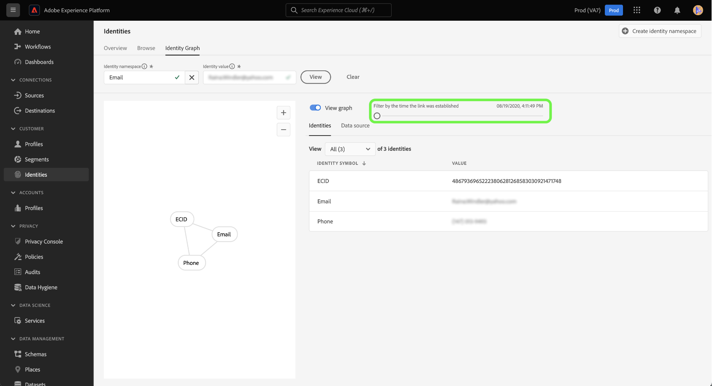

# Visualizador de gráfico de identidade

Um gráfico de identidade é um mapa de relacionamentos entre diferentes identidades para um cliente específico, fornecendo uma representação visual de como seu cliente interage com sua marca em diferentes canais. Todos os gráficos de identidade do cliente são gerenciados e atualizados coletivamente pelo Adobe Experience Platform Identity Service em tempo quase real, em resposta às atividades do cliente.

O visualizador de gráficos de identidade na interface do usuário da Platform permite visualizar e entender melhor quais identidades de cliente são unidas e de que maneiras. O visualizador permite que você arraste e interaja com diferentes partes do gráfico, permitindo examinar relacionamentos de identidade complexos, depurar com mais eficiência e aproveitar o aumento da transparência com a forma como as informações estão sendo utilizadas.

O documento a seguir fornece etapas sobre como acessar e usar o visualizador de gráficos de identidade na interface do usuário da plataforma.

## Tutorial em vídeo

O vídeo a seguir tem como objetivo oferecer suporte para a compreensão do visualizador de gráficos de identidade.

>[!VIDEO](https://video.tv.adobe.com/v/331030/?quality=12&learn=on)

## Introdução

Trabalhar com o visualizador de gráficos de identidade requer uma compreensão dos vários serviços da Adobe Experience Platform envolvidos. Antes de começar a trabalhar com o visualizador de gráficos de identidade, revise a documentação dos seguintes serviços:

- [[!DNL Identity Service]](../home.md): Obtenha uma melhor visão de clientes individuais e seu comportamento ao unir identidades em dispositivos e sistemas.
- [Perfil do cliente em tempo real](../../profile/home.md): Os gráficos de identidade são aproveitados pelo Perfil do cliente em tempo real para criar uma exibição abrangente e singular dos atributos e comportamento do cliente.

### Terminologia

- **Identidade (nó):** Uma identidade ou um nó são dados exclusivos de uma entidade, normalmente uma pessoa. Uma identidade é composta de um namespace de identidade e um valor de identidade. Por exemplo, uma identidade totalmente qualificada pode consistir em um namespace de identidade para **Email**, combinado com um valor de identidade de **robina@email.com**.
- **Link (borda):** Um link ou uma borda representa a conexão entre identidades. Os links de identidade incluem propriedades, como carimbos de data e hora estabelecidos pela primeira vez e atualizados pela última vez. O primeiro carimbo de data e hora estabelecido define a data e a hora em que uma nova identidade está vinculada a uma identidade existente. O último carimbo de data e hora atualizado define a data e a hora em que um link de identidade existente foi atualizado pela última vez.
- **Gráfico (cluster):** Um gráfico ou cluster é um grupo de identidades e links que representam uma pessoa.

## Acessar o visualizador de gráfico de identidade {#access-identity-graph-viewer}

Na interface do usuário da plataforma, selecione **[!UICONTROL Identidades]** na navegação à esquerda e selecione **[!UICONTROL Gráfico de identidade]** na lista de guias no cabeçalho.

Para exibir um gráfico de identidade, forneça um namespace de identidade e seu valor correspondente e selecione **[!UICONTROL Exibir]**.

>[!TIP]
>
>Selecione o ícone da tabela  para ver um painel com uma lista de todos os namespaces de identidade disponíveis na organização. Você pode usar qualquer um dos namespaces de identidade, desde que tenha um valor de identidade válido conectado a eles. Para obter mais informações, leia a [guia do namespace de identidade](../namespaces.md).

## Noções básicas da interface do visualizador do gráfico de identidade

A interface do visualizador do gráfico de identidade é composta de vários elementos que você pode usar para interagir e entender melhor seus dados de identidade.

O gráfico de identidade exibe todas as identidades vinculadas à combinação de namespace de identidade e valor inserida. Cada nó consiste em um namespace de identidade e seu valor correspondente. Você pode selecionar, segurar e arrastar qualquer nó para interagir com o gráfico. Como alternativa, você pode passar o mouse sobre um nó para ver informações sobre seu valor de identidade correspondente. Selecionar **[!UICONTROL Exibir gráfico]** para ocultar ou exibir o gráfico.

>[!IMPORTANT]
>
>Um gráfico de identidade requer no mínimo duas identidades vinculadas para serem geradas e um namespace de identidade e uma combinação de valor válidos. O número máximo de identidades que o visualizador de gráficos pode exibir é 150. Consulte a [apêndice](#appendix) para obter mais informações.

Selecione um link no gráfico para ver o conjunto de dados e a ID do lote que contribuem para esse link. A seleção de um link também atualiza o painel direito para fornecer mais informações sobre detalhes da fonte de dados, bem como propriedades como carimbos de data e hora estabelecidos pela primeira vez e atualizados pela última vez.

O [!UICONTROL Identidades] tabela fornece uma exibição diferente dos dados de identidade, listando o namespace de identidade e a combinação de valor de identidade em um formato tabular. Selecionar um nó no gráfico atualizará o item de linha realçado no [!UICONTROL Identidades] tabela.

Use o menu suspenso para classificar os dados do gráfico e destacar as informações sobre um namespace de identidade específico. Por exemplo, selecione **[!UICONTROL Email]** no menu para exibir dados específicos para o namespace da identidade do email.

O painel direito exibe informações sobre uma identidade selecionada, incluindo seu último carimbo de data e hora atualizado. O painel direito também exibe informações sobre a fonte de dados que corresponde à identidade selecionada, incluindo a ID do lote, o nome do conjunto de dados, a ID do conjunto de dados e o nome do esquema.

A tabela a seguir fornece informações adicionais sobre as propriedades da fonte de dados exibidas no painel direito:

| Fonte de dados | Descrição |
| --- | --- | 
| ID em lote | O identificador gerado automaticamente que corresponde aos dados do lote. |
| ID do conjunto de dados | O identificador gerado automaticamente que corresponde ao conjunto de dados. |
| Nome do conjunto de dados | O nome do conjunto de dados que contém seus dados em lote. |
| Nome do esquema | O nome do schema. O esquema fornece um conjunto de regras que representam e validam a estrutura e o formato dos dados. |

Também é possível usar a variável *[!UICONTROL Fonte de dados]* para ver uma lista de fontes de dados que contribuem para suas identidades. Selecionar [!UICONTROL Fonte de dados] para obter uma exibição em tabela de seus conjuntos de dados e IDs de lote.

Use o controle deslizante para filtrar os dados do gráfico pela primeira vez em que as identidades foram estabelecidas. Por padrão, o visualizador de gráficos de identidade exibe todas as identidades vinculadas ao gráfico. Mantenha pressionado e arraste o controle deslizante para ajustar a hora ao último carimbo de data e hora em que uma nova identidade foi vinculada ao gráfico. No exemplo abaixo, o gráfico exibe que o link de identidade mais recente (GAID) foi estabelecido em **[!UICONTROL 19/08/2020, 4:29:29:00]**.

Ajuste o controle deslizante para ver se outro link de identidade (Email) foi estabelecido em **[!UICONTROL 19/08/2020, 4:25:23:00]**.

Também é possível ajustar o controle deslizante para ver a iteração mais antiga do gráfico. No exemplo abaixo, o visualizador de gráficos de identidade exibe que o gráfico foi criado pela primeira vez em **[!UICONTROL 19/08/2020, 4:11:16:00]**, com seus primeiros links sendo ECID, Email e Telefone.

## Apêndice

A seção a seguir fornece informações adicionais para trabalhar com o visualizador de gráficos de identidade.

### Noções básicas sobre mensagens de erro

Podem ocorrer erros ao acessar o visualizador de gráficos de identidade. Esta é uma lista de pré-requisitos e limitações que devem ser levados em consideração ao trabalhar com o visualizador de gráficos de identidade.

- Um valor de identidade deve existir no namespace selecionado.
- O visualizador de gráficos de identidade requer no mínimo duas identidades vinculadas para serem geradas. É possível que haja apenas um valor de identidade e nenhuma identidade vinculada e, nesse caso, o valor só existiria em [!DNL Profile] visualizador.
- O visualizador de gráficos de identidade não pode exceder o máximo de 150 identidades.

### Acessar o visualizador de gráficos de identidade dos conjuntos de dados

Você também pode acessar o visualizador de gráficos de identidade usando a interface de conjuntos de dados do . Nos conjuntos de dados [!UICONTROL Procurar] selecione um conjunto de dados com o qual deseja interagir e selecione **[!UICONTROL Visualizar conjunto de dados]**

Na janela de visualização, selecione um ícone de impressão digital para ver as identidades representadas pelo visualizador de gráficos de identidade.

>[!TIP]
>
>O ícone de impressão digital só aparece se o conjunto de dados tiver duas ou mais identidades.

## Próximas etapas

Ao ler este documento, você aprendeu a explorar os gráficos de identidade de seus clientes na interface do usuário da plataforma. Para obter mais informações sobre identidades na Platform, consulte o [Visão geral do Serviço de identidade](../home.md)

## Changelog

| Data | Ação |
| ---- | ------ |
| 2021-01 | <ul><li>Adição de suporte para streaming de dados assimilados e sandbox de não produção.</li><li>Correção de erros secundários.</li></ul> |
| 2021-02 | <ul><li>O visualizador de gráficos de identidade é disponibilizado por meio da visualização de conjunto de dados.</li><li>Correção de erros secundários.</li><li>O visualizador de gráficos de identidade é disponibilizado Geralmente.</li></ul> |
| 2023-01 | <ul><li>Atualizações da interface do usuário.</li></ul> |
