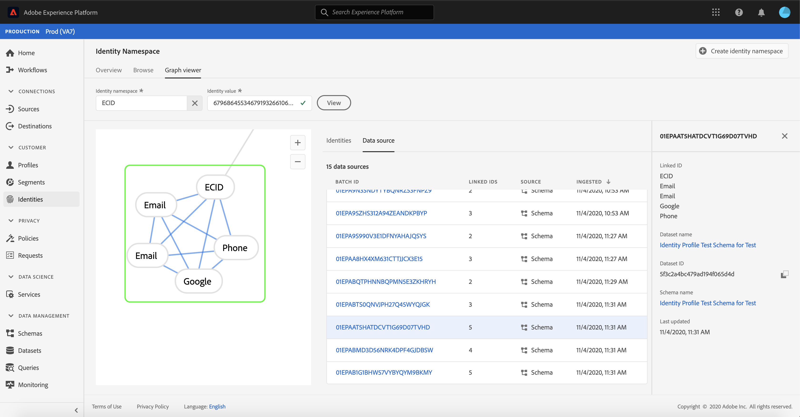

# Visão geral do visualizador de gráficos de identidade

Um gráfico de identidade é um mapa de relacionamentos entre diferentes identidades para um cliente específico, fornecendo uma representação visual de como seu cliente interage com sua marca em diferentes canais. Todos os gráficos de identidade do cliente são gerenciados e atualizados coletivamente pelo Adobe Experience Platform Identity Service em tempo quase real, em resposta às atividades do cliente.

O visualizador de gráficos de identidade na interface do usuário da Platform permite visualizar e entender melhor quais identidades de cliente são unidas e de que maneiras. O visualizador permite que você arraste e interaja com diferentes partes do gráfico, permitindo examinar relacionamentos de identidade complexos, depurar com mais eficiência e aproveitar o aumento da transparência com a forma como as informações estão sendo utilizadas.

## Vídeo de tutorial

O vídeo a seguir tem como objetivo oferecer suporte para a compreensão do visualizador de gráficos de identidade.

>[!VIDEO](https://video.tv.adobe.com/v/331030/?quality=12&learn=on)

## Introdução

Trabalhar com o visualizador de gráficos de identidade requer uma compreensão dos vários serviços da Adobe Experience Platform envolvidos. Antes de começar a trabalhar com o visualizador de gráficos de identidade, revise a documentação dos seguintes serviços:

- [[!DNL Identity Service]](../home.md): Obtenha uma melhor visão de clientes individuais e seu comportamento ao unir identidades em dispositivos e sistemas.

### Terminologia

- **Identidade (nó):** uma identidade ou um nó são dados exclusivos de uma entidade, normalmente uma pessoa. Uma identidade é composta de um namespace e um valor de identidade.
- **Link (edge):** um link ou uma borda representa a conexão entre identidades.
- **Gráfico (cluster):** um gráfico ou cluster é um grupo de identidades e links que representam uma pessoa.

## Acessar o visualizador de gráfico de identidade

Para usar o visualizador de gráficos de identidade na interface do usuário, selecione **[!UICONTROL Identities]** no painel de navegação esquerdo e selecione a guia **[!UICONTROL Identity graph]**. Na tela **[!UICONTROL Identity Namespace]**, clique no ícone **[!UICONTROL Select identity namespace]** para pesquisar o namespace que deseja usar.

O painel **[!UICONTROL Select identity namespace]** é exibido. Esta tela contém uma lista de namespaces disponíveis para sua organização, incluindo informações sobre **[!UICONTROL Display name]**, **[!UICONTROL Identity symbol]**, **[!UICONTROL Owner]**, **[!UICONTROL Last updated]** data e **[!UICONTROL Description]** de um namespace. Você pode usar qualquer um dos namespaces fornecidos, desde que tenha um valor de identidade válido conectado a eles.

Selecione o namespace que deseja usar e clique em **[!UICONTROL Select]** para prosseguir.

Depois de selecionar um namespace, insira o valor correspondente para um cliente específico na caixa de texto **[!UICONTROL Identity value]** e selecione **[!UICONTROL View]**.

### Acessar o visualizador de gráficos de identidade dos conjuntos de dados

Você também pode acessar o visualizador de gráficos de identidade usando a interface de conjuntos de dados do . Na página de conjuntos de dados [!UICONTROL Browse] , selecione um conjunto de dados com o qual deseja interagir e selecione **[!UICONTROL Preview dataset]**

Na janela de visualização, selecione um ícone de impressão digital para ver as identidades representadas pelo visualizador de gráficos de identidade.

>[!TIP]
>
>O ícone de impressão digital só aparece se o conjunto de dados tiver duas ou mais identidades.

O visualizador de gráficos de identidade é exibido. No lado esquerdo da tela, há o gráfico de identidade que exibe todas as identidades vinculadas ao namespace selecionado e o valor de identidade inserido. Cada nó de identidade consiste em um namespace e seu valor de ID correspondente. É possível selecionar e manter qualquer identidade para arrastar e interagir com o gráfico. Como alternativa, você pode passar o mouse sobre uma identidade para ver informações sobre seu valor de ID. A saída do gráfico também é exibida como uma lista com guias no centro da tela.

>[!IMPORTANT]
>
>Um gráfico de identidade requer no mínimo duas identidades vinculadas para serem geradas, bem como um namespace e um par de ID válidos. O número máximo de identidades que o visualizador de gráficos pode exibir é 150. Consulte a seção [Apêndice](#appendix) abaixo para obter mais informações.

Selecione uma identidade para atualizar a linha realçada na tabela **[!UICONTROL Identities]** e para atualizar as informações fornecidas no painel direito, que inclui **[!UICONTROL Value]**, **[!UICONTROL Batch ID]** e a data **[!UICONTROL Last updated]** de uma identidade.

Você pode filtrar por meio de um gráfico e isolar um namespace específico usando a opção de classificação na parte superior da tabela **[!UICONTROL Identities]**. No menu suspenso, selecione o namespace que deseja realçar.

O visualizador de gráfico retorna, destacando o namespace selecionado. A opção de filtro também atualiza a tabela **[!UICONTROL Identities]** para retornar informações somente para o namespace selecionado.

A parte superior direita da caixa do visualizador de gráficos contém opções de ampliação. Selecione o ícone **(+)** para aplicar zoom ao gráfico ou ao ícone **(-)** para diminuir o zoom.

Você pode exibir mais informações em lotes selecionando **[!UICONTROL Data source]** no cabeçalho. A tabela **[!UICONTROL Data source]** exibe uma lista de **[!UICONTROL Batch IDs]** associada ao gráfico, bem como seu **[!UICONTROL Linked IDs]**, o schema de origem e a data da assimilação.

Você pode selecionar qualquer um dos links em um gráfico de identidade para ver todos os lotes de origem que contribuíram para o link.

Como alternativa, você pode selecionar um lote para ver todos os links para os quais esse lote contribuiu.

Os gráficos de identidade com grupos maiores de identidades também são acessíveis por meio do visualizador de gráficos de identidade.

## Apêndice

A seção a seguir fornece informações adicionais para trabalhar com o visualizador de gráficos de identidade.

### Noções básicas sobre mensagens de erro

Podem ocorrer erros ao acessar o visualizador de gráficos de identidade. Esta é uma lista de pré-requisitos e limitações que devem ser levados em consideração ao trabalhar com o visualizador de gráficos de identidade.

- Um valor de identidade deve existir no namespace selecionado.
- O visualizador de gráficos de identidade requer no mínimo duas identidades vinculadas para serem geradas. É possível que haja apenas um valor de identidade e nenhuma identidade vinculada e, nesse caso, o valor só existiria no visualizador [!DNL Profile].
- O visualizador de gráficos de identidade não pode exceder o máximo de 150 identidades.

## Próximas etapas

Ao ler este documento, você aprendeu a explorar os gráficos de identidade de seus clientes na interface do usuário da plataforma. Para obter mais informações sobre identidades na Platform, consulte a [Visão geral do Serviço de identidade](../home.md)

## Changelog

| Data | Ação |
| ---- | ------ |
| 2021-01 | <ul><li>Adição de suporte para streaming de dados assimilados e sandbox de não produção.</li><li>Correção de erros secundários.</li></ul> |
| 2021-2002 | <ul><li>O visualizador de gráficos de identidade é disponibilizado por meio da visualização de conjunto de dados.</li><li>Correção de erros secundários.</li><li>O visualizador de gráficos de identidade é disponibilizado Geralmente.</li></ul> |
