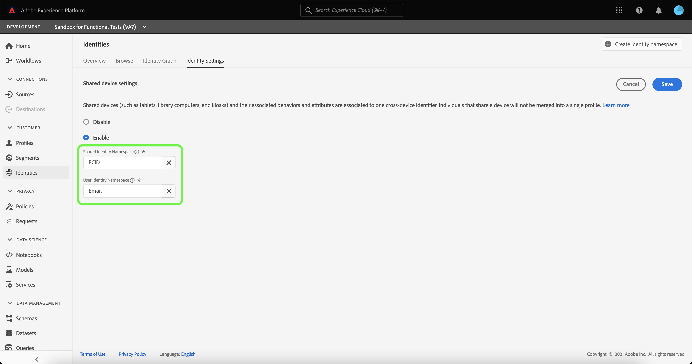

# Visão geral da detecção de dispositivo compartilhado (Beta)

>[!IMPORTANT]
>
>O [!DNL Shared Device Detection] está em beta. Seus recursos e documentação estão sujeitos a alterações.

Adobe Experience Platform [!DNL Identity Service] O ajuda você a obter uma melhor visão de seu cliente e de seu comportamento ao unir identidades em dispositivos e sistemas, permitindo que você forneça experiências digitais pessoais e impactantes em tempo real.

[!DNL Shared Device] refere-se aos dispositivos usados por mais de um indivíduo. Os exemplos de um dispositivo compartilhado incluem tablets, computadores de biblioteca e quiosques. Por meio da [!DNL Shared Device Detection] , usuários diferentes do mesmo dispositivo podem ser impedidos de serem mesclados em uma única identidade, permitindo uma representação mais precisa de um indivíduo.

Com [!DNL Shared Device Detection] é possível:

* Criar gráficos de identidade separados para diferentes utilizadores do mesmo dispositivo;
* Impedir a mistura de dados de indivíduos diferentes usando o mesmo dispositivo;
* Gere uma exibição mais limpa e precisa de seus clientes.

>[!TIP]
>
>Configurações para [!DNL Shared Device Detection] deve ser concluído antes de ativar o Perfil para o conjunto de dados, pois não é mais possível revisar as configurações depois que os gráficos forem gerados em [!DNL Identity Service].

## Introdução ao [!DNL Shared Device Detection]

Trabalhar com [!DNL Shared Device Detection] exige uma compreensão dos vários serviços da plataforma envolvidos. Antes de começar a trabalhar com a [!DNL Shared Device Detection], revise a documentação dos seguintes serviços:

* [[!DNL Identity Service]](../home.md): Obtenha uma melhor visão de clientes individuais e seu comportamento ao unir identidades em dispositivos e sistemas.
   * [Visualizador de gráfico de identidade](./identity-graph-viewer.md): Visualize e interaja com o visualizador de gráficos de identidade para entender melhor como as identidades do cliente são unidas e de que maneiras.
   * [Namespaces de identidade](../namespaces.md): Veja os componentes de uma identidade totalmente qualificada e como os namespaces de identidade permitem distinguir o contexto e o tipo de uma identidade.

## Noções básicas do [!DNL Shared Device Detection]

É importante entender a seguinte terminologia ao trabalhar com a
[!DNL Shared Device Detection]. Consulte a tabela abaixo para obter uma lista de termos essenciais para entender [!DNL Shared Device Detection].

### Terminologia

| Termos | Definição |
| --- | --- |
| Dispositivo compartilhado | Um dispositivo compartilhado é qualquer dispositivo usado por mais de um indivíduo. Os exemplos de dispositivos compartilhados incluem tablets, computadores de biblioteca e quiosques. |
| [!DNL Shared Device Detection] | [!DNL Shared Device Detection] refere-se a uma configuração que permite que dados de usuários diferentes do mesmo dispositivo sejam separados um do outro. |
| Namespace de identidade compartilhada | O Namespace de identidade compartilhada representa o dispositivo que pode ser usado por vários usuários. O Namespace de identidade compartilhada geralmente é a ECID, mas pode ser definido como outras IDs de dispositivo. |
| Namespace de identidade do usuário | O Namespace de identidade do usuário representa o usuário autenticado (conectado) de um dispositivo compartilhado. |
| Último usuário autenticado | O último usuário autenticado representa o usuário que fez logon por último em um dispositivo, se um dispositivo estiver sendo conectado por várias contas. |

{style=&quot;table-layout:auto&quot;}

[!DNL Shared Device Detection] O funciona estabelecendo dois namespaces: o **Namespace de identidade compartilhada** e **Namespace de identidade do usuário**.

* O Namespace de identidade compartilhada representa o dispositivo que pode ser usado por vários usuários. O Adobe recomenda que os clientes usem a ECID como o identificador de dispositivo compartilhado.
* O Namespace de identidade do usuário é mapeado para o namespace de identidade que corresponde à ID de logon de um usuário, pode ser uma ID de CRM do usuário, endereço de email, email com hash ou número de telefone.

Um dispositivo compartilhado, como um tablet, tem um único **Namespace de identidade compartilhada**. Por outro lado, cada usuário de um dispositivo compartilhado tem sua própria função designada **Namespace de identidade do usuário** que corresponde às respectivas IDs de logon. Por exemplo, um tablet que Kevin e Nora compartilham para uso de comércio eletrônico tem sua própria ECID de `1234`, enquanto Kevin tem seu próprio Namespace de identidade de usuário que está mapeado para ele `kevin@email.com` conta e Nora tem seu próprio Namespace de identidade de usuário mapeado para ela `nora@email.com` conta.

[!DNL Shared Device Detection] é capaz de fazer distinções entre vários usuários do mesmo dispositivo ao vincular o namespace de identidade compartilhada (por exemplo, ECID) com o último namespace de identidade de usuário autenticado (ID de logon).

### Como os dados de identidade são enviados para um gráfico de identidade

Considere o exemplo a seguir para ajudar a entender como [!DNL Shared Device Detection] funciona:

>[!NOTE]
>
>Nesse diagrama, o Namespace de identidade compartilhada é configurado para ECID e o Namespace de identidade do usuário é configurado para ID de CRM.

* Kevin e Nora compartilham um tablet para visitar um site de comércio eletrônico. No entanto, ambos têm as suas próprias contas independentes que cada um utiliza para procurar e fazer compras em linha;
   * Como um dispositivo compartilhado, o tablet tem uma ECID correspondente, que representa a ID do cookie do navegador da Web do tablet;
* Suponha que Kevin usa o tablet e **fazer logon** para sua conta de comércio eletrônico para procurar fones de ouvido, isso significa que a ID do CRM de Kevin (**Namespace de identidade do usuário**) agora está vinculada à ECID do tablet (**Namespace de identidade compartilhada**). Os dados de navegação do tablet agora são incorporados ao gráfico de identidade de Kevin.
   * Se Kevin **logout** e Nora usa o comprimido e **fazer logon** para sua própria conta e compra uma câmera, seu ID do CRM agora está vinculado ao ECID do tablet. Portanto, os dados de navegação do tablet agora são incorporados ao gráfico de identidade da Nora.
   * If Nora **não efetua logout** Kevin usa o tablet, mas... **não efetua logon**, os dados de navegação do tablet ainda são incorporados à Nora, pois ela permanece como o usuário autenticado e sua ID do CRM ainda está vinculada à ECID do tablet.
   * If Nora **faz logout** Kevin usa o tablet, mas... **não efetua logon**, então os dados de navegação do tablet ainda são incorporados ao gráfico de identidade da Nora, porque como **último usuário autenticado**, sua ID do CRM permanece vinculada à ECID do tablet.
   * Se Kevin **fazer logon** novamente, sua ID do CRM agora é vinculada ao ECID do tablet, pois ele agora é o último usuário autenticado e os dados de navegação do tablet agora são incorporados ao gráfico de identidade.

### How [!DNL Profile Service] mescla fragmentos de perfil com [!DNL Shared Device Detection] ativado

[!DNL Profile Service] toma nota dos fragmentos de perfil e dos perfis mesclados. Cada perfil de cliente individual é composto de vários fragmentos de perfil que foram mesclados para formar uma única visualização desse cliente. Por exemplo, se um cliente interagir com sua marca em vários canais, sua organização terá vários fragmentos de perfil relacionados a esse único cliente que aparece em vários conjuntos de dados. Quando esses fragmentos são assimilados na Platform, eles são mesclados para criar um único perfil para esse cliente.

When [!DNL Shared Device Detection] está ativado, [!DNL Profile] define a identidade primária do fragmento de perfil com base no fato de o evento de experiência ser autenticado ou não

Um **evento de experiência autenticada** é uma ação concluída por um usuário durante o logon em um dispositivo. Para eventos de experiência autenticados, a identidade primária é a variável **Namespace de identidade do usuário** (ID de logon). Um **evento de experiência não autenticado** é uma ação concluída por um usuário que não está conectado a um dispositivo. Para eventos de experiência não autenticados, a identidade primária é a variável **Namespace de identidade compartilhada** (ECID).

Para obter mais informações, consulte o  [[!DNL Real-time Customer Profile] visão geral](../../profile/home.md).

## Interface do usuário de dispositivos compartilhados

Na interface do usuário da plataforma, selecione **[!UICONTROL Identidades]** no menu de navegação esquerdo e selecione **[!UICONTROL Configurações de identidade]**.

O [!UICONTROL Configurações do dispositivo compartilhado] for exibida, fornecendo uma interface para definir as configurações do dispositivo compartilhado para seus dados. As configurações de dispositivo compartilhado são desabilitadas por padrão.

Quando ativadas, as configurações de dispositivo compartilhado permitem que os dados de usuários diferentes do mesmo dispositivo sejam separados um do outro. Essa configuração permite uma representação mais limpa e precisa dos gráficos de identidade, em que as identidades do usuário do mesmo dispositivo não são combinadas.

Selecionar **[!UICONTROL Habilitar]** para começar a modificar as configurações do dispositivo compartilhado.

O [!UICONTROL Namespace de identidade compartilhada] e [!UICONTROL Namespace de identidade do usuário] opções de configuração são exibidas, permitindo modificar os namespaces de identidade que deseja usar.

[!UICONTROL Namespace de identidade compartilhada] representa um único dispositivo que é usado por vários usuários diferentes. Este namespace é sempre definido como **[!UICONTROL ECID]** porque todos os usuários da plataforma usam **[!UICONTROL ECID]** como o identificador do navegador da Web.

O [!UICONTROL Namespace de identidade do usuário] O permite identificar usuários diferentes do mesmo dispositivo e impedir que os dados sejam combinados no mesmo gráfico de identidade.

Selecione o **[!UICONTROL Namespace de identidade do usuário]** barra de pesquisa e insira um namespace de identidade ou selecione um namespace de identidade no menu suspenso.

>[!TIP]
>
>O [!UICONTROL Namespace de identidade do usuário] deve ser mapeado para o namespace de identidade que corresponde à ID de logon do usuário final. As opções incluem ID do cliente, email e email com hash.

Depois de configurar o [!UICONTROL Configurações do dispositivo compartilhado], selecione **[!UICONTROL Salvar]**.

Uma janela pop-up é exibida, solicitando que você confirme sua seleção. Selecionar **[!UICONTROL Sim]** para concluir a configuração.

