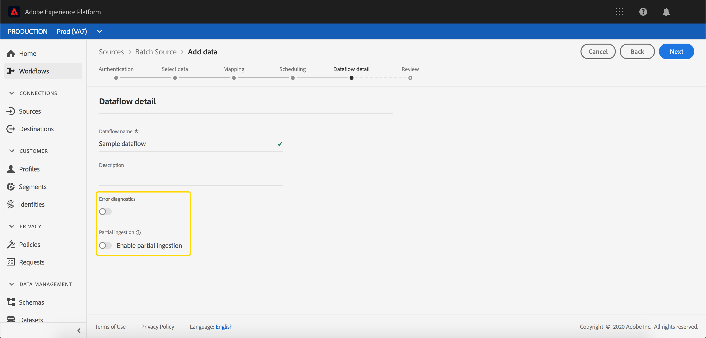
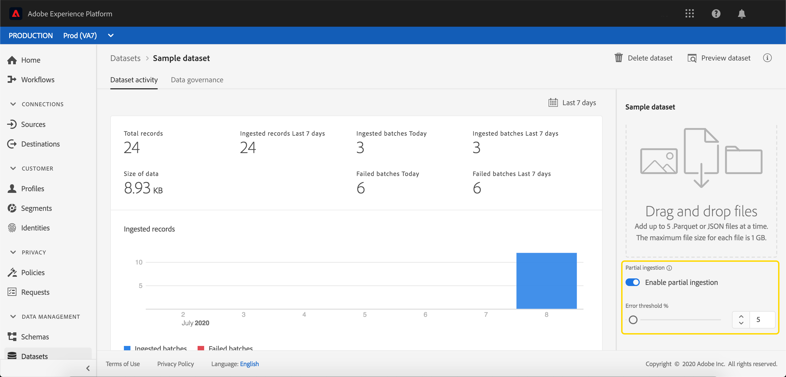

# Ingestão parcial por lote

A assimilação parcial em lote é a capacidade de assimilar dados que contêm erros, até um determinado limite. Com esse recurso, os usuários podem assimilar com êxito todos os dados corretos no Adobe Experience Platform, enquanto todos os dados incorretos são armazenados em lote separadamente, juntamente com detalhes sobre o motivo pelo qual são inválidos.

Este documento fornece um tutorial para gerenciar a assimilação parcial de lote.

## Introdução

Este tutorial requer um conhecimento prático dos vários serviços da Adobe Experience Platform envolvidos com a assimilação parcial em lote. Antes de iniciar este tutorial, reveja a documentação dos seguintes serviços:

- [Ingestão em lote](./overview.md): O método que [!DNL Platform] O assimila e armazena dados de arquivos de dados, como CSV e Parquet.
- [[!DNL Experience Data Model (XDM)]](../../xdm/home.md): O quadro normalizado pelo qual [!DNL Platform] organiza os dados de experiência do cliente.

As seções a seguir fornecem informações adicionais que você precisará saber para fazer chamadas para o [!DNL Platform] APIs.

### Lendo exemplos de chamadas de API

Este guia fornece exemplos de chamadas de API para demonstrar como formatar suas solicitações do . Isso inclui caminhos, cabeçalhos necessários e cargas de solicitação formatadas corretamente. O JSON de exemplo retornado nas respostas da API também é fornecido. Para obter informações sobre as convenções usadas na documentação para chamadas de API de exemplo, consulte a seção sobre [como ler exemplos de chamadas de API](../../landing/troubleshooting.md#how-do-i-format-an-api-request) no [!DNL Experience Platform] guia de solução de problemas.

### Coletar valores para cabeçalhos necessários

Para fazer chamadas para [!DNL Platform] As APIs devem ser concluídas primeiro [tutorial de autenticação](https://www.adobe.com/go/platform-api-authentication-en). A conclusão do tutorial de autenticação fornece os valores para cada um dos cabeçalhos necessários em todos [!DNL Experience Platform] Chamadas de API, conforme mostrado abaixo:

- Autorização: Portador `{ACCESS_TOKEN}`
- x-api-key: `{API_KEY}`
- x-gw-ims-org-id: `{ORG_ID}`

Todos os recursos em [!DNL Experience Platform] são isoladas em sandboxes virtuais específicas. Todas as solicitações para [!DNL Platform] As APIs exigem um cabeçalho que especifica o nome da sandbox em que a operação ocorrerá:

- x-sandbox-name: `{SANDBOX_NAME}`

>[!NOTE]
>
>Para obter mais informações sobre sandboxes em [!DNL Platform], consulte o [documentação de visão geral da sandbox](../../sandboxes/home.md).

## Habilitar um lote para assimilação parcial de lote na API {#enable-api}

>[!NOTE]
>
>Esta seção descreve como habilitar um lote para assimilação parcial de lote usando a API. Para obter instruções sobre como usar a interface do usuário, leia o [habilitar um lote para assimilação parcial de lote na interface do usuário](#enable-ui) etapa.

Você pode criar um novo lote com a assimilação parcial ativada.

Para criar um novo lote, siga as etapas em [guia do desenvolvedor de ingestão em lote](./api-overview.md). Depois de alcançar o **[!UICONTROL Criar lote]** adicione o seguinte campo no corpo da solicitação:

```json
{
    "enableErrorDiagnostics": true,
    "partialIngestionPercent": 5
}
```

| Propriedade | Descrição |
| -------- | ----------- |
| `enableErrorDiagnostics` | Um sinalizador que permite [!DNL Platform] para gerar mensagens de erro detalhadas sobre seu lote. |
| `partialIngestionPercent` | A porcentagem de erros aceitáveis antes que todo o lote falhe. Portanto, neste exemplo, um máximo de 5% do lote pode ser de erros, antes que falhe. |


## Habilitar um lote para assimilação parcial de lote na interface do usuário {#enable-ui}

>[!NOTE]
>
>Esta seção descreve como habilitar um lote para a assimilação em lote parcial usando a interface do usuário do . Se você já tiver ativado um lote para assimilação parcial de lote usando a API, poderá pular para a próxima seção.

Para permitir que um lote seja assimilado parcialmente por meio da [!DNL Platform] Na interface do usuário, você pode criar um novo lote por meio de conexões de origem, criar um novo lote em um conjunto de dados existente ou criar um novo lote por meio do &quot;[!UICONTROL Mapear o fluxo CSV para XDM]&quot;.

### Criar uma nova conexão de origem {#new-source}

Para criar uma nova conexão de origem, siga as etapas listadas no [Visão geral das fontes](../../sources/home.md). Depois de alcançar o **[!UICONTROL Detalhes do fluxo de dados]** , tome nota da **[!UICONTROL Ingestão parcial]** e **[!UICONTROL Diagnóstico de erros]** campos.



O **[!UICONTROL Ingestão parcial]** alternar permite ativar ou desativar o uso de assimilação de lote parcial.

O **[!UICONTROL Diagnóstico de erros]** alternar só aparece quando a variável **[!UICONTROL Ingestão parcial]** está desligado. Este recurso permite [!DNL Platform] para gerar mensagens de erro detalhadas sobre seus lotes assimilados. Se a variável **[!UICONTROL Ingestão parcial]** estiver ativada, os diagnósticos de erro aprimorados serão aplicados automaticamente.


O **[!UICONTROL Limite de erros]** permite definir a porcentagem de erros aceitáveis antes que todo o lote falhe. Por padrão, esse valor é definido como 5%.

### Usar um conjunto de dados existente {#existing-dataset}

Para usar um conjunto de dados existente, comece selecionando um conjunto de dados. A barra lateral à direita é preenchida com informações sobre o conjunto de dados.


O **[!UICONTROL Ingestão parcial]** alternar permite ativar ou desativar o uso de assimilação de lote parcial.

O **[!UICONTROL Diagnóstico de erros]** alternar só aparece quando a variável **[!UICONTROL Ingestão parcial]** está desligado. Este recurso permite [!DNL Platform] para gerar mensagens de erro detalhadas sobre seus lotes assimilados. Se a variável **[!UICONTROL Ingestão parcial]** estiver ativada, os diagnósticos de erro aprimorados serão aplicados automaticamente.



O **[!UICONTROL Limite de erros]** permite definir a porcentagem de erros aceitáveis antes que todo o lote falhe. Por padrão, esse valor é definido como 5%.

Agora, você pode fazer upload de dados usando o **Adicionar dados** e será assimilado usando a ingestão parcial.

### Use o &quot;[!UICONTROL Mapear CSV para esquema XDM]&quot; fluxo {#map-flow}

Para usar o &quot;[!UICONTROL Mapear CSV para esquema XDM]&quot;, siga as etapas listadas na [Tutorial de mapeamento de um arquivo CSV](../tutorials/map-a-csv-file.md). Depois de alcançar o **[!UICONTROL Adicionar dados]** , tome nota da **[!UICONTROL Ingestão parcial]** e **[!UICONTROL Diagnóstico de erros]** campos.


O **[!UICONTROL Ingestão parcial]** alternar permite ativar ou desativar o uso de assimilação de lote parcial.

O **[!UICONTROL Diagnóstico de erros]** alternar só aparece quando a variável **[!UICONTROL Ingestão parcial]** está desligado. Este recurso permite [!DNL Platform] para gerar mensagens de erro detalhadas sobre seus lotes assimilados. Se a variável **[!UICONTROL Ingestão parcial]** estiver ativada, os diagnósticos de erro aprimorados serão aplicados automaticamente.


**[!UICONTROL Limite de erros]** permite definir a porcentagem de erros aceitáveis antes que todo o lote falhe. Por padrão, esse valor é definido como 5%.

## Próximas etapas {#next-steps}

Este tutorial aborda como criar ou modificar um conjunto de dados para permitir a assimilação em lote parcial. Para mais informações sobre a ingestão de lote, leia o [guia do desenvolvedor de ingestão em lote](./api-overview.md).

Para obter informações sobre o monitoramento de erros de ingestão parcial, leia o [guia de diagnóstico de erro de ingestão em lote](../quality/error-diagnostics.md).
