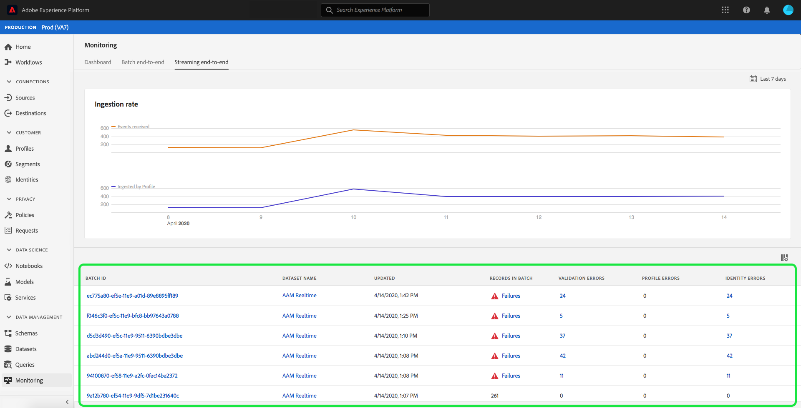

# Monitoramento da assimilação de dados

A assimilação de dados permite assimilar seus dados na Adobe Experience Platform. Você pode usar a assimilação em lote, que permite inserir os dados usando vários tipos de arquivo (como CSVs), ou a assimilação de streaming, que permite assimilar os dados no [!DNL Platform] uso de endpoints de transmissão em tempo real.

Este guia do usuário fornece etapas sobre como monitorar seus dados na interface do usuário do Adobe Experience Platform. Este guia requer uma Adobe ID e acesso ao Adobe Experience Platform.

## Monitore a assimilação de dados de ponta a ponta de fluxo {#monitor-streaming-end-to-end-data-ingestion}

>[!CONTEXTUALHELP]
>id="platform_ingestion_streaming_ingestionrate"
>title="Taxa de ingestão"
>abstract="O número de eventos processados com êxito por segundo."
>text="Learn more in the documentation"
>additional-url="http://www.adobe.com/go/monitor-dataflows-en" text="Monitorar fluxos de dados para fontes na interface do usuário"

>[!TIP]
>
>Para calcular o total de eventos em uma data específica, use a expressão de: `total events / day = ingestion rate * 60 * 60 * 24`.

No [Interface do usuário do Experience Platform](https://platform.adobe.com), selecione **[!UICONTROL Monitoramento]** no menu de navegação esquerdo, seguido por **[!UICONTROL Streaming completo]**.

O **[!UICONTROL Streaming completo]** página de monitoramento é exibida. Este espaço de trabalho fornece um gráfico que exibe a taxa de eventos transmitidos sendo recebidos por [!DNL Platform], um gráfico que exibe a taxa de eventos transmitidos que foram processados com êxito por [[!DNL Real-Time Customer Profile]](../../profile/home.md), bem como uma lista detalhada de dados de entrada.

Por padrão, o gráfico superior mostra a taxa de assimilação dos últimos sete dias. Esse intervalo de datas pode ser ajustado para mostrar vários períodos de tempo selecionando o botão destacado.

O gráfico inferior mostra a taxa de eventos transmitidos processados com êxito por [!DNL Profile] nos últimos sete dias. Esse intervalo de datas pode ser ajustado para mostrar vários períodos de tempo selecionando o botão destacado.

>[!NOTE]
>
>Para que os dados sejam exibidos nesse gráfico, os dados devem ser **explicitamente** habilitado para [!DNL Profile]. Para saber como habilitar os dados de transmissão para [!DNL Profile]leia a [guia do usuário de conjuntos de dados](../../catalog/datasets/user-guide.md#enable-a-dataset-for-real-time-customer-profile).

Abaixo dos gráficos está uma lista de todos os registros de assimilação de streaming que correspondem ao intervalo de datas exibido acima. Cada lote listado exibe sua ID, o nome do conjunto de dados, quando foi atualizado pela última vez, o número de registros no lote, bem como o número de erros (se houver). Você pode selecionar qualquer um dos registros para obter informações mais detalhadas sobre esse registro.

### Exibição de registros de transmissão

Ao visualizar os detalhes de um registro simplificado bem-sucedido, informações como o número de registros assimilados, o tamanho do arquivo e as horas de início e término da assimilação são mostradas.

Os detalhes de um registro de transmissão com falha exibem as mesmas informações de um registro bem-sucedido.

Além disso, registros com falha fornecem detalhes sobre os erros que ocorreram ao processar o lote. No exemplo abaixo, ocorreu um erro de análise ao converter ou validar os dados.

>[!NOTE]
>
>Se houver erros nas linhas assimiladas, essas linhas **not** será descartada, a menos que a mensagem resultante resulte em XDM inválido.

## Monitorar a assimilação de dados de ponta a ponta do lote

No [[!DNL Experience Platform UI]](https://platform.adobe.com), selecione **[!UICONTROL Monitoramento]** no menu de navegação esquerdo.

O **[!UICONTROL Lote completo]** página de monitoramento é exibida, exibindo uma lista dos lotes assimilados anteriormente. Você pode selecionar qualquer um dos lotes para obter informações mais detalhadas sobre esse registro.

### Exibindo lotes

Ao visualizar os detalhes de um lote bem-sucedido, informações como o número de registros assimilados, o tamanho do arquivo e as horas de início e término da assimilação são mostradas.

Os detalhes de um lote com falha exibem as mesmas informações de um lote bem-sucedido, com a adição do número de registros com falha.

Além disso, os lotes com falha fornecem detalhes sobre os erros que ocorreram durante o processamento do lote. No exemplo abaixo, ocorreu um erro com o lote assimilado porque ele tem o número máximo de identidades da pessoa.

>[!NOTE]
>
>Se houver erros nas linhas assimiladas, essas linhas **not** será descartada, a menos que a mensagem resultante resulte em XDM inválido.

