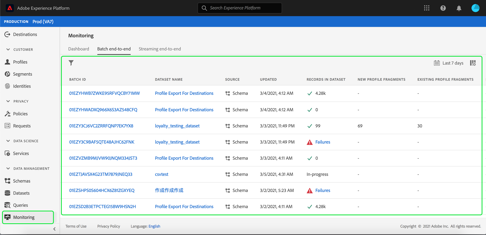

# Monitoramento da ingestão de dados

A assimilação de dados permite assimilar seus dados na Adobe Experience Platform. Você pode usar a assimilação em lote, que permite inserir seus dados usando vários tipos de arquivos (como CSVs), ou a assimilação por streaming, que permite assimilar seus dados no [!DNL Experience Platform] usando pontos de extremidade de streaming em tempo real.

Este guia do usuário fornece etapas sobre como monitorar seus dados na interface do usuário do Adobe Experience Platform. Este guia requer que você tenha uma Adobe ID e acesso ao Adobe Experience Platform.

## Monitorar a ingestão de dados na transmissão de ponta a ponta {#monitor-streaming-end-to-end-data-ingestion}

>[!CONTEXTUALHELP]
>id="platform_ingestion_streaming_ingestionrate"
>title="Taxa de ingestão"
>abstract="O número de eventos processados com êxito por segundo."
>text="Learn more in the documentation"
>additional-url="https://experienceleague.adobe.com/docs/experience-platform/dataflows/ui/monitor-sources.html?lang=pt-BR" text="Monitorar fluxos de dados de fontes na interface"

>[!TIP]
>
>Para calcular o total de eventos em uma data específica, use a expressão de: `total events / day = ingestion rate * 60 * 60 * 24`.

Na [Interface do usuário do Experience Platform](https://platform.adobe.com), selecione **[!UICONTROL Monitoring]** no menu de navegação esquerdo, seguido por **[!UICONTROL Streaming end-to-end]**.

A página de monitoramento **[!UICONTROL Streaming end-to-end]** é exibida. Este espaço de trabalho fornece um gráfico que mostra a taxa de eventos transmitidos que estão sendo recebidos por [!DNL Experience Platform], um gráfico que mostra a taxa de eventos transmitidos que foram processados com êxito por [[!DNL Real-Time Customer Profile]](../../profile/home.md), bem como uma lista detalhada de dados recebidos.

Por padrão, o gráfico superior mostra a taxa de assimilação nos últimos sete dias. Esse intervalo de datas pode ser ajustado para mostrar vários períodos selecionando o botão realçado.

O gráfico inferior mostra a taxa de eventos transmitidos processados com êxito por [!DNL Profile] nos últimos sete dias. Esse intervalo de datas pode ser ajustado para mostrar vários períodos selecionando o botão realçado.

>[!NOTE]
>
>Para que os dados sejam exibidos neste gráfico, os dados devem ser **explicitamente** habilitados para [!DNL Profile]. Para saber como habilitar a transmissão de dados para [!DNL Profile], leia o [guia do usuário de conjuntos de dados](../../catalog/datasets/user-guide.md#enable-a-dataset-for-real-time-customer-profile).

Abaixo dos gráficos há uma lista de todos os registros de assimilação de fluxo que correspondem ao intervalo de datas exibido acima. Cada lote listado exibe sua ID, o nome do conjunto de dados, quando foi atualizado pela última vez, o número de registros no lote, bem como o número de erros (se houver). Você pode selecionar qualquer um dos registros para obter informações mais detalhadas sobre esse registro.

### Exibição de registros de transmissão

Ao visualizar os detalhes de um registro transmitido com êxito, informações como o número de registros assimilados, o tamanho do arquivo e as horas inicial e final de assimilação são mostradas.

Os detalhes de um registro de transmissão com falha exibem as mesmas informações de um registro bem-sucedido.

Além disso, os registros com falha fornecem detalhes sobre os erros ocorridos durante o processamento do lote. No exemplo abaixo, ocorreu um erro de análise ao converter ou validar os dados.

>[!NOTE]
>
>Se houver erros nas linhas assimiladas, essas linhas **não** serão descartadas, a menos que a mensagem resultante resulte em um XDM inválido.

## Monitorar a assimilação completa de dados em lote

No [[!DNL Experience Platform UI]](https://platform.adobe.com), selecione **[!UICONTROL Monitoring]** no menu de navegação esquerdo.

A página de monitoramento **[!UICONTROL Batch end-to-end]** é exibida, exibindo uma lista dos lotes assimilados anteriormente. Você pode selecionar qualquer um dos lotes para obter informações mais detalhadas sobre esse registro.

### Exibição de lotes

Ao visualizar os detalhes de um lote bem-sucedido, são mostradas informações como o número de registros assimilados, o tamanho do arquivo e os horários de início e término da assimilação.

Os detalhes de um lote com falha exibem as mesmas informações de um lote bem-sucedido, com a adição do número de registros com falha.

Além disso, os lotes com falha fornecem detalhes sobre os erros que ocorreram durante o processamento do lote. No exemplo abaixo, houve um erro com o lote assimilado porque ele tem o número máximo de identidades para a pessoa.

>[!NOTE]
>
>Se houver erros nas linhas assimiladas, essas linhas **não** serão descartadas, a menos que a mensagem resultante resulte em um XDM inválido.

