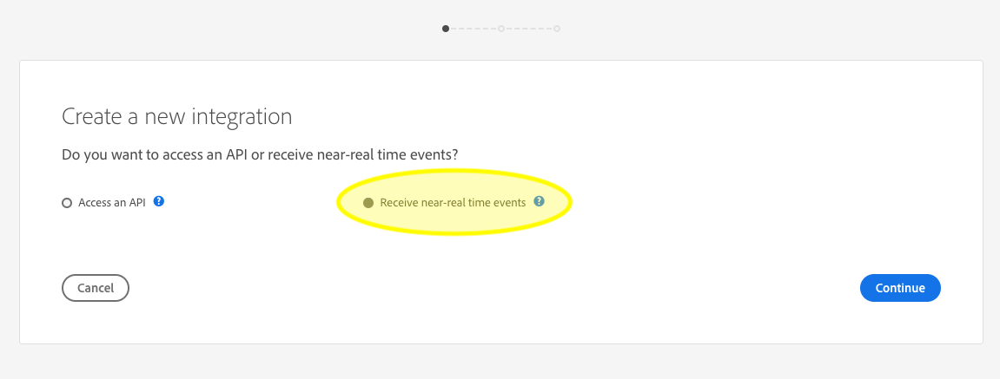

# Notificações de ingestão de dados

O processo de assimilação de dados na Adobe Experience Platform é composto de várias etapas. Após identificar os arquivos de dados que precisam ser ingeridos na Plataforma, o processo de ingestão é iniciado e cada etapa ocorre consecutivamente até que os dados sejam ingeridos com êxito ou falhem. O processo de ingestão pode ser iniciado usando a API [de ingestão de dados da plataforma](https://www.adobe.io/apis/experienceplatform/home/api-reference.html#!acpdr/swagger-specs/ingest-api.yaml) Adobe Experience ou a interface do usuário da plataforma Experience.

Os dados carregados na plataforma devem percorrer várias etapas para chegar ao destino, ao Data Lake ou ao armazenamento de dados do Perfil do cliente em tempo real. Cada etapa envolve o processamento dos dados, a validação dos dados e o armazenamento dos dados antes de passá-los para a próxima etapa. Dependendo da quantidade de dados que está sendo ingerida, isso pode se tornar um processo demorado e sempre há uma chance de o processo falhar devido a erros de validação, semântica ou processamento. No evento de uma falha, os problemas de dados precisam ser corrigidos e todo o processo de ingestão deve ser reiniciado usando os arquivos de dados corrigidos.

Para auxiliar no monitoramento do processo de ingestão, a Plataforma de experiência permite a assinatura de um conjunto de eventos publicados em cada etapa do processo, notificando o status dos dados ingeridos e as possíveis falhas.

## eventos de notificação de status disponíveis

Abaixo está uma lista de notificações de status de ingestão de dados disponíveis que podem ser assinadas.

>[!NOTE] Há apenas um tópico de evento fornecido para todas as notificações de ingestão de dados. Para distinguir entre diferentes status, é possível usar o código do evento.

| Serviço de plataforma | Status | Descrição do Evento | Código do Evento |
| ---------------- | ------ | ----------------- | ---------- |
| Aterrissagem de dados | success | Ingestão - lote bem-sucedido | ing_load_success |
| Aterrissagem de dados | falha | Ingestão - Falha no lote | ing_load_failure |
| Perfil do cliente em tempo real | success | Serviço de Perfil - Lote de carregamento de dados bem-sucedido | ps_load_success |
| Perfil do cliente em tempo real | falha | Serviço de Perfil - Falha no lote de carregamento de dados | ps_load_failure |
| Gráfico de identidade | success | Gráfico de identidade - lote de carregamento de dados bem-sucedido | ig_load_success |
| Gráfico de identidade | falha | Gráfico de identidade - Falha no lote de carregamento de dados | ig_load_failure |

## schema de carga de notificação

O schema de evento de notificação de ingestão de dados é um schema do Modelo de Dados de Experiência (XDM) que contém campos e valores que fornecem detalhes sobre o status dos dados que estão sendo assimilados. Visite o repo XDM GitHub público para visualização do schema [de carga de](https://github.com/adobe/xdm/blob/master/schemas/common/notifications/ingestion.schema.json)notificação mais recente.

## Assinar notificações de status de ingestão de dados

Por meio de Eventos [de E/S da](https://www.adobe.io/apis/experienceplatform/events.html)Adobe, você pode assinar vários tipos de notificação usando webhooks. Para saber mais sobre webhooks e como assinar Eventos de E/S da Adobe usando webhooks, consulte o guia de [introdução aos Eventos de E/S da Adobe Webhooks](https://www.adobe.io/apis/experienceplatform/events/docs.html#!adobedocs/adobeio-events/master/intro/webhook_docs_intro.md) .

### Criar uma nova integração usando o Console de E/S da Adobe

Faça logon no Console [de E/S da](https://console.adobe.io/home) Adobe e clique na guia *Integrações* ou clique em **Criar integração** em Start rápido. Quando a tela *Integração* for exibida, clique em **Nova integração** para criar uma nova integração.


A tela *Criar nova integração* é exibida. Selecione **Receber quase-eventos em tempo real** e clique em **Continuar**.



A próxima tela fornece opções para criar integrações com diferentes eventos, produtos e serviços disponíveis para sua organização com base em suas subscrições, direitos e permissões. Para essa integração, selecione Notificações **de** plataforma em Plataforma de experiência e clique em **Continuar**.


O formulário Detalhes *da* integração é exibido, exigindo que você forneça um nome e uma descrição para a integração, bem como um certificado de chave pública.

Se você não tiver um certificado público, poderá gerar um no terminal usando o seguinte comando:

```shell
openssl req -x509 -sha256 -nodes -days 365 -newkey rsa:2048 -keyout private.key -out certificate_pub
```

Depois de gerar um certificado, arraste e solte o arquivo na caixa Certificados **de chaves** públicas ou clique em **Selecionar um arquivo** para navegar pelo diretório de arquivos e selecionar o certificado diretamente.

Após adicionar o certificado, a opção Registro *do* Evento é exibida. Clique em **Adicionar registro** de Evento.


A caixa de diálogo de detalhes *de registro do* Evento é expandida para mostrar controles adicionais. Aqui você pode selecionar seus tipos de evento desejados e registrar seu webhook. Insira um nome para o registro do evento, o URL do webhook *(Opcional)*, bem como uma breve descrição. Por fim, selecione os tipos de evento que deseja assinar (notificação de ingestão de dados) e clique em **Salvar**.


## Próximas etapas

Depois de criar sua integração de E/S, você poderá visualização as notificações recebidas para essa integração. Consulte o guia de Eventos [de E/S da Adobe para](https://www.adobe.io/apis/experienceplatform/events/docs.html#!adobedocs/adobeio-events/master/support/tracing.md) rastreamento para obter instruções detalhadas sobre como rastrear seus eventos.
