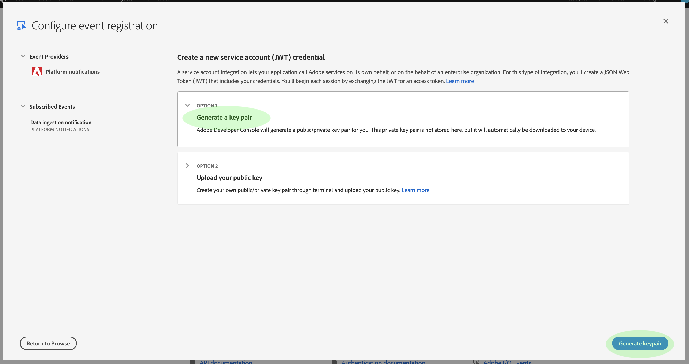

# Notificações de ingestão de dados

O processo de assimilação de dados no Adobe Experience Platform é composto de várias etapas. Depois que você identificar os arquivos de dados que precisam ser ingeridos, o processo de ingestão será iniciado e cada etapa ocorrerá consecutivamente até que os dados sejam ingeridos com êxito ou falhem. [!DNL Platform] O processo de ingestão pode ser iniciado usando a API [de ingestão de dados da](https://www.adobe.io/apis/experienceplatform/home/api-reference.html#!acpdr/swagger-specs/ingest-api.yaml) Adobe Experience Platform ou a interface do [!DNL Experience Platform] usuário.

Os dados carregados em [!DNL Platform] devem passar por várias etapas para chegar ao destino, ao local [!DNL Data Lake] ou ao [!DNL Real-time Customer Profile] armazenamento de dados. Cada etapa envolve o processamento dos dados, a validação dos dados e o armazenamento dos dados antes de passá-los para a próxima etapa. Dependendo da quantidade de dados que está sendo ingerida, isso pode se tornar um processo demorado e sempre há uma chance de o processo falhar devido a erros de validação, semântica ou processamento. No evento de uma falha, os problemas de dados precisam ser corrigidos e todo o processo de ingestão deve ser reiniciado usando os arquivos de dados corrigidos.

Para auxiliar no monitoramento do processo de ingestão, [!DNL Experience Platform] torna possível assinar um conjunto de eventos publicados em cada etapa do processo, notificando o status dos dados ingeridos e de possíveis falhas.

## Eventos de notificação de status disponíveis

Abaixo está uma lista de notificações de status de ingestão de dados disponíveis que podem ser assinadas.

>[!NOTE]
>
>Há apenas um tópico de evento fornecido para todas as notificações de ingestão de dados. Para distinguir entre diferentes status, é possível usar o código do evento.

| Serviço de plataforma | Status | Descrição do Evento | Código do evento |
| ---------------- | ------ | ----------------- | ---------- |
| Aterrissagem de dados | success | Ingestão - lote bem-sucedido | ing_load_success |
| Aterrissagem de dados | falha | Ingestão - Falha no lote | ing_load_failure |
| Perfil do cliente em tempo real | success | Serviço de perfil - Lote de carregamento de dados bem-sucedido | ps_load_success |
| Perfil do cliente em tempo real | falha | Serviço de perfil - Falha no lote de carregamento de dados | ps_load_failure |
| Gráfico de identidade | success | Gráfico de identidade - lote de carregamento de dados bem-sucedido | ig_load_success |
| Gráfico de identidade | falha | Gráfico de identidade - Falha no lote de carregamento de dados | ig_load_failure |

## Schema de carga de notificação

O schema de evento de notificação de ingestão de dados é um schema [!DNL Experience Data Model] (XDM) que contém campos e valores que fornecem detalhes sobre o status dos dados que estão sendo assimilados. Visite o [!DNL GitHub] acordo público XDM para visualização do schema [de carga de](https://github.com/adobe/xdm/blob/master/schemas/notifications/ingestion.schema.json)notificação mais recente.

## Assinar notificações de status de ingestão de dados

Por meio de Eventos [de E/S de](https://www.adobe.io/apis/experienceplatform/events.html)Adobe, você pode assinar vários tipos de notificação usando webhooks. As seções abaixo descrevem as etapas para a inscrição em [!DNL Platform] notificações de eventos de ingestão de dados usando o Console do desenvolvedor do Adobe.

### Criar um novo projeto no Console do desenvolvedor do Adobe

Vá para o [Adobe Developer Console](https://www.adobe.com/go/devs_console_ui) e faça logon com seu Adobe ID. Em seguida, siga as etapas descritas no tutorial sobre como [criar um projeto](https://www.adobe.io/apis/experienceplatform/console/docs.html#!AdobeDocs/adobeio-console/master/projects-empty.md) vazio na documentação do Console do desenvolvedor do Adobe.

### Adicionar [!DNL Experience Platform] eventos ao projeto

Depois de criar um novo projeto, navegue até a tela de visão geral do projeto. Aqui, clique em **[!UICONTROL Adicionar evento]**.

A caixa de diálogo _[!UICONTROL Adicionar eventos]_ é exibida. Clique em **[!UICONTROL Experience Platform]** para filtrar a lista de opções disponíveis e, em seguida, clique em Notificações **[!UICONTROL de]** plataforma antes de clicar em **[!UICONTROL Avançar]**.

A tela seguinte exibe uma lista de tipos de evento para assinar. Selecione Notificação **[!UICONTROL de ingestão de]** dados e clique em **[!UICONTROL Avançar]**.

A tela seguinte solicita que você crie um JSON Web Token (JWT). Você tem a opção de gerar automaticamente um par de chaves ou fazer upload de sua própria chave pública gerada no terminal.

Para os fins deste tutorial, a primeira opção é seguida. Clique na caixa de opção para **[!UICONTROL Gerar um par]** de teclas e clique no botão **[!UICONTROL Gerar par]** de teclas no canto inferior direito.

Quando o par de chaves é gerado, ele é baixado automaticamente pelo navegador. Você mesmo deve armazenar esse arquivo, pois ele não é persistente no Developer Console.

A próxima tela permite que você analise os detalhes do par de chaves recém-gerado. Clique em **[!UICONTROL Avançar]** para continuar.

Na tela seguinte, forneça um nome e uma descrição para o registro do evento. A prática recomendada é criar um nome exclusivo e facilmente identificável para ajudar a diferenciar esse registro de eventos de outros no mesmo projeto.

Mais adiante na mesma tela, você pode configurar opcionalmente como receber eventos. **[!UICONTROL O Webhook]** permite que você forneça um endereço de webhook personalizado para receber eventos, enquanto a ação **[!UICONTROL do]** Runtime permite que você faça o mesmo usando o [Adobe I/O Runtime](https://www.adobe.io/apis/experienceplatform/runtime/docs.html).

Este tutorial ignora esta etapa de configuração opcional. Quando terminar, clique em **[!UICONTROL Salvar eventos]** configurados para concluir o registro do evento.

A página de detalhes do registro de eventos recém-criado é exibida, onde você pode revisar eventos recebidos, executar o rastreamento de depuração e editar sua configuração.

## Próximas etapas

Depois de registrar [!DNL Platform] notificações para o seu projeto, você poderá visualização eventos recebidos do painel do projeto. Consulte o guia de Eventos [de E/S do](https://www.adobe.io/apis/experienceplatform/events/docs.html#!adobedocs/adobeio-events/master/support/tracing.md) Tracing Adobe para obter instruções detalhadas sobre como rastrear seus eventos.
