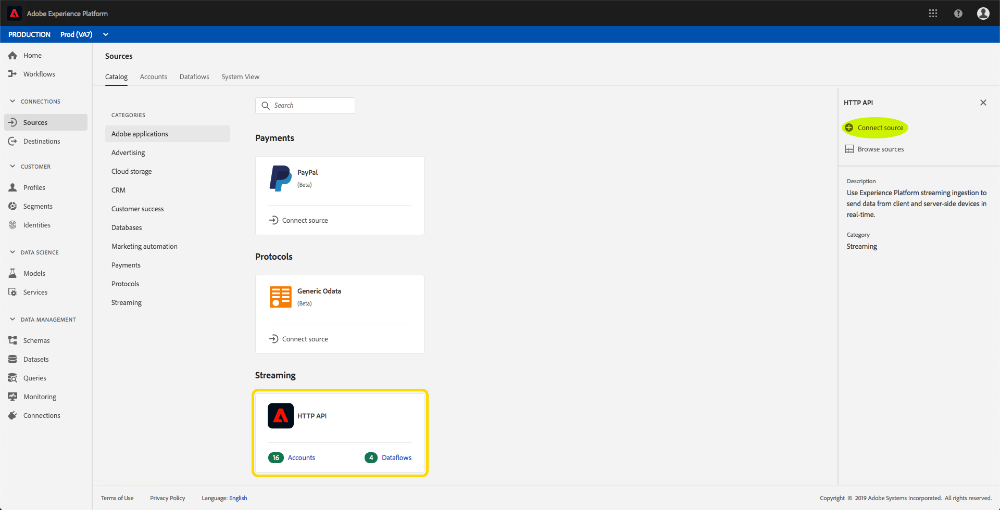

# Criar uma conexão de streaming usando a interface do usuário

Este guia de interface de usuário o ajudará a criar uma conexão de streaming usando o Adobe Experience Platform.

## Introdução

Para start de dados de transmissão, é necessário criar primeiro uma conexão HTTP de transmissão. [!DNL Experience Platform] Ao criar uma conexão de streaming, você precisa fornecer detalhes importantes, como a fonte de dados de streaming, e se pretende enviar dados de uma fonte confiável (autenticada) ou não confiável (não autenticada).

Depois de registrar uma conexão de streaming, você terá um URL exclusivo para o qual pode ser usado para transmitir dados [!DNL Platform].

Observe que para concluir este guia, você precisará acessar o Adobe Experience Platform. Se você não tiver acesso a [!DNL Platform], entre em contato com o administrador do sistema antes de continuar.

## Criar uma conexão de streaming

Depois de fazer logon na interface do usuário, clique em [!DNL Experience Platform] Fontes **[!UICONTROL para abrir a guia]** Catálogo ** . Esta página exibe os tipos de origem disponíveis como cartões individuais, com cada cartão contendo uma bolha que exibe o número de fluxos de dados que foram criados de conexões de fluxo contínuo para conjuntos de dados.

Na página *[!UICONTROL Fontes]* , clique em API **** HTTP e, em seguida, em Origem **[!UICONTROL do]** Connect.

A tela *[!UICONTROL Conectar-se a HTTP]* é exibida. Em Detalhes *[!UICONTROL do]* serviço, forneça o **[!UICONTROL nome]** e uma **[!UICONTROL descrição]** para sua nova conexão de streaming.

Em Autenticação *[!UICONTROL de]* conta, selecione as seguintes propriedades de configuração para sua conexão de streaming:

- **[!UICONTROL Autenticação]:**Se a conexão de streaming requer autenticação ou não. A autenticação garante que os dados sejam coletados de fontes confiáveis. É recomendável que isso seja ativado ao lidar com informações pessoais identificáveis (PII).
- **[!UICONTROL Compatibilidade]do Schema XDM:**Se essa conexão de streaming enviará ou não eventos compatíveis com schemas XDM. Por padrão, essa propriedade é ativada****.

Depois de concluir a seleção das propriedades de configuração, clique em **[!UICONTROL Connect (Conectar]**). Sua conexão HTTP de streaming agora é criada e agora pode ser visualizada na guia *[!UICONTROL Procurar]* na área de trabalho *[!UICONTROL Fontes]* .

Na guia *[!UICONTROL Procurar]* , você pode clicar em sua conexão HTTP de fluxo recém-criada e visualização os detalhes dessa conexão.

Ao clicar no hiperlink do nome da conexão, você pode selecionar os dados a serem exibidos ao configurar qual conjunto de dados está conectado, clicando em *[!UICONTROL Selecionar dados]*.

Você pode [criar um novo conjunto](#create-a-new-dataset) de dados ou [usar um conjunto de dados](#use-an-existing-dataset)existente.

### Criar um novo conjunto de dados

Para criar um novo conjunto de dados, forneça o **[!UICONTROL Nome]**, a **[!UICONTROL Descrição]**, bem como o **[!UICONTROL Schema]** do público alvo para o conjunto de dados.

Ao inserir todos os detalhes e clicar em **[!UICONTROL Avançar]**, você pode revisar os detalhes fornecidos antes de clicar em **[!UICONTROL Concluir]** para conectar o conjunto de dados à sua conexão HTTP de fluxo contínuo.

### Usar um conjunto de dados existente

Para usar um conjunto de dados existente, selecione o nome **[!UICONTROL do conjunto de dados de]** Saída.

Depois de clicar em **[!UICONTROL Avançar]**, você pode revisar os detalhes antes de clicar em **[!UICONTROL Concluir]** para conectar o conjunto de dados selecionado à sua conexão HTTP de fluxo.

## Próximas etapas

Ao seguir este tutorial, você criou uma conexão HTTP de streaming, permitindo que você use o terminal de streaming para acessar várias [!DNL Data Ingestion] APIs. Para obter instruções sobre como criar uma conexão de streaming na API, leia o tutorial Criação de uma conexão de streaming.
