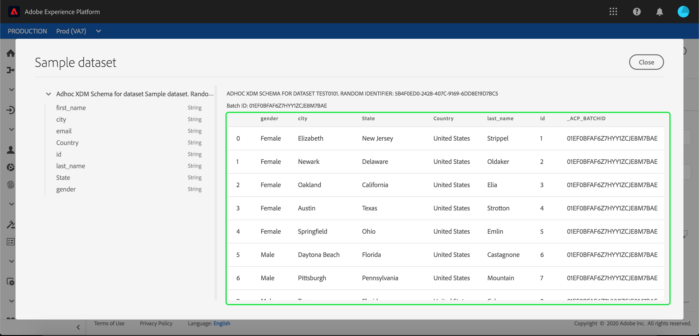

# Assimilar dados na Adobe Experience Platform

O Adobe Experience Platform permite importar facilmente dados para [!DNL Platform] como arquivos em lote. Os exemplos de dados a serem assimilados podem incluir dados de perfil de um arquivo simples em um sistema CRM (como um arquivo Parquet) ou dados que estejam em conformidade com um esquema [!DNL Experience Data Model] (XDM) conhecido no Registro de Esquema.

## Introdução

Para concluir este tutorial, você deve ter acesso a [!DNL Experience Platform]. Se você não tiver acesso a uma Organização IMS em [!DNL Experience Platform], fale com o administrador do sistema antes de continuar.

Se preferir assimilar dados usando APIs de assimilação de dados, comece lendo o [Guia do desenvolvedor de assimilação em lote](../batch-ingestion/api-overview.md).

## Espaço de trabalho Conjuntos de dados

A área de trabalho Conjuntos de dados em [!DNL Experience Platform] permite visualizar e gerenciar todos os conjuntos de dados que sua organização IMS fez, bem como criar novos conjuntos.

Exiba o espaço de trabalho Conjuntos de dados clicando em **[!UICONTROL Datasets]** no menu de navegação esquerdo. A área de trabalho Conjuntos de dados contém uma lista de conjuntos de dados, incluindo colunas que mostram o nome, a data e a hora criadas, a origem, o esquema e o status do último lote, bem como a data e a hora em que o conjunto de dados foi atualizado pela última vez.

>[!NOTE]
>
>Clique no ícone de filtro ao lado da barra de Pesquisa para usar os recursos de filtragem para exibir apenas os conjuntos de dados habilitados para [!DNL Profile].

## Criar um conjunto de dados

Para criar um conjunto de dados, clique em **[!UICONTROL Create Dataset]** no canto superior direito do espaço de trabalho Conjuntos de dados.

Na tela **[!UICONTROL Create Dataset]**, selecione se deseja &quot;[!UICONTROL Create Dataset from Schema]&quot; ou &quot;[!UICONTROL Create Dataset from CSV File]&quot;.

Para este tutorial, um esquema será usado para criar o conjunto de dados. Clique em **[!UICONTROL Create Dataset from Schema]** para continuar.

## Selecionar esquema do conjunto de dados

Na tela **[!UICONTROL Select Schema]**, escolha um schema clicando no botão de opção ao lado do schema que deseja usar. Para este tutorial, o conjunto de dados será feito usando o schema Membros de fidelidade . Usar a barra de pesquisa para filtrar esquemas é uma maneira útil de encontrar o esquema exato que você está procurando.

Depois de selecionar o botão de opção ao lado do schema que deseja usar, clique em **[!UICONTROL Next]**.

## Configurar conjunto de dados

Na tela **[!UICONTROL Configure Dataset]**, será necessário fornecer um nome ao conjunto de dados e também pode fornecer uma descrição do conjunto de dados.

**Notas sobre os nomes dos conjuntos de dados:**

- Os nomes dos conjuntos de dados devem ser curtos e descritivos para que o conjunto de dados possa ser facilmente encontrado na biblioteca posteriormente.
- Os nomes do conjunto de dados devem ser exclusivos, o que significa que também devem ser específicos o suficiente para que não sejam reutilizados no futuro.
- É uma prática recomendada fornecer informações adicionais sobre o conjunto de dados usando o campo de descrição, pois pode ajudar outros usuários a diferenciar os conjuntos de dados no futuro.

Depois que o conjunto de dados tiver um nome e uma descrição, clique em **[!UICONTROL Finish]**.

## Atividade do conjunto de dados

Um conjunto de dados vazio foi criado e você foi retornado à guia **[!UICONTROL Dataset Activity]** no espaço de trabalho Conjuntos de dados. Você deve ver o nome do conjunto de dados no canto superior esquerdo do espaço de trabalho, juntamente com uma notificação de que &quot;Nenhum lote foi adicionado&quot;. Isso é esperado, pois você ainda não adicionou nenhum lote a esse conjunto de dados.

No lado direito do espaço de trabalho Conjuntos de dados, você verá a guia **[!UICONTROL Info]** contendo informações relacionadas ao novo conjunto de dados, como ID do conjunto de dados, nome, descrição, nome da tabela, esquema, transmissão e origem. A guia Informações também inclui informações sobre quando o conjunto de dados foi criado e sua última data de modificação.

Além disso, na guia Informações, há um botão **[!UICONTROL Profile]** que é usado para habilitar seu conjunto de dados para uso com [!DNL Real-time Customer Profile]. O uso dessa alternância e [!DNL Real-time Customer Profile] serão explicados com mais detalhes na seção a seguir.

## Habilitar conjunto de dados para [!DNL Real-time Customer Profile]

Os conjuntos de dados são usados para assimilar dados em [!DNL Experience Platform] e esses dados são usados para identificar indivíduos e unir informações provenientes de várias fontes. Essa informação unida é chamada de [!DNL Real-Time Customer Profile]. Para [!DNL Platform] saber quais informações devem ser incluídas no [!DNL Real-Time Profile], os conjuntos de dados podem ser marcados para inclusão usando o botão **[!UICONTROL Profile]**.

Por padrão, essa alternância está desativada. Se você optar por ativar [!DNL Profile], todos os dados assimilados no conjunto de dados serão usados para ajudar a identificar um indivíduo e unir seus [!DNL Real-Time Profile].

Para saber mais sobre [!DNL Real-time Customer Profile] e trabalhar com identidades, consulte a documentação do [Serviço de identidade](../../identity-service/home.md).

Para ativar o conjunto de dados para [!DNL Real-time Customer Profile], clique no botão **[!UICONTROL Profile]** na guia **[!UICONTROL Info]**.

Uma caixa de diálogo será exibida solicitando que você confirme que deseja ativar o conjunto de dados para [!DNL Real-time Customer Profile].

Clique em **[!UICONTROL Enable]** e a alternância ficará azul, indicando que está ativada.

## Adicionar dados ao conjunto de dados

Os dados podem ser adicionados a um conjunto de dados de várias maneiras diferentes. Você poderia optar por usar [!DNL Data Ingestion] APIs ou um parceiro de ETL, como [!DNL Unifi] ou [!DNL Informatica]. Para este tutorial, os dados serão adicionados ao conjunto de dados usando a guia **[!UICONTROL Add Data]** na interface do usuário.

Para começar a adicionar dados ao conjunto de dados, clique na guia **[!UICONTROL Add Data]** . Agora você pode arrastar e soltar arquivos ou procurar no computador os arquivos que deseja adicionar.

>[!NOTE]
>
>A plataforma oferece suporte a dois tipos de arquivos para assimilação de dados, Parquet ou JSON. Você pode adicionar até cinco arquivos de cada vez, com o tamanho máximo de arquivo de cada arquivo de 10 GB.

## Carregar um arquivo

Depois de arrastar e soltar (ou procurar e selecionar) um arquivo Parquet ou JSON que deseja fazer upload, [!DNL Platform] começará imediatamente a processar o arquivo e uma caixa de diálogo **[!UICONTROL Uploading]** aparecerá na guia **[!UICONTROL Add Data]** mostrando o progresso do upload do arquivo.

## Métricas do conjunto de dados

Após a conclusão do upload do arquivo, a guia **[!UICONTROL Dataset Activity]** não mostrará mais que &quot;Nenhum lote foi adicionado.&quot; Em vez disso, a guia **[!UICONTROL Dataset Activity]** agora mostra as métricas do conjunto de dados. Todas as métricas mostrarão &quot;0&quot; neste estágio, pois o lote ainda não foi carregado.

Na parte inferior da guia está uma lista mostrando o **[!UICONTROL Batch ID]** dos dados que foram assimilados por meio do processo [&quot;Adicionar dados ao conjunto de dados&quot;](#add-data-to-dataset). Também inclui informações relacionadas ao lote, incluindo data assimilada, número de registros assimilados e o status atual do lote.

## Detalhes do lote

Clique em **[!UICONTROL Batch ID]** para visualizar um **[!UICONTROL Batch Overview]**, mostrando detalhes adicionais sobre o lote. Quando o lote terminar de carregar, as informações sobre o lote serão atualizadas para mostrar o número de registros assimilados e o tamanho do arquivo. O status também será alterado para &quot;Sucesso&quot; ou &quot;Falha&quot;. Se o lote falhar, a seção **[!UICONTROL Error Code]** conterá detalhes sobre quaisquer erros durante a assimilação.

Para obter mais informações e perguntas frequentes sobre assimilação de lote, consulte o [Guia de solução de problemas de assimilação de lote](../batch-ingestion/troubleshooting.md).

Para retornar à tela **[!UICONTROL Dataset Activity]**, clique no nome do conjunto de dados (**[!UICONTROL Loyalty Details]**) na navegação estrutural.

## Visualizar conjunto de dados

Quando o conjunto de dados estiver pronto, uma opção para **[!UICONTROL Preview Dataset]** aparecerá na parte superior da guia **[!UICONTROL Dataset Activity]**.

Clique em **[!UICONTROL Preview Dataset]** para abrir uma caixa de diálogo que mostra dados de amostra no conjunto de dados. Se o conjunto de dados foi criado usando um esquema, os detalhes do esquema do conjunto de dados serão exibidos no lado esquerdo da visualização. É possível expandir o schema usando as setas para ver a estrutura do schema. Cada cabeçalho de coluna nos dados de visualização representa um campo no conjunto de dados.

## Próximas etapas e recursos adicionais

Agora que você criou um conjunto de dados e assimilou dados com êxito em [!DNL Experience Platform], é possível repetir essas etapas para criar um novo conjunto de dados ou assimilar mais dados no conjunto de dados existente.

Para saber mais sobre a assimilação em lote, leia a [Visão geral da assimilação em lote](../batch-ingestion/overview.md) e complemente seu aprendizado assistindo ao vídeo abaixo.

>[!WARNING]
>
>A interface [!DNL Platform] mostrada no vídeo a seguir está desatualizada. Consulte a documentação acima para obter as capturas de tela e a funcionalidade mais recentes da interface do usuário.

>[!VIDEO](https://video.tv.adobe.com/v/27269?quality=12&learn=on)
