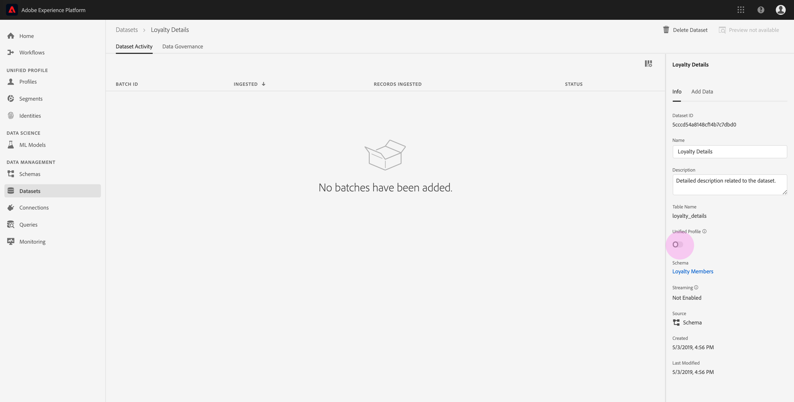

# Insira dados no Adobe Experience Platform

O Adobe Experience Platform permite importar facilmente dados para o Platform como arquivos em lote. Exemplos de dados a serem ingeridos podem incluir dados de perfil de um arquivo simples em um sistema CRM (como um arquivo parquet) ou dados que estejam em conformidade com um schema do Modelo de Dados de Experiência (XDM) conhecido no Registro do Schema.

## Introdução

Para concluir este tutorial, é necessário ter acesso ao Experience Platform. Se você não tiver acesso a uma Organização IMS no Experience Platform, fale com o administrador do sistema antes de prosseguir.

Se preferir assimilar dados usando as APIs de ingestão de dados, comece lendo o guia [do desenvolvedor de ingestão de](../batch-ingestion/api-overview.md)lote.

## Área de trabalho de conjuntos de dados

A área de trabalho de conjuntos de dados no Experience Platform permite que você visualização e gerencie todos os conjuntos de dados criados pela organização IMS, bem como criar novos conjuntos.

Visualização a área de trabalho Conjuntos de dados clicando em **Conjuntos** de dados na navegação à esquerda. A área de trabalho Conjuntos de dados contém uma lista de conjuntos de dados, incluindo colunas que mostram _Nome_, _Criado_ (data e hora), _Origem_, _Schema_ e Status _do___&#x200B;Último Lote, bem como a data e a hora em que o conjunto de dados foi Última Atualização.

>[!NOTE]
>
>Clique no ícone de filtro ao lado da barra Pesquisar para usar os recursos de filtragem para visualização somente dos conjuntos de dados habilitados para o Perfil.

## Criar um conjunto de dados

Para criar um conjunto de dados, clique em **Criar conjunto** de dados no canto superior direito da área de trabalho Conjuntos de dados.

Na tela **Criar conjunto de dados** , selecione se deseja &quot;Criar conjunto de dados a partir do Schema&quot; ou &quot;Criar conjunto de dados a partir do arquivo CSV&quot;.

Para este tutorial, um schema será usado para criar o conjunto de dados. Clique em **Criar conjunto de dados do Schema** para continuar.

## Selecionar schema de conjunto de dados

Na tela **Selecionar Schema** , escolha um schema clicando no botão de opção ao lado do schema que você deseja usar. Para este tutorial, o conjunto de dados será feito usando o schema Membros de Fidelidade. Usar a barra de pesquisa para filtrar schemas é uma maneira útil de encontrar o schema exato que você está procurando.

Depois de selecionar o botão de opção ao lado do schema que deseja usar, clique em **Avançar**.

## Configurar conjunto de dados

Na tela **Configurar conjunto de dados** , será necessário fornecer um **Nome** ao conjunto de dados e também uma **Descrição** do conjunto de dados.

**Notas sobre os nomes dos conjuntos de dados:**

- Os nomes dos conjuntos de dados devem ser curtos e descritivos para que o conjunto de dados possa ser facilmente encontrado na biblioteca posteriormente.
- Os nomes dos conjuntos de dados devem ser exclusivos, o que significa que também devem ser específicos o suficiente para que não sejam reutilizados no futuro.
- É prática recomendada fornecer informações adicionais sobre o conjunto de dados usando o campo de descrição, pois pode ajudar outros usuários a diferenciarem entre conjuntos de dados no futuro.

Depois que o conjunto de dados tiver um nome e uma descrição, clique em **Concluir**.

## atividade do conjunto de dados

Um conjunto de dados vazio foi criado e você foi retornado para a guia Atividade **** Conjunto de dados na área de trabalho Conjuntos de dados. Você deve ver o nome do conjunto de dados no canto superior esquerdo do espaço de trabalho, juntamente com uma notificação de que &quot;Nenhum lote foi adicionado.&quot; Isso é esperado, pois você ainda não adicionou nenhum lote a esse conjunto de dados.

No lado direito da área de trabalho dos Conjuntos de dados, você verá a guia **Informações** contendo informações relacionadas ao seu novo conjunto de dados, como ID _do_ Conjunto de dados, _Nome_, _Descrição_, Nome _da_______ tabela, Schema, Streaming eSource. A guia Informações também inclui informações sobre quando o conjunto de dados foi _criado_ e sua data de _Última modificação_ .

Também na guia Informações há uma alternância de _Perfil_ usada para habilitar seu conjunto de dados para uso com o Perfil de cliente em tempo real. O uso dessa alternância e o Perfil do cliente em tempo real serão explicados com mais detalhes na seção a seguir.

## Habilitar conjunto de dados para o Perfil do cliente em tempo real

Os conjuntos de dados são usados para assimilar dados no Experience Platform, e esses dados são usados para identificar indivíduos e unir informações provenientes de várias fontes. Essas informações agrupadas são chamadas de Perfil do cliente em tempo real. Para que a Platform saiba quais informações devem ser incluídas no Perfil em tempo real, os conjuntos de dados podem ser marcados para inclusão usando a alternância de **Perfil** .

Por padrão, essa alternância está desativada. Se você optar por alternar no Perfil, todos os dados ingeridos no conjunto de dados serão usados para ajudar a identificar um indivíduo e unir seu Perfil em tempo real.

Para saber mais sobre o Perfil do cliente em tempo real e como trabalhar com identidades, consulte a documentação do Serviço [de](../../identity-service/home.md) identidade.

Para ativar o conjunto de dados para o Perfil de cliente em tempo real, clique no botão de alternância do **Perfil** na guia **Informações** .

Será exibida uma caixa de diálogo solicitando que você confirme que deseja ativar o conjunto de dados para o Perfil do cliente em tempo real.

Clique em **Ativar** e a alternância ficará azul, indicando que está ativada.

## Adicionar dados ao conjunto de dados

Os dados podem ser adicionados a um conjunto de dados de várias maneiras diferentes. Você pode optar por usar as APIs de ingestão de dados ou um parceiro ETL, como Unifi ou Informatica. Para este tutorial, os dados serão adicionados ao conjunto de dados usando a guia **Adicionar dados** na interface do usuário.

Para começar a adicionar dados ao conjunto de dados, clique na guia **Adicionar dados** . Agora você pode arrastar e soltar arquivos ou procurar no computador os arquivos que deseja adicionar.

>[!NOTE]
>
>A Platform oferece suporte a dois tipos de arquivos para ingestão de dados, parquet ou JSON. Você pode adicionar até cinco arquivos de cada vez, com o tamanho máximo de cada arquivo de 10 GB.

## Carregar um arquivo

Depois que você arrastar e soltar (ou navegar e selecionar) um parquet ou arquivo JSON que deseja carregar, a Platform começará imediatamente a processar o arquivo e uma caixa de diálogo **Carregar** aparecerá na guia **Adicionar dados** mostrando o progresso do upload do arquivo.

## Métricas do conjunto de dados

Após a conclusão do upload do arquivo, a guia Atividade **do conjunto de** dados não mostra mais que &quot;Nenhum lote foi adicionado.&quot; Em vez disso, a guia Atividade de conjunto de dados agora mostra as métricas de conjunto de dados. Todas as métricas mostrarão &quot;0&quot; neste estágio, pois o lote ainda não foi carregado.

Na parte inferior da guia, há uma lista que mostra a ID _do_ lote dos dados que foram ingeridos pelo processo [&quot;Adicionar dados ao conjunto de dados&quot;](#add-data-to-dataset) . Também estão incluídas as informações relacionadas ao lote, incluindo a data de _assimilação_ , o número de _Registros ingeridos_ e o _Status_ atual do lote.

## Detalhes do lote

Clique na ID _do_ lote para visualização de uma visão geral **do** lote, mostrando detalhes adicionais sobre o lote. Quando o lote terminar de ser carregado, as informações sobre o lote serão atualizadas para mostrar o número de _Registros ingeridos_ e o Tamanho _do_ arquivo. O _Status_ também será alterado para &quot;Êxito&quot; ou &quot;Falha&quot;. Se o lote falhar, a seção Código _de_ erro conterá detalhes sobre quaisquer erros durante a ingestão.

Para obter mais informações e perguntas frequentes sobre a ingestão em lote, consulte o guia [de solução de problemas de ingestão em](../batch-ingestion/troubleshooting.md)lote.

Para retornar à tela Atividade **do Conjunto de** Dados, clique no nome do conjunto de dados (Detalhes _da_ Fidelidade) na navegação estrutural.

## Conjunto de dados de Pré-visualização

Quando o conjunto de dados estiver pronto, uma opção para **Pré-visualização do conjunto** de dados será exibida na parte superior da guia Atividade **do** conjunto de dados.

Clique em Conjunto de dados de **Pré-visualização** para abrir uma caixa de diálogo mostrando dados de amostra do conjunto de dados. Se o conjunto de dados tiver sido criado usando um schema, os detalhes do schema do conjunto de dados aparecerão no lado esquerdo da pré-visualização. Você pode expandir o schema usando as setas para ver a estrutura do schema. Cada cabeçalho de coluna nos dados de pré-visualização representa um campo no conjunto de dados.

## Próximas etapas

Agora que você criou um conjunto de dados e assimilou dados com êxito no Experience Platform, pode repetir essas etapas para criar um novo conjunto de dados ou assimilar mais dados no conjunto de dados existente.

Para saber mais sobre a ingestão em lote, leia a visão geral [da Ingestão em](../batch-ingestion/overview.md)lote.
