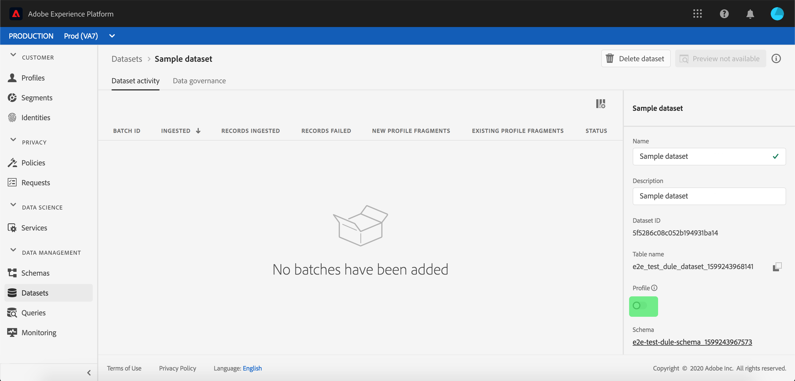
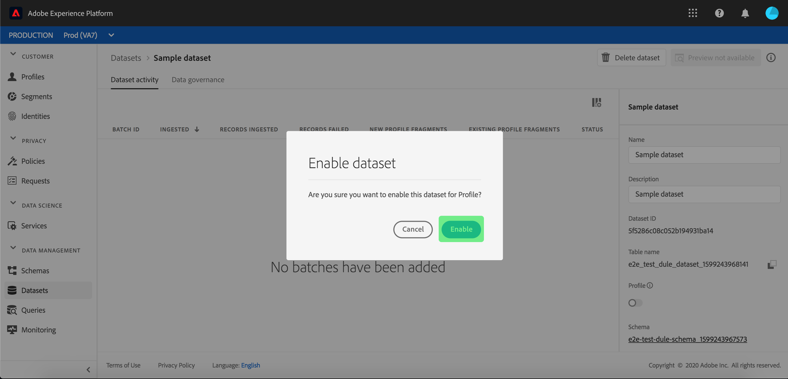

# Assimilar dados na Adobe Experience Platform

O Adobe Experience Platform permite importar dados facilmente para o [!DNL Platform] como arquivos em lote. Exemplos de dados a serem assimilados podem incluir dados de perfil de um arquivo simples em um sistema CRM (como um arquivo Parquet) ou dados que estejam em conformidade com uma [!DNL Experience Data Model] (XDM) no Registro de esquemas.

## Introdução

Para concluir este tutorial, você deve ter acesso a [!DNL Experience Platform]. Se você não tiver acesso a uma Organização IMS no [!DNL Experience Platform], entre em contato com o administrador do sistema antes de continuar.

Se você preferir assimilar dados usando as APIs de assimilação de dados, comece lendo o [Guia do desenvolvedor de assimilação em lote](../batch-ingestion/api-overview.md).

## Espaço de trabalho de conjuntos de dados

O espaço de trabalho dos conjuntos de dados no [!DNL Experience Platform] O permite visualizar e gerenciar todos os conjuntos de dados criados por sua organização IMS, bem como criar novos.

Exiba o espaço de trabalho Conjuntos de dados clicando em **[!UICONTROL Conjuntos de dados]** no painel de navegação esquerdo. O espaço de trabalho Conjuntos de dados contém uma lista de conjuntos de dados, incluindo colunas mostrando nome, criado (data e hora), origem, esquema e status do último lote, bem como a data e a hora em que o conjunto de dados foi atualizado pela última vez.

>[!NOTE]
>
>Clique no ícone de filtro ao lado da barra de Pesquisa para usar os recursos de filtragem e exibir somente os conjuntos de dados habilitados para [!DNL Profile].

## Criar um conjunto de dados

Para criar um conjunto de dados, clique em **[!UICONTROL Criar conjunto de dados]** no canto superior direito do espaço de trabalho Conjuntos de dados.

No **[!UICONTROL Criar conjunto de dados]** selecione se deseja &quot;[!UICONTROL Criar conjunto de dados a partir do esquema]&quot; ou &quot;[!UICONTROL Criar conjunto de dados a partir do arquivo CSV]&quot;.

Neste tutorial, um esquema será usado para criar o conjunto de dados. Clique em **[!UICONTROL Criar conjunto de dados a partir do esquema]** para continuar.

## Selecionar esquema do conjunto de dados

No **[!UICONTROL Selecionar esquema]** escolha um schema clicando no botão de opção ao lado do schema que deseja usar. Para este tutorial, o conjunto de dados será criado usando o esquema Membros de fidelidade. Usar a barra de pesquisa para filtrar esquemas é uma maneira útil de encontrar o esquema exato que você está procurando.

Depois de selecionar o botão de opção ao lado do esquema que deseja usar, clique em **[!UICONTROL Próxima]**.

## Configurar conjunto de dados

No **[!UICONTROL Configurar conjunto de dados]** , você deverá dar um nome ao conjunto de dados e também poderá fornecer uma descrição dele.

**Notas sobre nomes de conjuntos de dados:**

- Os nomes dos conjuntos de dados devem ser curtos e descritivos para que possam ser facilmente encontrados na biblioteca posteriormente.
- Os nomes dos conjuntos de dados devem ser exclusivos, o que significa que eles também devem ser específicos o suficiente para não serem reutilizados no futuro.
- É uma prática recomendada fornecer informações adicionais sobre o conjunto de dados usando o campo de descrição, pois pode ajudar outros usuários a diferenciar entre conjuntos de dados no futuro.

Depois que o conjunto de dados tiver um nome e uma descrição, clique em **[!UICONTROL Concluir]**.

## Atividade do conjunto de dados

Um conjunto de dados vazio foi criado e você foi retornado para a **[!UICONTROL Atividade do conjunto de dados]** no espaço de trabalho Conjuntos de dados. Você deve ver o nome do conjunto de dados no canto superior esquerdo do espaço de trabalho, juntamente com uma notificação de que &quot;Nenhum lote foi adicionado&quot;. Isso é esperado, pois você ainda não adicionou lotes a esse conjunto de dados.

No lado direito do espaço de trabalho Conjuntos de dados, você verá a **[!UICONTROL Informações]** guia que contém informações relacionadas ao novo conjunto de dados, como ID do conjunto de dados, nome, descrição, nome da tabela, esquema, fluxo e origem. A guia Informações também inclui informações sobre quando o conjunto de dados foi criado e sua última data de modificação.

Além disso, na guia Informações há uma  **[!UICONTROL Perfil]** alternância usada para habilitar seu conjunto de dados para uso com [!DNL Real-Time Customer Profile]. Use esse botão de alternância e [!DNL Real-Time Customer Profile], serão explicados com mais detalhes na seção a seguir.

## Habilitar conjunto de dados para [!DNL Real-Time Customer Profile]

Conjuntos de dados são usados para assimilar dados no [!DNL Experience Platform]e esses dados são usados para identificar indivíduos e unir informações provenientes de várias fontes. Essas informações agrupadas são chamadas de [!DNL Real-Time Customer Profile]. A fim de [!DNL Platform] para saber quais informações devem ser incluídas no [!DNL Real-Time Profile], os conjuntos de dados podem ser marcados para inclusão usando o **[!UICONTROL Perfil]** alternar.

Por padrão, esse botão de alternância está desativado. Se você optar por ativar [!DNL Profile], todos os dados assimilados no conjunto de dados serão usados para ajudar a identificar um indivíduo e compilar seus [!DNL Real-Time Profile].

Para saber mais sobre [!DNL Real-Time Customer Profile] e ao trabalhar com identidades, revise a variável [Serviço de identidade](../../identity-service/home.md) documentação.

Para ativar o conjunto de dados para [!DNL Real-Time Customer Profile], clique no link **[!UICONTROL Perfil]** alternar no **[!UICONTROL Informações]** guia.

Uma caixa de diálogo será exibida solicitando que você confirme se deseja ativar o conjunto de dados para [!DNL Real-Time Customer Profile].

Clique em **[!UICONTROL Ativar]** e o botão ficará azul, indicando que está ligado.

## Adicionar dados ao conjunto de dados

Os dados podem ser adicionados a um conjunto de dados de várias maneiras diferentes. Você pode optar por usar [!DNL Data Ingestion] APIs ou um parceiro de ETL, como [!DNL Unifi] ou [!DNL Informatica]. Para este tutorial, os dados serão adicionados ao conjunto de dados usando o **[!UICONTROL Adicionar dados]** na interface do usuário.

Para começar a adicionar dados ao conjunto de dados, clique no link **[!UICONTROL Adicionar dados]** guia. Agora você pode arrastar e soltar arquivos ou procurar no computador os arquivos que deseja adicionar.

>[!NOTE]
>
>A Platform oferece suporte a dois tipos de arquivos para assimilação de dados: Parquet ou JSON. Você pode adicionar até cinco arquivos de cada vez, com o tamanho máximo de cada arquivo de 1 GB.

## Carregar um arquivo

Depois de arrastar e soltar (ou navegar e selecionar) um arquivo Parquet ou JSON que você deseja fazer upload, [!DNL Platform] começará imediatamente a processar o arquivo e uma **[!UICONTROL Fazendo upload]** aparecerá na janela **[!UICONTROL Adicionar dados]** mostrando o progresso do upload do arquivo.

## Métricas de conjunto de dados

Após concluir o upload do arquivo, a variável **[!UICONTROL Atividade do conjunto de dados]** não mostra mais que &quot;Nenhum lote foi adicionado&quot;. Em vez disso, a variável **[!UICONTROL Atividade do conjunto de dados]** A guia agora mostra as métricas do conjunto de dados. Todas as métricas mostrarão &quot;0&quot; neste estágio, pois o lote ainda não foi carregado.

Na parte inferior da guia há uma lista mostrando as **[!UICONTROL ID do lote]** dos dados que acabaram de ser assimilados pela [&quot;Adicionar dados ao conjunto de dados&quot;](#add-data-to-dataset) processo. Também estão incluídas informações relacionadas ao lote, incluindo a data de assimilação, o número de registros assimilados e o status atual do lote.

## Detalhes do lote

Clique no link **[!UICONTROL ID do lote]** para exibir um **[!UICONTROL Visão geral de lotes]**, mostrando detalhes adicionais sobre o lote. Quando o carregamento do lote for concluído, as informações sobre o lote serão atualizadas para mostrar o número de registros assimilados e o tamanho do arquivo. O status também será alterado para &quot;Sucesso&quot; ou &quot;Falha&quot;. Se o lote falhar, a variável **[!UICONTROL Código de erro]** conterá detalhes sobre quaisquer erros durante a assimilação.

Para obter mais informações e perguntas frequentes sobre a assimilação de lotes, consulte [Guia de solução de problemas de assimilação em lote](../batch-ingestion/troubleshooting.md).

Para retornar ao **[!UICONTROL Atividade do conjunto de dados]** clique no nome do conjunto de dados (**[!UICONTROL Detalhes de fidelidade]**) na navegação estrutural.

## Visualizar conjunto de dados

Quando o conjunto de dados estiver pronto, uma opção para **[!UICONTROL Visualizar conjunto de dados]** aparece na parte superior do **[!UICONTROL Atividade do conjunto de dados]** guia.

Clique em **[!UICONTROL Visualizar conjunto de dados]** para abrir uma caixa de diálogo mostrando dados de amostra do conjunto de dados. Se o conjunto de dados foi criado usando um esquema, os detalhes do esquema do conjunto de dados aparecerão no lado esquerdo da visualização. É possível expandir o schema usando as setas para ver a estrutura do schema. Cada cabeçalho de coluna nos dados de visualização representa um campo no conjunto de dados.

## Próximas etapas e recursos adicionais

Agora que você criou um conjunto de dados e assimilou dados com sucesso no [!DNL Experience Platform], você pode repetir essas etapas para criar um novo conjunto de dados ou assimilar mais dados no conjunto de dados existente.

Para saber mais sobre a assimilação em lote, leia o [Visão geral da assimilação em lote](../batch-ingestion/overview.md) e complemente seu aprendizado assistindo ao vídeo abaixo.

>[!WARNING]
>
>A variável [!DNL Platform] A interface mostrada no vídeo a seguir está desatualizada. Consulte a documentação acima para obter as capturas de tela e a funcionalidade mais recentes da interface.

>[!VIDEO](https://video.tv.adobe.com/v/27269?quality=12&learn=on)
