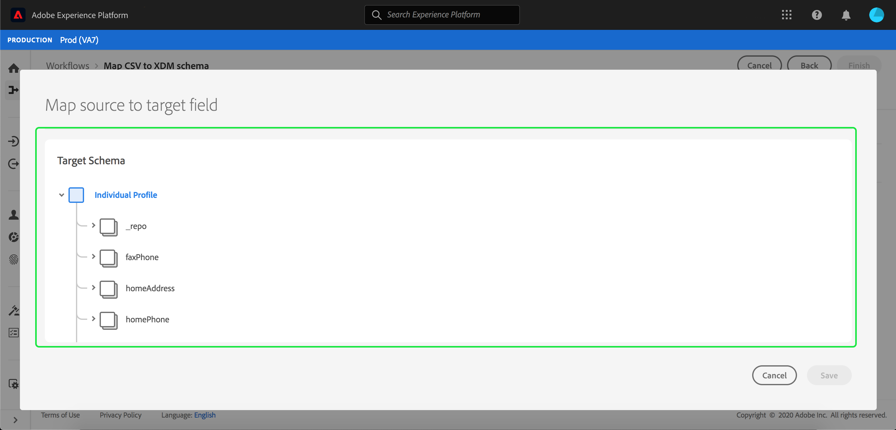

# Mapear um arquivo CSV para um esquema XDM

Para assimilar dados CSV em [!DNL Adobe Experience Platform], os dados devem ser mapeados para um esquema [!DNL Experience Data Model] (XDM). Este tutorial aborda como mapear um arquivo CSV para um esquema XDM usando a interface do usuário [!DNL Platform].

Além disso, o apêndice deste tutorial fornece mais informações sobre o uso de [funções de mapeamento](#mapping-functions).

## Introdução

Este tutorial requer uma compreensão funcional dos seguintes componentes de [!DNL Platform]:

- [[!DNL Experience Data Model (XDM System)]](../../xdm/home.md): A estrutura padronizada pela qual  [!DNL Platform] organiza os dados de experiência do cliente.
- [[!DNL Batch ingestion]](../batch-ingestion/overview.md): O método pelo qual  [!DNL Platform] assimila dados de arquivos de dados fornecidos pelo usuário.

Este tutorial também requer que você já tenha criado um conjunto de dados para assimilar seus dados CSV no. Para obter etapas sobre como criar um conjunto de dados na interface do usuário, consulte o [tutorial de assimilação de dados](./ingest-batch-data.md).

## Escolha um destino

Faça logon em [[!DNL Adobe Experience Platform]](https://platform.adobe.com) e selecione **[!UICONTROL Workflows]** na barra de navegação esquerda para acessar o espaço de trabalho **[!UICONTROL Workflows]**.

Na tela **[!UICONTROL Workflows]**, selecione **[!UICONTROL Map CSV to XDM schema]** na seção **[!UICONTROL Data ingestion]** e selecione **[!UICONTROL Launch]**.

O workflow **[!UICONTROL Map CSV to XDM schema]** é exibido, começando na etapa **[!UICONTROL Destination]**. Escolha um conjunto de dados para os dados de entrada que serão assimilados. Você pode usar um conjunto de dados existente ou criar um novo.

**Usar um conjunto de dados existente**

Para assimilar seus dados CSV em um conjunto de dados existente, selecione **[!UICONTROL Use existing dataset]**. Você pode recuperar um conjunto de dados existente usando a função de pesquisa ou rolando pela lista de conjuntos de dados existentes no painel.

Para assimilar seus dados CSV em um novo conjunto de dados, selecione **[!UICONTROL Create new dataset]** e insira um nome e uma descrição para o conjunto de dados nos campos fornecidos. Selecione um schema usando a função de pesquisa ou rolando pela lista de schemas fornecidos. Selecione **[!UICONTROL Next]** para continuar.

## Adicionar dados

A etapa **[!UICONTROL Add data]** é exibida. Arraste e solte seu arquivo CSV no espaço fornecido ou selecione **[!UICONTROL Choose files]** para inserir manualmente seu arquivo CSV.

A seção **[!UICONTROL Sample data]** aparece assim que o arquivo é carregado, mostrando as primeiras dez linhas de dados. Depois de confirmar que os dados foram carregados conforme esperado, selecione **[!UICONTROL Next]**.

## Mapear campos CSV para campos de esquema XDM

A etapa **[!UICONTROL Mapping]** é exibida. As colunas do arquivo CSV são listadas em **[!UICONTROL Source Field]**, com seus campos de esquema XDM correspondentes listados em **[!UICONTROL Target Field]**.

[!DNL Platform] O fornece automaticamente recomendações inteligentes para campos mapeados automaticamente com base no esquema de destino ou conjunto de dados selecionado. Você pode ajustar manualmente as regras de mapeamento de acordo com seus casos de uso.

Para aceitar todos os valores de mapeamento de geração automática, marque a caixa de seleção &quot;[!UICONTROL Accept all target fields]&quot;.

Às vezes, mais de uma recomendação está disponível para o schema de origem. Quando isso acontece, o cartão de mapeamento exibe a recomendação mais importante, seguida por um círculo azul que contém o número de recomendações adicionais disponíveis. Selecionar o ícone da lâmpada mostrará uma lista das recomendações adicionais. Você pode escolher uma das recomendações alternativas marcando a caixa de seleção ao lado da recomendação para a qual deseja mapear.

Como alternativa, você pode optar por mapear manualmente o esquema de origem para o esquema de destino. Passe o mouse sobre o schema de origem que deseja mapear, em seguida, selecione o ícone de adição.

A janela **[!UICONTROL Map source to target field]** é exibida. Aqui, você pode selecionar qual campo deseja mapear, seguido por **[!UICONTROL Save]** para adicionar seu novo mapeamento.

Se desejar remover um dos mapeamentos, passe o mouse sobre esse mapeamento e selecione o ícone de menos.

### Adicionar campo calculado {#add-calculated-field}

Os campos calculados permitem que os valores sejam criados com base nos atributos no schema de entrada. Esses valores podem ser atribuídos aos atributos no schema de destino e receber um nome e uma descrição para permitir uma referência mais fácil.

Selecione o botão **[!UICONTROL Add calculated field]** para continuar.

O painel **[!UICONTROL Create calculated field]** é exibido. A caixa de diálogo à esquerda contém os campos, as funções e os operadores suportados nos campos calculados. Selecione uma das guias para começar a adicionar funções, campos ou operadores ao editor de expressão.

| Tabulação | Descrição |
| --------- | ----------- |
| Campos | A guia fields lista campos e atributos disponíveis no schema de origem. |
| Funções | A guia funções lista as funções disponíveis para transformar os dados. Para saber mais sobre as funções que você pode usar nos campos calculados, leia o guia em [usando as funções de Preparação de Dados (Mapeador)](../../data-prep/functions.md). |
| Operadores | A guia operadores lista os operadores disponíveis para transformar os dados. |

É possível adicionar campos, funções e operadores manualmente usando o editor de expressão no centro. Selecione o editor para começar a criar uma expressão.

Selecione **[!UICONTROL Save]** para continuar.

A tela de mapeamento é exibida novamente com o campo de origem recém-criado. Aplique o campo de destino correspondente apropriado e selecione **[!UICONTROL Finish]** para concluir o mapeamento.

## Monitorar assimilação de dados

Depois que o arquivo CSV for mapeado e criado, você poderá monitorar os dados que estão sendo assimilados por meio dele. Para obter mais informações sobre como monitorar a assimilação de dados, consulte o tutorial em [monitorando a assimilação de dados](../../ingestion/quality/monitor-data-ingestion.md).

## Próximas etapas

Ao seguir este tutorial, você mapeou com sucesso um arquivo CSV simples para um esquema XDM e o assimilou em [!DNL Platform]. Esses dados agora podem ser usados por serviços [!DNL Platform] downstream, como [!DNL Real-time Customer Profile]. Consulte a visão geral de [[!DNL Real-time Customer Profile]](../../profile/home.md) para obter mais informações.
