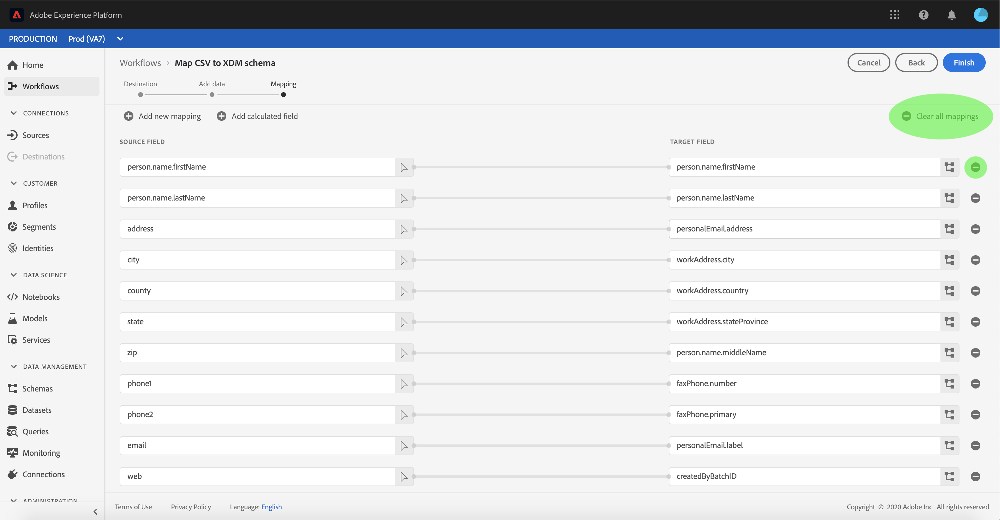

# Mapear um arquivo CSV para um schema XDM

Para assimilar dados CSV, [!DNL Adobe Experience Platform]os dados devem ser mapeados para um schema [!DNL Experience Data Model] (XDM). Este tutorial aborda como mapear um arquivo CSV para um schema XDM usando a interface do [!DNL Platform] usuário.

Além disso, o apêndice deste tutorial fornece mais informações sobre o uso de funções [de](#mapping-functions)mapeamento.

## Introdução

Este tutorial requer uma compreensão funcional dos seguintes componentes do [!DNL Platform]:

- [[!DNL Experience Data Model (Sistema XDM)]](../../xdm/home.md): A estrutura padronizada pela qual [!DNL Platform] organiza os dados de experiência do cliente.
- [[!DNL ingestão em lote]](../batch-ingestion/overview.md): O método pelo qual [!DNL Platform] ingere dados de arquivos de dados fornecidos pelo usuário.

Este tutorial também requer que você já tenha criado um conjunto de dados para assimilar seus dados CSV. Para obter etapas sobre como criar um conjunto de dados na interface do usuário, consulte o tutorial [de assimilação de](./ingest-batch-data.md)dados.

## Escolher um destino

Faça logon em [[!DNL Adobe Experience Platform]](https://platform.adobe.com) e selecione **[!UICONTROL Workflows]** na barra de navegação esquerda para acessar a área de trabalho de **[!UICONTROL Workflows]** .

Na tela **[!UICONTROL Workflows]** , selecione **[!UICONTROL Mapear o schema]** CSV para XDM na seção de ingestão **[!UICONTROL de]** dados e selecione **[!UICONTROL Iniciar]**.

O fluxo de trabalho **[!UICONTROL Mapear CSV para schema]** XDM é exibido, começando na etapa **[!UICONTROL Destino]** . Escolha um conjunto de dados para os dados de entrada a serem ingeridos. Você pode usar um conjunto de dados existente ou criar um novo.

**Usar um conjunto de dados existente**

Para assimilar seus dados CSV em um conjunto de dados existente, selecione **[!UICONTROL Usar conjunto de dados]** existente. Você pode recuperar um conjunto de dados existente usando a função de pesquisa ou percorrendo a lista de conjuntos de dados existentes no painel.

Para assimilar seus dados CSV em um novo conjunto de dados, selecione **[!UICONTROL Criar novo conjunto de dados]** e insira um nome e uma descrição para o conjunto de dados nos campos fornecidos. Selecione um schema usando a função de pesquisa ou percorrendo a lista dos schemas fornecidos. Selecione **[!UICONTROL Avançar]** para continuar.

## Adicionar dados

A etapa **[!UICONTROL Adicionar dados]** é exibida. Arraste e solte o arquivo CSV no espaço fornecido ou selecione **[!UICONTROL Escolher arquivos]** para inserir manualmente o arquivo CSV.

A seção Dados **[!UICONTROL de]** amostra é exibida assim que o arquivo é carregado, mostrando as primeiras dez linhas de dados. Depois de confirmar que os dados foram carregados como esperado, selecione **[!UICONTROL Avançar]**.

## Mapear campos CSV para campos de schema XDM

A etapa **[!UICONTROL Mapeamento]** é exibida. As colunas do arquivo CSV são listadas em Campo **[!UICONTROL de]** origem, com seus campos de schema XDM correspondentes listados em Campo **[!UICONTROL de]** Público alvo. Os campos de público alvo não selecionados são contornados em vermelho. Você pode usar a opção de filtrar campos para restringir a lista dos campos de origem disponíveis.

Para mapear uma coluna CSV para um campo XDM, selecione o ícone de schema ao lado do campo de público alvo correspondente da coluna.

A janela **[!UICONTROL Selecionar campo]** schema é exibida. Aqui, você pode navegar pela estrutura do schema XDM e localizar o campo para o qual deseja mapear a coluna CSV. Clique em um campo XDM para selecioná-lo e, em seguida, clique em **[!UICONTROL Selecionar]**.

A tela **[!UICONTROL Mapeamento]** é exibida novamente, com o campo XDM selecionado aparecendo agora em Campo **[!UICONTROL de]** Público alvo.

Se você não desejar mapear uma coluna CSV específica, é possível remover o mapeamento clicando no ícone **** remover ao lado do campo público alvo. Você também pode remover todos os mapeamentos selecionando o botão **[!UICONTROL Limpar todos os mapeamentos]**.

Se desejar adicionar um novo mapeamento, selecione **[!UICONTROL Adicionar novo mapeamento]** na parte superior da lista de campo **[!UICONTROL de]** origem.

Ao mapear campos, também é possível incluir funções para calcular valores com base nos campos de origem de entrada. Consulte a seção de funções [de](#mapping-functions) mapeamento no apêndice para obter mais informações.

### Adicionar campo calculado

Campos calculados permitem que valores sejam criados com base nos atributos no schema de entrada. Esses valores podem ser atribuídos aos atributos no schema do público alvo e receber um nome e uma descrição para facilitar a referência.

Selecione o botão **[!UICONTROL Adicionar campo]** calculado para continuar.

O painel **[!UICONTROL Criar campo]** calculado é exibido. A caixa de diálogo esquerda contém os campos, as funções e os operadores suportados nos campos calculados. Selecione uma das guias para adicionar funções, campos ou operadores ao editor de expressões.

| Tabulação | Descrição |
| --------- | ----------- |
| Campos | A guia campos lista campos e atributos disponíveis no schema de origem. |
| Funções | A guia funções lista as funções disponíveis para transformar os dados. |
| Operadores | A guia operadores lista os operadores disponíveis para transformar os dados. |

É possível adicionar manualmente campos, funções e operadores usando o editor de expressão no centro. Selecione o editor para criar uma expressão no start.

Selecione **[!UICONTROL Salvar]** para continuar.

A tela de mapeamento reaparece com o campo de origem recém-criado. Aplique o campo de público alvo correspondente apropriado e selecione **[!UICONTROL Concluir]** para concluir o mapeamento.

## Monitore seu fluxo de dados

Depois que o arquivo CSV for mapeado e criado, você poderá monitorar os dados que estão sendo assimilados por meio dele. Para obter mais informações sobre como monitorar fluxos de dados, consulte o tutorial sobre como [monitorar fluxos de dados](../../ingestion/quality/monitor-data-flows.md)de transmissão contínua.

## Próximas etapas

Ao seguir este tutorial, você mapeou com êxito um arquivo CSV simples para um schema XDM e o assimilou [!DNL Platform]. Esses dados agora podem ser usados por [!DNL Platform] serviços de downstream, como [!DNL Real-time Customer Profile]. Consulte a visão geral do [[!DNL Real-time Customer Perfil]](../../profile/home.md) para obter mais informações.

## Apêndice

A seção a seguir fornece informações adicionais para mapear colunas CSV para campos XDM.

### Funções de mapeamento

Determinadas funções de mapeamento podem ser usadas para calcular e calcular valores com base no que é inserido nos campos de origem. Para usar uma função, digite-a em Campo **[!UICONTROL de]** origem com a sintaxe e as entradas apropriadas.

Por exemplo, para concatenar campos CSV de **cidade** e **país** e atribuí-los ao campo XDM de **cidade** , defina o campo de origem como `concat(city, ", ", county)`.

A tabela a seguir lista todas as funções de mapeamento suportadas, incluindo expressões de amostra e suas saídas resultantes.

| Função | Descrição | Expressão de amostra | Exemplo de saída |
| -------- | ----------- | ----------------- | ------------- |
| concat | Concatena determinadas cordas. | concat(&quot;Oi, &quot;, &quot;lá&quot;, &quot;!&quot;) | `"Hi, there!"` |
| explosão | Divide a string com base em um regex e retorna uma matriz de partes. | explode(&quot;Oi, aqui!&quot;, &quot; &quot;) | `["Hi,", "there"]` |
| instr | Retorna o local/índice de uma substring. | instr(&quot;adobe.com&quot;, &quot;com&quot;) | 6 |
| substituta | Substitui a string de pesquisa, se presente na string original. | replace(&quot;This is a string re test&quot;, &quot;re&quot;, &quot;replace&quot;) | &quot;Este é um teste de substituição de string&quot; |
| substr | Retorna uma substring de um determinado comprimento. | SAA(&quot;This is a substring test&quot;, 7, 8) | &quot; a subst&quot; |
| lower / lcase | Converte uma string em minúsculas. | lower(&quot;EleLLo&quot;) lcase(&quot;EleLLo&quot;) | &quot;hello&quot; |
| superior / ucase | Converte uma string em maiúsculas. | upper(&quot;HeLLo&quot;) ucase(&quot;EleLLo&quot;) | &quot;OLÁ&quot; |
| split | Divide uma string de entrada em um separador. | split(&quot;Hello world&quot;, &quot; &quot;) | `["Hello", "world"]` |
| join | Une uma lista de objetos usando o separador. | `join(" ", ["Hello", "world"]`) | &quot;Olá mundo&quot; |
| coalescência | Retorna o primeiro objeto não nulo em uma determinada lista. | coalesce(null, null, null, &quot;first&quot;, null, &quot;second&quot;) | &quot;first&quot; |
| decodificação | Considerando uma chave e uma lista de pares de valores chave nivelados como uma matriz, a função retornará o valor se a chave for encontrada ou retornará um valor padrão se estiver presente na matriz. | decode(&quot;k2&quot;, &quot;k1&quot;, &quot;v1&quot;, &quot;k2&quot;, &quot;v2&quot;, &quot;default&quot;) | &quot;v2&quot; |
| iif | Avalia uma determinada expressão booleana e retorna o valor especificado com base no resultado. | iif(&quot;s&quot;.equalsIgnoreCase(&quot;S&quot;), &quot;True&quot;, &quot;False&quot;) | &quot;Verdadeiro&quot; |
| min | Retorna o mínimo dos argumentos fornecidos. Usa ordenação natural. | min(3, 1, 4) | 1 |
| max | Retorna o máximo dos argumentos fornecidos. Usa ordenação natural. | max(3, 1, 4) | 4 |
| first | Recupera o primeiro argumento fornecido. | first(&quot;1&quot;, &quot;2&quot;, &quot;3&quot;) | &quot;1&quot; |
| last | Recupera o último argumento fornecido. | last(&quot;1&quot;, &quot;2&quot;, &quot;3&quot;) | &quot;3&quot; |
| uid / guid | Gera uma ID pseudo-aleatória. | uuid() guid() | {UNIQUE_ID} |
| now | Recupera a hora atual. | now() | `2019-10-23T10:10:24.556-07:00[America/Los_Angeles]` |
| carimbo de data e hora | Recupera o tempo Unix atual. | carimbo de data e hora() | 1571850624571 |
| format | Formata a data de entrada de acordo com um formato especificado. | format({DATE}, &quot;aaaa-MM-dd HH:mm:ss&quot;) | &quot;2019-10-23 11:24:35&quot; |
| dformat | Converte um carimbo de data e hora em uma string de data de acordo com um formato especificado. | dformat(1571829875, &quot;dd-MMM-yyyy hh:mm&quot;) | &quot;23-out-2019 11:24&quot; |
| data | Converte uma string de data em um objeto ZondedDateTime (formato ISO 8601). | date(&quot;23-out-2019 11:24&quot;) | &quot;2019-10-23T11:24:00+00:00&quot; |
| date_part | Recupera as partes da data. Os seguintes valores de componente são suportados:   &quot;ano&quot; &quot;aaaa&quot; &quot;yy&quot;  &quot;trimestre&quot; &quot;qq&quot; &quot;q&quot;  &quot;month&quot; &quot;mm&quot; &quot;m&quot;  &quot;dayofyear&quot;                              &quot;dia&quot;&quot;dia&quot;&quot;dia&quot;&quot;dia&quot;&quot;d&quot;&quot;semana&quot;&quot;wvw&quot;tv&quot;semana&quot;dia da semana&quot;&quot;dw&quot;hvw&quot;hormlvlvr&quot;bresskr&quot;brlhr h&quot;&quot;hh24&quot;&quot;hh12&quot;&quot;&quot;&quot;&quot;&quot;&quot;&quot;&quot;&quot;&quot;&quot;&quot;&quot;&quot;&quot;ms&quot;&quot; h&quot;&quot;h24&quot;&quot;ms&quot; | date_part(date(&quot;2019-10-17 11:55:12&quot;), &quot;MM&quot;) | 10 |
| set_date_part | Substitui um componente em uma determinada data. Os seguintes componentes são aceitos:   &quot;year&quot; &quot;yyyy&quot; &quot;yy&quot;  &quot;month&quot; &quot;mm&quot; &quot;m&quot;  &quot;day&quot; &quot;dd&quot; &quot;d&quot;  &quot;d&quot; &quot;hora&quot;        &quot;hh&quot;&quot;minuto&quot;&quot;&quot;in&quot;&quot;second&quot;&quot;&quot;&quot;s&quot;&quot;s&quot;&quot; | set_date_part(&quot;m&quot;, 4, date(&quot;2016-11-09T11:44:44.797&quot;) | &quot;2016-04-09T11:44:44.797&quot; |
| make_date_time / make_timestamp | Cria uma data de partes. | make_date_time(2019, 10, 17, 11, 55, 12, 999, &quot;América/Los_Angeles&quot;) | `2019-10-17T11:55:12.0&#x200B;00000999-07:00[America/Los_Angeles]` |
| current_timestamp | Retorna o carimbo de data e hora atual. | current_timestamp() | 1571850624571 |
| current_date | Retorna a data atual sem um componente de hora. | current_date() | &quot;18-nov-2019&quot; |