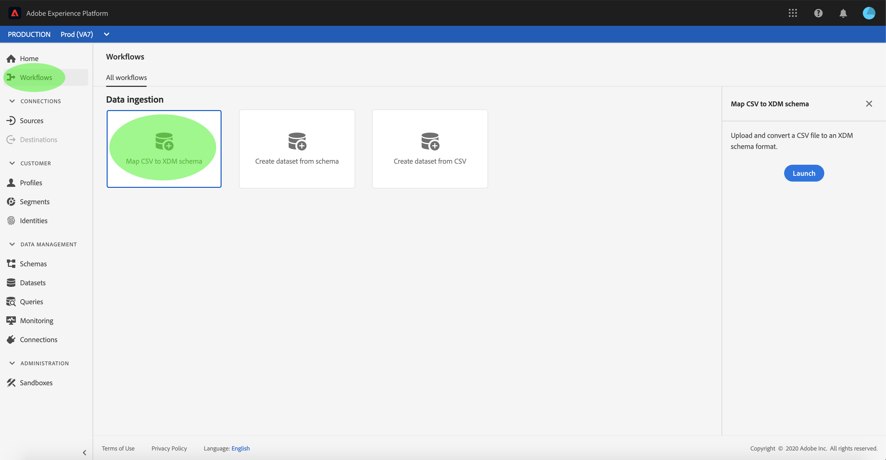
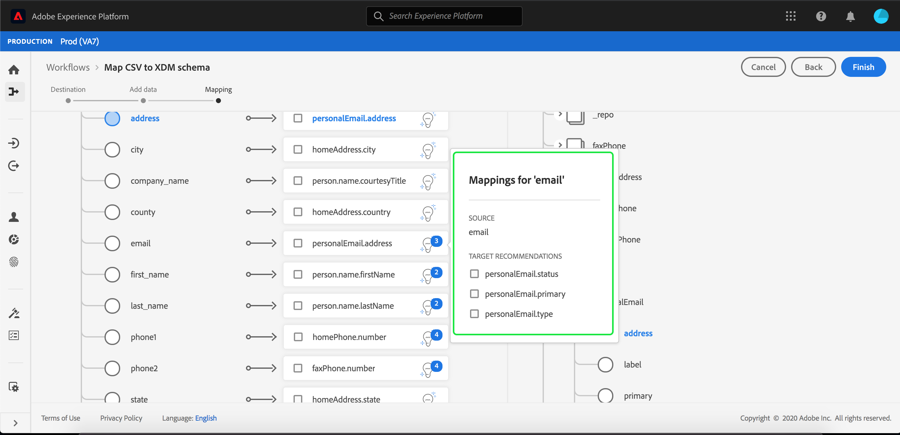

# Mapear um arquivo CSV para um esquema XDM existente

>[!NOTE]
>
>Este documento aborda como mapear um arquivo CSV para um esquema XDM existente. Para obter informações sobre como usar a ferramenta de recomendação de esquema gerada por IA (atualmente na versão beta), consulte o documento sobre [mapear um arquivo CSV usando recomendações de aprendizado de máquina](./recommendations.md).

Para assimilar dados CSV em [!DNL Adobe Experience Platform], os dados devem ser mapeados para um [!DNL Experience Data Model] Esquema de (XDM). Este tutorial aborda como mapear um arquivo CSV para um esquema XDM usando o [!DNL Platform] interface do usuário.

## Introdução

Este tutorial requer um entendimento prático dos seguintes componentes do [!DNL Platform]:

- [[!DNL Experience Data Model (XDM System)]](../../../xdm/home.md): o quadro normalizado pelo qual [!DNL Platform] organiza os dados de experiência do cliente.
- [Assimilação em lote](../../batch-ingestion/overview.md): o método pelo qual [!DNL Platform] assimila dados de arquivos de dados fornecidos pelo usuário.
- [Preparação de dados do Adobe Experience Platform](../../batch-ingestion/overview.md): um conjunto de recursos que permitem mapear e transformar dados assimilados para estarem em conformidade com esquemas XDM. A documentação sobre [Funções de Preparo de dados](../../../data-prep/functions.md) é particularmente relevante para o mapeamento de esquema.

Este tutorial também requer que você já tenha criado um conjunto de dados para assimilar seus dados CSV no. Para obter etapas sobre como criar um conjunto de dados na interface, consulte [tutorial de assimilação de dados](../ingest-batch-data.md).

## Escolher um destino

Efetue logon no [[!DNL Adobe Experience Platform]](https://platform.adobe.com) e selecione **[!UICONTROL Fluxos de trabalho]** na barra de navegação esquerda, para acessar a **[!UICONTROL Fluxos de trabalho]** espaço de trabalho.

No **[!UICONTROL Fluxos de trabalho]** , selecione **[!UICONTROL Mapear CSV para esquema XDM]** no **[!UICONTROL Assimilação de dados]** e selecione **[!UICONTROL Launch]**.

A variável **[!UICONTROL Mapear CSV para esquema XDM]** fluxo de trabalho é exibido, começando no **[!UICONTROL Destino]** etapa. Escolha um conjunto de dados para os dados de entrada que serão assimilados. Você pode usar um conjunto de dados existente ou criar um novo.

**Usar um conjunto de dados existente**

Para assimilar dados CSV em um conjunto de dados existente, selecione **[!UICONTROL Usar conjunto de dados existente]**. Você pode recuperar um conjunto de dados existente usando a função de pesquisa ou rolando pela lista de conjuntos de dados existentes no painel.

Para assimilar seus dados CSV em um novo conjunto de dados, selecione **[!UICONTROL Criar novo conjunto de dados]** e insira um nome e uma descrição para o conjunto de dados nos campos fornecidos. Selecione um esquema usando a função de pesquisa ou rolando pela lista de esquemas fornecida. Selecionar **[!UICONTROL Próxima]** para continuar.

## Adicionar dados

A variável **[!UICONTROL Adicionar dados]** é exibida. Arraste e solte o arquivo CSV no espaço fornecido ou selecione **[!UICONTROL Escolher arquivos]** para inserir manualmente o arquivo CSV.

A variável **[!UICONTROL Dados de exemplo]** é exibida depois que o arquivo é carregado, mostrando as primeiras dez linhas de dados. Depois de confirmar que os dados foram carregados conforme esperado, selecione **[!UICONTROL Próxima]**.

## Mapear campos CSV para campos de esquema XDM

A variável **[!UICONTROL Mapeamento]** é exibida. As colunas do arquivo CSV estão listadas em **[!UICONTROL Campo de origem]**, com os campos de esquema XDM correspondentes listados em **[!UICONTROL Campo de destino]**.

[!DNL Platform] O fornece automaticamente recomendações inteligentes para campos mapeados automaticamente com base no esquema ou conjunto de dados de destino selecionado. Você pode ajustar manualmente as regras de mapeamento para atender aos seus casos de uso.

Para aceitar todos os valores de mapeamento gerados automaticamente, marque a caixa de seleção &quot;[!UICONTROL Aceitar todos os campos de destino]&quot;.

Às vezes, mais de uma recomendação está disponível para o esquema de origem. Quando isso acontece, o cartão de mapeamento exibe a recomendação mais proeminente, seguida por um círculo azul que contém o número de recomendações adicionais disponíveis. Selecionar o ícone de lâmpada mostrará uma lista das recomendações adicionais. Você pode escolher uma das recomendações alternativas marcando a caixa de seleção ao lado da recomendação para a qual deseja mapear.

Como alternativa, você pode optar por mapear manualmente o esquema de origem para o esquema de destino. Passe o mouse sobre o schema de origem que deseja mapear e selecione o ícone de adição.

A variável **[!UICONTROL Mapear campo de origem para campo de destino]** popover é exibido. Aqui, é possível selecionar qual campo você deseja mapear, seguido de **[!UICONTROL Salvar]** para adicionar o novo mapeamento.

Se quiser remover um dos mapeamentos, passe o mouse sobre esse mapeamento e selecione o ícone de subtração.

### Adicionar campo calculado {#add-calculated-field}

Os campos calculados permitem que valores sejam criados com base nos atributos no esquema de entrada. Esses valores podem ser atribuídos a atributos no esquema de destino e receber um nome e uma descrição para facilitar a referência.

Selecione o **[!UICONTROL Adicionar campo calculado]** botão para continuar.

A variável **[!UICONTROL Criar campo calculado]** é exibido. A caixa de diálogo à esquerda contém os campos, funções e operadores compatíveis com os campos calculados. Selecione uma das guias para começar a adicionar funções, campos ou operadores ao editor de expressão.

| Tabulação | Descrição |
| --------- | ----------- |
| Campos | A guia fields lista campos e atributos disponíveis no schema de origem. |
| Funções | A guia functions lista as funções disponíveis para transformar os dados. Para saber mais sobre as funções que você pode usar em campos calculados, leia o guia em [uso das funções de Preparo de dados (Mapeador)](../../../data-prep/functions.md). |
| Operadores | A guia operators lista os operadores disponíveis para transformar os dados. |

Você pode adicionar campos, funções e operadores manualmente usando o editor de expressão no centro. Selecione o editor para começar a criar uma expressão.

Selecionar **[!UICONTROL Salvar]** para continuar.

A tela de mapeamento é exibida novamente com o campo de origem recém-criado. Aplique o campo de destino correspondente apropriado e selecione **[!UICONTROL Concluir]** para concluir o mapeamento.

## Monitorar assimilação de dados

Depois que o arquivo CSV for mapeado e criado, você poderá monitorar os dados que estão sendo assimilados por meio dele. Para obter mais informações sobre o monitoramento da assimilação de dados, consulte o tutorial em [monitoramento da assimilação de dados](../../../ingestion/quality/monitor-data-ingestion.md).

## Próximas etapas

Ao seguir este tutorial, você mapeou com sucesso um arquivo CSV simples para um esquema XDM e o assimilou em [!DNL Platform]. Esses dados agora podem ser usados por downstream [!DNL Platform] serviços como [!DNL Real-Time Customer Profile]. Consulte a visão geral do [[!DNL Real-Time Customer Profile]](../../../profile/home.md) para obter mais informações.
