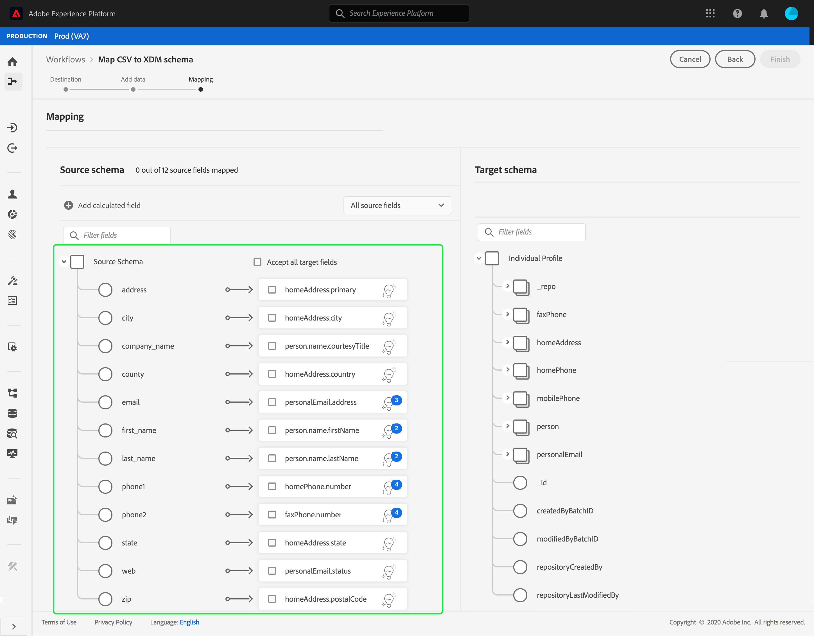

# Mapear um arquivo CSV para um esquema XDM existente

>[!NOTE]
>
>Este documento aborda como mapear um arquivo CSV para um esquema XDM existente. Para obter informações sobre como usar a ferramenta de recomendação de esquema gerado por IA (atualmente em beta), consulte o documento em [mapeamento de um arquivo CSV usando recomendações de aprendizado automatizado](./recommendations.md).

Para assimilar dados CSV no [!DNL Adobe Experience Platform], os dados devem ser mapeados para um [!DNL Experience Data Model] (XDM). Este tutorial aborda como mapear um arquivo CSV para um esquema XDM usando o [!DNL Platform] interface do usuário.

## Introdução

Este tutorial requer uma compreensão funcional dos seguintes componentes do [!DNL Platform]:

- [[!DNL Experience Data Model (XDM System)]](../../../xdm/home.md): O quadro normalizado pelo qual [!DNL Platform] organiza os dados de experiência do cliente.
- [Ingestão em lote](../../batch-ingestion/overview.md): O método pelo qual [!DNL Platform] assimila dados de arquivos de dados fornecidos pelo usuário.
- [Preparação de dados do Adobe Experience Platform](../../batch-ingestion/overview.md): Um conjunto de recursos que permite mapear e transformar dados assimilados em conformidade com esquemas XDM. A documentação sobre [Funções de preparação de dados](../../../data-prep/functions.md) é particularmente relevante para mapeamento de esquema.

Este tutorial também requer que você já tenha criado um conjunto de dados para assimilar seus dados CSV no. Para obter etapas sobre como criar um conjunto de dados na interface do usuário, consulte o [tutorial de assimilação de dados](../ingest-batch-data.md).

## Escolha um destino

Faça logon em [[!DNL Adobe Experience Platform]](https://platform.adobe.com) e depois selecione **[!UICONTROL Fluxos de trabalho]** na barra de navegação esquerda para acessar o **[!UICONTROL Fluxos de trabalho]** espaço de trabalho.

No **[!UICONTROL Fluxos de trabalho]** , selecione **[!UICONTROL Mapear CSV para esquema XDM]** nos termos do **[!UICONTROL Assimilação de dados]** e depois selecione **[!UICONTROL Launch]**.

O **[!UICONTROL Mapear CSV para esquema XDM]** for exibido, começando no **[!UICONTROL Destino]** etapa. Escolha um conjunto de dados para os dados de entrada que serão assimilados. Você pode usar um conjunto de dados existente ou criar um novo.

**Usar um conjunto de dados existente**

Para assimilar seus dados CSV em um conjunto de dados existente, selecione **[!UICONTROL Usar conjunto de dados existente]**. Você pode recuperar um conjunto de dados existente usando a função de pesquisa ou rolando pela lista de conjuntos de dados existentes no painel.

Para assimilar seus dados CSV em um novo conjunto de dados, selecione **[!UICONTROL Criar novo conjunto de dados]** e insira um nome e uma descrição para o conjunto de dados nos campos fornecidos. Selecione um schema usando a função de pesquisa ou rolando pela lista de schemas fornecidos. Selecionar **[!UICONTROL Próximo]** para continuar.

## Adicionar dados

O **[!UICONTROL Adicionar dados]** será exibida. Arraste e solte seu arquivo CSV no espaço fornecido ou selecione **[!UICONTROL Escolher arquivos]** para inserir manualmente seu arquivo CSV.

O **[!UICONTROL Dados de exemplo]** é exibida após o upload do arquivo, mostrando as primeiras dez linhas de dados. Depois de confirmar que os dados foram carregados conforme o esperado, selecione **[!UICONTROL Próximo]**.

## Mapear campos CSV para campos de esquema XDM

O **[!UICONTROL Mapeamento]** será exibida. As colunas do arquivo CSV são listadas em **[!UICONTROL Campo de origem]**, com os campos de esquema XDM correspondentes listados em **[!UICONTROL Campo de destino]**.

[!DNL Platform] O fornece automaticamente recomendações inteligentes para campos mapeados automaticamente com base no esquema de destino ou conjunto de dados selecionado. Você pode ajustar manualmente as regras de mapeamento de acordo com seus casos de uso.

Para aceitar todos os valores de mapeamento de geração automática, marque a caixa de seleção &quot;[!UICONTROL Aceitar todos os campos de destino]&quot;.

Às vezes, mais de uma recomendação está disponível para o schema de origem. Quando isso acontece, o cartão de mapeamento exibe a recomendação mais importante, seguida por um círculo azul que contém o número de recomendações adicionais disponíveis. Selecionar o ícone da lâmpada mostrará uma lista das recomendações adicionais. Você pode escolher uma das recomendações alternativas marcando a caixa de seleção ao lado da recomendação para a qual deseja mapear.

Como alternativa, você pode optar por mapear manualmente o esquema de origem para o esquema de destino. Passe o mouse sobre o schema de origem que deseja mapear, em seguida, selecione o ícone de adição.

O **[!UICONTROL Mapear origem para campo de destino]** O programa de energia é exibido. Aqui, você pode selecionar qual campo deseja mapear, seguido por **[!UICONTROL Salvar]** para adicionar o novo mapeamento.

Se desejar remover um dos mapeamentos, passe o mouse sobre esse mapeamento e selecione o ícone de menos.

### Adicionar campo calculado {#add-calculated-field}

Os campos calculados permitem que os valores sejam criados com base nos atributos no schema de entrada. Esses valores podem ser atribuídos aos atributos no schema de destino e receber um nome e uma descrição para permitir uma referência mais fácil.

Selecione o **[!UICONTROL Adicionar campo calculado]** botão para continuar.

O **[!UICONTROL Criar campo calculado]** será exibido. A caixa de diálogo à esquerda contém os campos, as funções e os operadores suportados nos campos calculados. Selecione uma das guias para começar a adicionar funções, campos ou operadores ao editor de expressão.

| Tabulação | Descrição |
| --------- | ----------- |
| Campos | A guia fields lista campos e atributos disponíveis no schema de origem. |
| Funções | A guia funções lista as funções disponíveis para transformar os dados. Para saber mais sobre as funções que você pode usar nos campos calculados, leia o guia em [usando funções de Preparação de dados (Mapeador)](../../../data-prep/functions.md). |
| Operadores | A guia operadores lista os operadores disponíveis para transformar os dados. |

É possível adicionar campos, funções e operadores manualmente usando o editor de expressão no centro. Selecione o editor para começar a criar uma expressão.

Selecionar **[!UICONTROL Salvar]** para continuar.

A tela de mapeamento é exibida novamente com o campo de origem recém-criado. Aplique o campo de destino correspondente apropriado e selecione **[!UICONTROL Concluir]** para concluir o mapeamento.

## Monitorar assimilação de dados

Depois que o arquivo CSV for mapeado e criado, você poderá monitorar os dados que estão sendo assimilados por meio dele. Para obter mais informações sobre o monitoramento da assimilação de dados, consulte o tutorial em [monitoramento da ingestão de dados](../../../ingestion/quality/monitor-data-ingestion.md).

## Próximas etapas

Ao seguir este tutorial, você mapeou com sucesso um arquivo CSV simples para um esquema XDM e o assimilou em [!DNL Platform]. Esses dados agora podem ser usados pelo downstream [!DNL Platform] serviços como [!DNL Real-Time Customer Profile]. Consulte a visão geral para [[!DNL Real-Time Customer Profile]](../../../profile/home.md) para obter mais informações.
