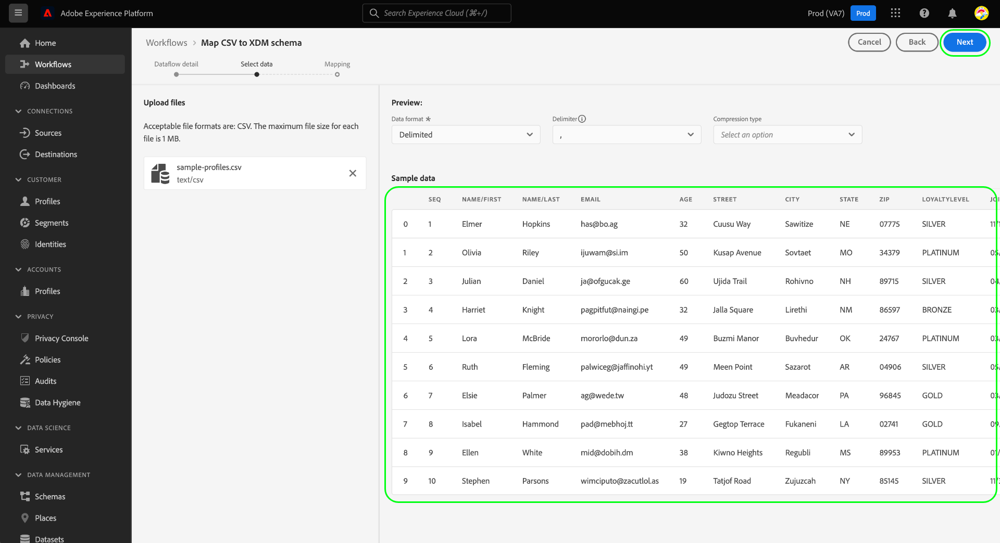

# Mapear um arquivo CSV para um esquema XDM usando recomendações geradas por IA

>[!NOTE]
>
>Para obter informações sobre os recursos de mapeamento CSV geralmente disponíveis no Platform, consulte o documento em [mapeamento de um arquivo CSV para um esquema existente](./existing-schema.md).

Para assimilar dados CSV no [!DNL Adobe Experience Platform], os dados devem ser mapeados para um [!DNL Experience Data Model] (XDM). Você pode optar por mapear para [um schema existente](./existing-schema.md), mas se você não souber exatamente qual esquema usar ou como ele deve ser estruturado, poderá usar recomendações dinâmicas com base em modelos de aprendizado de máquina (ML) na interface do usuário da plataforma.

## Introdução

Este tutorial requer uma compreensão funcional dos seguintes componentes do [!DNL Platform]:

* [[!DNL Experience Data Model (XDM System)]](../../../xdm/home.md): O quadro normalizado pelo qual [!DNL Platform] organiza os dados de experiência do cliente.
   * No mínimo, você deve entender o conceito de [comportamentos no XDM](../../../xdm/home.md#data-behaviors), para que você possa decidir se deseja mapear seus dados para um [!UICONTROL Perfil] classe (comportamento registrado) ou [!UICONTROL ExperienceEvent] classe (comportamento da série de tempo).
* [Ingestão em lote](../../batch-ingestion/overview.md): O método pelo qual [!DNL Platform] assimila dados de arquivos de dados fornecidos pelo usuário.
* [Preparação de dados do Adobe Experience Platform](../../batch-ingestion/overview.md): Um conjunto de recursos que permite mapear e transformar dados assimilados em conformidade com esquemas XDM. A documentação sobre [Funções de preparação de dados](../../../data-prep/functions.md) é especificamente relevante para mapeamento de esquema.

## Fornecer detalhes do fluxo de dados

Na interface do usuário do Experience Platform, selecione **[!UICONTROL Fontes]** no painel de navegação esquerdo. No **[!UICONTROL Catálogo]** , navegue até o **[!UICONTROL Sistema local]** categoria . Em **[!UICONTROL Upload de arquivo local]**, selecione **[!UICONTROL Adicionar dados]**.

![O [!UICONTROL Fontes] na interface do usuário da plataforma, com [!UICONTROL Adicionar dados] under [!UICONTROL Upload de arquivo local] sendo selecionado.](../../images/tutorials/map-csv-recommendations/local-file-upload.png)

O **[!UICONTROL Mapear esquema CSV XDM]** for exibido, começando no **[!UICONTROL Detalhes do fluxo de dados]** etapa.

Selecionar **[!UICONTROL Criar um novo schema usando recomendações de ML]**, fazendo com que novos controles apareçam. Escolha a classe apropriada para os dados CSV que deseja mapear ([!UICONTROL Perfil] ou [!UICONTROL ExperienceEvent]). Como opção, você pode usar o menu suspenso para selecionar o setor relevante para sua empresa ou deixá-lo em branco se as categorias fornecidas não se aplicarem a você. Se sua organização opera sob uma [B2B (B2B)](../../../xdm/tutorials/relationship-b2b.md) selecione o **[!UICONTROL Dados B2B]** caixa de seleção.

![O [!UICONTROL Detalhes do fluxo de dados] etapa com a opção de recomendação ML selecionada. [!UICONTROL Perfil] é selecionado para a classe e [!UICONTROL Telecomunicações] selecionados para o setor](../../images/tutorials/map-csv-recommendations/select-class-and-industry.png)

A partir daqui, forneça um nome para o schema que será criado a partir dos dados CSV e um nome para o conjunto de dados de saída que conterá os dados assimilados nesse esquema.

Opcionalmente, é possível configurar os seguintes recursos adicionais para o fluxo de dados antes de continuar:

| Nome de entrada | Descrição |
| --- | --- |
| [!UICONTROL Descrição] | Uma descrição para o fluxo de dados. |
| [!UICONTROL Diagnóstico de erros] | Quando ativado, mensagens de erro são geradas para lotes recém-assimilados, que podem ser visualizados ao buscar o lote correspondente na variável [API](../../batch-ingestion/api-overview.md). |
| [!UICONTROL Ingestão parcial] | Quando ativado, registros válidos para novos dados de lote serão assimilados dentro de um limite de erro especificado. Esse limite permite configurar a porcentagem de erros aceitáveis antes que todo o lote falhe. |
| [!UICONTROL Detalhes do fluxo de dados] | Forneça um nome e uma descrição opcional para o fluxo de dados que trará os dados CSV para a Plataforma. Ao iniciar esse fluxo de trabalho, um nome padrão é atribuído automaticamente ao fluxo de trabalho. A alteração do nome é opcional. |
| [!UICONTROL Alertas] | Selecione em uma lista de [alertas no produto](../../../observability/alerts/overview.md) que você deseja receber com relação ao status do fluxo de dados depois que ele for iniciado. |

{style="table-layout:auto"}

Quando terminar de configurar o fluxo de dados, selecione **[!UICONTROL Próximo]**.

![O [!UICONTROL Detalhes do fluxo de dados] for concluída.](../../images/tutorials/map-csv-recommendations/dataflow-detail-complete.png)

## Selecionar dados

No **[!UICONTROL Selecionar dados]** , use a coluna da esquerda para carregar seu arquivo CSV. Você pode selecionar **[!UICONTROL Escolher arquivos]** para abrir uma caixa de diálogo do explorador de arquivos para selecionar o arquivo ou você pode arrastar e soltar o arquivo diretamente na coluna.

![O [!UICONTROL Escolher arquivos] e arraste e solte a área realçada na [!UICONTROL Selecionar dados] etapa.](../../images/tutorials/map-csv-recommendations/upload-files.png)

Após o upload do arquivo, é exibida uma seção de dados de amostra que mostra as primeiras dez linhas dos dados recebidos para que você possa verificar se o upload foi feito corretamente. Clique em **[!UICONTROL Avançar]** para continuar.

## Configurar mapeamentos de esquema

Os modelos ML são executados para gerar um novo schema com base na configuração do fluxo de dados e no arquivo CSV carregado. Quando o processo estiver concluído, a [!UICONTROL Mapeamento] é preenchida com para mostrar os mapeamentos de cada campo individual ao lado da exibição totalmente navegável da estrutura de esquema gerada.

![O [!UICONTROL Mapeamento] na interface do usuário, mostrando todos os campos CSV mapeados e a estrutura de esquema resultante.](../../images/tutorials/map-csv-recommendations/schema-generated.png)

Aqui, você pode opcionalmente [editar os mapeamentos de campo](#edit-mappings) ou [alterar os grupos de campos aos quais estão associados](#edit-schema) de acordo com suas necessidades. Quando satisfeito, selecione **[!UICONTROL Concluir]** para concluir o mapeamento e iniciar o fluxo de dados configurado anteriormente. Os dados CSV são assimilados no sistema e preenchem um conjunto de dados com base na estrutura de esquema gerada, pronto para ser consumido pelos serviços downstream da plataforma.

![O [!UICONTROL Concluir] sendo selecionado, concluindo o processo de mapeamento CSV.](../../images/tutorials/map-csv-recommendations/finish-mapping.png)

### Editar mapeamentos de campo {#edit-mappings}

Use a visualização de mapeamento de campo para editar mapeamentos existentes ou removê-los totalmente. Para obter mais informações sobre como gerenciar um conjunto de mapeamento na interface do usuário, consulte [Guia da interface do usuário para mapeamento da preparação de dados](../../../data-prep/ui/mapping.md#mapping-interface).

### Editar grupos de campos {#edit-field-groups}

Os campos CSV são mapeados automaticamente para grupos de campos XDM existentes usando modelos ML. Se desejar alterar o grupo de campos de qualquer campo CSV específico, selecione **[!UICONTROL Editar]** ao lado da árvore de esquema.

![O [!UICONTROL Editar] sendo selecionado ao lado da árvore de esquema.](../../images/tutorials/map-csv-recommendations/edit-schema-structure.png)

Uma caixa de diálogo é exibida, permitindo editar o nome de exibição, o tipo de dados e o grupo de campos para qualquer campo no mapeamento. Selecione o ícone de edição () ao lado de um campo de origem para editar seus detalhes na coluna direita antes de selecionar **[!UICONTROL Aplicar]**.

Quando terminar de ajustar as recomendações do schema para os campos de origem, selecione **[!UICONTROL Salvar]** para aplicar as alterações.

## Próximas etapas

Este guia cobriu como mapear um arquivo CSV para um esquema XDM usando recomendações geradas por IA, permitindo trazer esses dados para a Platform por meio da ingestão em lote.

Para obter etapas sobre como mapear um arquivo CSV para um esquema existente, consulte [fluxo de trabalho de mapeamento de esquema existente](./existing-schema.md). Para obter informações sobre o streaming de dados na plataforma em tempo real por meio de conexões de fonte pré-criadas, consulte [visão geral das fontes](../../../sources/home.md).
