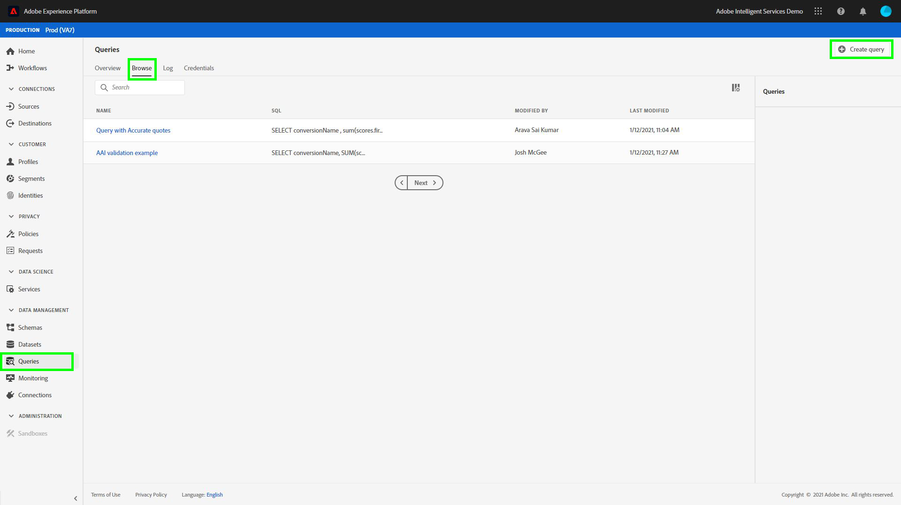

# Análise de pontuações de atribuição usando o Serviço de query

Cada linha nos dados representa uma conversão, na qual as informações dos pontos de contato relacionados são armazenadas como uma matriz de estruturas na coluna `touchpointsDetail`.

| Informações do ponto de contato | Coluna |
| ---------------------- | ------ |
| Nome do ponto de contato | `touchpointsDetail. touchpointName` |
| Canal de ponto de contato | `touchpointsDetail.touchPoint.mediaChannel` |
| Pontuações algorítmicas do Attribution AI de ponto de contato | <li>`touchpointsDetail.scores.algorithmicSourced`</li> <li> `touchpointsDetail.scores.algorithmicInfluenced` </li> |

## Encontrar os caminhos de dados

Na interface do usuário do Adobe Experience Platform, selecione **[!UICONTROL Datasets]** no painel de navegação esquerdo. A página **[!UICONTROL Datasets]** é exibida. Em seguida, selecione a guia **[!UICONTROL Browse]** e localize o conjunto de dados de saída para suas pontuações do Attribution AI.


Selecione o conjunto de dados de saída. A página de atividade do conjunto de dados é exibida.


Na página de atividade do conjunto de dados, selecione **[!UICONTROL Preview dataset]** no canto superior direito para visualizar seus dados e garantir que eles foram assimilados conforme esperado.


Após visualizar seus dados, selecione o schema no painel direito. Um provedor é exibido com o nome e a descrição do schema. Selecione o hiperlink do nome do schema para redirecionar para o schema de pontuação.


Usando o esquema de pontuação, você pode selecionar ou pesquisar um valor. Depois de selecionado, o painel lateral **[!UICONTROL Field properties]** é aberto, permitindo copiar o caminho para uso na criação de consultas.


## Acessar Serviço de Query

Para acessar o Serviço de query na interface do usuário da plataforma, comece selecionando **[!UICONTROL Queries]** na navegação à esquerda e selecione a guia **[!UICONTROL Browse]**. Uma lista de suas consultas salvas anteriormente é carregada.



Em seguida, selecione **[!UICONTROL Create query]** no canto superior direito. O Editor de consultas é carregado. Usando o Editor de consultas, você pode começar a criar consultas usando seus dados de pontuação.


Para obter mais informações sobre o Editor de consultas, visite o [Guia do usuário do Editor de consultas](../../query-service/ui/user-guide.md).

## Modelos de query para análise de pontuação de atribuição

As consultas abaixo podem ser usadas como um modelo para diferentes cenários de análise de pontuação. Você precisa substituir os `_tenantId` e `your_score_output_dataset` pelos valores adequados encontrados no esquema de saída de pontuação.

>[!NOTE]
>
> Dependendo de como seus dados foram assimilados, os valores usados abaixo, como `timestamp`, podem estar em um formato diferente.

### Exemplos de validação

**Número total de conversões por evento de conversão (em uma janela de conversão)**

```sql
    SELECT conversionName,
           SUM(scores.firstTouch) as total_conversions,
           SUM(scores.algorithmicSourced) as total_attributed_conversions
    FROM
        (SELECT
                _tenantId.your_score_output_dataset.conversionName
                    as conversionName,
                inline(_tenantId.your_score_output_dataset.touchpointsDetail),
                timestamp as conversion_timestamp
         FROM
                your_score_output_dataset
        )
    WHERE
        conversion_timestamp >= '2020-07-16'
      AND
        conversion_timestamp <  '2020-10-14'
    GROUP BY
        conversionName
```

**Número total de eventos somente conversão (em uma janela de conversão)**

```sql
    SELECT
        _tenantId.your_score_output_dataset.conversionName as conversionName,
        COUNT(1) as convOnly_cnt
    FROM
        your_score_output_dataset
    WHERE
        _tenantId.your_score_output_dataset.touchpointsDetail.touchpointName[0] IS NULL AND
        timestamp >= '2020-07-16' AND
        timestamp <  '2020-10-14'
    GROUP BY
        conversionName
```

### Exemplo de análise de tendência

**Número de conversões por dia**

```sql
    SELECT conversionName,
           DATE(conversion_timestamp) as conversion_date,
           SUM(scores.firstTouch) as convertion_cnt
    FROM
        (SELECT
                _tenantId.your_score_output_dataset.conversionName as conversionName,
                inline(_tenantId.your_score_output_dataset.touchpointsDetail),
                timestamp as conversion_timestamp
         FROM
                your_score_output_dataset
        )
    GROUP BY
        conversionName, DATE(conversion_timestamp)
    ORDER BY
        conversionName, DATE(conversion_timestamp)
    LIMIT 20
```

### Exemplo de análise de distribuição

**Quantidade de pontos de contato em caminhos de conversão por tipo definido (em uma janela de conversão)**

```sql
    SELECT conversionName,
           touchpointName,
           COUNT(1) as tp_count
    FROM
        (SELECT
                _tenantId.your_score_output_dataset.conversionName as conversionName,
                inline(_tenantId.your_score_output_dataset.touchpointsDetail),
                timestamp as conversion_timestamp
         FROM
                your_score_output_dataset
        )
    WHERE
        conversion_timestamp >= '2020-07-16' AND
        conversion_timestamp < '2020-10-14' AND
        touchpointName IS NOT NULL
    GROUP BY
        conversionName, touchpointName
    ORDER BY
        conversionName, tp_count DESC
```

### Exemplos de geração de insight

**Detalhamento de unidades incrementais por ponto de contato e data de conversão (em uma janela de conversão)**

```sql
    SELECT conversionName,
           touchpointName,
           DATE(conversion_timestamp) as conversion_date,
           SUM(scores.algorithmicSourced) as incremental_units
    FROM
        (SELECT
                _tenantId.your_score_output_dataset.conversionName as conversionName,
                inline(_tenantId.your_score_output_dataset.touchpointsDetail),
                timestamp as conversion_timestamp
         FROM
                your_score_output_dataset
        )
    WHERE
        conversion_timestamp >= '2020-07-16' AND
        conversion_timestamp < '2020-10-14'  AND
        touchpointName IS NOT NULL
    GROUP BY
        conversionName, touchpointName, DATE(conversion_timestamp)
    ORDER BY
        conversionName, touchpointName, DATE(conversion_timestamp)
```

**Detalhamento de unidades incrementais por data de ponto de contato e ponto de contato (em uma janela de conversão)**

```sql
    SELECT conversionName,
           touchpointName,
           DATE(touchpoint.timestamp) as touchpoint_date,
           SUM(scores.algorithmicSourced) as incremental_units
    FROM
        (SELECT
                _tenantId.your_score_output_dataset.conversionName as conversionName,
                inline(_tenantId.your_score_output_dataset.touchpointsDetail),
                timestamp as conversion_timestamp
         FROM
                your_score_output_dataset
        )
    WHERE
        conversion_timestamp >= '2020-07-16' AND
        conversion_timestamp < '2020-10-14'  AND
        touchpointName IS NOT NULL
    GROUP BY
        conversionName, touchpointName, DATE(touchpoint.timestamp)
    ORDER BY
        conversionName, touchpointName, DATE(touchpoint.timestamp)
    LIMIT 20
```

**Pontuações agregadas para um determinado tipo de ponto de contato para todos os modelos de pontuação (em uma janela de conversão)**

```sql
    SELECT
           conversionName,
           touchpointName,
           SUM(scores.algorithmicSourced) as total_incremental_units,
           SUM(scores.algorithmicInfluenced) as total_influenced_units,
           SUM(scores.uShape) as total_uShape_units,
           SUM(scores.decayUnits) as total_decay_units,
           SUM(scores.linear) as total_linear_units,
           SUM(scores.lastTouch) as total_lastTouch_units,
           SUM(scores.firstTouch) as total_firstTouch_units
    FROM
        (SELECT
                _tenantId.your_score_output_dataset.conversionName as conversionName,
                inline(_tenantId.your_score_output_dataset.touchpointsDetail),
                timestamp as conversion_timestamp
         FROM
                your_score_output_dataset
        )
    WHERE
        conversion_timestamp >= '2020-07-16' AND
        conversion_timestamp < '2020-10-14'  AND
        touchpointName = 'display'
    GROUP BY
        conversionName, touchpointName
    ORDER BY
        conversionName, touchpointName
```

**Avançado - análise de comprimento do caminho**

Obtenha uma distribuição de comprimento de caminho para cada tipo de evento de conversão:

```sql
    WITH agg_path AS (
          SELECT
            _tenantId.your_score_output_dataset.conversionName as conversionName,
            sum(size(_tenantId.your_score_output_dataset.touchpointsDetail)) as path_length
          FROM
            your_score_output_dataset
          WHERE
            _tenantId.your_score_output_dataset.touchpointsDetail.touchpointName[0] IS NOT NULL AND
            timestamp >= '2020-07-16' AND
            timestamp <  '2020-10-14'
          GROUP BY
            _tenantId.your_score_output_dataset.conversionName,
            eventMergeId
    )
    SELECT
        conversionName,
        path_length,
        count(1) as conversionPath_count
    FROM
        agg_path
    GROUP BY
        conversionName, path_length
    ORDER BY
        conversionName, path_length
```

**Avançado - número distinto de pontos de contato na análise de caminhos de conversão**

Obtenha a distribuição do número de pontos de contato distintos em um caminho de conversão para cada tipo de evento de conversão:

```sql
    WITH agg_path AS (
      SELECT
        _tenantId.your_score_output_dataset.conversionName as conversionName,
        size(array_distinct(flatten(collect_list(_tenantId.your_score_output_dataset.touchpointsDetail.touchpointName)))) as num_dist_tp
      FROM
        your_score_output_dataset
      WHERE
        _tenantId.your_score_output_dataset.touchpointsDetail.touchpointName[0] IS NOT NULL AND
        timestamp >= '2020-07-16' AND
        timestamp <  '2020-10-14'
      GROUP BY
        _tenantId.your_score_output_dataset.conversionName,
        eventMergeId
    )
    SELECT
        conversionName,
        num_dist_tp,
        count(1) as conversionPath_count
    FROM
     agg_path
    GROUP BY
        conversionName, num_dist_tp
    ORDER BY
        conversionName, num_dist_tp
```

### Schema flatten e exemplo de explosão

Esse query nivela a coluna struct em várias colunas do singular e explora matrizes em várias linhas. Isso ajuda a transformar as pontuações de atribuição em um formato CSV. A saída deste query tem uma conversão e um dos pontos de contato correspondentes a essa conversão em cada linha.

>[!TIP]
>
> Neste exemplo, você precisa substituir `{COLUMN_NAME}` além de `_tenantId` e `your_score_output_dataset`. A variável `COLUMN_NAME` pode obter os valores de passagens opcionais pelos nomes das colunas (colunas de relatórios) que foram adicionados durante a configuração da sua instância do Attribution AI. Revise seu esquema de saída de pontuação para localizar os valores `{COLUMN_NAME}` necessários para concluir esta consulta.

```sql
SELECT 
  segmentation,
  conversionName,
  scoreCreatedTime,
  aaid, _id, eventMergeId,
  conversion.eventType as conversion_eventType,
  conversion.quantity as conversion_quantity,
  conversion.eventSource as conversion_eventSource,
  conversion.priceTotal as conversion_priceTotal,
  conversion.timestamp as conversion_timestamp,
  conversion.geo as conversion_geo,
  conversion.receivedTimestamp as conversion_receivedTimestamp,
  conversion.dataSource as conversion_dataSource,
  conversion.productType as conversion_productType,
  conversion.passThrough.{COLUMN_NAME} as conversion_passThru_column,
  conversion.skuId as conversion_skuId,
  conversion.product as conversion_product,
  touchpointName,
  touchPoint.campaignGroup as tp_campaignGroup, 
  touchPoint.mediaType as tp_mediaType,
  touchPoint.campaignTag as tp_campaignTag,
  touchPoint.timestamp as tp_timestamp,
  touchPoint.geo as tp_geo,
  touchPoint.receivedTimestamp as tp_receivedTimestamp,
  touchPoint.passThrough.{COLUMN_NAME} as tp_passThru_column,
  touchPoint.campaignName as tp_campaignName,
  touchPoint.mediaAction as tp_mediaAction,
  touchPoint.mediaChannel as tp_mediaChannel,
  touchPoint.eventid as tp_eventid,
  scores.*
FROM (
  SELECT
        _tenantId.your_score_output_dataset.segmentation,
        _tenantId.your_score_output_dataset.conversionName,
        _tenantId.your_score_output_dataset.scoreCreatedTime,
        _tenantId.your_score_output_dataset.conversion,
        _id,
        eventMergeId,
        map_values(identityMap)[0][0].id as aaid,
        inline(_tenantId.your_score_output_dataset.touchpointsDetail)
  FROM
        your_score_output_dataset
)
```
