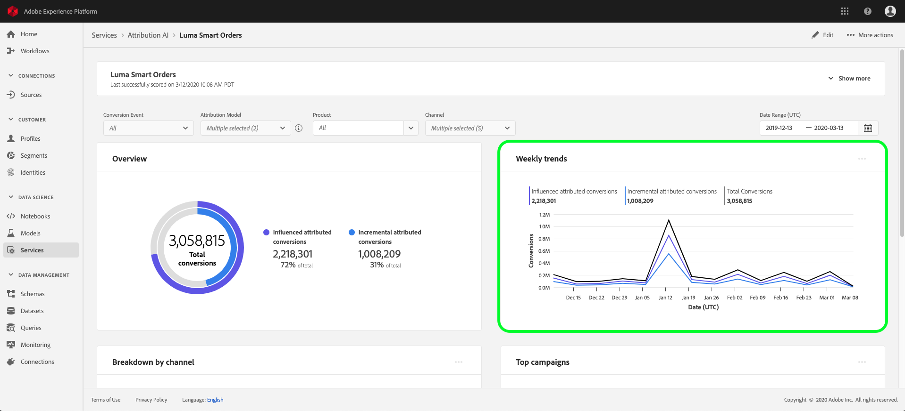

# Informações do Discover no Attribution AI

As instâncias do serviço Attribution AI fornecem insights que podem ser usados para ajudar a tomar e medir decisões de marketing relacionadas ao desempenho do marketing e ao retorno sobre o investimento. A seleção de uma instância de serviço fornece visualizações e filtros para ajudar você a entender o impacto de cada interação do cliente em cada fase da jornada do cliente.

Este documento é um guia para interagir com insights da instância de serviço na interface do usuário dos Serviços inteligentes do Adobe.

## Introdução

Para utilizar insights para o Attribution AI, você precisa ter uma instância de serviço com um status de execução bem-sucedida disponível. Para criar uma nova instância de serviço, visite o [guia da interface do usuário do Attribution AI](./user-guide.md). Se você criou recentemente uma instância de serviço e ela ainda está treinando e pontuando, aguarde 24 horas para que ela termine de ser executada.

## Visão geral dos insights da instância de serviço

Na interface [!DNL Adobe Experience Platform], selecione **[!UICONTROL Services]** no painel de navegação esquerdo. O navegador **[!UICONTROL Services]** é exibido e exibe os Serviços inteligentes do Adobe disponíveis. No contêiner do Attribution AI, selecione **[!UICONTROL Open]**.

A página Attribution AI service é exibida. Esta página lista as instâncias de serviço do Attribution AI e exibe informações sobre elas, incluindo o nome da instância, os eventos de conversão, a frequência com que a instância é executada e o status da última atualização. Selecione um nome de instância de serviço para começar.

>[!NOTE]
>
>Somente as instâncias de serviço que concluíram execuções de pontuação bem-sucedidas podem ser selecionadas.

Em seguida, a página de insights para essa instância de serviço é exibida, onde você recebe visualizações e uma série de filtros para interagir com seus dados. As visualizações e filtros são explicados com mais detalhes neste guia.

### Detalhes da instância de serviço

Para exibir detalhes adicionais para uma instância de serviço, selecione **[!UICONTROL Show more]** no canto superior direito.

Uma lista detalhada é exibida. Para obter mais informações sobre qualquer uma das propriedades listadas, visite o [guia do usuário do Attribution AI](./user-guide.md).

### Editar uma instância

Para editar uma instância, selecione **[!UICONTROL Edit]** na navegação superior direita.

A caixa de diálogo Editar é exibida, permitindo editar o nome, a descrição e a frequência de pontuação da instância. Se o status da instância estiver desativado, a frequência de pontuação não poderá ser editada. Para confirmar as alterações e fechar a caixa de diálogo, selecione **[!UICONTROL Save]** no canto inferior direito.

### Mais ações {#more-actions}

O botão **[!UICONTROL More actions]** está localizado na navegação superior direita ao lado de **[!UICONTROL Edit]**. Selecionar **[!UICONTROL More actions]** abre uma lista suspensa que permite selecionar uma das seguintes operações:

- **[!UICONTROL Clone]**: Clona a instância.
- **[!UICONTROL Delete]**: Exclui a instância.
- **[!UICONTROL Download summary data]**: Faz o download de um arquivo CSV contendo os dados de resumo.
- **[!UICONTROL Access scores]**: Selecionar  **[!UICONTROL Access scores]** redireciona você para as pontuações de  [acesso do tutorial](./download-scores.md) do Attribution AI.
- **[!UICONTROL View run history]**: Um provedor contendo uma lista de todas as execuções de pontuação associadas à instância do serviço é exibido.

## Filtrar seus dados

Os insights do Attribution AI permitem filtrar seus dados e atualizar automaticamente as exibições da interface do usuário com base nos filtros selecionados.

### Evento de conversão

Ao criar uma nova instância no Attribution AI, um dos campos obrigatórios é &quot;Eventos de conversão&quot;. Os eventos de conversão são objetivos de negócios que identificam o impacto das atividades de marketing, como pedidos de comércio eletrônico, compras na loja e visitas ao site.

Na instância , a lista suspensa **[!UICONTROL Conversion events]** permite selecionar qualquer um dos eventos definidos para a instância a fim de filtrar os dados. Selecionar eventos específicos altera as visualizações da interface do usuário para preencher apenas as conversões pertencentes a esses eventos.

### Modelo de atribuição

Selecionar **[!UICONTROL Attribution Model]** abre uma lista suspensa com todos os diferentes modelos de atribuição disponíveis. Você pode selecionar vários modelos para comparar os resultados. Para obter mais informações sobre os diferentes modelos de atribuição e como eles funcionam, visite a visão geral do [Attribution AI](./overview.md) que contém uma tabela com informações sobre cada modelo.

### Região

>[!NOTE]
>
>Esse filtro só estará presente se você tiver executado a etapa opcional [modelagem com base na região](./user-guide.md#region-based-modeling-optional) no guia da interface do usuário do Attribution AI ao criar sua instância de serviço.

Esse filtro permite selecionar qualquer região configurada no processo de criação da instância.

### Adicionar filtros

Você pode adicionar filtros adicionais selecionando o ícone **filter** para abrir a janela **[!UICONTROL Add filters]**. A opção **[!UICONTROL Add filters]** permite filtrar por Canal, Geografia, Tipo de mídia e Produto. Somente os filtros aplicáveis para uma instância de serviço são preenchidos pela provedor. Por exemplo, se você não fornecer dados geográficos ou um tipo de mídia, esses atributos de filtro não estarão disponíveis para sua instância.

- **[!UICONTROL Channel]: a seleção do atributo channel permite filtrar qualquer um dos canais de marketing disponíveis.** Você pode selecionar vários canais para compará-los.
- **[!UICONTROL Geography]:** a seleção do atributo geográfico permite filtrar códigos de país com base em modelos baseados em região. Dependendo dos dados, esse filtro pode ou não estar presente. Os códigos de país têm dois caracteres. Consulte a lista completa de códigos de país [aqui](https://datahub.io/core/country-list).
- **[!UICONTROL Media type]:** a seleção do atributo de tipo de mídia permite filtrar qualquer um dos tipos de mídia definidos.
- **[!UICONTROL Product]:** a seleção do atributo product permite filtrar de qualquer produto que foi assimilado inicialmente na criação da instância.

### Date Range

Selecione o ícone de calendário para abrir o intervalo de datas. As datas de início e término do evento de conversão determinam a quantidade de dados preenchidos na interface do usuário. Você pode optar por restringir ou ampliar o intervalo de datas para focar ou expandir a quantidade de dados preenchidos.

## Visão geral dos dados

O cartão **[!UICONTROL Overview]** mostra o total de conversões por modelo de atribuição. O número total muda com base em quão específico você faz a pesquisa usando os filtros descritos anteriormente neste documento. Selecionar mais modelos adiciona círculos adicionais à Visão geral, cada um com sua própria cor correspondente à legenda.

## Tendências semanais

O cartão **[!UICONTROL Weekly trends]** divide a conversão total pelo intervalo de datas definido durante o processo de filtragem.

Selecionar os elipses no canto superior direito do cartão **Tendências semanais** exibe uma lista suspensa que permite selecionar tendências diárias, semanais ou mensais.

Passar o mouse sobre a linha de dados de um modelo de atribuição específico cria uma portfólio que mostra o número total de conversões dessa data.

## Detalhamento por canal

O cartão **[!UICONTROL Breakdown by channel]** é usado para determinar o número total de conversões em relação a cada canal. Este cartão pode ser utilizado para ajudar a tomar decisões sobre a eficácia de cada canal e o retorno do investimento.

Selecionar os elipses na parte superior direita do cartão **[!UICONTROL Breakdown by channel]** abre uma lista suspensa que permite preencher dados com base em pontos de contato.

## Principais campanhas

O cartão **[!UICONTROL Top campaigns]** exibe uma visão geral de suas campanhas e como a campanha está se saindo em cada canal. Este cartão pode ajudar a informar sua equipe sobre a eficácia de uma campanha específica para um determinado canal e fornecer informações, como em quais campanhas você deve investir mais.

## Detalhamento por posição do ponto de contato

Selecionar a guia **[!UICONTROL Path Analysis]** carrega os gráficos **[!UICONTROL Breakdown by touchpoint position]** e **[!UICONTROL Top conversion paths]**.

O gráfico **[!UICONTROL Breakdown by touchpoint position]** é um detalhamento das conversões atribuídas por posição do ponto de contato em comparação entre todos os caminhos de conversão. Este gráfico ajuda você a entender quais pontos de contato são mais eficazes em diferentes estágios do caminho de conversão. Os estágios são inicial, reprodutor e mais próximo.

- **Início:** indica que o ponto de contato foi o primeiro contato em um caminho de conversão.
- **Reprodutor:** indica que o ponto de contato não foi o primeiro ou o último contato que levou a uma conversão.
- **Mais próximo:** indica que o ponto de contato foi o último contato antes de uma conversão.

>!![NOTE]
A soma da contribuição da porcentagem para um modelo de atribuição entre todos os pontos de contato e posições deve ser igual a 100.

## Principais caminhos de conversão

O gráfico **[!UICONTROL Top conversion paths]** mostra as pontuações influenciadas e algorítmicas nos principais caminhos de conversão nas regiões selecionadas. Este gráfico permite visualizar quais pontos de contato contribuem para conversões e qual é a pontuação de atribuição para cada ponto de contato. Você pode usar essas informações para visualizar os caminhos mais frequentes em uma determinada região e ver se algum padrão surge entre os diferentes conjuntos de pontos de contato.

## Eficácia do ponto de contato

Selecionar a guia **[!UICONTROL Touchpoint Effectiveness]** carrega o cartão **[!UICONTROL Touchpoint effectiveness]**. Esse cartão usa a distribuição de dados do Attribution AI para exibir informações para cada ponto de contato. Os dados desta tabela são gerados somente para períodos específicos, conforme indicado pela data **[!UICONTROL As of]** no canto superior direito do cartão.

Você pode usar as informações do cartão **[!UICONTROL Touchpoint effectiveness]** para entender como um ponto de contato contribui para uma conversão. Você também pode ver a eficácia de cada ponto de contato com as seguintes métricas de desempenho:

**Caminhos tocados**: Essa métrica exibe uma porcentagem de caminhos que alcançaram/não alcançaram a conversão para o ponto de contato. Você verá conversões atribuídas mais altas se a proporção de caminhos (porcentagem) que alcançaram a conversão para caminhos que não alcançaram a conversão for alta.

**Medida** de eficiência: Essa métrica exibe estrelas em uma escala de um a cinco. A escala indica a importância relativa de um ponto de contato para fazer uma conversão.

>[!NOTE]
Um volume de ponto de contato mais alto não garante uma medida de eficiência mais alta.

**Volume** total: O número agregado de vezes que um ponto de contato foi tocado por um usuário. Isso inclui pontos de contato que aparecem em um caminho que realiza a conversão, bem como caminhos que não resultam em uma conversão.

## Próximas etapas

Após terminar de filtrar os dados e poder exibir as informações apropriadas, você tem a opção de acessar as pontuações. Para obter um guia detalhado sobre como acessar suas pontuações, visite o tutorial [access scores em Attribution AI](./download-scores.md). Além disso, também é possível baixar os dados de resumo, conforme indicado em [more actions](#more-actions). Selecionar &quot;Baixar dados de resumo&quot; baixa os dados de resumo agregados por datas.

## Recursos adicionais

O vídeo a seguir foi projetado para ajudar no aprendizado de como usar a página de insights do Attribution AI para entender o ROI de canais e campanhas de marketing.

>[!VIDEO](https://video.tv.adobe.com/v/32669?learn=on&quality=12)
