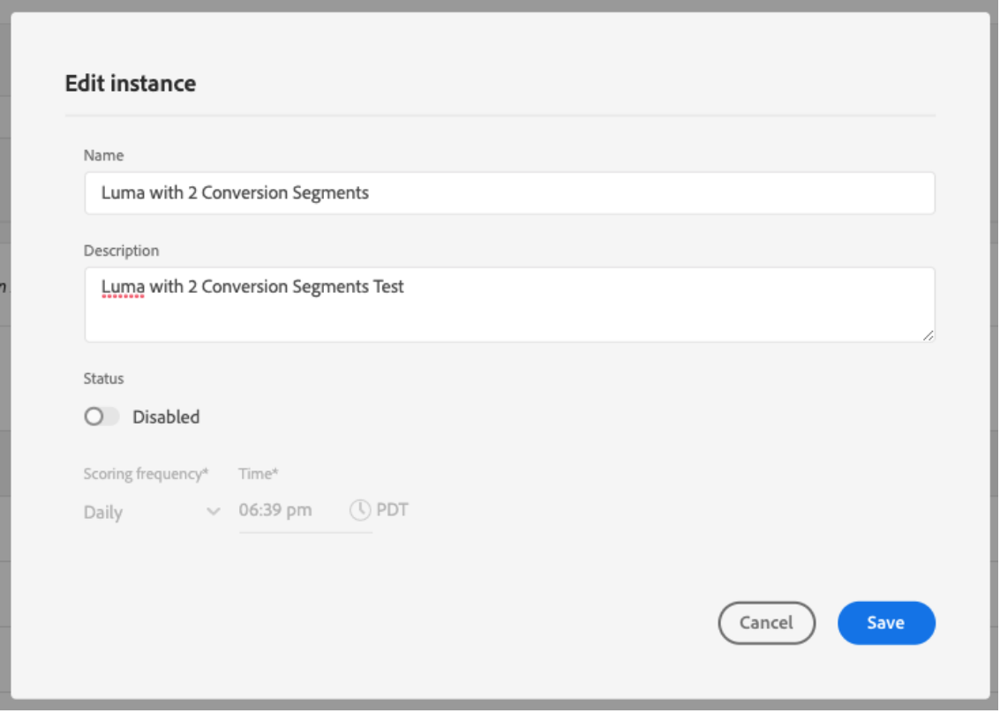

# Descubra insights no Attribution AI

As instâncias de serviço do Attribution AI fornecem insights que podem ser usados para ajudar a tomar e medir decisões de marketing relacionadas ao desempenho de marketing e ao retorno sobre o investimento. A seleção de uma instância de serviço fornece visualizações e filtros para ajudá-lo a entender o impacto de cada interação com o cliente em cada fase da jornada do cliente.

Este documento serve como um guia para interagir com insights da instância do serviço na interface do usuário dos Serviços inteligentes do Adobe.

## Introdução

Para utilizar insights para o Attribution AI, é necessário ter uma instância de serviço com um status de execução bem-sucedida disponível. Para criar uma nova instância de serviço, visite o [guia da interface do usuário do Attribution AI](./user-guide.md). Se você criou recentemente uma instância de serviço e ela ainda está sendo treinada e pontuada, aguarde 24 horas para que ela seja concluída.

## Visão geral dos insights da instância de serviço

No [!DNL Adobe Experience Platform] Interface, selecione **[!UICONTROL Serviços]** no painel de navegação esquerdo. A variável **[!UICONTROL Serviços]** é exibido e exibe os Serviços inteligentes Adobe disponíveis. No container do Attribution AI, selecione **[!UICONTROL Abertura]**.

A página Attribution AI service é exibida. Esta página lista instâncias de serviço do Attribution AI e exibe informações sobre elas, incluindo o nome da instância, eventos de conversão, a frequência com que a instância é executada e o status da última atualização. Selecione um nome de instância de serviço para começar.

>[!NOTE]
>
>Somente as instâncias de serviço que concluíram execuções de pontuação bem-sucedidas podem ser selecionadas.

Em seguida, a página de insights para essa instância do serviço é exibida, onde você recebe visualizações e vários filtros para interagir com seus dados. As visualizações e os filtros são explicados com mais detalhes neste guia.

### Detalhes da instância do serviço

Para exibir detalhes adicionais de uma instância de serviço, selecione **[!UICONTROL Mostrar mais]** no canto superior direito.

Uma lista detalhada é exibida. Para obter mais informações sobre qualquer uma das propriedades listadas, visite o [Guia do usuário do Attribution AI](./user-guide.md).

### Editar uma instância

Para editar uma instância, selecione **[!UICONTROL Editar]** na navegação superior direita.

A caixa de diálogo de edição é exibida, permitindo editar o nome, a descrição e a frequência de pontuação da instância. Se o status da instância estiver desativado, a frequência de pontuação não poderá ser editada. Para confirmar as alterações e fechar a caixa de diálogo, selecione **[!UICONTROL Salvar]** no canto inferior direito.

### Mais ações {#more-actions}

A variável **[!UICONTROL Mais ações]** está localizado na navegação superior direita ao lado de **[!UICONTROL Editar]**. Selecionar **[!UICONTROL Mais ações]** abre uma lista suspensa que permite selecionar uma das seguintes operações:

- **[!UICONTROL Clonar]**: clona a instância.
- **[!UICONTROL Excluir]**: exclui a instância.
- **[!UICONTROL Baixar dados de resumo]**: baixa um arquivo CSV contendo os dados de resumo.
- **[!UICONTROL Pontuações de acesso]**: Seleção **[!UICONTROL Pontuações de acesso]** redireciona você para a [tutorial de pontuações de acesso do Attribution AI](./download-scores.md).
- **[!UICONTROL Exibir histórico de execuções]**: um popover contendo uma lista de todas as execuções de pontuação associadas à instância do serviço é exibido.

## Filtrar seus dados

Os insights do Attribution AI permitem filtrar seus dados e atualizar automaticamente os visuais da interface com base nos filtros selecionados.

### Evento de conversão

Ao criar uma nova instância no Attribution AI, um dos campos obrigatórios é &quot;Eventos de conversão&quot;. Eventos de conversão são Objetivos de negócios que identificam o impacto de atividades de marketing, como pedidos, compras na loja e visitas a sites.

A partir da instância, o **[!UICONTROL Eventos de conversão]** permite selecionar qualquer um dos eventos definidos para sua instância para filtrar seus dados. Selecionar eventos específicos altera as visualizações da interface do usuário para preencher somente as conversões pertencentes a esses eventos.

### Modelo de atribuição

Selecionar **[!UICONTROL Modelo de atribuição]** abre uma lista suspensa com todos os diferentes modelos de atribuição disponíveis. É possível selecionar vários modelos para comparar os resultados. Para obter mais informações sobre os diferentes modelos de atribuição e como eles funcionam, visite o [Attribution AI](./overview.md) visão geral que contém uma tabela com informações sobre cada modelo.

### Região

>[!NOTE]
>
>Esse filtro só estará presente se você tiver executado a etapa opcional [modelagem baseada em região](./user-guide.md#region-based-modeling-optional) no guia da interface do usuário do Attribution AI ao criar a instância do serviço.

Esse filtro permite selecionar qualquer região configurada no processo de criação de instância.

### Adicionar filtros

É possível adicionar mais filtros selecionando o **filtro** ícone para abrir o **[!UICONTROL Adicionar filtros]** popover. A variável **[!UICONTROL Adicionar filtros]** O popover permite filtrar por Canal, Geografia, Tipo de mídia e Produto. Somente os filtros aplicáveis para uma instância de serviço são preenchidos pelo popover. Por exemplo, se você não forneceu dados geográficos ou um tipo de mídia, esses atributos de filtro não estarão disponíveis para sua instância.

- **[!UICONTROL Canal]:** Selecionar o atributo de canal permite filtrar qualquer um dos canais de marketing disponíveis. Você pode selecionar vários canais para compará-los.
- **[!UICONTROL Geografia]:** Selecionar o atributo de geografia permite filtrar códigos de país com base em modelos de região. Dependendo dos seus dados, esse filtro pode ou não estar presente. Os códigos de país têm dois caracteres. Ver a lista completa de códigos de país [aqui](https://datahub.io/core/country-list).
- **[!UICONTROL Tipo de mídia]:** A seleção do atributo de tipo de mídia permite filtrar qualquer um dos tipos de mídia definidos.
- **[!UICONTROL Produto]:** Selecionar o atributo de produto permite filtrar por quaisquer produtos que foram inicialmente assimilados na criação da sua instância.

### Date Range

Selecione o ícone de calendário para abrir o popover de intervalo de datas. As datas de evento de conversão inicial e final determinam a quantidade de dados preenchidos na interface do usuário. É possível optar por restringir ou ampliar o intervalo de datas para focalizar ou expandir a quantidade de dados preenchidos.

## Visão geral dos seus dados

A variável **[!UICONTROL Visão geral]** O cartão mostra o total de conversões por modelo de atribuição. O número total muda com base em quão específica você faz sua pesquisa usando os filtros descritos anteriormente neste documento. Selecionar mais modelos adiciona círculos adicionais à Visão geral, cada um com sua própria cor correspondente à legenda.

## Tendências semanais

A variável **[!UICONTROL Tendências semanais]** O cartão detalha sua conversão total pelo intervalo de datas definido durante o processo de filtragem.

Selecionar as reticências no canto superior direito da **Tendências semanais** O cartão exibe uma lista suspensa que permite selecionar tendências diárias, semanais ou mensais.

Passar o mouse sobre a linha de dados de um modelo de atribuição específico cria um popover que mostra o número total de conversões dessa data.

## Detalhamento por canal

A variável **[!UICONTROL Detalhamento por canal]** é usado para determinar o número total de conversões em relação a cada canal. Essa placa pode ser usada para ajudar a tomar decisões sobre a eficácia de cada canal e o retorno sobre o investimento.

Selecionar as reticências no canto superior direito da **[!UICONTROL Detalhamento por canal]** cartão abre uma lista suspensa que permite preencher dados com base em pontos de contato.

## Principais campanhas

A variável **[!UICONTROL Principais campanhas]** exibe uma visão geral de suas campanhas e como a campanha está se saindo em cada canal. Este cartão pode ajudar a informar sua equipe sobre a eficácia de uma campanha específica para um determinado canal e fornecer insights, como em quais campanhas você deve investir ainda mais.

## Detalhamento por posição de ponto de contato

Selecionar o **[!UICONTROL Análise de caminho]** carrega a **[!UICONTROL Detalhamento por posição de ponto de contato]** e **[!UICONTROL Principais caminhos de conversão]** gráficos.

A variável **[!UICONTROL Detalhamento por posição de ponto de contato]** o gráfico é um detalhamento das conversões atribuídas por posição do ponto de contato comparado em todos os caminhos de conversão. Este gráfico ajuda você a entender quais pontos de contato são mais eficazes em diferentes estágios do caminho de conversão. Os estágios são inicial, reprodutor e final.

- **Início:** Indica que o ponto de contato foi o primeiro contato em um caminho de conversão.
- **Reprodutor:** Indica que o ponto de contato não foi o primeiro nem o último contato que levou a uma conversão.
- **Mais perto:** Indica que o ponto de contato foi o último contato antes de uma conversão.

>!![NOTE]
A soma da contribuição percentual para um modelo de atribuição em todos os pontos de contato e posições deve ser igual a 100.

## Principais caminhos de conversão

A variável **[!UICONTROL Principais caminhos de conversão]** o gráfico mostra as pontuações influenciadas e algorítmicas nos principais caminhos de conversão nas regiões selecionadas. Este gráfico permite visualizar quais pontos de contato contribuem para conversões e qual é a pontuação de atribuição para cada ponto de contato. É possível usar essas informações para exibir os caminhos mais frequentes em uma determinada região e ver se algum padrão surge entre os diferentes conjuntos de pontos de contato.

## Eficácia do ponto de contato

Selecionar o **[!UICONTROL Eficácia do ponto de contato]** carrega a **[!UICONTROL Eficácia do ponto de contato]** cartão. Esse cartão usa a distribuição de dados do Attribution AI para exibir informações para cada ponto de contato. Os dados desta tabela são gerados apenas para períodos específicos, conforme indicado pela variável **[!UICONTROL Em]** data na parte superior direita do cartão.

Você pode usar o **[!UICONTROL Eficácia do ponto de contato]** informações do cartão para entender como um ponto de contato contribui para uma conversão. Você também pode ver a eficiência de cada ponto de contato com as seguintes métricas de desempenho:

**Caminhos tocados**: essa métrica exibe uma porcentagem de caminhos que atingem/não atingem a conversão para o ponto de contato. Você verá conversões atribuídas mais altas se a proporção de caminhos (porcentagem) que alcançam a conversão para caminhos que não alcançam a conversão for alta.

**Medida de eficiência**: essa métrica exibe estrelas em uma escala de um a cinco. A escala indica a importância relativa de um ponto de contato para fazer uma conversão.

>[!NOTE]
Um maior volume de pontos de contato não garante uma medida de eficiência mais alta.

**Volume total**: o número agregado de vezes que um ponto de contato foi tocado por um usuário. Isso inclui os pontos de contato que aparecem em um caminho que alcança a conversão, bem como caminhos que não resultam em uma conversão.

## Próximas etapas

Quando terminar de filtrar os dados e puder exibir as informações apropriadas, você terá a opção de acessar as pontuações. Para obter um guia detalhado sobre como acessar suas pontuações, visite o [pontuações de acesso no Attribution AI](./download-scores.md) tutorial. Além disso, você também pode baixar os dados de resumo conforme indicado em [mais ações](#more-actions). Selecionar &quot;Baixar dados de resumo&quot; baixa os dados de resumo agregados por datas.

## Recursos adicionais

O vídeo a seguir foi projetado para ajudar a saber como usar a página de insights do Attribution AI para entender o ROI de canais e campanhas de marketing.

>[!VIDEO](https://video.tv.adobe.com/v/32669?learn=on&quality=12)
