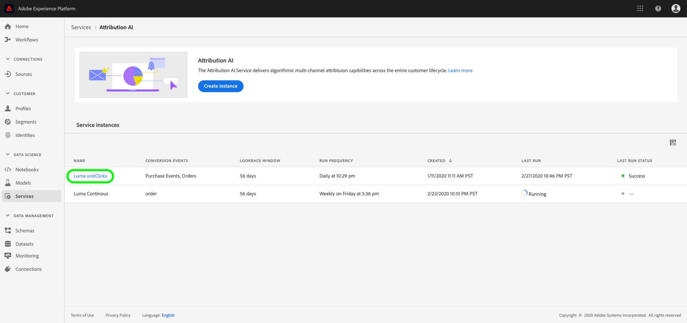

# Descobrindo insights no Attribution AI

As instâncias de serviço de Attribution AI fornecem informações que podem ser usadas para auxiliar na tomada e medição de decisões de marketing relacionadas ao desempenho de marketing e retorno sobre o investimento. A seleção de uma instância de serviço fornece visualizações e filtros para ajudá-lo a entender o impacto de cada interação do cliente em cada fase da jornada do cliente.

Este documento serve como um guia para interagir com informações da instância do serviço na interface do usuário do Adobe Intelligent Services.

## Introdução

Para utilizar insights para o Attribution AI, é necessário ter uma instância de serviço com um status de execução bem-sucedida disponível. Para criar uma nova instância de serviço, visite o guia [da interface do usuário do](./user-guide.md)Attribution AI. Se você criou recentemente uma instância de serviço e ela ainda está treinando e marcando, aguarde 24 horas para que ela termine de ser executada.

## Visão geral dos insights da instância de serviço

Na [!DNL Adobe Experience Platform] interface do usuário, selecione **[!UICONTROL Serviços]** na navegação à esquerda. O navegador **[!UICONTROL Serviços]** é exibido e exibe os Serviços inteligentes Adobe disponíveis. No container para Attribution AI, selecione **[!UICONTROL Abrir]**.

A página de serviço do Attribution AI é exibida. Esta página lista as instâncias de serviço do Attribution AI e exibe informações sobre elas, incluindo o nome da instância, os eventos de conversão, a frequência de execução da instância e o status da última atualização. Selecione um nome de instância de serviço para começar.

>[!NOTE]
>
>Somente as instâncias de serviço que concluíram execuções de pontuação bem-sucedidas podem ser selecionadas.

Em seguida, a página de insights para essa instância de serviço é exibida, onde você recebe visualizações e vários filtros para interagir com seus dados. As visualizações e os filtros são explicados com mais detalhes neste guia.

### Detalhes da instância de serviço

Para visualização de detalhes adicionais para uma instância de serviço, selecione **[!UICONTROL Mostrar mais]** no canto superior direito.

Uma lista detalhada é exibida. Para obter mais informações sobre qualquer uma das propriedades listadas, visite o guia [do usuário do](./user-guide.md)Attribution AI.

### Editar uma instância

Para editar uma instância, selecione **[!UICONTROL Editar]** na navegação superior direita.

A caixa de diálogo Editar é exibida, permitindo que você edite o nome, a descrição e a frequência de pontuação da instância. Se o status da instância estiver desativado, a frequência de pontuação não poderá ser editada. Para confirmar suas alterações e fechar a caixa de diálogo, selecione **[!UICONTROL Salvar]** no canto inferior direito.

### Mais ações {#more-actions}

O botão **[!UICONTROL Mais ações]** está localizado na navegação superior direita ao lado de **[!UICONTROL Editar]**. Selecionar **[!UICONTROL Mais ações]** abre uma lista suspensa que permite selecionar uma das seguintes operações:

- **[!UICONTROL Clonar]**: Clona a instância.
- **[!UICONTROL Excluir]**: Exclui a instância.
- **[!UICONTROL Baixar dados]** de resumo: Faz o download de um arquivo CSV que contém os dados de resumo.
- **[!UICONTROL Pontuações]** de acesso: A seleção das pontuações **[!UICONTROL de]** acesso o redireciona para as pontuações de [acesso do tutorial](./download-scores.md).
- **[!UICONTROL Histórico]** de execução da visualização: Um provedor que contém uma lista de todas as execuções de pontuação associadas à instância do serviço é exibido.

## Filtrar seus dados

Os insights do Attribution AI permitem filtrar seus dados e atualizar automaticamente os visuais da interface com base nos filtros selecionados.

### Evento de conversão

Quando você cria uma nova instância no Attribution AI, um dos campos obrigatórios é &quot;eventos de conversão&quot;. Os eventos de conversão são objetivos de negócios que identificam o impacto das atividades de marketing, como pedidos de comércio eletrônico, compras na loja e visitas ao site.

Na instância, a lista suspensa eventos **[!UICONTROL de]** conversão permite selecionar qualquer um dos eventos definidos para sua instância para filtrar seus dados. A seleção de eventos específicos altera as visualizações da interface para preencher somente as conversões pertencentes a esses eventos.

### Modelo de atribuição

Selecionar Modelo **[!UICONTROL de]** atribuição abre uma lista suspensa com todos os diferentes modelos de atribuição disponíveis. Você pode selecionar vários modelos para comparar resultados. Para obter mais informações sobre os diferentes modelos de atribuição e como eles funcionam, visite a visão geral do [Attribution AI](./overview.md) que contém uma tabela com informações sobre cada modelo.

### Região

>[!NOTE]
>
>Esse filtro só estará presente se você tiver realizado a modelagem [opcional baseada na](./user-guide.md#region-based-modeling-optional) região da etapa no guia da interface do usuário do Attribution AI ao criar a instância do serviço.

Esse filtro permite que você selecione quaisquer regiões configuradas no processo de criação de instâncias.

### Adicionar filtros

Você pode adicionar filtros adicionais selecionando o ícone de **filtro** para abrir o pod **[!UICONTROL Adicionar filtros]** . O **[!UICONTROL provedor Adicionar filtros]** permite filtrar por Canal, Geografia, tipo de mídia e Produto. Somente os filtros aplicáveis para uma instância de serviço são preenchidos pelo provedor. Por exemplo, se você não forneceu dados geográficos ou um tipo de mídia, esses atributos de filtro não estarão disponíveis para sua instância.

- **[!UICONTROL Canal]:** A seleção do atributo canal permite filtrar qualquer canal de marketing disponível. Você pode selecionar vários canais para compará-los.
- **[!UICONTROL Geografia]:** A seleção do atributo geográfico permite filtrar os códigos de país com base em modelos baseados na região. Dependendo dos seus dados, este filtro pode estar ou não presente. Os códigos de país têm dois caracteres. Consulte a lista completa do código do país [aqui](https://datahub.io/core/country-list).
- **[!UICONTROL Tipo]de mídia:** Selecionar o atributo de tipo de mídia permite filtrar qualquer um dos tipos de mídia definidos.
- **[!UICONTROL Produto]:** Selecionar o atributo do produto permite filtrar de quaisquer produtos que foram inicialmente ingeridos na criação da sua instância.

### Date Range

Selecione o ícone de calendário para abrir o intervalo de datas. As datas de início e término do evento de conversão determinam a quantidade de dados preenchidos na interface do usuário. Você pode escolher restringir ou ampliar o intervalo de datas para focar ou expandir a quantidade de dados preenchidos.

## Visão geral de seus dados

O cartão **[!UICONTROL Visão geral]** mostra o total de conversões por modelo de atribuição. O número total muda com base no quão específico você faz sua pesquisa usando os filtros descritos anteriormente neste documento. Selecionar mais modelos adiciona círculos adicionais à Visão geral, cada um com sua própria cor correspondente à legenda.

## Tendências semanais

O cartão de tendências **** semanais detalha sua conversão total pelo intervalo de datas definido durante o processo de filtragem.

Selecionar as elipses no canto superior direito do cartão de tendências **** semanais exibe uma lista suspensa que permite selecionar tendências diárias, semanais ou mensais.

Passar o mouse sobre a linha de dados de um modelo de atribuição específico cria um provedor que mostra o número total de conversões para essa data.

## Detalhamento por canal

A **[!UICONTROL Análise por placa de canal]** é usada para determinar o número total de conversões em relação a cada canal. Este cartão pode ser utilizado para ajudar a tomar decisões sobre a eficácia de cada canal e o retorno do investimento.

Selecionar as elipses na parte superior direita do cartão **[!UICONTROL Detalhamento por canal]** abre uma lista suspensa que permite preencher dados com base em pontos de contato.

## Principais campanhas

A placa **[!UICONTROL Top campanha]** exibe uma visão geral das campanhas e o desempenho da campanha em cada canal. Este cartão pode ajudar a informar sua equipe sobre a eficácia de uma campanha específica para um determinado canal e fornecer insights, como sobre as campanhas nas quais você deve investir mais.

## Detalhamento por posição do ponto de contato

A seleção da guia Análise **[!UICONTROL de]** caminho carrega os gráficos **[!UICONTROL Detalhamento por posição]** de ponto de contato e caminhos **[!UICONTROL de conversão]** Superior.

O **[!UICONTROL Detalhamento por gráfico de posição]** de ponto de contato é um detalhamento de conversões atribuídas por posição do ponto de contato comparada em todos os caminhos de conversão. Este gráfico ajuda você a entender quais pontos de contato são mais eficazes em diferentes estágios do caminho de conversão. Os estágios são iniciais, jogadores e mais próximos.

- **Início:** Indica que o ponto de contato foi o primeiro toque em um caminho de conversão.
- **Jogador:** Indica que o ponto de contato não foi o primeiro ou o último toque que levou a uma conversão.
- **Mais próximo:** Indica que o ponto de contato foi o último toque antes de uma conversão.

>!![NOTE]
A soma da contribuição percentual para um modelo de atribuição em todos os pontos de contato e posições deve ser igual a 100.

## Caminhos de conversão principais

O gráfico **[!UICONTROL Principais caminhos]** de conversão mostra as pontuações influenciadas e algorítmicas nos principais caminhos de conversão nas regiões selecionadas. Este gráfico permite visualizar quais pontos de contato contribuem para conversões e qual é a pontuação de atribuição para cada ponto de contato. Você pode usar essas informações para visualização dos caminhos mais frequentes em uma determinada região e ver se algum padrão surge entre os diferentes conjuntos de pontos de contato.

## Eficácia do ponto de contato

Selecionar a guia **[!UICONTROL Touchpoint Effectivity]** carrega a placa de eficácia **[!UICONTROL do]** Touchpoint. Este cartão usa a distribuição de dados pelo Attribution AI para exibir informações para cada ponto de contato. Os dados desta tabela são gerados apenas para períodos específicos, conforme indicado pela data de **[!UICONTROL início]** no canto superior direito do cartão.

Você pode usar as informações do cartão de eficácia **[!UICONTROL do ponto de]** contato para entender como um ponto de contato contribui para uma conversão. Você também pode ver a eficácia de cada ponto de contato com as seguintes métricas de desempenho:

**Caminhos tocados**: Essa métrica exibe uma porcentagem de caminhos que alcançaram/não alcançaram a conversão para o ponto de contato. Você verá conversões atribuídas mais altas se a proporção de caminhos (porcentagem) que atingem a conversão para caminhos que não atingem a conversão for alta.

**Medida** de eficiência: Essa métrica exibe estrelas em uma escala de um a cinco. A escala indica a importância relativa de um ponto de contato para fazer uma conversão.

>[!NOTE]
Um volume de ponto de contato mais alto não garante uma medida de eficiência mais alta.

**Volume** total: O número agregação de vezes que um ponto de contato foi tocado por um usuário. Isso inclui pontos de contato que aparecem em um caminho que realiza a conversão, bem como caminhos que não resultam em uma conversão.

## Próximas etapas

Depois que você terminar de filtrar os dados e puder exibir as informações apropriadas, terá a opção de acessar as pontuações. Para obter um guia detalhado sobre como acessar suas pontuações, visite as pontuações de [acesso no tutorial sobre o Attribution AI](./download-scores.md) . Além disso, você também pode baixar seus dados de resumo conforme indicado em [mais ações](#more-actions). Selecionar &quot;Baixar dados de resumo&quot; faz o download dos dados de resumo agregados por datas.

## Recursos adicionais

O vídeo a seguir foi criado para ajudar a aprender como usar a página de insights do Attribution AI para entender o ROI de canais e campanhas de marketing.

>[!VIDEO](https://video.tv.adobe.com/v/32669?learn=on&quality=12)