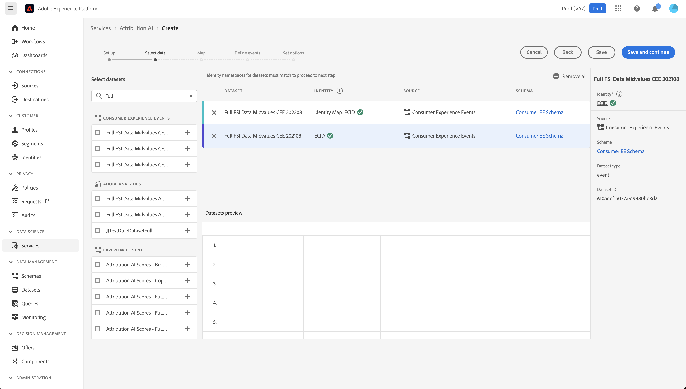

# Guia da interface do usuário do Attribution AI

A IA de atribuição, como parte dos Serviços inteligentes, é um serviço de atribuição de vários canais e algoritmos que calcula a influência e o impacto incremental das interações com o cliente em relação aos resultados especificados. Com o Attribution AI, os profissionais de marketing podem medir e otimizar os gastos com marketing e publicidade, entendendo o impacto de cada interação individual com o cliente em cada fase das jornadas do cliente.

Este documento serve como um guia para interagir com a IA de atribuição na interface do usuário dos Serviços inteligentes.

## Criar um modelo

Na interface do usuário do [!DNL Adobe Experience Platform], selecione **[!UICONTROL Serviços]** na navegação à esquerda. O navegador **[!UICONTROL Serviços]** é exibido e exibe os serviços inteligentes Adobe disponíveis. No contêiner da IA de atribuição, selecione **[!UICONTROL Abrir]**.

A página do serviço IA de atribuição é exibida. Esta página lista os modelos de serviço da IA de atribuição e exibe informações sobre eles, incluindo o nome do modelo, os eventos de conversão, a frequência com que o modelo é executado e o status da última atualização.

Você pode encontrar a métrica **[!UICONTROL Total de eventos de conversão pontuados]** localizada no lado inferior direito do contêiner **[!UICONTROL Criar modelo]**. Essa métrica rastreia o número total de eventos de conversão pontuados pela IA de atribuição no ano civil atual, incluindo todos os ambientes de sandbox e modelos de serviço excluídos.

Os modelos de serviço podem ser editados, clonados e excluídos usando os controles no lado direito da interface do usuário. Para exibir esses controles, selecione um modelo a partir dos **[!UICONTROL Modelos de serviço]** existentes. Os controles contêm as seguintes informações:

- **[!UICONTROL Editar]**: selecionar **[!UICONTROL Editar]** permite modificar um modelo de serviço existente. Você pode editar o nome, a descrição, o status, a frequência de pontuação do modelo e as colunas adicionais do conjunto de dados de pontuação.
- **[!UICONTROL Clonar]**: selecionar **[!UICONTROL Clonar]** copia o modelo de serviço selecionado. Em seguida, você pode modificar o fluxo de trabalho para fazer pequenos ajustes e renomeá-lo como um novo modelo.
- **[!UICONTROL Excluir]**: é possível excluir um modelo de serviço, incluindo qualquer execução histórica. O conjunto de dados de saída correspondente será excluído do Experience Platform. No entanto, as pontuações que foram sincronizadas com o Perfil do cliente em tempo real não são excluídas.
- **[!UICONTROL Fonte de dados]**: um link para o conjunto de dados que está sendo usado. Se mais de um conjunto de dados estiver sendo usado pela IA de atribuição, &quot;Vários&quot; seguido do número de conjuntos de dados será exibido. Ao selecionar o hiperlink, o popover de visualização dos conjuntos de dados é exibido.
- **[!UICONTROL Detalhes da última execução]**: exibido somente quando uma execução falha. As informações sobre por que a execução falhou, como códigos de erro, são exibidas aqui.

- **[!UICONTROL Eventos de conversão]**: uma visão geral rápida dos eventos de conversão configurados para este modelo.
- **[!UICONTROL Janela de retrospectiva]**: o período definido indicando quantos dias antes dos pontos de contato do evento de conversão foram incluídos.
- **[!UICONTROL Pontos de contato]**: uma lista de todos os pontos de contato que você definiu ao criar este modelo.

Selecione **[!UICONTROL Criar modelo]** para começar.

Em seguida, a página de configuração da IA de atribuição é exibida, onde você pode fornecer um nome e uma descrição opcional para seu modelo de serviço.

## Selecionar dados {#select-data}

<!-- https://www.adobe.com/go/aai-select-data -->

Por design, a IA de atribuição pode usar os dados do Adobe Analytics, do evento de experiência e do evento de experiência do consumidor para calcular pontuações de atribuição. Ao selecionar um conjunto de dados, somente os compatíveis com a IA de atribuição são listados. Para selecionar um conjunto de dados, selecione o símbolo (**+**) ao lado do nome do conjunto de dados ou marque a caixa de seleção para adicionar vários conjuntos de dados de uma vez. Você também pode usar a opção de pesquisa para encontrar rapidamente os conjuntos de dados em que está interessado.

Depois de selecionar os conjuntos de dados que deseja usar, clique no botão **[!UICONTROL Adicionar]** para adicionar os conjuntos de dados ao painel de visualização do conjunto de dados.

Selecionar o ícone de informações  ao lado de um conjunto de dados abre o popover de visualização do conjunto de dados.

A visualização do conjunto de dados contém dados como o tempo da última atualização, o esquema de origem e uma visualização das primeiras dez colunas.

Selecione **[!UICONTROL Salvar]** para salvar os rascunhos à medida que você avança no fluxo de trabalho. Você também pode salvar configurações de modelo de rascunho e ir para a próxima etapa do fluxo de trabalho. Use **[!UICONTROL Salvar e continuar]** para criar e salvar rascunhos durante as configurações do modelo. O recurso permite criar e salvar rascunhos da configuração do modelo e é particularmente útil quando é necessário definir muitos campos no fluxo de trabalho de configuração.

### Integridade do conjunto de dados {#dataset-completeness}

<!-- https://www.adobe.com/go/aai-dataset-completeness -->

Na visualização do conjunto de dados, há um valor percentual de integridade do conjunto de dados. Esse valor fornece um instantâneo rápido de quantas colunas em seu conjunto de dados estão vazias/nulas. Se um conjunto de dados contiver muitos valores ausentes e esses valores forem capturados em outro lugar, é altamente recomendável incluir o conjunto de dados que contém os valores ausentes.

>[!NOTE]
>
>A integridade do conjunto de dados é calculada usando a janela máxima de treinamento para a IA de atribuição (um ano). Isso significa que dados com mais de um ano não são considerados ao exibir o valor de integridade do conjunto de dados.

### Selecionar uma identidade {#identity}

Agora é possível unir vários conjuntos de dados uns aos outros com base no mapa de identidade (campo). Você deve selecionar um tipo de identidade (também conhecido como &quot;namespace de identidade&quot;) e um valor de identidade dentro desse namespace. Se você tiver atribuído mais de um campo como uma identidade no esquema no mesmo namespace, todos os valores de identidade atribuídos aparecerão na lista suspensa de identidades anexada ao namespace, como `EMAIL (personalEmail.address)` ou `EMAIL (workEmail.address)`.

>[!IMPORTANT]
>
>O mesmo tipo de identidade (namespace) deve ser usado para cada conjunto de dados selecionado. Uma marca de seleção verde é exibida ao lado do tipo de identidade na coluna identidade, indicando que os conjuntos de dados são compatíveis. Por exemplo, ao usar o namespace Telefone e `mobilePhone.number` como o identificador, todos os identificadores para os conjuntos de dados restantes devem conter e usar o namespace Telefone.

Para selecionar uma identidade, selecione o valor sublinhado localizado na coluna de identidade. O popover Selecionar uma identidade é exibido.

Caso haja mais de uma identidade disponível em um namespace, selecione o campo de identidade correto para seu caso de uso. Por exemplo, duas identidades de email estão disponíveis no namespace de email: um email comercial e pessoal. Dependendo do caso de uso, um email pessoal tem mais probabilidade de ser preenchido e ser mais útil em previsões individuais. Isso significa que você selecionaria `EMAIL (personalEmail.address)` como sua identidade.

>[!NOTE]
>
> Se não existir um tipo de identidade (namespace) válido para um conjunto de dados, você deve definir uma identidade primária e atribuí-la a um namespace de identidade usando o [editor de esquemas](../../xdm/schema/composition.md#identity). Para saber mais sobre namespaces e identidades, visite a documentação dos [namespaces do Serviço de Identidade](../../identity-service/features/namespaces.md).

## Mapeamento de canais de mídia e campos de campanha {#aai-mapping}

<!-- https://www.adobe.com/go/aai-mapping -->

Após concluir a seleção e a adição dos conjuntos de dados, a etapa de configuração **Mapa** é exibida. A IA de atribuição exige o mapeamento do campo Canal de mídia para cada conjunto de dados selecionado na etapa anterior. Isso ocorre porque, sem o mapeamento do canal de mídia entre conjuntos de dados, os insights derivados da IA de atribuição podem não ser exibidos corretamente, dificultando a interpretação da página de insights. Embora somente o Canal de mídia seja obrigatório, é altamente recomendável mapear alguns dos campos opcionais, como Ação de mídia, Nome da campanha, Grupo de campanha e Tag de campanha. Isso permite que a IA de atribuição forneça insights mais claros e resultados ideais.

## Definição de eventos {#define-events}

<!-- https://www.adobe.com/go/aai-define-events -->

Há três tipos diferentes de dados de entrada usados para definir eventos:

- **Eventos de conversão:** objetivos de negócios que identificam o impacto de atividades de marketing, como pedidos de comércio eletrônico, compras na loja e visitas a sites.
- **Janela de pesquisa:** fornece um período indicando quantos dias antes dos pontos de contato do evento de conversão devem ser incluídos.
- **Pontos de contato:** eventos de marketing a nível de recipient, individual e/ou cookie usados para avaliar o impacto numérico ou baseado em receita das conversões.

### Definir eventos de conversão {#define-conversion-events}

Para definir um evento de conversão, você precisa dar um nome ao evento e selecionar o tipo de evento selecionando o conjunto de dados e o campo do menu suspenso **Selecionar um conjunto de dados e campo**.

Depois que um evento é selecionado, uma nova lista suspensa é exibida à direita. A segunda lista suspensa é usada para fornecer mais contexto ao evento por meio do uso de operações. Para este evento de conversão, a operação padrão *existe* é usada.

>[!NOTE]
>
>Uma cadeia de caracteres com seu *nome de conversão* é atualizada à medida que você define seu evento.

Em seguida, você pode selecionar um conjunto de dados combinado que é gerado ao combinar todos os conjuntos de dados de entrada na etapa anterior. Como alternativa, selecione uma coluna com base em conjuntos de dados individuais no menu suspenso **Selecionar um conjunto de dados e campo**.

Os botões **[!UICONTROL Adicionar evento]** e **[!UICONTROL Adicionar Grupo]** são usados para definir ainda mais sua conversão. Dependendo da conversão que você está definindo, talvez seja necessário usar os botões **[!UICONTROL Adicionar evento]** e **[!UICONTROL Adicionar grupo]** para fornecer mais contexto.

Selecionar **[!UICONTROL Adicionar evento]** cria campos adicionais que podem ser preenchidos usando o mesmo método descrito acima. Isso adiciona uma instrução AND à definição de string abaixo do nome da conversão. Selecione **x** para remover um evento que foi adicionado.

Selecionar **[!UICONTROL Adicionar Grupo]** oferece a opção de criar campos adicionais separados do original. Com a adição de grupos, um botão azul *And* é exibido. Selecionar **And** fornece uma opção para alterar o parâmetro para conter &quot;Or&quot;. &quot;Or&quot; é usado para definir vários caminhos de conversão bem-sucedidos. &quot;And&quot; estende o caminho de conversão para incluir condições adicionais.

Se você precisar de mais de uma conversão, selecione **Adicionar conversão** para criar um novo cartão de conversão. Você pode repetir o processo acima para definir várias conversões.

### Definir janela de pesquisa {#lookback-window}

Depois de concluir a definição da conversão, é necessário confirmar a janela de retrospectiva. Usando as teclas de seta ou selecionando o valor padrão (56), especifique quantos dias antes do evento de conversão você deseja incluir pontos de contato. Os pontos de contato são definidos na próxima etapa.

### Definir pontos de contato

A definição de pontos de contato segue um fluxo de trabalho semelhante a [definindo conversões](#define-conversion-events). Inicialmente, você precisa nomear seu ponto de contato e selecionar um valor de ponto de contato no menu suspenso *Inserir nome do campo*. Depois de selecionado, o menu suspenso do operador é exibido com o valor padrão &quot;exists&quot;. Selecione a lista suspensa para revelar uma lista de operadores.

Para a finalidade deste ponto de contato, selecione **é igual a**.

Depois que um operador para um ponto de contato é selecionado, o *Valor do Campo* é disponibilizado. Os valores da lista suspensa para *Inserir Valor do Campo* são preenchidos com base no operador e no valor do ponto de contato selecionado anteriormente. Se um valor não for preenchido na lista suspensa, é possível digitar esse valor manualmente. Selecione a lista suspensa e selecione **CLIQUE**.

>[!NOTE]
>
>Os operadores &quot;exists&quot; e &quot;not exists&quot; não têm valores de campo associados a eles.

Os botões **Adicionar evento** e **Adicionar Grupo** são usados para definir ainda mais seu ponto de contato. Devido à natureza complexa em torno dos pontos de contato, não é incomum ter vários eventos e grupos para um único ponto de contato.

Quando selecionado, **Adicionar evento** permite que campos adicionais sejam adicionados. selecione **x** para remover um evento que foi adicionado.

Selecionar **Adicionar grupo** oferece a opção de criar campos adicionais separados do original. Com a adição de grupos, um botão azul *And* é exibido. Selecione **And** para alterar o parâmetro, o novo parâmetro &quot;Or&quot; é usado para definir vários caminhos bem-sucedidos. Esse ponto de contato específico tem apenas um caminho bem-sucedido, portanto, &quot;Ou&quot; não é necessário.

>[!NOTE]
>
>Use a cadeia de caracteres em *Nome do ponto de contato* para obter uma visão geral rápida do seu ponto de contato. Observe que a string corresponde ao nome do ponto de contato.

Você pode adicionar outros pontos de contato selecionando **Adicionar ponto de contato** e repetindo o processo acima.

Depois de definir todos os pontos de contato necessários, role para cima e selecione **Avançar** no canto superior direito para prosseguir para a etapa final.

## Configuração avançada de treinamento e pontuação

A página final da IA de atribuição é a página **[!UICONTROL Avançado]** usada para configurar treinamento e pontuação.

### Programar treinamento

Usando o *Agendamento*, você pode selecionar um dia e hora da semana em que deseja que a pontuação ocorra.

Selecione a lista suspensa em *Frequência de Pontuação* para selecionar entre pontuação diária, semanal e mensal. Em seguida, selecione os dias da semana em que deseja que a pontuação ocorra. Vários dias podem ser selecionados. Selecionar o mesmo dia novamente desmarca a seleção.

Para alterar a hora do dia em que a pontuação ocorrerá, selecione o ícone de relógio. Na nova sobreposição exibida, insira a hora do dia em que deseja que a pontuação ocorra. Selecione fora da sobreposição para fechá-la.

>[!NOTE]
>
>Pode levar até 24 horas para que cada processo de pontuação seja concluído.

### Colunas adicionais do conjunto de dados de pontuação (opcional)

Por padrão, um conjunto de dados de pontuação é criado para cada modelo de serviço em um esquema padrão. Você pode optar por adicionar outras colunas com base nas configurações de Evento de conversão e Pontos de contato na saída do conjunto de dados de pontuação. Comece selecionando colunas do seu conjunto de dados de entrada. Em seguida, você pode arrastá-las e soltá-las para alterar a ordem, mantendo pressionado o botão esquerdo do mouse sobre o ícone de hambúrguer.

### Modelagem baseada em região (opcional) {#region-based-modeling-optional}

Os comportamentos dos clientes podem ser bem diferentes de acordo com o país e a região geográfica. Para empresas globais, usar modelos baseados em país ou região pode aumentar a precisão da atribuição. Cada região adicionada cria um novo modelo com os dados dessa região.

Para definir uma nova região, selecione **[!UICONTROL Adicionar região]**. No contêiner exibido, forneça um nome para a região. Somente um valor (&quot;placeContext.geo.countryCode&quot;) é preenchido na lista suspensa **[!UICONTROL Inserir nome do campo]**. Selecione esse valor.

Em seguida, selecione um operador.

Por fim, digite o código do país na lista suspensa **[!UICONTROL Inserir valor do campo]**.

>[!NOTE]
>
>Os códigos de país têm dois caracteres. Uma lista completa pode ser encontrada aqui [ISO 3166-1 alpha-2](https://datahub.io/core/country-list).

### Janela de treinamento {#training-window}

Para garantir que você obtenha o modelo mais preciso possível, é importante treinar seu modelo com dados históricos que representem sua empresa. Por padrão, o modelo é treinado usando 2 trimestres (6 meses) de dados de eventos de conversão. Selecione a lista suspensa para alterar o padrão. Você pode optar por treinar com um a quatro trimestres de dados (de 3 a 12 meses).

>[!NOTE]
>
>Uma janela de treinamento mais curta é mais sensível às tendências recentes, enquanto uma janela de treinamento mais longa cria um modelo mais robusto e é menos sensível às tendências recentes.

Depois de selecionar sua janela de treinamento, selecione **[!UICONTROL Concluir]** no canto superior direito. Aguarde algum tempo para que os dados sejam processados. Uma vez concluída, uma caixa de diálogo pop-over é exibida confirmando que a configuração da instância foi concluída. Selecione **[!UICONTROL Ok]** para ser redirecionado para a página **[!UICONTROL Instâncias de serviço]**, onde você pode ver sua instância de serviço.

## Próximas etapas

Ao seguir este tutorial, você criou com êxito uma instância de serviço na IA de atribuição. Quando a instância terminar de pontuar (aguarde até 24 horas), você estará pronto para [descobrir os insights da IA de atribuição](./discover-insights.md). Além disso, se você quiser baixar os resultados de pontuação, visite a documentação [pontuações de download](./download-scores.md).

## Recursos adicionais

O vídeo a seguir descreve um fluxo de trabalho completo para criar uma nova instância na IA de atribuição.

>[!VIDEO](https://video.tv.adobe.com/v/32668?learn=on&quality=12)
