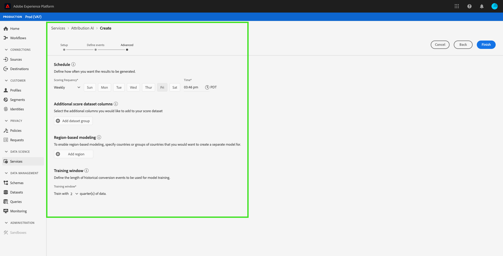

# Guia da interface do usuário do Attribution AI

O Attribution AI, como parte dos Serviços inteligentes, é um serviço de atribuição de vários canais e algoritmos que calcula a influência e o impacto incremental das interações com o cliente em relação aos resultados especificados. Com o Attribution AI, os profissionais de marketing podem medir e otimizar os gastos com marketing e publicidade, entendendo o impacto de cada interação individual com o cliente em cada fase das viagens do cliente.

Este documento é um guia para interagir com o Attribution AI na interface do usuário dos Serviços inteligentes.

## Criar uma instância

Na interface [!DNL Adobe Experience Platform], clique em **[!UICONTROL Services]** no painel de navegação esquerdo. O navegador **[!UICONTROL Services]** é exibido e exibe os serviços Adobe inteligentes disponíveis. No contêiner do Attribution AI, clique em **[!UICONTROL Open]**.

A página Attribution AI service é exibida. Esta página lista as instâncias de serviço do Attribution AI e exibe informações sobre elas, incluindo o nome da instância, os eventos de conversão, a frequência com que a instância é executada e o status da última atualização.

Você pode encontrar a métrica **[!UICONTROL Total conversion events scored]** localizada no lado inferior direito do contêiner **[!UICONTROL Create instance]**. Essa métrica rastreia o número total de eventos de conversão pontuados por Attribution AI no ano civil atual, incluindo todos os ambientes sandbox e quaisquer instâncias de serviço excluídas.

As instâncias de serviço podem ser editadas, clonadas e excluídas usando os controles no lado direito da interface do usuário. Para exibir esses controles, selecione uma instância de seu **[!UICONTROL Service instances]** existente. Os controles contêm as seguintes informações:

- **[!UICONTROL Edit]**: Selecionar  **[!UICONTROL Edit]** permite modificar uma instância de serviço existente. É possível editar o nome, a descrição, o status e a frequência de pontuação da instância.
- **[!UICONTROL Clone]**: Selecionar  **[!UICONTROL Clone]** copia a instância de serviço selecionada. Em seguida, você pode modificar o workflow para fazer pequenos ajustes e renomeá-lo como uma nova instância.
- **[!UICONTROL Delete]**: Você pode excluir uma instância de serviço, incluindo quaisquer execuções históricas.
- **[!UICONTROL Data source]**: Um link para o conjunto de dados que está sendo usado por esta instância.
- **[!UICONTROL Last run details]**: Isso só é exibido quando uma execução falha. Informações sobre por que a execução falhou, como códigos de erro, são exibidas aqui.

- **[!UICONTROL Conversion events]**: Uma visão geral rápida dos eventos de conversão configurados para esta instância.
- **[!UICONTROL Lookback window]**: O período definido, indicando quantos dias antes dos pontos de contato do evento de conversão foram incluídos.
- **[!UICONTROL Touchpoints]**: Uma lista de todos os pontos de contato definidos ao criar essa instância.

Selecione **[!UICONTROL Create instance]** para começar.

Em seguida, a página de configuração do Attribution AI é exibida, onde é possível fornecer informações básicas e especificar um conjunto de dados para a instância.

### Nomeie a instância

Em **[!UICONTROL Basic information]**, forneça um nome e uma descrição opcional para a instância de serviço.

### Selecionar um conjunto de dados

Depois de preencher as informações básicas, clique na lista suspensa denominada **Selecionar conjunto de dados** para selecionar seu conjunto de dados. O conjunto de dados é usado para treinar o modelo e pontuar os dados subsequentes produzidos. Ao selecionar um conjunto de dados no seletor suspenso, somente aqueles que são compatíveis com o Attribution AI e estão em conformidade com o esquema do Experience Data Model (XDM) são listados. Depois que um conjunto de dados for escolhido, clique em **Next** no canto superior direito para prosseguir para a página definir eventos.

>[!TIP]
>
>Os conjuntos de dados do Adobe Analytics são suportados por meio do Conector de origem do Analytics.

## Definição de eventos

Há três tipos diferentes de dados de entrada usados para definir eventos:

- **Eventos de conversão:** objetivos de negócios que identificam o impacto das atividades de marketing, como pedidos de comércio eletrônico, compras na loja e visitas ao site.
- **Janela de pesquisa:** fornece um período que indica quantos dias antes dos pontos de contato do evento de conversão devem ser incluídos.
- **Pontos de contato:** eventos de marketing de recipients, individuais e ou de cookies usados para avaliar o impacto numérico ou baseado na receita das conversões.

### Definir eventos de conversão {#define-conversion-events}

Para definir um evento de conversão, é necessário dar um nome ao evento e selecionar o tipo de evento clicando no menu suspenso **Inserir nome de campo**.

Quando um evento é selecionado, uma nova lista suspensa é exibida à direita. A segunda lista suspensa é usada para fornecer mais contexto ao evento por meio do uso de operações . Para esse evento de conversão, a operação padrão *exists* é usada.

>[!NOTE]
>
>Uma string em seu *nome de conversão* é atualizada à medida que você define seu evento.

Os botões **[!UICONTROL Add event]** e **[!UICONTROL Add Group]** são usados para definir ainda mais sua conversão. Dependendo da conversão que você estiver definindo, talvez seja necessário usar os botões **[!UICONTROL Add event]** e **[!UICONTROL Add group]** para fornecer mais contexto.

Clicar em **[!UICONTROL Add event]** cria campos adicionais que podem ser preenchidos usando o mesmo método descrito acima. Isso adiciona uma instrução AND à definição da string abaixo do nome da conversão. Clique em **x** para remover um evento que foi adicionado.

Clicar em **[!UICONTROL Add Group]** dá a opção de criar campos adicionais separados do original. Com a adição de grupos, um botão azul *And* é exibido. Clicar em **And** dá uma opção para alterar o parâmetro para conter &quot;Ou&quot;. &quot;Ou&quot; é usado para definir vários caminhos de conversão bem-sucedidos. &quot;And&quot; estende o caminho de conversão para incluir condições adicionais.

Se você precisar de mais de uma conversão, clique em **Adicionar conversão** para criar um novo cartão de conversão. Você pode repetir o processo acima para definir várias conversões.

### Definir janela de pesquisa {#lookback-window}

Após terminar de definir sua conversão, você precisa confirmar sua janela de lookback. Usando as teclas de seta ou clicando no valor padrão (56), especifique quantos dias antes do evento de conversão você deseja incluir pontos de contato. Os pontos de contato são definidos na próxima etapa.

### Definir pontos de contato

A definição de pontos de contato segue um fluxo de trabalho semelhante ao [definindo conversões](#define-conversion-events). Inicialmente, é necessário nomear seu ponto de contato e selecionar um valor de ponto de contato no menu suspenso *Inserir nome de campo*. Depois de selecionado, a lista suspensa do operador aparece com o valor padrão &quot;exists&quot;. Clique na lista suspensa para exibir uma lista de operadores.

Para a finalidade deste ponto de contato, selecione **igual a**.

Quando um operador para um ponto de contato é selecionado, *Inserir valor do campo* é disponibilizado. Os valores suspensos para *Inserir valor do campo* são preenchidos com base no operador e no valor do ponto de contato selecionado anteriormente. Se um valor não for preenchido na lista suspensa, é possível digitar esse valor manualmente. Clique na lista suspensa e selecione **CLIQUE**.

>[!NOTE]
>
>Os operadores &quot;exists&quot; e &quot;not exists&quot; não têm valores de campo associados a eles.

Os botões *Adicionar evento* e *Adicionar Grupo* são usados para definir ainda mais o ponto de contato. Devido à natureza complexa dos pontos de contato, não é incomum ter vários eventos e grupos para um único ponto de contato.

Quando clicado, **Adicionar evento** permite que campos adicionais sejam adicionados. Clique em **x** para remover um evento que foi adicionado.

Clicar em **Adicionar grupo** dá a você a opção de criar campos adicionais separados do original. Com a adição de grupos, um botão azul *And* é exibido. Clique em **And** para alterar o parâmetro, o novo parâmetro &quot;Ou&quot; é usado para definir vários caminhos bem-sucedidos. Este ponto de contato específico tem apenas um caminho bem-sucedido, portanto, &quot;Ou&quot; não é necessário.

>[!NOTE]
>
>Use a string em *Nome do ponto de contato* para obter uma visão geral rápida do seu ponto de contato. Observe que a string corresponde ao nome do ponto de contato.

Você pode adicionar pontos de contato adicionais clicando em **Adicionar ponto de contato** e repetindo o processo acima.

Quando terminar de definir todos os pontos de contato necessários, role para cima e clique em **Next** no canto superior direito para prosseguir para a etapa final.

## Configuração avançada de treinamento e pontuação

A página final no Attribution AI é a página **[!UICONTROL Advanced]** usada para configurar o treinamento e a pontuação.

### Agendar treinamento

Usando o *Agendamento*, você pode selecionar um dia e hora da semana em que deseja que a pontuação ocorra.

Clique na lista suspensa em *Frequência de pontuação* para selecionar entre pontuação diária, semanal e mensal. Em seguida, selecione os dias da semana em que deseja que a pontuação ocorra. Vários dias podem ser selecionados. Clique um dia uma segunda vez para desmarcá-lo.

Para alterar a hora do dia em que deseja que a pontuação ocorra, clique no ícone do relógio. Na nova sobreposição exibida, insira a hora do dia em que deseja que a pontuação ocorra. Clique fora da sobreposição para fechá-la.

>[!NOTE]
>
>Pode levar até 24 horas para que cada processo de pontuação seja concluído.

### Colunas adicionais do conjunto de dados de pontuação (opcional)

Por padrão, um conjunto de dados de pontuação é criado para cada instância de serviço em um esquema padrão. Você pode optar por adicionar colunas adicionais com base nas configurações de Evento de conversão e Ponto de contato à saída do conjunto de dados de pontuação. Comece selecionando colunas do seu conjunto de dados de entrada, você pode arrastá-las e soltá-las para alterar a ordem, mantendo o botão esquerdo do mouse pressionado sobre o ícone do hambúrguer.

### Modelagem baseada em região (opcional) {#region-based-modeling-optional}

Os comportamentos dos seus clientes podem diferir significativamente por país e região geográfica. Para empresas globais, usar modelos baseados em país ou em região pode aumentar a precisão da atribuição. Cada região adicionada cria um novo modelo com os dados dessa região.

Para definir uma nova região, comece clicando em **[!UICONTROL Add region]**. No contêiner exibido, forneça um nome para a região. Somente um valor (&quot;placeContext.geo.countryCode&quot;) é preenchido a partir da lista suspensa **[!UICONTROL Enter Field Name]**. Selecione este valor.

Em seguida, selecione um operador.

Por fim, digite o código do país na lista suspensa **[!UICONTROL Enter Field Value]**.

>[!NOTE]
>
>Os códigos de país têm dois caracteres. Uma lista completa pode ser encontrada aqui [ISO 3166-1 alfa-2](https://datahub.io/core/country-list).

### Janela de treinamento {#training-window}

Para garantir que você obtenha o modelo mais preciso possível, é importante treinar o modelo com dados históricos que representem sua empresa. Por padrão, o modelo é treinado usando 2 trimestres (6 meses) de dados de eventos de conversão. Selecione a lista suspensa para alterar o padrão. Você pode optar por treinar com um ou quatro trimestres dos dados (de 3 a 12 meses).

>[!NOTE]
>
>Uma janela de treinamento mais curta é mais sensível às tendências recentes, enquanto uma janela de treinamento mais longa cria um modelo mais robusto e é menos sensível às tendências recentes.

Depois de selecionar sua janela de treinamento, clique em **[!UICONTROL Finish]** no canto superior direito. Permita que os dados sejam processados por algum tempo. Uma vez concluída, uma caixa de diálogo de instância é exibida, confirmando que a configuração da instância foi concluída. Clique em **[!UICONTROL Ok]** para ser redirecionado para a página **[!UICONTROL Service instances]** onde você pode ver sua instância de serviço.

## Próximas etapas

Ao seguir este tutorial, você criou com êxito uma instância de serviço no Attribution AI. Quando a instância terminar de pontuar (aguarde até 24 horas), você estará pronto para [descobrir insights do Attribution AI](./discover-insights.md). Além disso, se desejar baixar os resultados da pontuação, visite a documentação de [downloading scores](./download-scores.md) .

## Recursos adicionais

O vídeo a seguir descreve um fluxo de trabalho completo para criar uma nova instância no Attribution AI.

>[!VIDEO](https://video.tv.adobe.com/v/32668?learn=on&quality=12)
